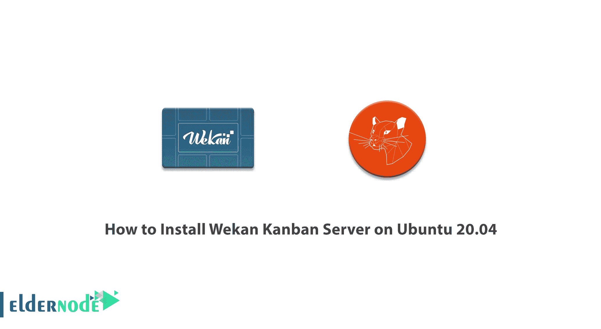

# 如何在 Ubuntu 20.04 - Eldernode 博客上安装 Wekan 看板服务器

> 原文：<https://blog.eldernode.com/install-wekan-kanban-server-on-ubuntu-20-04/>



Wekan 是一个基于 Meteor Javascript 框架的开源看板。这是一个基于网络的管理工具，类似于 Trello，并允许您为您的项目协作创建一个董事会。使用 Wekan Board，您可以轻松邀请您想要的成员加入董事会。需要注意的是，和 Trello 一样，你可以在 wekan 板上定义一个任务，并将其分配给你的成员。在这篇文章中，我们试图让你完全了解如何在 Ubuntu 20.04 上安装 Wekan 看板服务器。你可以在 [Eldernode](https://eldernode.com/) 看到购买 [Ubuntu VPS](https://eldernode.com/ubuntu-vps/) 服务器的套餐。

## **教程在 Ubuntu 20.04 上安装 Wekan 看板服务器**

Wekan 是一个看板，允许基于卡片的任务和待办事项管理，类似于 WorkFlowy 或 Trello 这样的工具。由于它的实时同步功能，您可以在团队中使用它。使用标签，评论，约会等等都可以在 Wekan 工作流类型中实现。在这篇文章的后续部分，加入我们来学习如何一步一步地在 Ubuntu 20.04 上安装 Wekan 看板服务器。

### **Wekan 看板的特点**

Wekan 的功能包括:

**–**为创建的卡片分配彩色标签，以便分组和过滤。

**–**能够将成员添加到卡片中，为他们定义任务。

**–**创建可以在列之间移动卡片的板。

**–**轻松合作

**–**认证、管理面板和 SMTP 设置的能力。

**–**它有剪贴板功能和拖放功能。

**–**能够添加、删除、启动、存档和显示电路板

### **在 Ubuntu 20.04 上安装 Wekan 看板服务器|**Ubuntu 18.04

由于必须安装 NGINX web 服务器才能在 Ubuntu 20.04、18.04 服务器上安装 Wekan，所以在第一步中，必须首先使用以下命令[安装 Nginx web 服务器](https://blog.eldernode.com/install-nginx-on-ubuntu-20-04-lts/):

```
sudo apt-get install nginx -y
```

下一步是在安装后启动并激活 NGINX:

```
sudo systemctl start nginx
```

```
sudo systemctl enable nginx
```

然后，您必须使用快照打包安装 Wekan:

```
sudo snap install wekan
```

请注意，在下一步中，您必须通过执行以下命令来设置根 URL。注意 IP 地址命令中的 **SERVER_IP** 是主机服务器:

```
sudo snap set wekan root-url="http://SERVER_IP"
```

成功完成上述步骤后，我们进入下一步。此时，您需要指定一个端口，以便 Wekan 通过您的浏览器进行访问。另一方面，由于 Wekan 运行在 Nginx 上，我们建议使用另一个端口来完成这项工作:

```
sudo snap set wekan port='3001'
```

在您能够应用您想要的更改之后，您现在需要使用以下命令重新启动 [MongoDB](https://blog.eldernode.com/install-mongodb-ubuntu-20/) 和系统一次:

```
sudo systemctl restart snap.wekan.mongodb
```

```
sudo systemctl restart snap.wekan.wekan
```

要登录 Wekan，你必须打开你最喜欢的浏览器之一，运行 **http://localhost:3001** 。需要注意的是，如果你有一个主机 IP 服务器，你可以使用地址**http://<SERVER _ IP>:3001**进入 Wekan:

## 结论

Wekan 是在麻省理工学院的许可下发布的。这个程序允许用户轻松地使用和修改它。Wekan 可以轻松地在服务器上托管。它还可以确保您始终完全控制您的信息，并确保没有其他人可以访问它。在本文中，我们试图教你如何在 Ubuntu 20.04 上安装 Wekan 看板服务器。