# 如何在 Debian 10 - Eldernode 博客上用 PostgreSQL 安装 Wiki.js

> 原文：<https://blog.eldernode.com/install-wiki-js-with-postgresql-on-debian/>

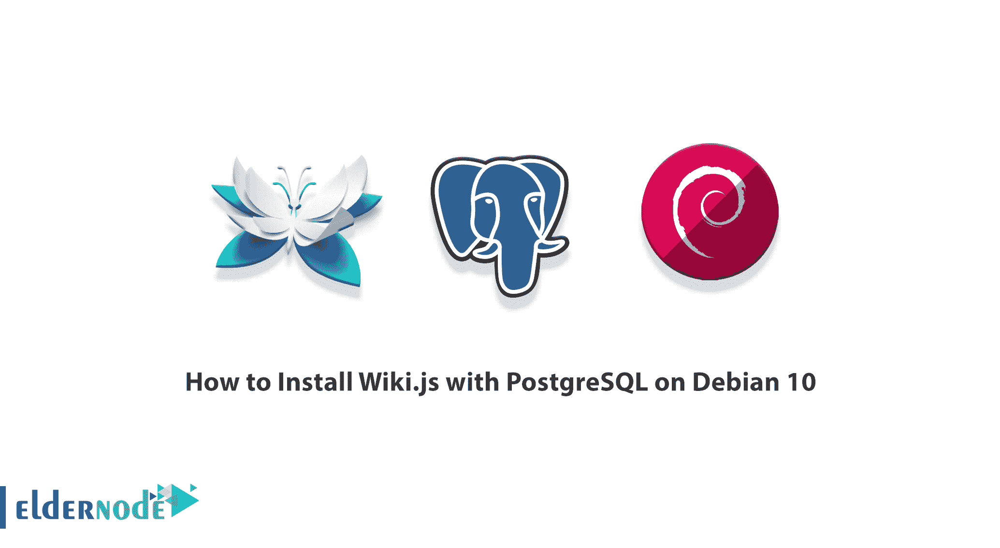

Wiki.js 是一个生成内容、归档内容、上传培训包等等的绝佳平台。使用 Wiki.js，您可以为您的用户创建权限，并根据内容对他们进行分类。这个平台实际上是一个为设备编写的软件程序可以运行和使用的平台。该平台包括硬件要求和软件要求，如操作系统。事实上，它是运行应用程序所需的硬件要求和软件要求。在这篇文章中，我们将教你如何在 Debian 10 上安装带有 PostgreSQL 的 Wiki.js。如果你想买一个 [**Linux VPS**](https://eldernode.com/linux-vps/) 服务器，你可以在 [Eldernode](https://eldernode.com/) 看到可用的软件包。

## **wiki . js 简介**

正如本文介绍中提到的，Wiki.js 是一个创建内容的平台，管理员可以通过它访问自己的用户，甚至对他们的内容进行分类。Wiki.js 平台可以在 Windows、 [Linux](https://blog.eldernode.com/tag/linux/) 和 macOS 操作系统上运行。注意，与所有平台一样，安装 Wiki.js 需要一个主机，该主机需要完全的 root 访问权限。

在本文的剩余部分，请关注我们如何在 Debian 10 上安装带有 [PostgreSQL 的 Wiki.js。在下一节，我们将解释如何安装](https://blog.eldernode.com/install-postgresql-debian10/) [Node.js 和 NPM](https://blog.eldernode.com/install-node-js-and-npm-on-ubuntu/) 。然后我们将讨论如何安装 PostgreSQL 数据库服务器。在安装 Wiki.js 前的最后一步，我们会教你如何安装 Nginx Web Server。最后，我们将解释如何安装 Wiki.js。

### **教程更新并安装所需软件包**

在开始安装 Wiki.js 之前，有一个基本且重要的步骤。此时，您需要更新系统包，以防止潜在的错误。因此，您应该运行以下命令:

```
sudo apt-get update
```

```
sudo apt-get upgrade
```

```
sudo reboot
```

现在，您必须运行以下命令来安装 Debian 基本管理所需的软件包:

```
sudo apt install -y
```

```
curl wget vim git unzip socat
```

```
sudo bash-completion apt-transport-https build-essential dirmngr
```

### **如何安装 Node.js 和 NPM**

安装 Wiki.js 之前的一个要求是安装 Node.js 和 NPM。因此，您可以使用以下命令来实现这一点:

```
curl -sL https://deb.nodesource.com/setup_10.x | sudo -E bash -
```

```
sudo apt install -y nodejs
```

### **安装 PostgreSQL 数据库服务器**

在这一节中，我们计划教你如何在 Debian 上安装 PostgreSQL。要在您的 Debian 服务器上安装 PostgreSQL，以 root 或拥有 [Sudo 特权](https://blog.eldernode.com/initial-setup-with-debian-10/)的用户身份执行以下步骤。在第一步中，您必须使用以下命令更新 APT 包索引:

```
sudo apt update
```

现在，您应该使用以下命令安装 PostgreSQL server 和 Contrib 包，该包提供了额外的功能:

```
sudo apt install postgresql postgresql-contrib
```

您可以切换到用户 Postgres 登录到 PostgreSQL 服务器，并使用以下命令访问 PostgreSQL 提示符:

```
sudo su - postgres
```

```
psql
```

无需切换用户，您可以使用以下命令来访问 PostgreSQL:

```
sudo -u postgres psql
```

### **如何安装 Nginx Web 服务器**

在这一节中，我们打算教你如何一步一个 Nginx Web 服务器。为此，只需遵循以下步骤:

```
wget https://nginx.org/keys/nginx_signing.key
```

```
sudo apt-key add nginx_signing.key
```

```
rm nginx_signing.key
```

```
sudo -s
```

```
printf "deb https://nginx.org/packages/mainline/debian/ $(lsb_release -sc) nginx\ndeb-src https://nginx.org/packages/mainline/debian/ $(lsb_release -sc) nginx\n" >> /etc/apt/sources.list.d/nginx_mainline.list
```

```
exit
```

```
sudo apt update
```

```
sudo apt install -y nginx
```

在下一节中，我们将教你如何下载和安装 wiki.js。请继续阅读本文。

## **在 Debian 10 上用 PostgreSQL 安装 Wiki.js with】**

在本节中，我们希望训练您一步一步地如何下载和安装 wiki.js。您可以在第一步中创建一个项目目录，然后转到创建的目录。然后，您可以将目录的所有权更新给您的用户。使用以下命令执行这些步骤:

```
sudo mkdir /var/www/wiki.js
```

```
cd /var/www/wiki.js
```

```
sudo chown -R [your_user]:[your_user] /var/www/wiki.js
```

现在您可以使用下面的命令**下载并安装 Wiki.js** :

```
curl -sSo- https://wiki.js.org/install.sh | bash
```

在您成功安装 Wiki.js 之后，您现在可以使用下面的命令**启动配置向导**:

```
node wiki configure
```

### **如何在 Debian 10 上用 PostgreSQL 设置 Wiki.js with】**

在本节中，我们将教您如何配置、设置和访问 wiki.js。您将被要求使用以下地址从浏览器打开 wiki.js 以继续配置:

```
HTTP://<your-server-ip>:3000
```

***注意:*** 确保防火墙上有允许的端口 3000。

在您的浏览器中输入上述地址后，您可以看到以下页面:

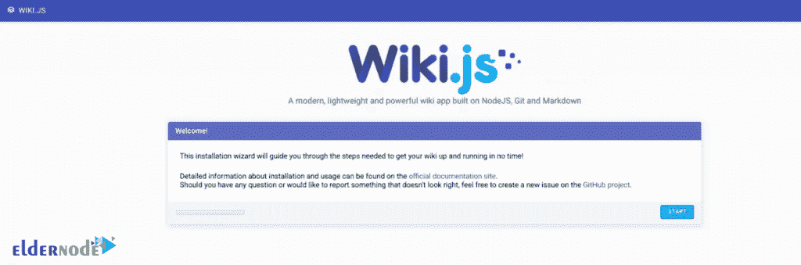

您可以通过点击“**开始**来检查系统。报告如下。下一步，您可以点击**继续**。通过这样做，您将能够配置您的常规设置:

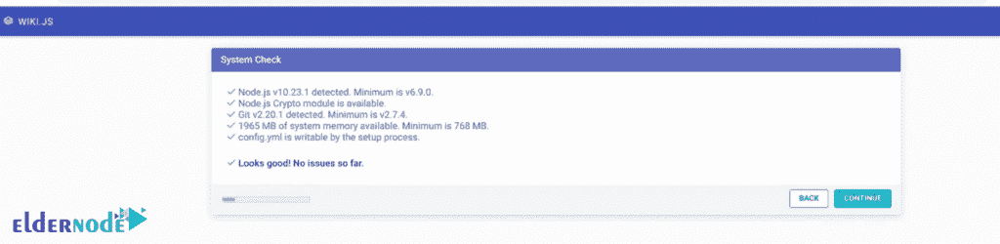

再次点击**继续**:

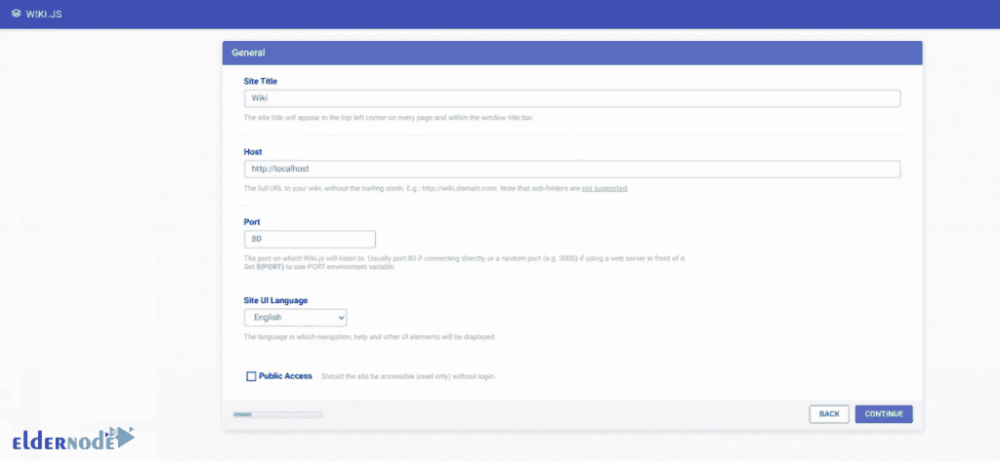

*

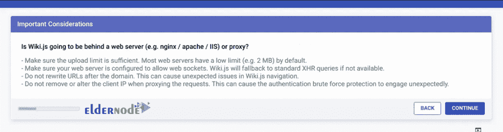

您现在可以通过点击“**连接**”来连接到数据库:

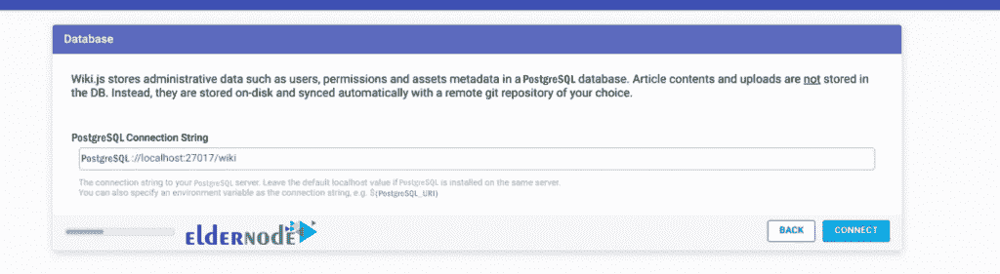

点击**继续**:

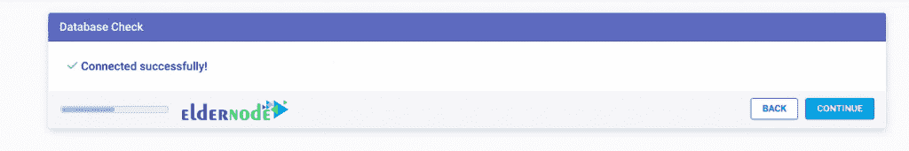

指定配置路径，点击**继续**:

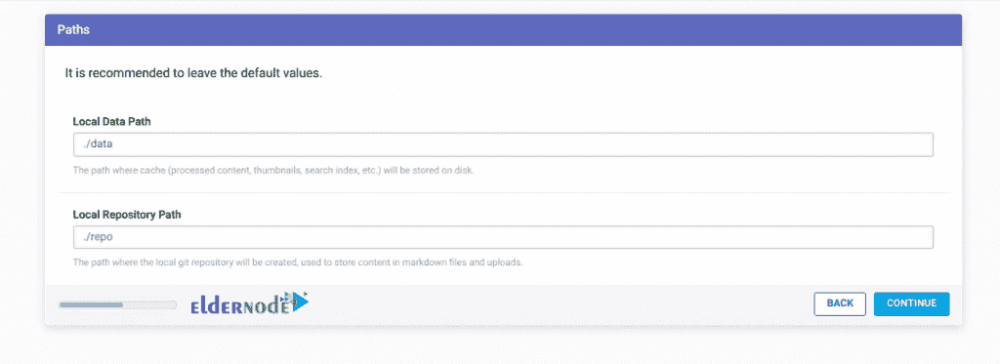

如下图所示，如果您愿意，现在可以配置 git 存储库:

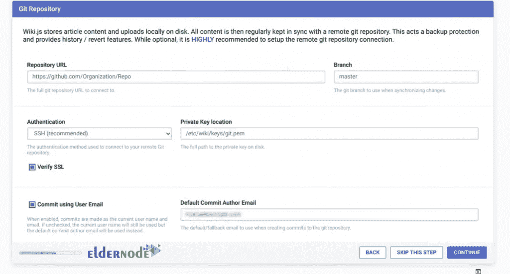

请注意，下一步是配置管理员帐户。完成后，点击**继续**:

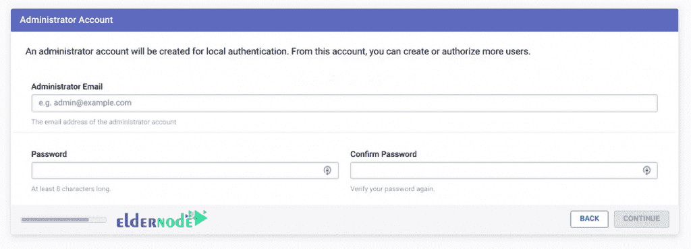

点击“**开始**，会出现登录页面提示:

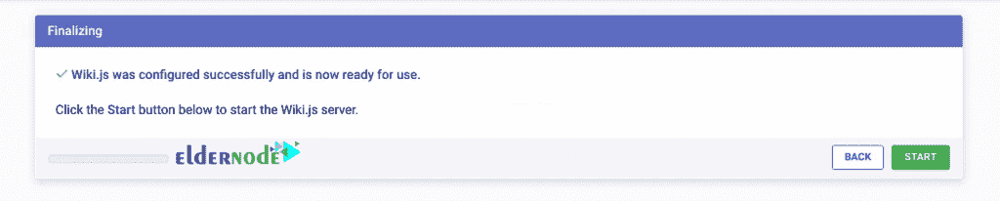

您应该注意，提供您在上面设置的管理员凭据来登录。然后会出现一个页面提示您创建主页:


最后，您可以点击“**创建主页**”开始:

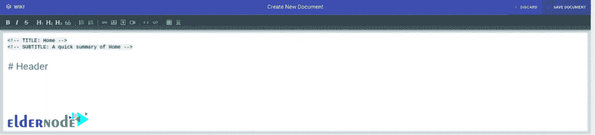

## 结论

Wiki.js 是一个基于 Node.js、Git 和 Markdown 的开源、现代和强大的 Wiki 应用程序。Wiki.js 运行在速度极快的 Node.js 引擎上，并经过优化以节省 CPU 资源。在本文中，我们试图教你如何在 Debian 10 上用 PostgreSQL 安装 Wiki.js。在本文的最后，我们还介绍了如何在 Debian 10 上用 PostgreSQL 设置 Wiki.js。