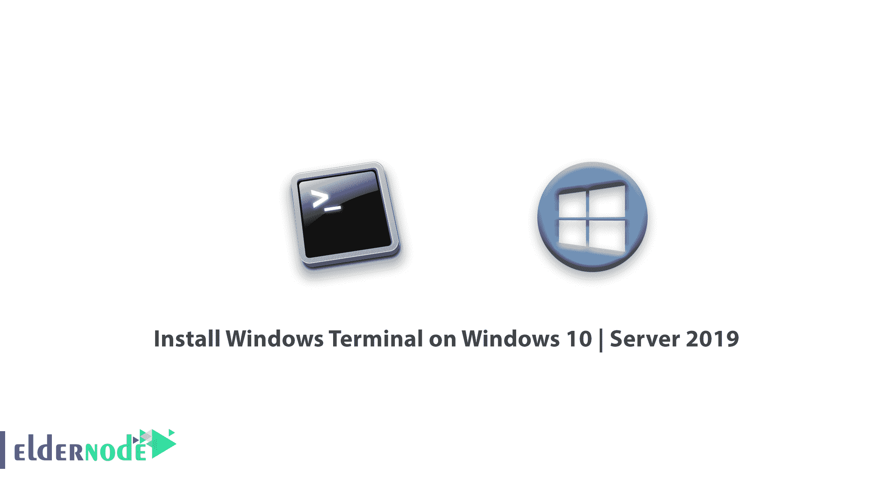
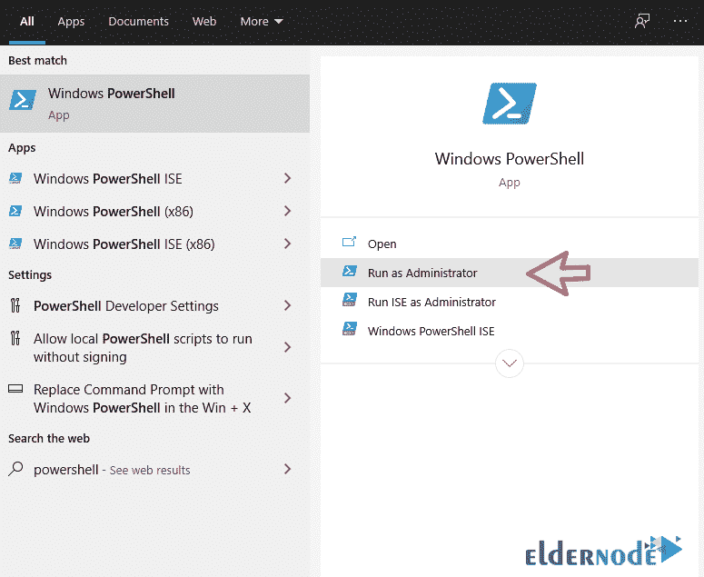
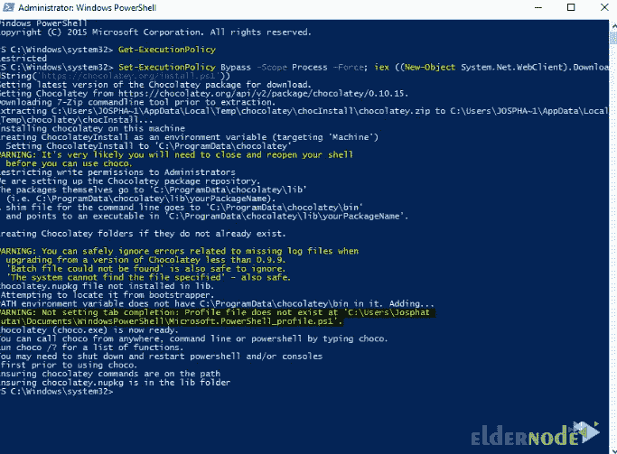
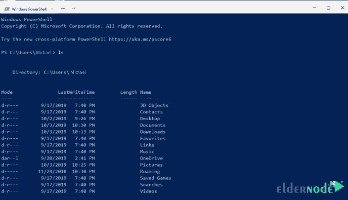

# 如何在 Windows 10 | Server 2019 上安装 Windows 终端- Eldernode

> 原文：<https://blog.eldernode.com/install-windows-terminal-on-windows/>



微软为视窗开发了一个新的命令行程序。该程序旨在成为一个集成环境，用于访问 PowerShell、CMD 和 WSL(微软的 Linux 子系统)等环境。微软还增加了一些功能，如在新终端中支持多个标签，以及为希望升级终端的开发者定制。Windows 终端支持基于 GPU 的文本呈现。在本文中，我们将教大家**如何在 Windows 10 和 Windows Server 2019** 上安装 Windows 终端。如果你想买一台 [**Windows VPS**](https://eldernode.com/windows-vps/) 服务器，你可以在 [Eldernode](https://eldernode.com/) 看到可用的软件包。

## **教程在 Windows 10 | Server 2019 上安装 Windows 终端**

Windows 已经将其[终端模拟器](https://github.com/microsoft/terminal)作为开源放在了 GitHub 上。在本教程中，我们将使用[巧克力包管理器](https://chocolatey.org/)进行安装。请继续关注本文的其余部分。

### **如何在 Windows 上安装 chocolate y**

首先，您应该确保您使用的是一个**管理外壳**。以管理员身份运行 **PowerShell** :



然后，键入并运行以下命令:

```
Set-ExecutionPolicy Bypass -Scope Process -Force; iex ((New-Object System.Net.WebClient).DownloadString('https://chocolatey.org/install.ps1')) 
```

在下一部分中，安装开始。等待安装完成:



您应该不会收到任何错误，因为您的安装过程已经正确完成。使用[入门](https://chocolatey.org/docs/getting-started)使用以下命令:

```
choco 
```

或者

```
choco -? 
```

是时候用 choco 安装 [Windows](https://blog.eldernode.com/tag/windows/) 终端了。

## **在 windows 10 | server 2019 上安装 Windows 终端**

在上一节中您成功地在 Windows 上安装了 Chocolatey 之后，现在我们要讨论如何安装 Windows 终端。为此，只需遵循以下步骤。

运行 **PowerShell** 并键入以下命令:

```
choco install microsoft-windows-terminal 
```

执行上述命令后，安装过程开始。

安装程序后，在 Windows 的**搜索**部分搜索 **Windows 终端**。



要使用 Chocolatey 升级 Windows 终端，请运行以下命令:

```
choco upgrade microsoft-windows-terminal 
```

您现在可以在 Windows 10 和 Windows Server 2019 中轻松使用 Windows 终端应用程序。

## 结论

在本文中，我们试图一步步教你如何在 Windows 10 | Server 2019 上安装 Windows 终端。如果你愿意，可以参考文章[如何在 Windows](https://blog.eldernode.com/use-chocolatey-package-manager-on-windows/) 上使用 Chocolatey 软件包管理器。