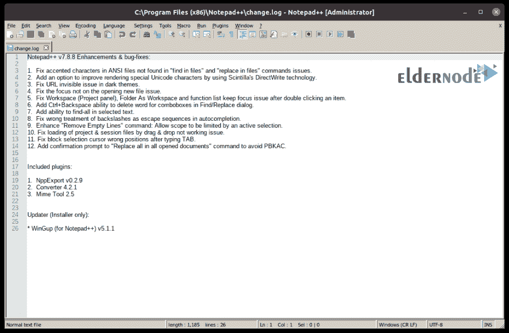

# 在 Ubuntu 20.10[新版本] - Eldernode 上安装 Wine 5.20

> 原文：<https://blog.eldernode.com/install-wine-5-20-on-ubuntu-20-10/>

![Install Wine 5.20 on Ubuntu 20.10 [New Release]](img/814a3e15e28ba350ea04afa01f451964.png)

Wine 是一个免费的应用程序(开源)软件，允许为 Microsoft Windows 操作系统编写的软件在类似 Unix 的操作系统上运行。这个应用程序还有一个名为 Winelib 的库，开发人员可以使用它来编译他们的 Windows 软件，使其更容易适应类似 Unix 的操作系统。Wine 并不是一个完整的模拟器，但它可以被称为兼容层，因为它是 Windows dlls 的重新实现。Wine 代表 Wine 这个名字并不是一个模拟器。本教程讲解如何**在 Ubuntu 20.10** 上安装 Wine 5.20。我们将向您展示如何安装分发终端 3.0 的稳定版本和 Wine 版本。类似的说明适用于 Ubuntu 16.04 和任何基于 Ubuntu 的发行版，包括 Linux Mint 和原始操作系统。您可以访问 [Eldernode](https://eldernode.com/) 中的软件包到[购买 Linux VPS](https://eldernode.com/linux-vps/) 服务器来安装 wine。

## **教程在 Ubuntu 20.10 上安装 Wine 5.20**

默认情况下，Wine 不会安装在大多数 GNU/ [Linux](https://blog.eldernode.com/tag/linux/) 发行版上，必须单独安装。也可以使用 VirtualBox 或 VMware 等虚拟化工具，但它们需要更多的系统资源和 Windows 安装。在这篇文章的续篇中，加入我们来学习如何在 [Ubuntu](https://blog.eldernode.com/tag/ubuntu/) 20.10 上安装 Wine 5.20。

***注意:*** 要想在 Ubuntu 系统上安装新的软件包，必须以拥有 sudo 权限的用户身份登录。

### **如何在 Ubuntu 20.10 上安装 Wine 3.0**

wine 包可以在 Ubuntu 的默认库中找到，可以很容易地用 apt 包管理器安装。这是在 [Ubuntu](https://eldernode.com/ubuntu-vps/) 上安装 wine 最简单的方法，但是存储库中的版本可能比 wine 的最新版本旧。

从更新包列表开始:

```
sudo apt update
```

接下来，通过键入以下命令来安装 wine:

```
sudo apt install wine64
```

完全安装后，使用*wine–version*命令显示 wine 版本:

```
wine --version
```

### **如何在 Ubuntu 20.10 上安装 Wine 4.0**

在本节中，我们提供了如何在 Ubuntu 20.10 上安装 Wine 版的分步说明。

首先使用以下 wget 命令将 WineHQ 存储库的 GPG 密钥输入到您的系统中:

```
wget -qO- https://dl.winehq.org/wine-builds/winehq.key | sudo apt-key add -
```

通过执行以下命令添加 WineHQ 存储库:

```
sudo apt install software-properties-common
```

```
sudo apt-add-repository 'deb http://dl.winehq.org/wine-builds/ubuntu/ bionic main'
```

如何通过键入以下命令安装 Wine 4.0:

```
sudo apt-get install --install-recommends winehq-stable
```

用于显示葡萄酒版本:

```
wine --version
```

输出应该如下所示:

```
wine-4.0
```

### **如何在 Ubuntu 20.10** 上安装使用 Wine 5.20

在安装之前，如果在 64 位系统上运行，您需要启用 32 位体系结构。为此，请使用以下命令:

```
sudo dpkg --add-architecture i386
```

如果您的系统中没有 wget，请使用以下代码安装它:

```
sudo apt update 
```

```
sudo apt -y install software-properties-common wget
```

然后使用以下命令下载并添加存储库密钥:

```
wget -qO - https://dl.winehq.org/wine-builds/winehq.key | sudo apt-key add -
```

导入密钥后，您必须添加存储库:

```
sudo apt-add-repository 'deb https://dl.winehq.org/wine-builds/ubuntu/ focal main'
```

现在库已经准备好了，你可以在你的 Ubuntu 20.10 上安装 Wine 5 了:

```
sudo apt update 
```

```
sudo apt install --install-recommends winehq-stable
```

***注意:*** 由于安装包数量较多，这可能需要一些时间。

```
......  The following packages will be upgraded:  libcurl3-gnutls  1 upgraded, 266 newly installed, 0 to remove and 6 not upgraded.  Need to get 271 MB/271 MB of archives.  After this operation, 1,807 MB of additional disk space will be used.  Do you want to continue? [Y/n] y
```

现在你可以检查你的版本。

#### **在 Ubuntu 上使用 wine 5.20**20.10

对于命令行，可以在终端上直接调用 **wine** 工具:

```
$ wine
```

使用以下命令访问帮助页面:

```
$ wine --help
```

使用以下命令，您可以安装测试应用程序，如 **Notepad ++** :

```
wget https://github.com/notepad-plus-plus/notepad-plus-plus/releases/download/v7.8.8/npp.7.8.8.Installer.exe
```

你可以用 wine 来安装你下载的**。exe** 应用程序:

```
wine npp.7.8.8.Installer.exe
```

现在**同意**安装**单声道**和**壁虎**套装；


*


接下来，开始使用 Wine 安装您的程序:


最后你可以运行**记事本++了**。



## 结论

流行的 Wine 应用程序被设计成在 Linux 上运行 Windows 软件。这个软件实际上创建了软件层来适应 Windows 软件，并为 Windows 软件的良好运行提供了必要的库。在本文中，我们讨论了如何在 Ubuntu 20.10 上安装 Wine 3、4 和 5.20。