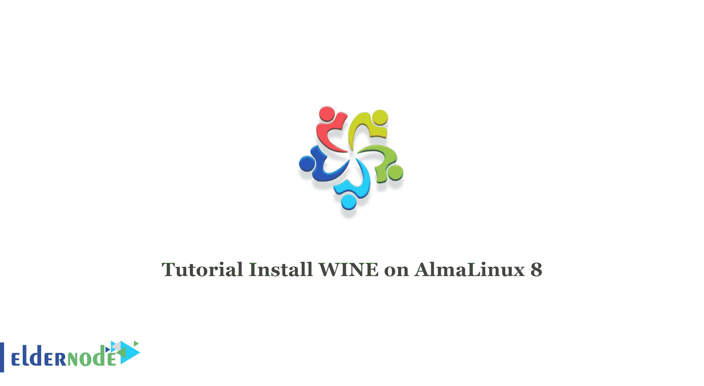

# 教程在 AlmaLinux 8.4 或 8.5 上安装 WINE-elder node 博客

> 原文：<https://blog.eldernode.com/install-wine-on-almalinux/>



如果你想在 AlmaLinux 上运行一个程序，AlmaLinux 上没有专门的版本。在这种情况下，您应该使用在其他平台上模拟 Windows 环境的程序。Wine 是在其他平台上模拟 Windows 环境的程序之一。在这篇文章中，我们将教你如何在 alma Linux 8.4 或 8.5 上安装 WINE。想买一个便宜的有即时激活功能的 [Linux VPS](https://eldernode.com/linux-vps/) ，在 [Eldernode](https://eldernode.com/) 上订购你需要的东西。

## **如何在 AlmaLinux 上安装 WINE**

Wine 是 Linux、Mac 和 Android 上的免费开源程序，允许你在这些平台上运行 Windows 应用程序、游戏和 EXE 文件。

### **在 AlmaLinux 8.4 或 8.5 上安装 WINE**

a)您需要通过以下命令更新系统软件包:

```
sudo dnf update
```

AlmaLinux 没有官方的葡萄酒库，你必须从源头开始构建。您需要使用 Epel 中的开发工具和一些其他必需的依赖项来构建源代码。现在，您可以借助以下命令来启用它:

```
sudo dnf install epel-release
```

```
sudo dnf config-manager --set-enabled powertools
```

在这一步中，您应该安装在 AlmaLinux 系统上构建 Wine 源代码所需的开发工具。为此，请运行以下命令:

```
sudo dnf groupinstall 'Development Tools' -y
```

现在，您应该通过以下命令安装其他依赖项:

```
sudo dnf -y install gcc libX11-devel freetype-devel zlib-devel \  libxcb-devel libxslt-devel libgcrypt-devel libxml2-devel \  gnutls-devel libpng-devel libjpeg-turbo-devel \  libtiff-devel dbus-devel fontconfig-devel
```

接下来，按 Enter 键开始安装。

现在是时候下载葡萄酒了。你可以在官方页面查看想要的葡萄酒版本。为此，请使用以下命令:

```
sudo dnf -y install wget
```

```
wget https://dl.winehq.org/wine/source/6.x/wine-6.1.tar.xz
```

注意:注意给定的版本号，并在必要时更改它。

最后，您应该在 AlmaLinux 系统上安装 Wine:

```
tar xvf wine-*.tar.xz
```

```
cd wine-*/
```

```
./configure --enable-win64
```

```
sudo make install
```

### **如何在 AlmaLinux 上查看葡萄酒版本**

您可以通过以下命令检查 Wine 的版本:

```
wine64 --version
```

最后，您可以开始在 AlmaLinux 上安装 Windows 程序。

```
win64 ./path-to-your file.exe
```

## 结论

本文教你如何在 AlmaLinux 8.4 或 8.5 上安装 Wine。如果您想在 AlmaLinux 系统上使用图形化的 Microsoft Windows 应用程序，可以安装 Wine。我希望这篇教程对你有用。