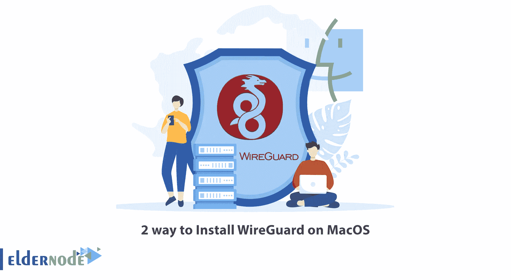
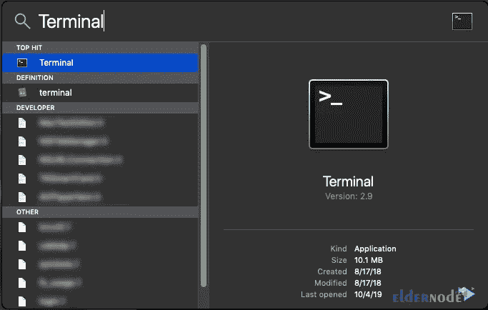
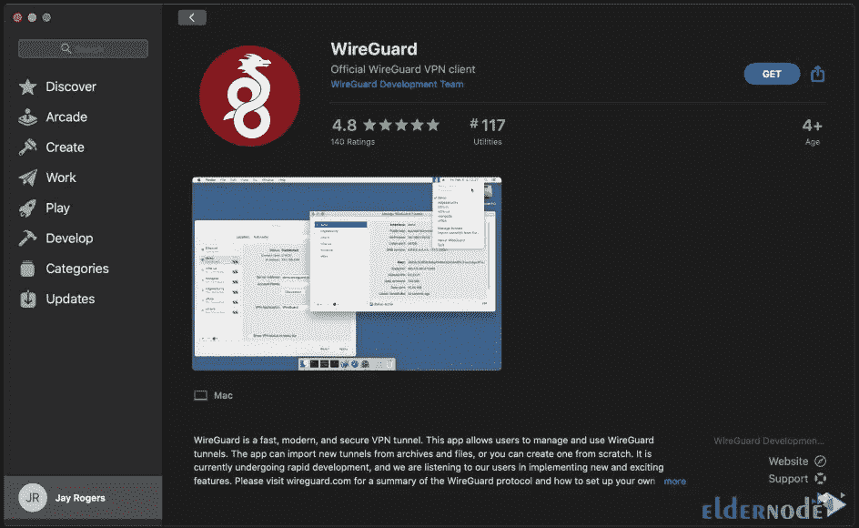
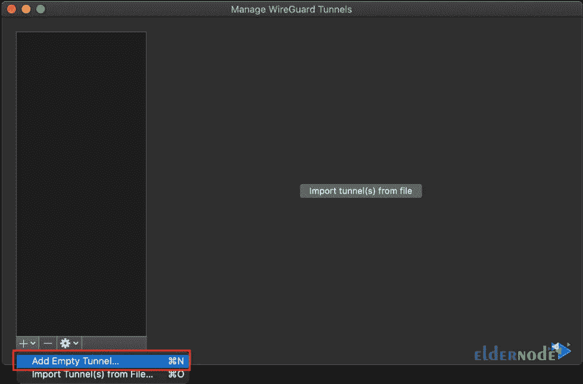
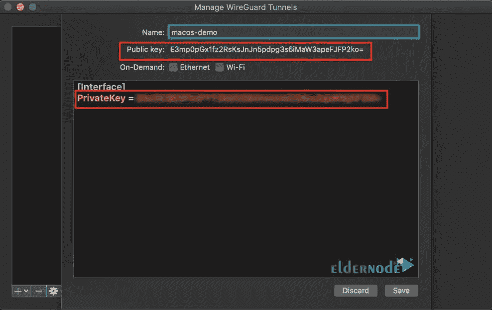
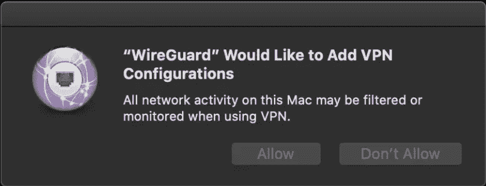

# 在 MacOS 上安装 WireGuard 的两种方法

> 原文：<https://blog.eldernode.com/install-wireguard-on-macos/>



WireGuard 协议已经非常流行。在某种程度上，与 OpenVPN 和 IPSec 等其他 VPN 协议相比，Linux 的创造者 Linus Torvalds 等大型技术和编程人物将 WireGuard 软件誉为“艺术品”。测试表明，该协议的连接速度比其他协议快得多，其加密选项也比其他选项更安全。在本文中，我们将教你两种在 MacOS 上安装 WireGuard 的方法。如果你想[购买便宜的 VPS](https://eldernode.com/vps/) 服务器，可以访问 [Eldernode](https://eldernode.com/) 网站上提供的套装。

## **如何在 MacOS 上设置 2 路 wire guard**

### **铁丝网**特征

[WireGuard](https://blog.eldernode.com/introducing-and-install-wireguard-on-kali/) 是 VPN 协议；客户端(如您的电脑或电话)与 VPN 服务器通信的方式。此外，WireGuard 是一个软件，您可以在不同的设备上运行，效果最好。这个软件只支持 UDP，不使用握手协议。

WireGuard 的一些功能包括:

**1)灵活性:** WireGuard 连接迅速，即使在网络中漫游时也是如此。在其他 VPN 协议失败的情况下，此协议保持连接。

**2)安全性:**与其他 [VPN](https://blog.eldernode.com/vps-vs-vpn/) 软件相比，WireGuard 软件选择了智能和现代化的加密工具，具有安全默认值。

**3)速度:** WireGuard 使用快速加密代码。另外，它的底层组件位于 Linux 内核中(在 Linux 服务器和桌面上)，这使得它比其他 VPN 更快。

**4)易于部署:**安装 WireGuard 软件的客户端和服务器部分非常容易。在服务器端，设置 WireGuard 并不比配置 SSH 难多少。

在这篇来自 [MacOS 培训](https://blog.eldernode.com/tag/mac/)系列的文章的续篇中，我们将教你如何在 MacOS 上安装 WireGuard。

## **1)使用自制软件** 在 MacOS 上安装 WireGuard

要用这种方法安装 WireGuard，第一步是安装 HomeBrew。为此，只需打开终端并运行以下命令:



```
/usr/bin/ruby -e "$(curl -fsSL https://raw.githubusercontent.com/Homebrew/install/master/install)"
```

请注意，这些步骤可能需要 20 分钟。

现在，您可以使用以下命令安装 WireGuard:

```
brew install wireguard-tools; sudo mkdir -p /etc/wireguard/;
```

您可以通过以下命令查看配置和连接信息:

```
sudo wg show
```

您也可以使用以下命令断开连接:

```
sudo wg-quick down <configuration name>
```

要重新连接，您可以运行以下命令:

```
sudo wg-quick up <configuration name>
```

## **2)在 MacOS 上安装 wire guard**

要使用此方法安装 WireGuard，您必须遵循以下步骤。第一步，需要[通过访问 App Store 下载 WireGuard](https://itunes.apple.com/us/app/wireguard/id1451685025?ls=1&mt=12) :



下载并安装 WireGuard 后，您需要创建一个隧道，如下所示。点击**添加空隧道**:



通过点击上面的选项，您将看到为您生成的密钥。如果您想一直连接到您的 VPN，您需要为“以太网”和“Wi-Fi”启用**按需**选项:



在下一步中，您需要将您的服务器添加为“对等体”。在此步骤中，您将为远程网络配置 IP 地址和 DNS:

```
[Interface]  PrivateKey = abcdefghijklmnopqrstuvwxyz1234567890=+  Address = 10.0.0.3/24  DNS = 1.1.1.1, 1.0.0.1
```

```
[Peer]  PublicKey = YOUR_SERVER_PUBLIC_KEY  AllowedIPs = 0.0.0.0/0  Endpoint = YOUR_SERVER_WAN_IP:51820
```

输入信息后保存。现在，您可能会遇到类似下图的消息。所以你必须点击**允许**:



最后，要将客户机添加到服务器，必须运行以下命令:

```
sudo wg set wg0 peer YOUR_CLIENT_PUBLIC_KEY allowed-ips YOUR_CLIENT_VPN_IP
```

## 结论

WireGuard 是一种安全的隧道协议。事实上，WireGuard 是最安全的 VPN 协议之一，这要归功于它使用了现代的、完全经过验证的加密技术。在本文中，我们试图教你如何在 MacOS 上安装 WireGuard。如果你有任何问题，可以在评论区和我们分享。