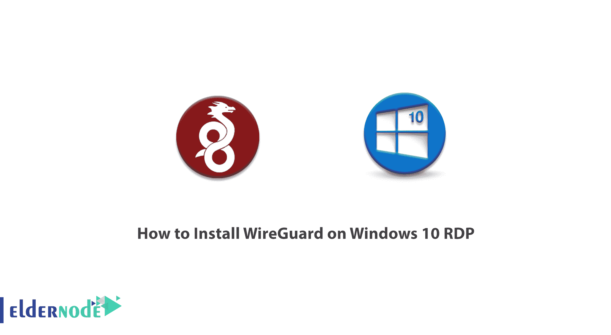
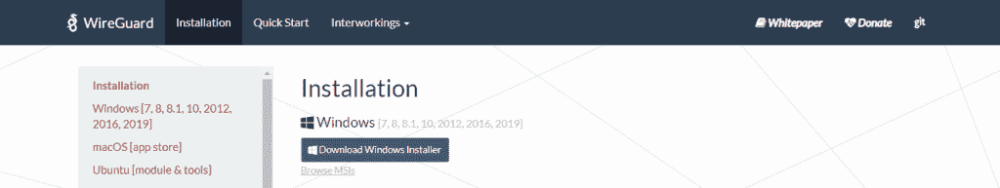
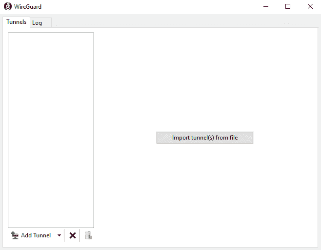
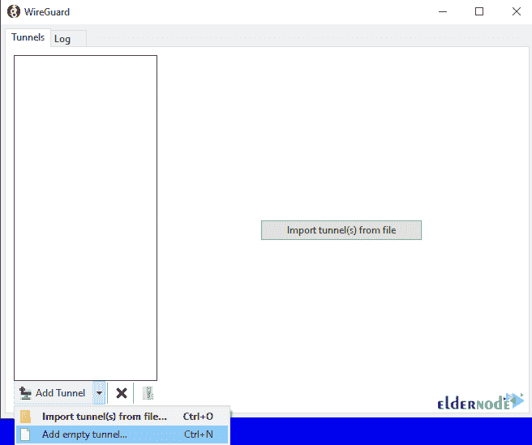
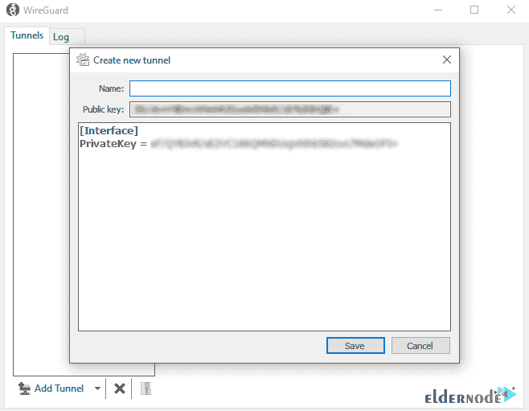
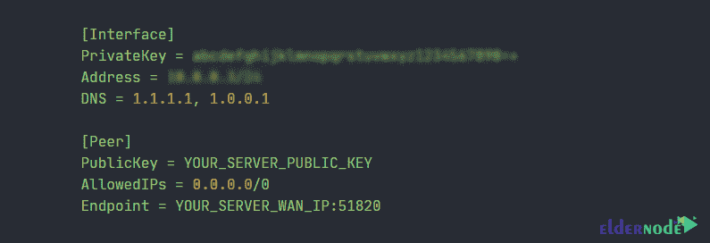
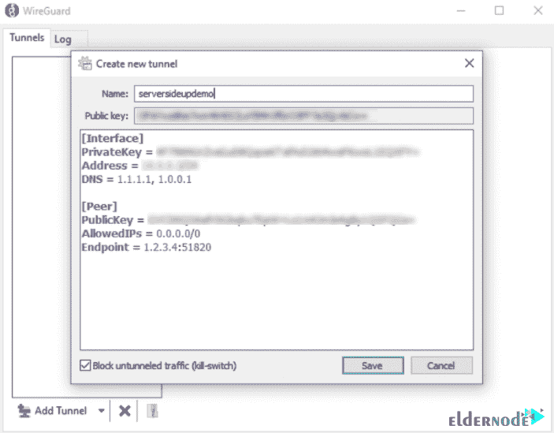
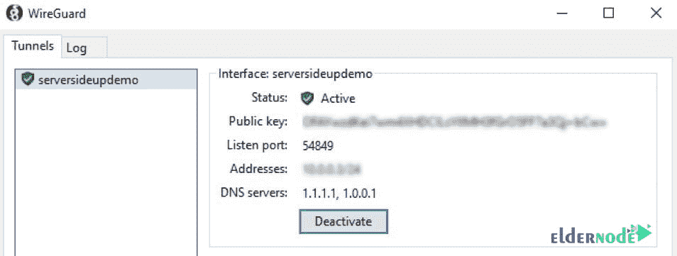

# 如何在 Windows 10 上安装 wire guard RDP-elder node 博客

> 原文：<https://blog.eldernode.com/install-wireguard-on-windows-10/>



WireGuard 是一种具有高级加密功能的现代虚拟专用网技术。WireGuard 技术比其他类似方法更快，如 IPsec 和 Open VPN。它还具有更简单的配置和更好的性能。该平台可以在几乎所有系统上运行，包括 Linux、Windows、Android 和 macOS。WireGuard 的工作原理是在每台设备上创建一个充当隧道的网络。需要注意的是，WireGuard 中的 VPN 流量传输是 UDP。在这篇文章中，我们将教你如何在 Windows 10 RDP 上安装 WireGuard。你可以访问 [Eldernode](https://eldernode.com/) 提供的包来购买 **[Windows 10 RDP](https://eldernode.com/windows-10-rdp/)** 服务器。

## **教程在 Windows 10 上安装 wire guard RDP**

WireGuard 是一种开源的 VPN 协议，比商业上可用的模型更快更容易。虽然传统 VPN 的速度通常是以牺牲安全性为代价的，但 WireGuard 提供了高速、高安全性的互联网接入。与其他 VPN 协议和应用程序相比，WireGuard 以其重量和加密而闻名。有趣的是，与其他超过 60，000 行代码的应用程序相比，WireGuard 只有大约 4，000 行代码。拥有更少的代码意味着软件更容易使用，并允许高效和准确的调试、更新和更改。对于较大的应用程序，这需要更多的时间和精力。

跟随我们这篇文章，看看如何在 [Windows](https://blog.eldernode.com/tag/windows/) 10 RDP 上安装 WireGuard。

### **wire guard 如何工作**

在 [Linux](https://blog.eldernode.com/tag/linux/) 上，WireGuard 只在内核空间工作，因此它的性能比驻留在用户空间的 [OpenVPN](https://blog.eldernode.com/setup-openvpn-on-windows-server-2019/) 好得多。许多 WireGuard 指标，包括性能和连接速度，比 OpenVPN 好四倍。在相同的硬件上，它们比基于 IPsec 的 VPN 速度更快。

然而，Android、iOS、macOS、OpenBSD 和 Windows 的 WireGuard 实现是用一种 **Go** 无内存编程语言编写的。除了一些社区支持的集成了 WireGuard 核心模块的 Android OS 项目之外，非 Linux WireGuard 实现在用户空间中运行。有趣的是，WireGuard 在运行用户空间方面的表现甚至比 OpenVPN 还要好。

在本文的其余部分，我们将逐步解释如何在 Windows 10 RDP 上安装 WireGuard。和我们在一起。

## **在 Windows 10 RDP 上逐步安装 wire guard**

在本节中，我们将教你如何在 Windows 10 RDP 上安装 WireGuard。为此，只需在第一步中转至 [WireGuard 网站](https://www.wireguard.com/install/)的安装页面。然后你必须在打开的页面上点击**下载 Windows Installer** 。这样做将开始下载。



转到您下载安装文件的位置。


然后双击运行它。


在下图中，您可以看到 WireGuard 环境。



**如何在 Windows 10 上配置和使用 wire guard**

运行 WireGuard 后，您必须添加配置文件。点击**添加隧道**，然后**添加空隧道**。



有趣的是，GUI 会自动生成一个公私密钥。请注意，我们的工作还没有结束。因此，让我们提供它来连接到您的服务器。



***注意:*** 出于安全考虑，最好永远不要共享私钥。

在下一步中，有必要将配置文件更新为如下图所示:



确保您还将您的地址设置为 VPN 上的唯一 IP 地址。选中阻止未隧道化的流量将确保我们的所有流量都通过我们的 VPN 进行路由。



**如何给服务器添加客户端密钥**

如果此时按下**激活**，则不会连接。因为你的服务器需要知道你是谁。因此，您必须将您的**客户端的公钥**添加到服务器。应该注意，向服务器添加密钥的最简单的方法是使用 **Wg set** 命令。因此，您需要在服务器上运行以下命令:

### **如何测试 WireGuard 连接**

成功完成前面的步骤后，现在可以在 Windows 10 RDP 设备上按下**激活**按钮了。通过这样做，您应该会看到一个成功的连接已经建立:

```
sudo wg set wg0 peer YOUR_CLIENT_PUBLIC_KEY allowed-ips YOUR_CLIENT_VPN_IP
```



结论

WireGuard 是一种开源通信软件和协议，它使用 VPN 解决方案来建立点对点连接。在这篇文章中，我们试图教你如何一步一步地在 Windows 10 RDP 上安装 WireGuard。

## Conclusion

WireGuard is an open-source communication software and protocol that uses VPN solutions to establish point-to-point connections. In this article, we tried to teach you to step by step how to Install WireGuard on Windows 10 RDP.