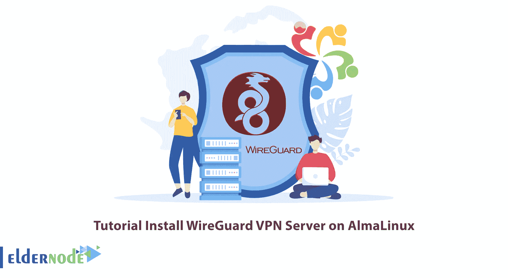

# 教程在 AlmaLinux 上安装 WireGuard VPN 服务器

> 原文：<https://blog.eldernode.com/install-wireguard-vpn-server-on-almalinux/>



WireGuard 是一种开源软件和通信协议，它使用 VPN 解决方案来建立点对点连接。在本文中，我们打算一步一步地教你如何在 AlmaLinux 上安装 WireGuard VPN 服务器。还需要注意的是，如果你打算购买一台 [Linux VPS](https://eldernode.com/linux-vps/) 服务器，你可以访问 [Eldernode](https://eldernode.com/) 网站上提供的软件包。

## **2 在 AlmaLinux 上设置 WireGuard 的步骤**

### **对** 的介绍

[WireGuard](https://blog.eldernode.com/introducing-and-install-wireguard-on-kali/) 是一种先进加密的现代虚拟专用网技术。与其他类似的方法相比，如 IPsec 和 [OpenVPN](https://blog.eldernode.com/setup-an-openvpn-server-on-ubuntu-22-04/) ，WireGuard 技术更快，更容易配置，性能更好。该平台几乎可以在任何系统上运行，包括 Linux、Windows、Android 和 macOS。

Wireguard 的工作原理是在每台设备上创建一个充当隧道的网络。WireGuard 中的 VPN 流量是 UDP。简单来说，WireGuard 是一款免费开源的应用软件，是一种在路由(网络)中使用虚拟专用网方法建立点对点通信的通信协议。

该程序作为 Linux 内核中的一个模块运行，旨在提高隧道协议中 OpenVPN 和 IPsec 的性能。

## **在 AlmaLinux 上安装 WireGuard VPN 服务器**

在前一节熟悉了 WireGuard 之后，现在我们将解释如何在 [AlmaLinux](https://blog.eldernode.com/tag/almalinux/) 上安装它。为此，只需遵循以下步骤。

第一步，您应该通过运行以下命令来更新系统:

```
sudo dnf update
```

更新后，您必须借助以下命令重新启动系统:

```
sudo reboot
```

使用以下命令安装不在 Almalinux 存储库中的 WireGuard 软件包:

```
sudo dnf install -y epel-release elrepo-release
```

现在可以通过运行以下命令来安装 WireGuard 及其所需的依赖项了:

```
sudo dnf install kmod-wireguard wireguard-tools
```

安装程序时，如果您被询问一个问题，有必要通过键入 y 然后按 enter 键继续安装过程。

### **如何在 AlmaLinux 上配置 WireGuard VPN 服务器**

在上一节中您学习了如何在 AlmaLinux 上安装 WireGuard VPN 之后，现在我们想教您如何配置它。

配置 WireGuard VPN 的第一步是使用以下命令创建一个 WireGuard 工作目录。请注意，这样做会导致 WireGuard 将配置文件存储在该目录中:

```
sudo mkdir /etc/wireguard
```

这里您需要生成 WireGuard 公钥和私钥。您可以通过运行以下命令来生成私钥:

```
umask 077 | wg genkey | sudo tee /etc/wireguard/wireguard.key
```

在下一步中，您需要确认文件是否写在上面的目录中:

```
cat /etc/wireguard/wireguard.key
```

现在，您需要通过运行以下命令来生成公钥:

```
wg pubkey < /etc/wireguard/wireguard.key > /etc/wireguard/wireguard.pub.key
```

同样，您需要使用以下命令验证公钥文件的内容:

```
cat /etc/wireguard/wireguard.pub.key
```

接下来，您需要为 WireGuard 创建一个网络配置:

```
sudo vim /etc/wireguard/wg0.conf
```

```
[Interface]  Address = 10.10.10.1/24  SaveConfig = true  ListenPort = 51820  DNS = 8.8.8.8,10.10.10.1,1.1.1.1  PrivateKey = <SERVER-PRIVATE-KEY>  PostUp = firewall-cmd --add-port=51820/udp; firewall-cmd --zone=public --add-masquerade; firewall-cmd --direct --add-rule ipv4 filter FORWARD 0 -i wg0 -o eth0 -j ACCEPT; firewall-cmd --direct --add-rule ipv4 nat POSTROUTING 0 -o eth0 -j MASQUERADE  PostDown = firewall-cmd --remove-port=51820/udp; firewall-cmd --zone=public --remove-masquerade; firewall-cmd --direct --remove-rule ipv4 filter FORWARD 0 -i wg0 -o eth0 -j ACCEPT; firewall-cmd --direct --remove-rule ipv4 nat POSTROUTING 0 -o eth0 -j MASQUERADE
```

为了**启用 IP 转发**，您需要在配置文件中添加以下行:

```
net.ipv4.ip forward = 1
```

应该注意的是，通过启用 IP 转发，将允许 VPN 客户端将数据包路由到它们各自的目的地:

echo " net . IP v4 . IP _ forward = 1 " | sudo tee-a/etc/sysctl . conf

最后，您可以通过运行以下命令来重新加载 sysctl 配置:

```
sudo sysctl -p
```

### **如何在 AlmaLinux 上启动 WireGuard VPN 服务器**

在您成功安装和配置 WireGuard 之后，在本节中，我们将教您如何在 AlmaLinux 上启动它。您可以使用以下命令启动 WireGuard:

```
sudo wg-quick up wg0
```

现在，您可以通过运行以下命令来启动该服务:

```
sudo systemctl start [[email protected]](/cdn-cgi/l/email-protection)
```

您还可以使用以下命令查看 WireGuard 的状态:

```
systemctl status [[email protected]](/cdn-cgi/l/email-protection)
```

## 结论

WireGuard 使用不同的加密包，专注于看起来最安全的加密。此外，通过使用比 OpenVPN 和 IPsec 更小的代码库(大约 4000 行代码)，它使得安全审计更容易。在本文中，我们试图通过教授如何在 AlmaLinux 上安装 WireGuard VPN 服务器来帮助您。如果你有任何问题，可以在评论区和我们分享。