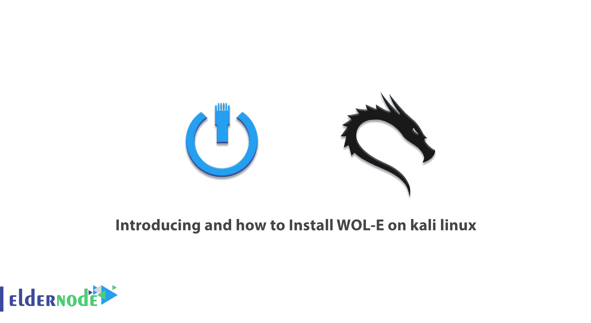

# kali linux - Eldernode 博客介绍及如何安装 WOL-E

> 原文：<https://blog.eldernode.com/install-wol-e-on-kali-linux/>



在网络上设置系统的一种方法是使用局域网唤醒方法，简称 WoL。在这种方法中，向目标系统发送数据包会导致目标系统启动。在 [Kali linux](https://blog.eldernode.com/tag/kali-linux/) 中，一个名为 WOL-E 的工具被包含在网络中，用于测试和接收关于这种类型系统存在的信息。所以在这篇文章中，我们试图帮助你了解**以及如何在 kali linux** 上安装 WOL-E。你可以访问 [Eldernode](https://eldernode.com/) 中可用的包来购买一个 [Linux VPS](https://eldernode.com/linux-vps/) 服务器。

## **介绍如何在 kali linux 上使用 WOL-E**

WoL 是在极低功耗模式下唤醒远程计算机的行业标准协议。“低功耗模式”的定义已经随着时间的推移而改变，但这里的定义包括“关闭”计算机和访问电源。应该注意的是，该协议还允许完成无线局域网唤醒。

如果您想远程访问您的计算机，您建议使用 WoL 工具。WoL 允许您访问您的文件和程序，同时保持您的计算机低功耗，以节省电力和金钱。在这篇文章的后续部分，我们将学习如何在 [kali linux](https://blog.eldernode.com/install-and-configure-kali-linux-on-vps/) 上安装 WOL-E。请和我们在一起。

### **WOL 简介——E**

Wake-on-LAN (WoL)是一种网络标准，允许您远程打开计算机，无论目标计算机是否处于休眠、睡眠状态，甚至完全关闭。这是通过从具有 WoL 客户端版本的计算机接收“魔术包”来实现的。最终启动什么电脑操作系统也无关紧要( [Windows](https://blog.eldernode.com/tag/windows/) ，Mac， [Ubuntu](https://blog.eldernode.com/tag/ubuntu/) 等等。)

WOL-E 功能可以用来打开任何接收到魔术包的计算机上的远程计算机。为此，计算机 BIOS 必须支持局域网唤醒。因此，不是每台计算机都能够自动使用局域网唤醒。这项功能可能有其他名称，但它们都有相同的含义，如远程唤醒、局域网供电、局域网唤醒、局域网恢复等。

### **什么是网络唤醒？**

WoL 是一种网络标准，允许您在启用时远程打开计算机。这项功能还有一个补充标准，称为无线局域网唤醒或 WoWLAN。有了这个解释，让我们来看看与 WoL 一起工作所需的时间。要做到这一点，你需要三样东西:

1.您的计算机必须连接到电源。

2.您的系统主板必须符合 ATX 标准。当然不用担心，几乎所有的现代主板都支持这个。

3.必须在您的计算机网卡上启用 WoL，无论是以太网还是无线网卡。另一个好消息是，这个特性也是一个全球标准，几乎在所有情况下都可用。

作为一个协议，有能力从网络唤醒整个计算机世界。还应该注意的是，它提供了完整的硬件支持。

### **WOL-E 工具能力**

**以下是 WOL-E 的特点:**

****–**使用强制查找客户端系统的 MAC 地址。**

****–**嗅探并保存到磁盘。**

****–**收听 WOL 格式的密码，并将其保存到您的磁盘中。**

****–**向客户端发送唤醒。**

****–**搜索网络上的苹果设备。**

### **WOL-E 是如何工作的？**

**事实上，这个功能依赖于魔术包。简单地说，当网卡检测到数据包时，它会指示计算机自己打开。因此，系统需要始终连接到电源，以便能够在接收到电源命令后执行该命令。主动 WoL 网卡继续扫描这个神奇的包，以接收系统内部时钟周围的小充电量。但是这个解释是什么意思，又是怎么做到的呢？**

**魔术包是从服务器发送的。许多东西都可以充当服务器，包括专有软件、路由器、网站、计算机、移动设备、智能电视和其他物联网设备。服务器通过整个网络发送一个完整的数据包。该软件包包含非常重要的信息，包括子网详细信息、网络地址，当然还有您计算机的 MAC 地址。**

**当所有这些信息组合成一个数据包时，称为 WOL 帧，系统网卡会持续监控这些数据包中的信息。现在，如果系统 MAC 地址在一个数据包中重复 16 次，您的计算机会注意到该数据包是一个 WOL 帧。**

## ****如何在卡莉 linux 上安装 WOL-E****

**您的以太网或无线网卡也应该支持此功能。因为它是通过 BIOS 或您的网卡中间件配置的，所以您不需要任何特殊的软件来启用它。应该注意的是，局域网唤醒支持在今天已经完全普及。在这一节中，我们将学习如何在 kali linux 上安装 WOL-E。**

**在 kali linux 上安装 WOL-E 比你想象的要容易。只需运行以下命令:**

```
`sudo apt-get install wol-e`
```

**应该注意，上面的命令安装 wol-e 和它所依赖的其他包。**

## ****结论****

**最后，出现的问题是关于这个特性的使用程度。应该说，由于这项技术的年代久远，其有用和使用的理由还是很多的。事实上，如果我们展望未来，智能家居现象在人们中间变得更加普遍，WoL 技术将对家庭用户有许多用途。但最重要的是，该过程非常简单，安装和激活，以便使用它。在本文中，我们试图向您全面介绍 WOL-E，并学习如何在 Kali Linux 上安装 WOL-E。**