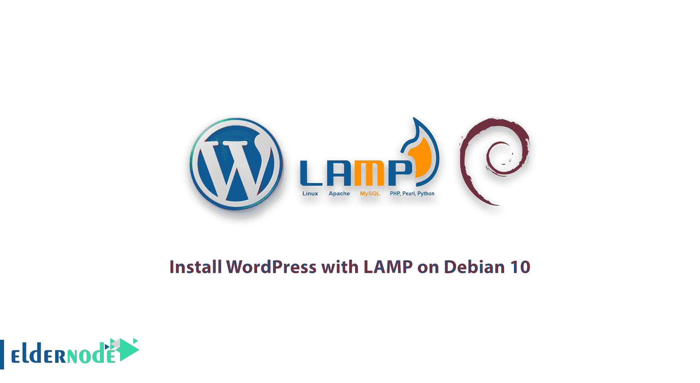
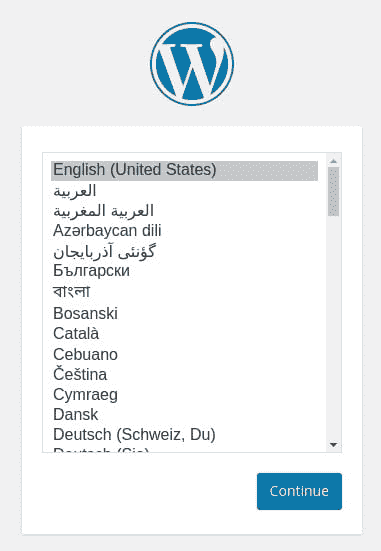
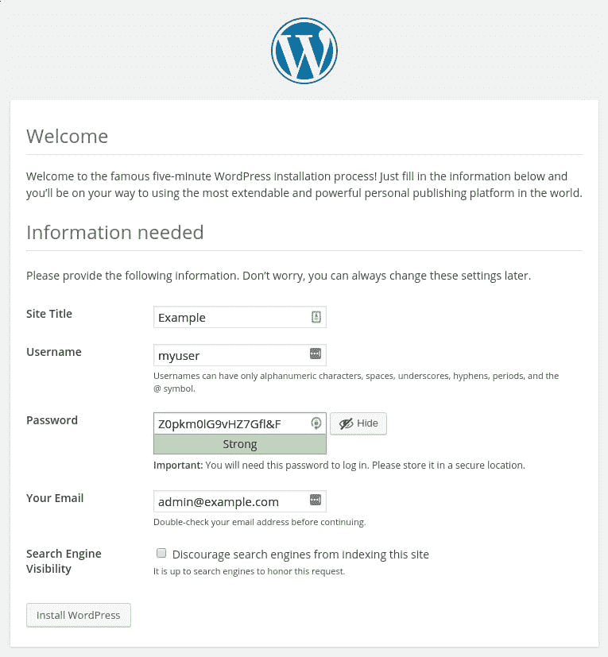
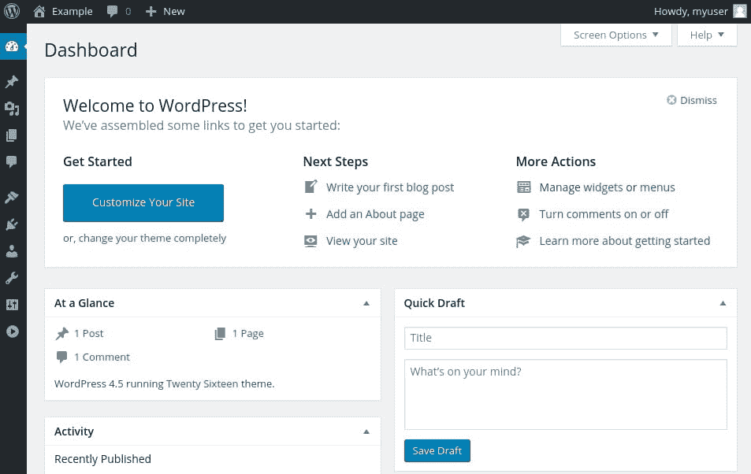
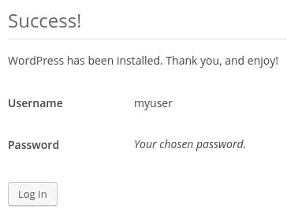

# 如何在 Debian 上安装带灯的 WordPress

> 原文：<https://blog.eldernode.com/install-wordpress-lamp-debian-10/>



为了了解互联网上最流行的内容管理系统，我们向你展示如何在 Debian 10 上安装 WordPress with LAMP。它允许你在一个有 PHP 处理的后端上轻松建立灵活的博客和网站。WordPress 已经被广泛采用，并且是快速建立和运行网站的绝佳选择。设置完成后，几乎所有的管理都可以通过 web 前端完成。

**先决条件:**

如果您考虑以下因素，本教程可能会更有用:

*   拥有 sudo 权限的非 root 用户
*   在 Debian 10 上，按照我们的 [初始服务器设置进行设置。](https://eldernode.com/initial-setup-with-debian-10/)
*   **安装一个灯栈** : WordPress 需要一个网络服务器、一个数据库和 PHP 才能正常运行。设置一个**灯组**可以满足所有这些要求。按照本指南 安装和配置该软件。
*   **用 SSL** 保护你的网站:WordPress 提供动态内容并处理用户认证和授权。 [TLS/SSL](https://eldernode.com/how-to-install-and-activate-the-ssl-certificate/) 是一种允许你对来自你网站的流量进行加密的技术，这样你的连接是安全的。设置 SSL 的方式将取决于您的站点是否有域名。
    *   **如果你有一个域名……**保护你的网站最简单的方法是使用 Let's Encrypt，它提供免费的可信证书。

**你可能也有兴趣阅读:**

**[如何在 Ubuntu 20.04 中用 Apache 安装 WordPress](https://eldernode.com/install-wordpress-apache-ubuntu-20/)**

## 如何在 Debian 10 上安装带灯的 WordPress

加入我们这个指南，告诉你如何在 **Debian 10** 上安装带有**灯**的 **WordPress** 。因此，如果你完成了先决条件点，让我们开始吧。

### 1-为 WordPress 创建一个 MariaDB 数据库和用户 

你将从预备课程开始。WordPress 需要一个基于 MySQL 的数据库来存储和管理网站和用户信息。你已经安装了 Maria db——MySQL 的替代软件——但是我们需要为 WordPress 创建一个数据库和一个用户。

因此，首先，作为 **root** 帐户打开 MariaDB 提示符:

```
sudo mariadb
```

请注意，如果您在安装和设置 MariaDB 时设置了另一个具有管理权限的帐户，您也可以作为该用户登录。您需要使用以下命令来完成此操作:

```
mariadb -u username -p
```

发出这个命令后，MariaDB 将提示您输入为该帐户设置的密码。

现在，使用下面的命令为 WordPress 创建数据库。

```
mysql> CREATE DATABASE wordpress DEFAULT CHARACTER SET utf8 COLLATE utf8_unicode_ci;
```

请注意，每个 MySQL 语句都必须以分号()结尾；)。如果您遇到任何问题，请检查以确保这是存在的。

然后，创建一个单独的 MySQL 用户帐户，专门用于操作新数据库。从管理和安全的角度来看，创建单一功能的数据库和帐户是一个好主意。在本指南中，你将使用名称 **wordpress_user** ，但是如果你愿意，可以随意更改。

使用下面的命令创建这个帐户，设置密码，并授予用户访问刚刚创建的数据库的权限。请记住为您的数据库用户选择一个强密码:

```
mariadb [(none) ]> GRANT ALL ON wordpress.* TO 'wordpress_user'@'localhost' IDENTIFIED BY 'password';
```

现在你有了一个数据库和用户账户，每个都是专门为 WordPress 设计的。运行以下命令来重新加载 grant 表，以便 MariaDB 的当前实例知道您所做的更改:

```
mariadb [(none) ]> FLUSH PRIVILEGES;
```

要离开 MariaDB:

```
mariadb [(none) ]> Exit; 
```

**[用 比特币](https://eldernode.com/bitcoin-vps/)** 购买 VPS

2-安装附加的 PHP 扩展

### 当设置我们的 LAMP 堆栈时，我们只需要一个非常小的扩展集来让 PHP 与 MariaDB 通信。WordPress 和它的许多插件利用了额外的 PHP 扩展。

运行下面的命令，下载并安装一些最流行的 PHP 扩展，用于 WordPress。

由于您将在下一节中重启 Apache 来加载这些新的扩展，如果您返回到这里来安装附加插件，请通过键入以下命令来重启 Apache:

```
sudo apt update  sudo apt install php-curl php-gd php-mbstring php-xml php-xmlrpc php-soap php-intl php-zip 
```

3-调整 Apache 的配置以适应。htaccess 覆盖并重写

```
sudo systemctl restart apache2
```

### `当您安装了额外的 PHP 扩展并准备好使用时，接下来要做的事情是对 Apache 配置进行一些更改。根据必备教程，您应该在/etc/Apache 2/sites-available/目录中有一个站点配置文件。这里我们将使用/etc/Apache 2/sites-available/WordPress . conf作为例子，但是您应该在适当的地方替换配置文件的路径。`

`另外，你将使用 /var/www/wordpress 作为你的 **WordPress** 安装的根目录。您应该使用配置中指定的 webroot。`

`**点** :为了使用 000-default.conf 默认配置(用 /var/www/html 作为你的 webroot)。如果你只打算在这个服务器上托管一个网站，这是很好的选择。如果没有，最好将必要的配置分成逻辑块，每个站点一个文件。`

`目前，的使用。htaccess 文件被禁用。WordPress 和许多 WordPress 插件广泛使用这些文件在目录内调整 web 服务器的行为。`

`打开您网站的 Apache 配置文件。请注意，如果您的网站已有 Apache 配置文件，该文件的名称会有所不同:`

`然后，允许。htaccess 文件，您需要添加一个指向您的文档根目录的目录块，其中包含一个 AllowOverride 指令。在配置文件的 VirtualHost 块中添加以下文本块，确保使用正确的 web 根目录:`

```
`sudo nano /etc/apache2/sites-available/wordpress.conf`
```

`/etc/Apache 2/sites-available/WordPress . conf`

`您现在可以保存并关闭文件。`

```
`<Directory /var/www/wordpress/>      AllowOverride All  </Directory>`
```

`启用重写模块以利用 WordPress 永久链接功能:`

`为了确保您没有犯任何语法错误，请在实现您所做的更改之前运行下面的命令。`

```
`sudo a2enmod rewrite`
```

`输出`

```
`sudo apache2ctl configtest`
```

`但是，如果您通过命令报告遇到任何错误，请返回并检查您的配置文件中是否有任何语法错误。否则，重新启动 Apache 来实现更改:`

```
`Syntax OK`
```

```
`sudo systemctl restart apache2`
```

`4-下载文字新闻`

### `在这一步，你可以下载并安装 WordPress，因为你的服务器软件已经配置好了，特别是出于安全考虑，我们总是建议你直接从他们的网站上获取 WordPress 的最新版本。`

`**点** :既然你需要 curl 下载 WordPress，那就安装吧，因为你的 Debian 服务器上可能默认没有安装这个程序。`

`并运行以下命令切换到一个可写目录，然后下载压缩版本。`

```
`sudo apt install curl`
```

`接下来，提取压缩文件以创建 **WordPress** 目录结构:`

```
`cd /tmp  curl -O https://wordpress.org/latest.tar.gz`
```

`你需要马上把这些文件移到我们的文档根目录下。不过，在此之前，添加一个假人。htaccess 文件，以便 WordPress 以后可以使用。`

```
`tar xzvf latest.tar.gz`
```

`因此，要创建该文件:`

`现在将示例配置文件复制到 WordPress 实际读取的文件名中:`

```
`touch /tmp/wordpress/.htaccess`
```

`此外，创建升级目录，这样 WordPress 就不会在软件更新后尝试自己升级时遇到权限问题:`

```
`cp /tmp/wordpress/wp-config-sample.php /tmp/wordpress/wp-config.php`
```

`所以是时候将目录的全部内容复制到您的文档根目录中了。**注意**下面的命令在源目录的末尾有一个点，表示目录中的所有内容都应该被复制，包括隐藏文件(比如)。您创建的 htaccess 文件)`

```
`mkdir /tmp/wordpress/wp-content/upgrade`
```

`至此，您已经成功地将 WordPress 安装到您的 web 服务器上，并执行了一些初始配置步骤。`

```
`sudo cp -a /tmp/wordpress/. /var/www/wordpress`
```

`5-配置 WordPress 目录`

### ``在你完成基于网络的 WordPress 设置过程之前，你需要调整我们的 **WordPress** 目录中的一些项目。``

``首先将所有文件的所有权交给 **www-data** 用户和组。这是 Apache will 服务器运行的用户，Apache 需要能够读写 WordPress 文件，以便为网站提供服务并执行自动更新。``

``因此，要更新所有权:``

``然后，在 WordPress 目录和文件上设置正确的权限:``

```
``sudo chown -R www-data:www-data /var/www/wordpress``
```

``由于这些应该是合理的权限设置，一些插件和程序可能需要额外的调整。``

```
``sudo find /var/www/wordpress/ -type d -exec chmod 750 {} \;  sudo find /var/www/wordpress/ -type f -exec chmod 640 {} \;``
```

``总之，你需要对主要的 WordPress 配置文件做一些修改。``

``当您打开该文件时，您的第一个目标将是调整一些密钥来为您的安装提供一些安全性。WordPress 为这些值提供了一个安全的生成器，这样你就不必自己想出好的值。这些只在内部使用，所以在这里使用复杂、安全的值不会损害可用性。``

``从 WordPress 秘密密钥生成器获取安全值:``

``您将得到如下所示的唯一值:``

```
``curl -s https://api.wordpress.org/secret-key/1.1/salt/``
```

``输出``

``**非常重要的一点** : 记得每次都要求唯一的值。 **不做****T**复制上图所示数值。``

```
``define('AUTH_KEY',         '1jl/vqfs<XhdXoAPz9 DO NOT COPY THESE VALUES c_j{iwqD^<+c9.k<[[email protected]](/cdn-cgi/l/email-protection)');  define('SECURE_AUTH_KEY',  'E2N-h2]Dcvp+aS/p7X DO NOT COPY THESE VALUES {Ka(f;rv?Pxf})CgLi-3');  define('LOGGED_IN_KEY',    'W(50,{W^,OPB%PB<JF DO NOT COPY THESE VALUES 2;y&,2m%3]R6DUth[;88');  define('NONCE_KEY',        'll,4UC)7ua+8<!4VM+ DO NOT COPY THESE VALUES #`DXF+[$atzM7 o^-C7g');  define('AUTH_SALT',        'koMrurzOA+|L_lG}kf DO NOT COPY THESE VALUES  07VC*Lj*lD&?3w!BT#-');  define('SECURE_AUTH_SALT', 'p32*p,]z%LZ+pAu:VY DO NOT COPY THESE VALUES C-?y+K0DK_+F|0h{!_xY');  define('LOGGED_IN_SALT',   'i^/G2W7!-1H2OQ+t$3 DO NOT COPY THESE VALUES t6**bRVFSD[Hi])-qS`|');  define('NONCE_SALT',       'Q6]U:K?j4L%Z]}h^q7 DO NOT COPY THESE VALUES 1% ^qUswWgn+6&xqHN&%');`` 
```

``**亦作**``

``**[在 Ubuntu 18.04 上用 LEMP 安装 WordPress](https://eldernode.com/wordpress-nginx-mariadb-php-ubuntu/)**``

##### ``**[如何在 Ubuntu 20.04 上安装 LEMP 栈](https://eldernode.com/install-lemp-stack-ubuntu20/)**``

``**[在 CentOS 8 上安装灯栈](https://eldernode.com/install-lamp-stack-on-centos-8/)**``

``这些是您将直接粘贴到配置文件中以设置安全密钥的配置行。将您收到的输出复制到您的剪贴板，然后打开位于您的文档根目录中的 WordPress 配置文件:``

``另外，找到包含这些设置的虚拟值的部分。它看起来会像这样:``

``/var/www/WordPress/WP-config . PHP``

```
``sudo nano /var/www/wordpress/wp-config.php``
```

``. . .``

``然后，删除这些行并粘贴从命令行复制的值:``

```
``. . .    define('AUTH_KEY',         'put your unique phrase here');  define('SECURE_AUTH_KEY',  'put your unique phrase here');  define('LOGGED_IN_KEY',    'put your unique phrase here');  define('NONCE_KEY',        'put your unique phrase here');  define('AUTH_SALT',        'put your unique phrase here');  define('SECURE_AUTH_SALT', 'put your unique phrase here');  define('LOGGED_IN_SALT',   'put your unique phrase here');  define('NONCE_SALT',       'put your unique phrase here');`` 
```

``/var/www/WordPress/WP-config . PHP``

``从现在开始，修改文件顶部的数据库连接设置。您需要调整您在 [MariaDB](https://eldernode.com/tag/install-mariadb-on-debian-10/) 中配置的数据库名称、数据库用户和相关密码。``

``你必须做的另一个改变是设置 WordPress 应该用来写文件系统的方法。因为我们已经给了 web 服务器在需要的地方写的权限，所以我们可以显式地将文件系统方法设置为“direct”。如果没有用我们当前的设置进行设置，将会导致当你执行某些操作时，WordPress 提示 FTP 凭证。``

```
``. . .    define('AUTH_KEY',         'VALUES COPIED FROM THE COMMAND LINE');  define('SECURE_AUTH_KEY',  'VALUES COPIED FROM THE COMMAND LINE');  define('LOGGED_IN_KEY',    'VALUES COPIED FROM THE COMMAND LINE');  define('NONCE_KEY',        'VALUES COPIED FROM THE COMMAND LINE');  define('AUTH_SALT',        'VALUES COPIED FROM THE COMMAND LINE');  define('SECURE_AUTH_SALT', 'VALUES COPIED FROM THE COMMAND LINE');  define('LOGGED_IN_SALT',   'VALUES COPIED FROM THE COMMAND LINE');  define('NONCE_SALT',       'VALUES COPIED FROM THE COMMAND LINE');    . . .``
```

``如您所见，此设置可以添加到数据库连接设置下，或者文件中的任何其他位置:``

``/var/www/WordPress/WP-config . PHP``

``现在，完成后，您可以保存并关闭文件。``

``**最后**，你可以通过网络浏览器访问 WordPress 来完成安装和配置。``

```
``. . .    define('DB_NAME', 'wordpress');    /** MySQL database username */  define('DB_USER', 'wordpress_user');    /** MySQL database password */  define('DB_PASSWORD', 'password');    . . .    define('FS_METHOD', 'direct');``
```

``6-通过 Web 界面完成安装``

``服务器配置完成后，您可以通过 web 界面完成安装``

### ```在 web 浏览器中，导航到服务器的域名或公共 IP 地址:```

```接下来，您可以选择想要使用的语言:```

```接下来，您将进入主设置页面。为你的 WordPress 站点选择一个名字，并选择一个用户名(出于安全考虑，建议不要选择像“admin”这样的名字)。自动生成一个 [强密码](https://eldernode.com/how-to-create-strong-password/) 。保存此密码或选择另一个强密码。```

```
```https://server_domain_or_IP```
```

``输入您的电子邮件地址，并选择您是否希望阻止搜索引擎索引您的网站:``

```
````
```

````

``准备好后，点击**安装 WordPress** 按钮，进入提示您登录的页面:``

``最后，当你登录后，你会被带到 WordPress 管理面板。``

````

```
````
```

``从仪表板中，您可以开始对您的站点的主题和发布内容进行更改。``

``**好样的** ！到达这里，你就是在 Debian 10 上安装 WordPress with LAMP 的专家了。WordPress 应该已经安装并可以使用了。一些常见的后续步骤是为你的帖子选择永久链接设置(可以在设置>永久链接中找到)或者选择一个新主题(在外观>主题)。如果这是你第一次使用 WordPress，稍微探索一下界面来熟悉你的新 CMS，或者在他们的官方文档上查看 WordPress 指南的[第一步。](https://wordpress.org/support/article/first-steps-with-wordpress/)``

``From the dashboard, you can begin making changes to your site’s theme and publishing content.``

``**Good job**! By reaching here, you are an expert on How to install WordPress with LAMP on Debian 10\. WordPress should be installed and ready to use. Some common next steps are to choose the permalinks setting for your posts (can be found in Settings > Permalinks) or to select a new theme (in Appearance > Themes). If this is your first time using WordPress, explore the interface a bit to get acquainted with your new CMS, or check the [First Steps with WordPress](https://wordpress.org/support/article/first-steps-with-wordpress/) guide on their official documentation.``