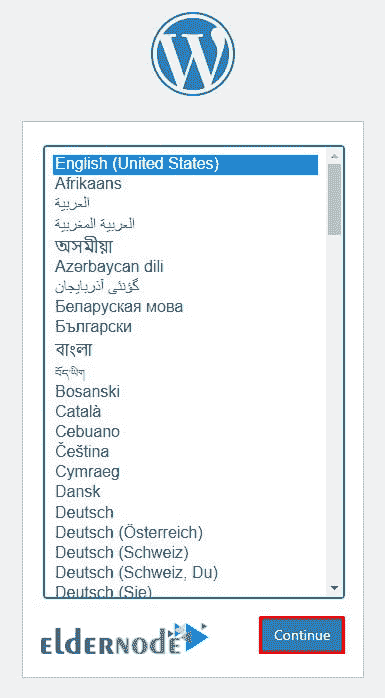

# 教程在 AlmaLinux 8.4 上安装 WordPress-elder node 博客

> 原文：<https://blog.eldernode.com/install-wordpress-on-almalinux/>


进入网站设计领域的用户都熟悉内容管理系统(CMS)。WordPress 是一个网站内容管理系统，你可以用它来创建各种网站和博客。由于 WordPress 内容管理系统的高度灵活性，你将能够使用它来启动任何类型的网站。在这篇文章中，我们将教你如何在 AlmaLinux 8.4 上安装 WordPress。如果你想买一个 [**Linux VPS**](https://eldernode.com/linux-vps/) 服务器，你可以在 [Eldernode](https://eldernode.com/) 看到可用的软件包。

## **如何在 AlmaLinux 8.4 上安装 WordPress**

### **WordPress 和 ita 功能介绍**

有许多内容管理系统可用于建立一个网站，其中一些比其他人有优势。WordPress 是一个内容管理系统，由各种各样的模板和皮肤组成，免费提供给用户。你可以使用这个系统来启动你的网站，不需要任何编程技能。

使用内容管理系统创建的网站实际上是动态网站。如果你是网站设计新手，想要建立一个网站，我们建议你使用像 WordPress 这样的内容管理系统。因为网站设计和编程非常费时费钱。

WordPress 最重要的优点和特性是:

1.简单易用

2.可持续性和创造性

3.有吸引力的设计选项

4.灵活性

5.搜索引擎优化

6.结构

7.轻松的内容管理

8.无孔不入

9.订阅能力

10.开源

11.反应

12.表演

13.编程接口应用程序(API)

14.可量测性

15.WordPress 支持

16.速度和效率

跟随我们这篇文章，向你展示如何在 AlmaLinux 8.4 上安装 WordPress。

### **在 AlmaLinux 8.4 上安装 WordPress 的先决条件**

在这一节，我们想教你在 AlmaLinux 8.4 上安装 WordPress 的先决条件。应该注意的是，第一步是访问 root 用户帐户(或使用 root 权限访问管理员帐户)。

首先，您需要使用下面的命令作为主用户通过 SSH 登录到您的 AlmaLinux 8.4 服务器。注意，在下面的命令中，您必须用相应的 IP 地址和您的 SSH 端口号替换**“IP 地址**和**端口号**:

```
ssh [[email protected]](/cdn-cgi/l/email-protection)_Address -p Port_number
```

然后，您需要使用以下命令来更新系统:

```
dnf update -y
```

现在，您应该通过运行以下命令来验证操作系统的当前版本:

```
cat /etc/os-release
```

完成上述步骤后，我们现在到达灯安装阶段。首先，您需要使用以下命令安装 Apache web 服务器、MariaDB 服务器、PHP 和其他包:

```
dnf install httpd httpd-tools mariadb-server php php-json php-mysqlnd php-json php-curl unzip -y
```

现在，您应该能够使用以下命令**启动 Apache 和 MariaDB** 服务，并**启用**它们来重启系统:

```
systemctl start httpd
```

```
systemctl enable httpd
```

```
systemctl start mariadb
```

```
systemctl enable mariadb
```

### **如何创建 WordPress 数据库**

要在第一步为 WordPress 创建一个数据库，你必须使用下面的命令**登录 MariaDB** :

```
mysql
```

接下来，您需要使用以下命令**创建数据库和用户**:

```
MariaDB [(none)]> CREATE DATABASE wpdb;
```

```
MariaDB [(none)]> CREATE USER 'wpuser'@'localhost' IDENTIFIED BY 'password';
```

通过执行下面的命令，您可以**授予 WordPress 数据库所有的特权**:

```
MariaDB [(none)]> GRANT ALL ON wpdb.* TO 'wpuser'@'localhost' IDENTIFIED BY 'password' WITH GRANT OPTION;
```

最后，您需要使用以下命令**清除特权**和**并退出 MariaDB** :

```
MariaDB [(none)]> FLUSH PRIVILEGES;
```

```
MariaDB [(none)]> EXIT;
```

## **在 AlmaLinux 8.4 上安装 WordPress**

在这一节，我们将讨论如何在 AlmaLinux 上安装 WordPress。为此，您必须遵循以下步骤。首先，将目录更改为 Apache web 根目录，并使用以下命令下载 WordPress 的最新版本:

```
cd /var/www/html
```

```
wget https://wordpress.org/latest.tar.gz
```

现在，您需要通过运行以下命令来**提取**下载的文件:

```
tar -xvzf latest.tar.gz
```

接下来，您需要**将目录更改为 WordPress** ，并使用以下命令重命名示例配置文件:

```
cd wordpress
```

```
mv wp-config-sample.php wp-config.php
```

现在，您需要通过运行以下命令来编辑示例配置文件，然后定义您的数据库设置:

```
nano wp-config.php
```

打开配置文件后，您需要**更改以下值**:

```
define( 'DB_NAME', 'wpdb' );
```

```
/** MySQL database username */  define( 'DB_USER', 'wpuser' );
```

```
/** MySQL database password */  define( 'DB_PASSWORD', 'password' );
```

```
/** MySQL hostname */  define( 'DB_HOST', 'localhost' );
```

最后，您需要使用以下命令**保存**文件，然后在 WordPress 目录上设置适当的所有权:

```
chown -R apache:apache /var/www/html/wordpress
```

### **如何在 AlmaLinux 8.4 上配置 WordPress**

在这一节，我们想讨论如何在 AlmaLinux 上配置 WordPress。第一步是**配置 Apache** 。为此，您需要**使用以下命令为 WordPress 创建一个 Apache 虚拟主机**配置文件:

```
nano /etc/httpd/conf.d/wp.conf
```

在用您想要的文本编辑器之一打开配置文件之后，您现在需要**向它添加以下行**:

```
<VirtualHost *:80>  ServerAdmin [[email protected]](/cdn-cgi/l/email-protection)  DocumentRoot "/var/www/html/wordpress"  ServerName wp.example.com  ErrorLog "/var/log/httpd/example.com-error_log"  CustomLog "/var/log/httpd/example.com-access_log" combined    <Directory "/var/www/html/wordpress">  DirectoryIndex index.html index.php  Options FollowSymLinks  AllowOverride All  Require all granted  </Directory>  </VirtualHost>
```

配置完 Apache 后，您必须使用下面的命令**保存**文件，然后**重启 Apache** 以应用更改:

```
systemctl restart httpd
```

下一步是**配置防火墙**。为此，您必须使用以下命令**通过防火墙启用端口 80 和 443** :

```
firewall-cmd --permanent --zone=public --add-service=http
```

```
firewall-cmd --permanent --zone=public --add-service=https
```

在最后一步中，您可以通过运行以下命令应用更改来重新加载防火墙:

```
firewall-cmd --reload
```

### **如何在 AlmaLinux 8.4 上访问 WordPress**

在前面的章节中，我们向您展示了如何在 AlmaLinux 上安装和配置 WordPress。现在我们想教你如何访问 WordPress 管理面板。为此，您必须遵循以下步骤。

您可以通过在浏览器中输入以下 URL 来访问 WordPress 安装向导:

```
http://wp.example.com
```

运行上述命令将带您进入下一页。下一步，你需要**选择你想要的语言**，然后点击**继续**按钮:



在前面的部分中选择了您想要的语言后，现在您需要输入**网站名称**、**管理员用户名**和**密码**。然后点击**安装按钮**:


如下图所示，您必须点击**登录**按钮:


点击登录按钮后，你将被重定向到 **WordPress 管理登录**页面:


最后一步，你必须输入你的**用户名**和**密码**，点击**登录**按钮。通过这样做，你会看到管理面板:


## 结论

WordPress 从一个活跃的、真诚的开源社区开始，可以帮助你建立一个伟大的网站并运行。在这篇文章中，我们试图一步一步地教你如何在 AlmaLinux 8.4 上安装 WordPress。