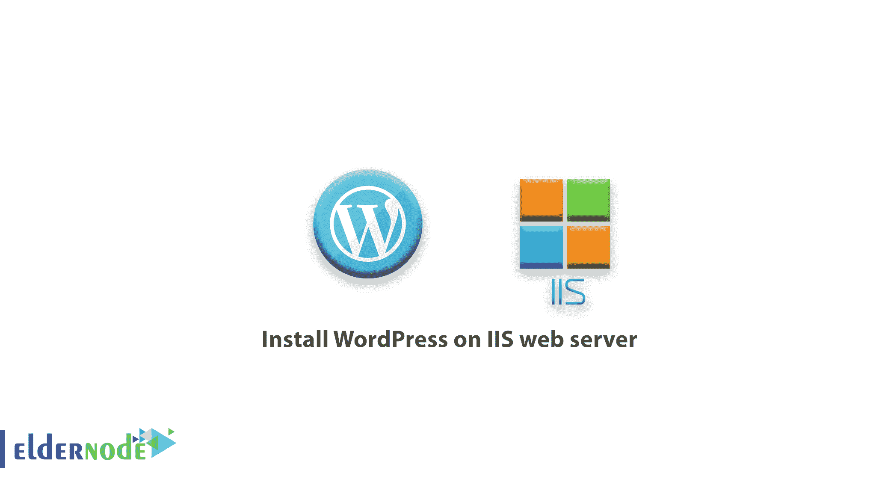
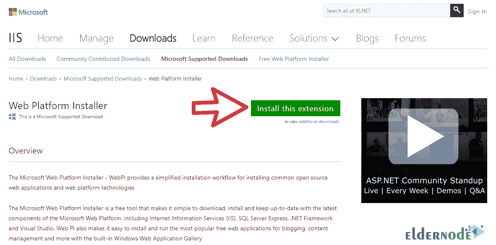
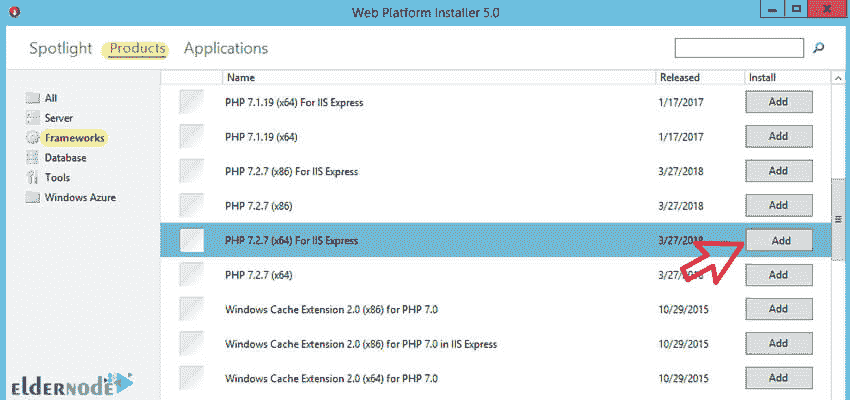
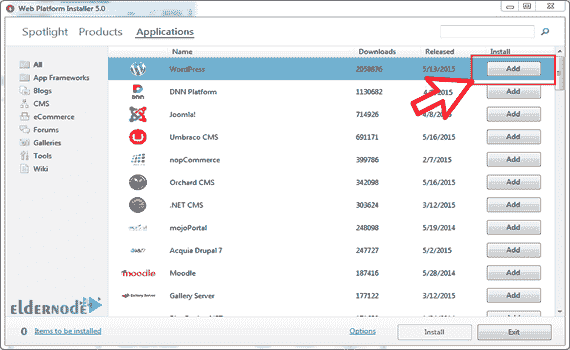
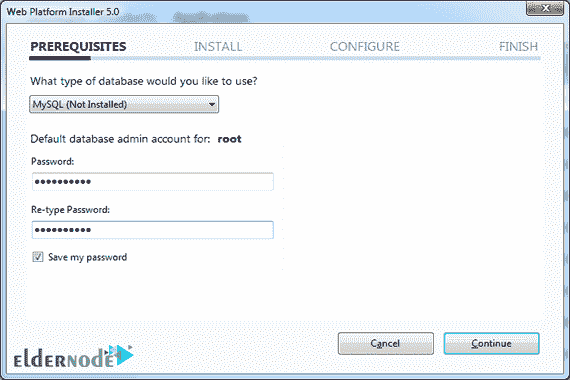
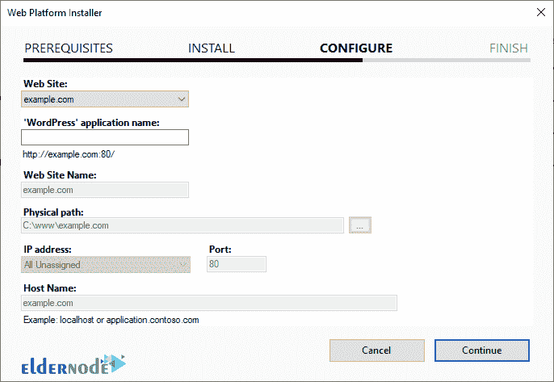
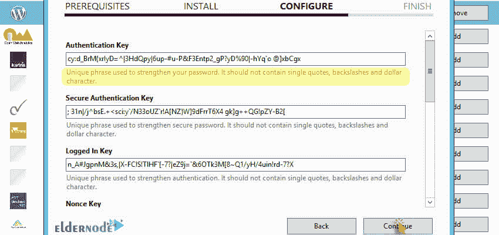
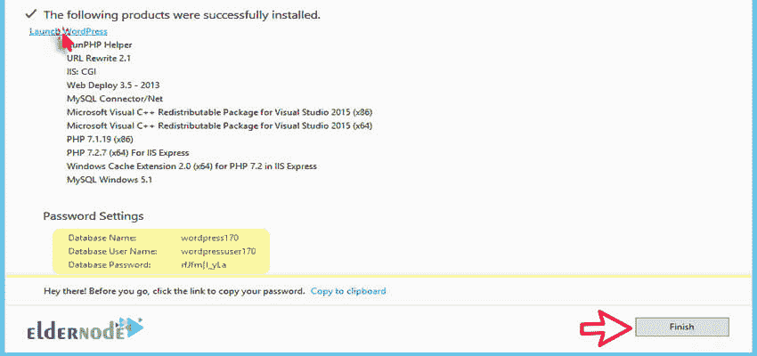
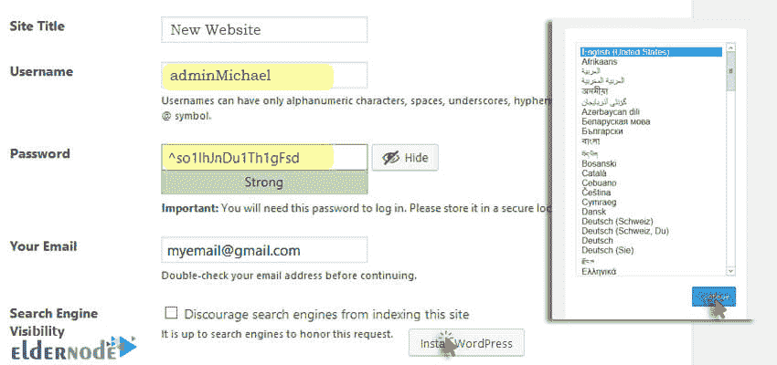

# 如何在 IIS web 服务器上安装 WordPress 教程 IIS Web 服务器

> 原文：<https://blog.eldernode.com/install-wordpress-on-iis/>

如何在 IIS web 服务器上安装 WordPress？在本教程中，我们将教你如何使用微软网络平台安装软件在 Windows 和 IIS 网络服务器上安装 [WordPress](https://wordpress.org/download/) 。

如你所知，要建立一个网站，最好先在你的电脑上本地运行，并检查脚本，模板和插件。当然， [xampp](https://eldernode.com/install-xampp-on-windows-10/) 或者 wamp 大多用于此目的。你也可以在一个[虚拟服务器](https://eldernode.com/vps/)上设置它，并专业地管理你的网站。

## 第一步:安装 IIS

您必须首先配置 web 服务器。您可以使用以下教程在您的系统上安装 IIS:

[如何在 Windows 10 中安装 IIS](https://eldernode.com/install-iis-in-windows-10/)

[在 Windows 2012 vps 服务器上安装 IIS](https://eldernode.com/install-iis-on-windows-2012-vps-server/)

### 步骤 2: 在 Windows/server 上下载并安装 Web 平台安装程序

**1。** 首先，从下面的链接下载并安装 Web Platform Installer (Web PI)软件。

[**下载 Web PI 软件**](https://www.microsoft.com/web/downloads/platform.aspx)

**2。** 运行软件。

在产品标签和框架部分，根据操作系统(x64 / x86)将最新版本的 PHP 添加到安装项目中。

**3。** 从应用部分找到 WordPress ，并将其添加到列表中。

然后点击安装。

**4。** 通过添加 WordPress，一个数据库(MySQL 5.1)被自动添加到列表中。

在这里输入**数据库管理员用户**的密码。

**5。** 在此步骤中，指定网站的名称，文件的路径，以及允许访问网站的端口/IP，如下图所示:

**6。** 在这一步，你必须创建并配置 WordPress 安全密钥。你不需要写下这些代码，你只需要创建复杂而长的代码。

**注意:** 这些代码中不要使用符号(')、($)和(\)。

你可以使用在线密钥生成器来生成这段代码。

**注意:** 在这些代码中，还有一个 $ 符号，你必须用另一个字符替换！

**7。** 物品安装完毕！

复制和保存数据库信息并点击启动 WordPress 或下面的链接继续 WordPress 的安装过程:

**http://localhost/WordPress/WP-admin/install . PHP**

## 第三步:安装 WordPress

**1。** 选择好 WordPress 语言后，输入你的信息，务必复制并保存密码和用户名。

**2。** 安装完成。

现在你应该可以分别从以下链接进入 WordPress 管理页面和网站的主页:

**http://localhost/WordPress/WP-log in . PHP**

**http://localhost/WordPress**

**注意:** 如果您在虚拟服务器上执行此操作，您可以用一个 IP 服务器(或域，如果您已经有 IP 记录)替换本地主机，并从互联网访问此页面。

**亦作，见:**

[如何在 Windows 10 上配置 XAMPP](https://eldernode.com/configure-xampp-on-windows-10/)

[如何在 Ubuntu 20.04 中用 Apache 安装 WordPress】](https://eldernode.com/install-wordpress-apache-ubuntu-20/)

**尊敬的用户**，我们希望您能喜欢这个[教程](https://eldernode.com/category/tutorial/)，您可以在评论区提出关于本次培训的问题，或者解决[老年人节点培训](https://eldernode.com/blog/)领域的其他问题，请参考[提问页面](https://eldernode.com/ask)部分，并尽快提出您的问题。腾出时间给其他用户和专家来回答你的问题。

好运。