# 如何在 Webmin - Usermin | Eldernode 博客上安装 WordPress

> 原文：<https://blog.eldernode.com/install-wordpress-on-webmin-usermin/>

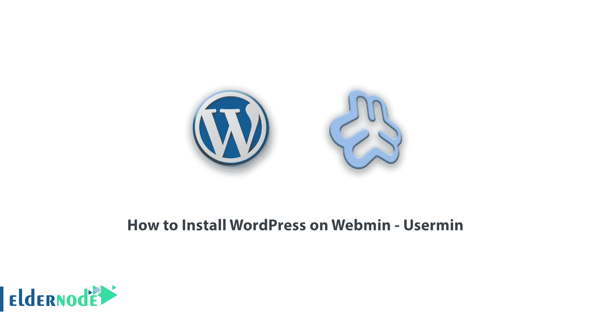

除了 CPanel 和 DirectAdmin，还有其他不太为人所知的平台。在这篇文章中，我们将进入另一个控制面板，试着教你如何在 Webmin 和 Usermin 上安装 WordPress。你可以访问 [Eldernode](https://eldernode.com/) 中可用的包来购买 [WordPress VPS](https://eldernode.com/wordpress-vps/) 服务器。和我们在一起。

## 教程在 Webmin 上安装 WordPress–user min

### 什么是 Webmin？

Webmin 是一个用于管理 Linux 系统的开源图形界面。在 Webmin 中，服务器管理员可以管理用户、服务、DNS 设置、Apache，在 web 上以图形方式编辑其服务器的服务器文件，而不是在 ssh 终端中输入指令。就像我们使用 WebSitePanel 来管理一个 [Windows vps](https://eldernode.com/windows-vps/) 服务器一样，Webmin 是用来管理一个 Linux 服务器的。无论您使用什么系统或使用什么控制面板，都没有关系。重要的是能够在你喜欢的控制面板上安装 [WordPress](https://blog.eldernode.com/tag/wordpress/) 。

Webmin 可以托管有 virtualmin 插件的站点。使用 virtualmin 插件，新的站点可以被添加到 Windows 或 [linux VPS](https://eldernode.com/linux-vps/) 服务器。请记住，管理员必须使用用户面板单独访问站点。

## 如何在 Webmin–user min 上安装 WordPress

**1。**首先，你需要从你的主机或者服务器管理员那里获取你的 Usermin 登录地址。如果您可以访问此地址，并且拥有用户名和密码，您就可以登录。

**2。**进入后，会看到类似下图的页面:

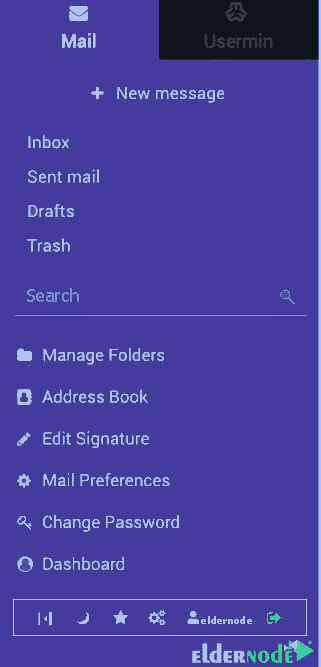

**3。**点击 **Usermin** ，如下图所示:

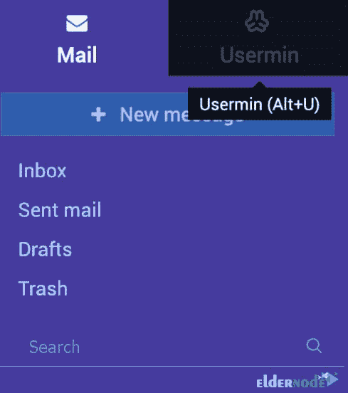

**4。**然后点击**其他**部分的**文件管理器**:

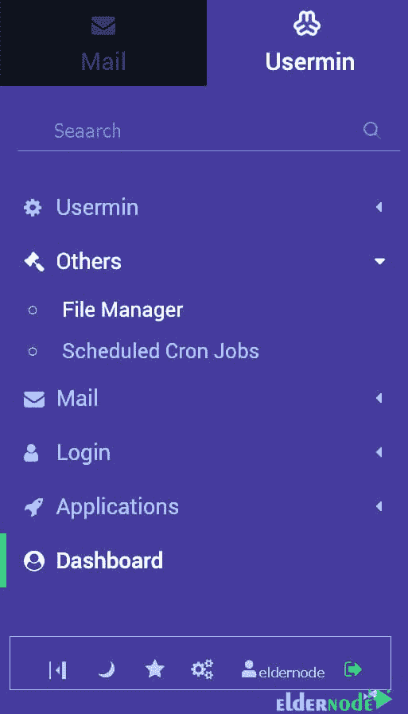

**5。**您现在已登录到您站点的文件管理部分。现在，点击 **public_html** 进入你网站的**根文件夹**:

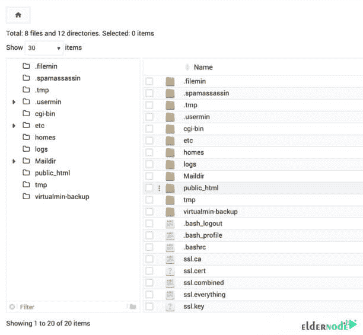

**6。**现在你应该删除默认的 Webmin 文件。然后点击主文件夹中所有文件旁边的**复选框**来激活它们。然后点击页面上方的**删除**，删除所有文件。最后，点击**移除选中的**。

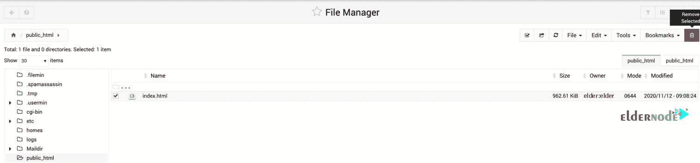

### 了解如何将 WordPress 上传到 Usermin

7 .**。从**文件**菜单中，点击**上传到当前目录**。在这里上传你从 WordPress 下载页面下载的 WordPress 文件。**

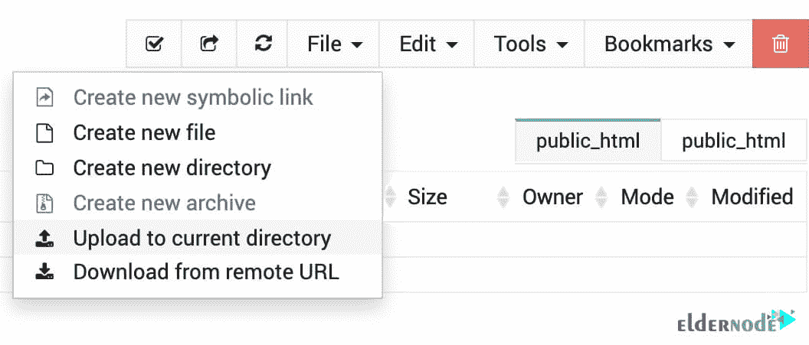

**8。**下一步，右键点击**文件**，点击**提取**。

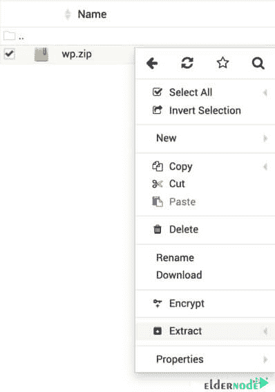

**9。现在你应该进入**文件夹并选择所有的文件。然后点击**文件**菜单中的**剪切**。****

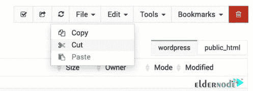

10。从左侧菜单中选择 **public_html** 重新进入主文件夹。

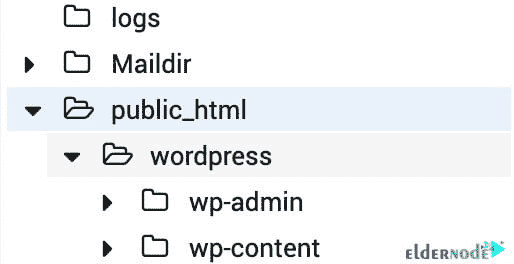

**11。**并从**编辑**菜单中选择**粘贴**选项将文件移动到主文件夹。

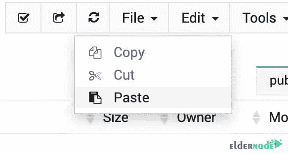

**12。**现在你可以从你的主机上删除 **wp.zip** 文件和 **wordpress** 文件夹了。

### 如何开始在 Usermin 上安装 WordPress

输入你的站点 URL，你会看到一个 WordPress 安装页面。在这一步，你必须安装 WordPress。

13。选择您想要的**语言**。

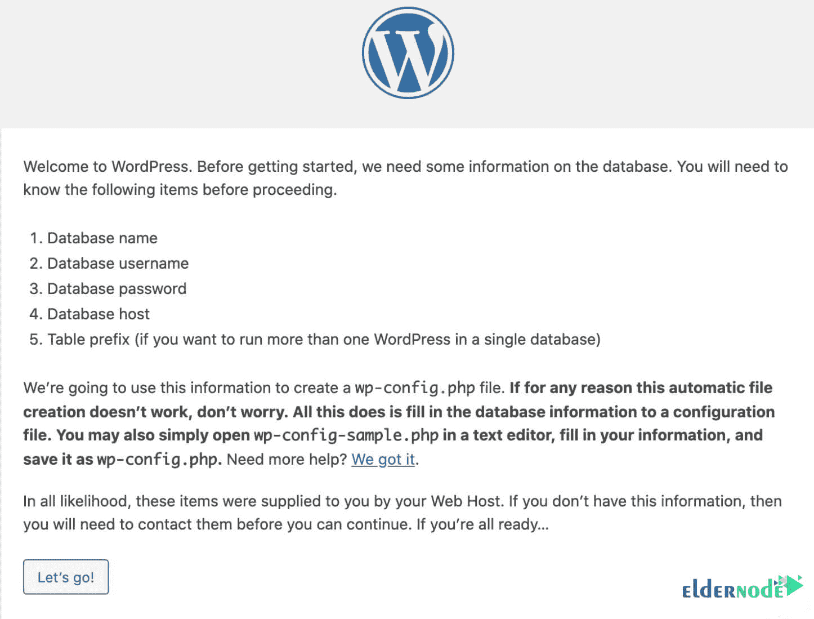

**14。**下一步，点击**开始**。

### 如何将 WordPress 连接到数据库

15。进入 WordPress 安装页面。该页面将要求您输入您需要输入的数据库信息。因为在 Webmin 中创建数据库的过程不同于其他控制面板，所以您应该让服务器管理员为您创建数据库。但是默认情况下，当您在服务器上构建主机时，会用您的用户名创建一个数据库。然后输入如下值:

**数据库名称:**您的主机名，例如:eldernode

**用户名:**您的主机的用户名。例如:eldernode

**密码:**您的主机面板的登录密码

如果上述信息不起作用。您应该要求您的服务器管理员通过 Virtualmin 为您创建一个数据库。

16。然后点击**提交。**

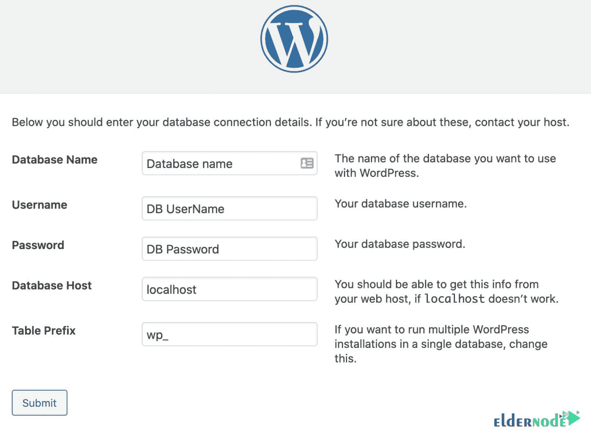

**17。**现在你需要点击**安装**。

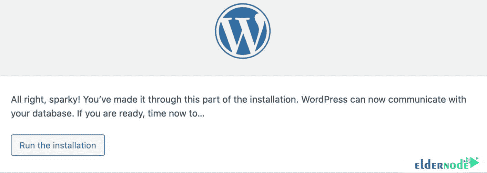

## 教程在 Webmin 上安装 WordPress

18。现在，你必须输入站点信息和 WordPress 管理信息。

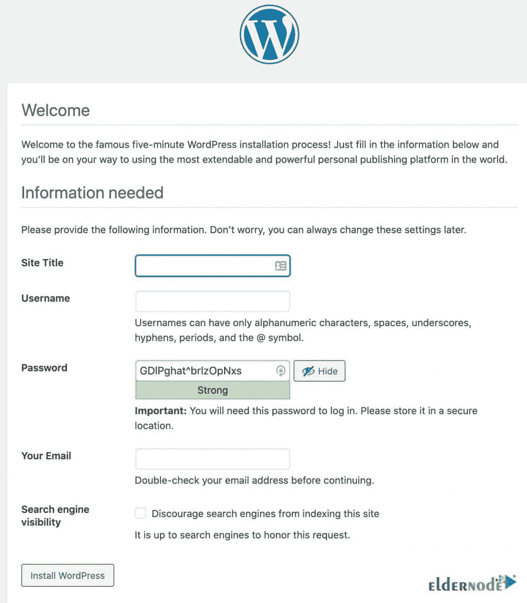

最后，你会看到 Webmin 上的 WordPress 安装已经成功完成。

## 结论

Webmin 是一个开源的 web 和信息管理工具，用于类似 Unix 的系统，如 Linux 和 Windows 系统。在这篇文章中，我们试图教你如何在 Webmin-Usermin 上安装 WordPress。