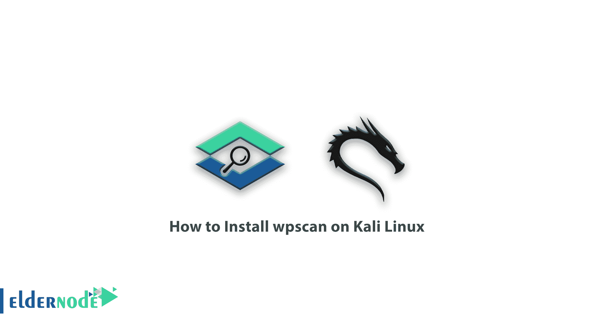

# 如何在 Kali Linux[安全] - Eldernode 博客上安装 wpscan

> 原文：<https://blog.eldernode.com/install-wpscan-on-kali-linux/>



一步步学习如何在 Kali **Linux** 上安装 wpscan。WordPress 等内容管理系统一直被诟病的一个问题就是它们的安全性。通过做一系列的安全措施，WordPress 真的是一个安全的 CMS，你不用担心。许多开发人员在采取安全措施后，在他们的站点上执行渗透测试，以找到并修复安全漏洞。最流行和最强大的工具之一是 [WpScan](https://wpscan.com/wordpress-security-scanner) 。WpScan 是一个安全工具，旨在测试 WordPress 内容管理系统的渗透能力。在本文中，我们试着教你**如何在 Kali Linux** 上安装 wpscan。您可以使用 [Eldernode](https://eldernode.com/) 中可用的包来购买 [Linux VPS](https://eldernode.com/linux-vps/) 服务器。

## 教程在 Kali Linux 上安装 wps can

### wps can 工具简介

WPScan 是一个扫描 [WordPress](https://blog.eldernode.com/tag/wordpress/) CMS 漏洞的应用工具。扫描的目的并不总是穿透别人的网站。您应该始终扫描和分析您的站点和客户，以修复安全问题和漏洞。用于从 WordPress 网站识别和收集信息的工具之一是 WPScan。下面，我们将教你如何在 [Kali Linux](https://blog.eldernode.com/introduction-kali-linux-server-and-its-applications/) 中可视化安装 WPScan 工具。

### wps can 工具有哪些功能？

1)发现网站插件及其版本

2)仅在插件中进行渗透测试和安全漏洞检测

3)识别插件和 WordPress 本身的安全漏洞

4)网站布局识别

5)使用不同的用户代理

6)读取 cookie 文件

7)识别目录

8)执行暴力攻击

9)手动攻击设置，如连接数、线程数和请求数。

## 在 Kali Linux 上安装 wps can

在这一节中，我们试图完整地教你如何在 Kali Linux 上安装 wpscan。和我们在一起。

你需要做的第一件事就是**安装 Git** 并更新到最新版本。为此，您需要在第一步中打开 Kali 终端，并在其中键入以下命令:

```
 sudo apt-get install git
```

第二步，你必须在最新的 Ruby 开发环境中指定 Kali Linux 的**依赖关系**。因此，键入并运行以下命令:

```
sudo apt-get install git ruby ruby-dev libcurl4-openssl-dev make
```

一旦安装了 **Git** 和**依赖项**，就该继续安装 **WPScan** 了。为此，请键入以下命令:

```
git clone https://github.com/wpscanteam/wpscan.git
```

现在，您需要使用以下命令将目录更改为 WPScan 目录:

```
cd wpscan
```

因为 WPScan 是一个需要捆绑器才能运行的程序，所以需要安装它。要安装 bundler，您可以键入并运行以下命令行:

```
sudo gem install bundler && bundle install --without test
```

***注:*** RubyGems 是 Ruby 编程语言的一个包管理器，它提供了一个分发 Ruby 程序和库的标准格式，是一个旨在轻松管理 Gems 安装的工具，也是一个分发它们的服务器。

您可以看到 WPScan 已经成功安装。请注意，首次运行时的更新可能需要几分钟时间。

## 结论

wpscan 是 WordPress 内容管理系统最流行的安全扫描工具之一，比其他 WordPress 扫描器拥有更多的功能和普及性。使用这个工具，你可以进行全面的扫描和渗透测试，找到 WordPress 网站的漏洞。在本文中，在介绍了 WPScan 及其特性之后，我们试图教您如何在 Kali Linux 上安装 wpscan。需要注意的是，如果想在 Debian 中安装 WPScan，可以参考文章[如何在 Debian 10](https://blog.eldernode.com/how-to-install-wpscan-on-debian-10/) 上安装 wpscan。