# 如何在 Mac - Eldernode 博客上安装 XAMPP

> 原文：<https://blog.eldernode.com/install-xampp-on-mac/>

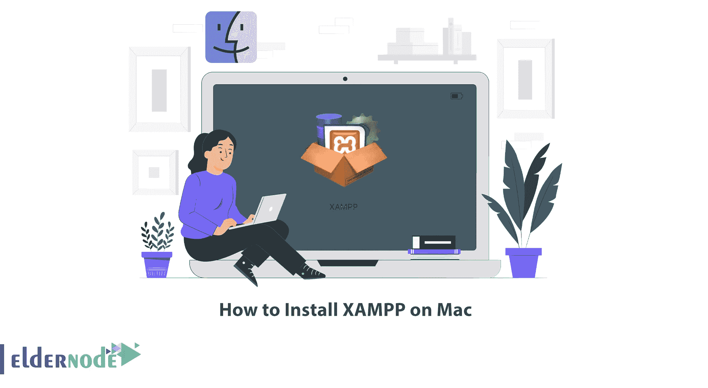

XAMPP 是用于创建本地网络服务器的软件。这个软件适用于所有从事网站设计的人。无论是那些想要学习像 WordPress 这样的内容管理系统并最终使用它创建网站的人，还是想要开发 web 应用程序的 web 程序员。这篇文章将教你如何在 Mac 上安装 XAMPP。如果您打算[购买 VPS](https://eldernode.com/vps/) 服务器，请查看我们网站上提供的套装。

## **教程在 Mac 上安装 XAMPP**

XAMPP 是一个缩写，其中 X 代表跨平台，A 代表 Apache，M 代表 MYSQL，Ps 代表 PHP 和 Perl，是一个免费的开源 web 服务器。它由 Apache Friends 开发，有 11 种语言版本，支持不同的平台，如 Windows 的 IA-32 包和 macOS 的 x64 包以及 Linux。事实上，这个软件的官方设计是作为一个开发工具，让网站设计师和程序员在自己的电脑上测试他们的工作，而不需要访问互联网。

### **下载 Mac 版 XAMPP**

第一步是下载 Mac 版 XAMPP。为此，请访问 [XAMPP](https://www.apachefriends.org/download.html) 官方网站，从 XAMPP 为 OS X 部分选择您想要的版本，然后点击**下载(64 位)**:

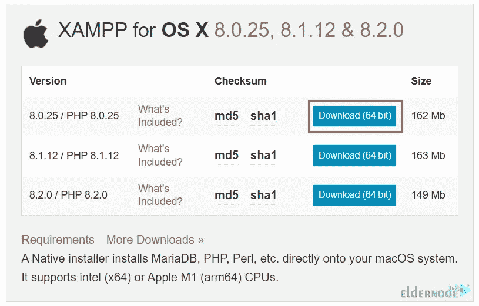

或者打开以下链接开始下载:

```
https://www.apachefriends.org/xampp-files/7.2.0/xampp-osx-7.2.0-0-installer.dmginto
```

## **安装 XAMPP 文件开始安装过程**

下载完成后，双击下载的文件。

打开 [XAMPP](https://blog.eldernode.com/configure-xampp-on-windows-10/) 应用后，双击 **XAMPP** :

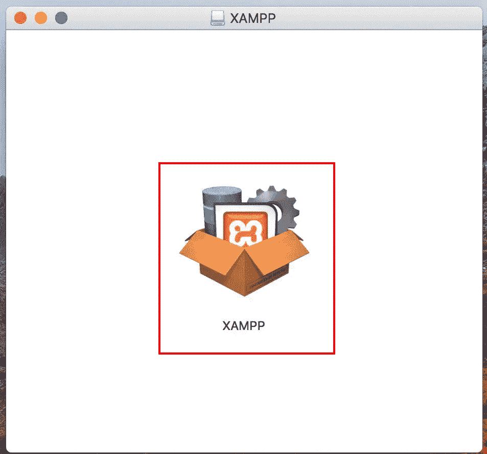

然后，您将被要求允许 XAMPP 打开。为此，点击**打开**:

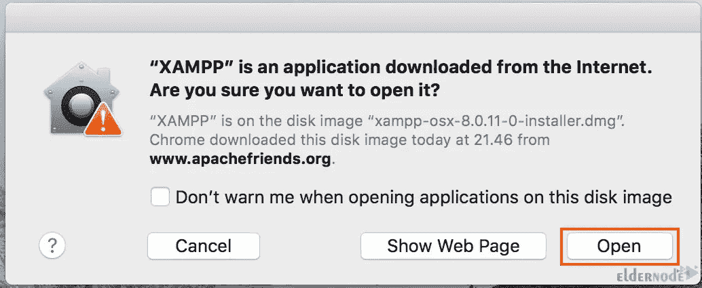

现在输入你的**用户名**和**密码**:

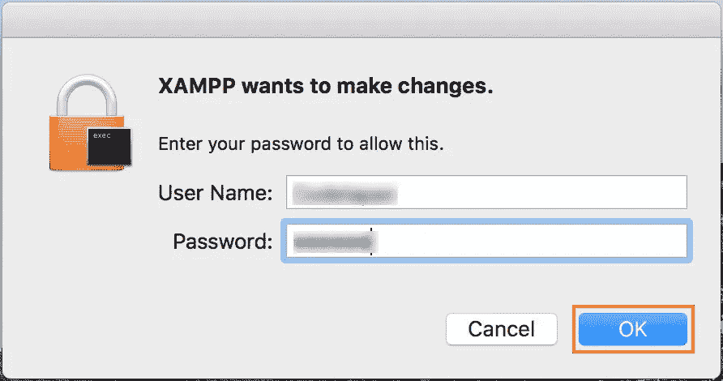

### **选择安装或更新哪些组件**

在这一步中，XAMP 安装将开始。只需点击下一个的**即可继续:**

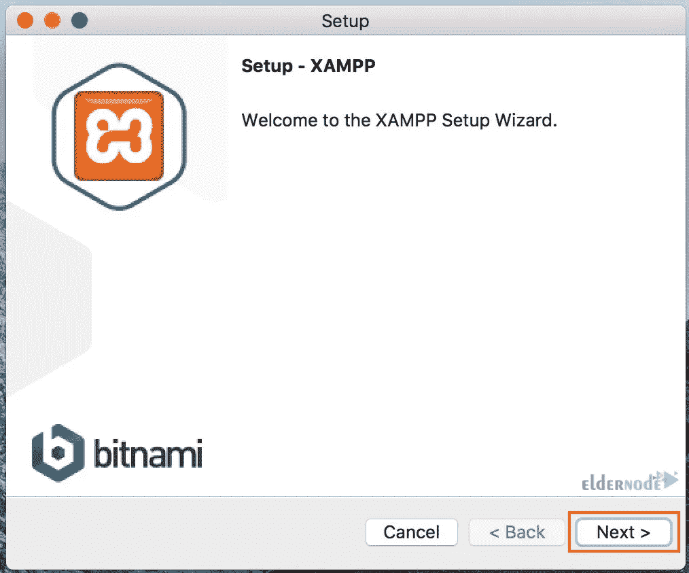

现在是时候选择您想要安装的组件了。如果你想安装所有的组件，点击两个组件复选框，即 XAMPP 核心文件和 XAMPP 开发者文件。选择后，点击**下一个**:

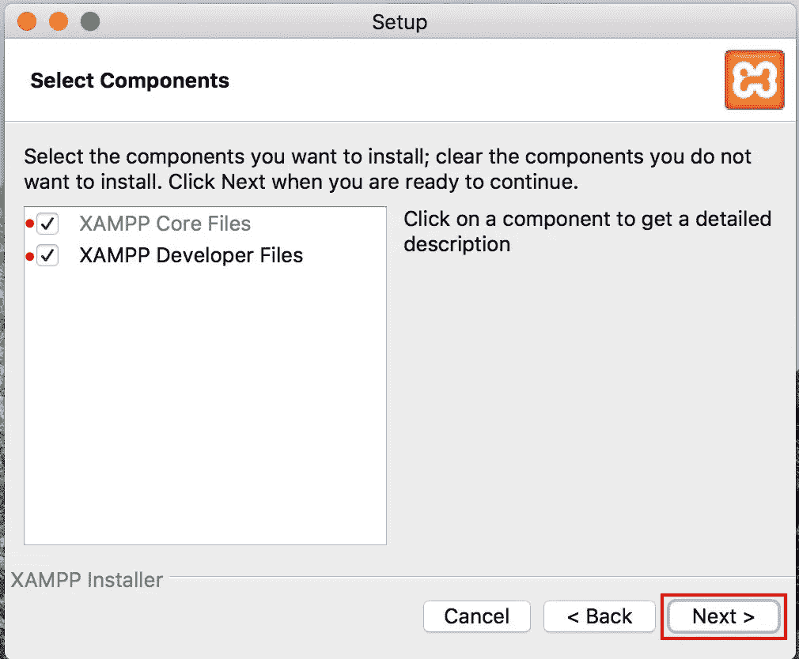

XAMPP 应用程序将安装在您的应用程序目录，您不能更改目标文件夹。所以点击**下一个**:

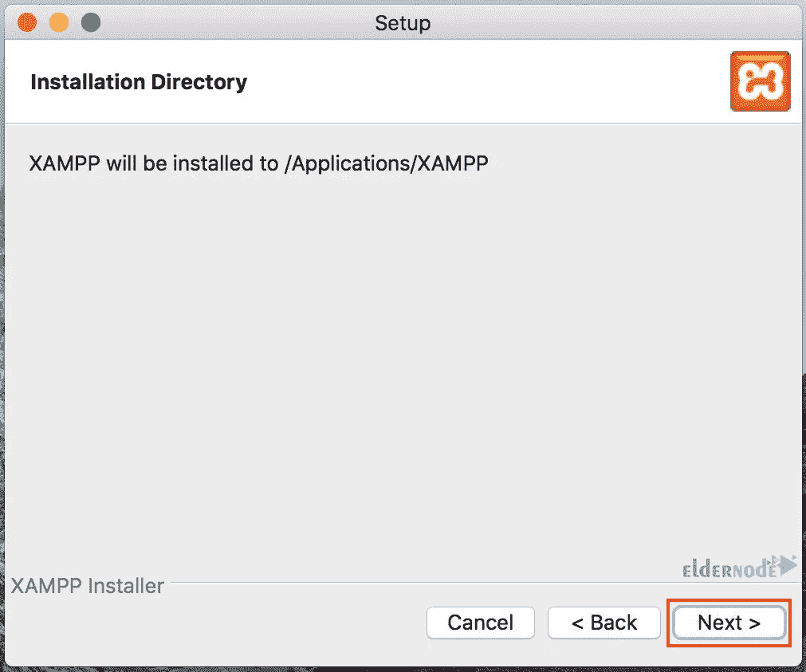

再次点击**下一个**:

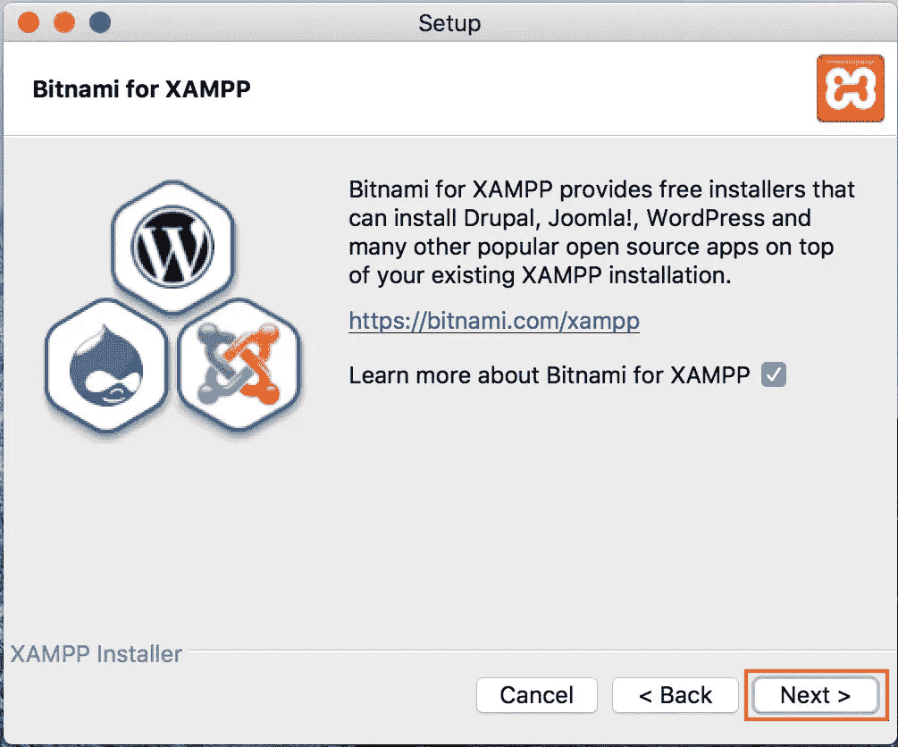

### **点击完成完成安装，在 Mac 上设置 XAMPP**

现在 XAMPP 准备安装。点击下一个的**开始安装:**

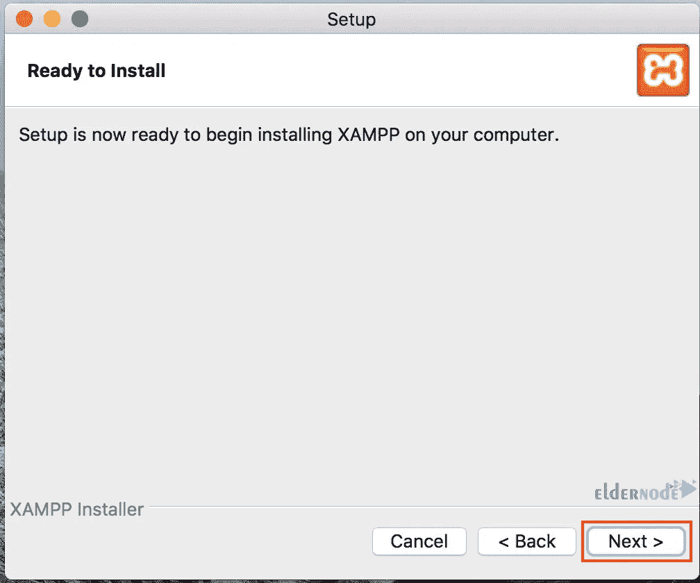

等待安装完成。

安装完成后，点击**完成。**点击**完成**按钮后，记得勾选**启动 XAMPP** 复选框自动打开 XAMPP 应用:

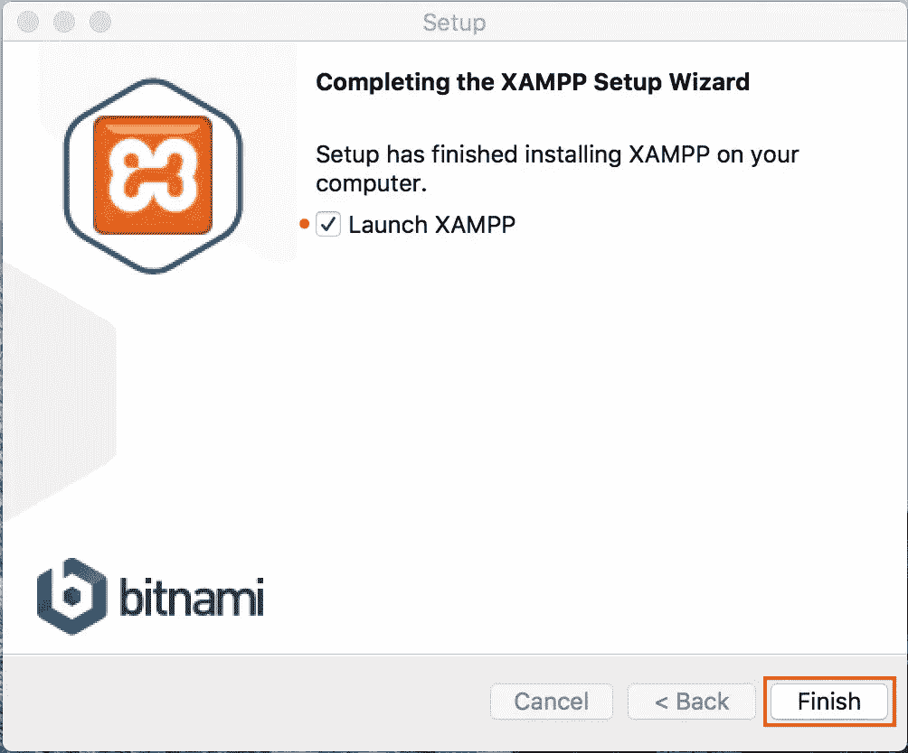

现在你会看到 XAMPP 应用程序将自动打开。点击**管理服务器>MySQL 数据库>开始**运行 MySQL。另外，点击 **Apache Web 服务器> >开始**运行 Apache:

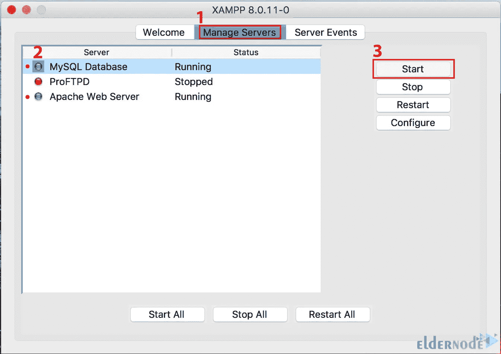

### **在 Mac 上更新 PHP**

你应该**在 Mac 上安装自制软件**来[更新 PHP xampp](https://blog.eldernode.com/update-php-version-in-xampp/) 。因此，如果您之前没有安装 Homebrew，请运行以下命令来完成此操作:

```
/bin/bash -c "$(curl -fsSL https://raw.githubusercontent.com/Homebrew/install/HEAD/install.sh)"
```

然后使用下面的命令将其添加到路径中:

```
echo "export PATH=/opt/homebrew/bin:$PATH" >> ~/.bash_profile 
```

```
source ~/.bash_profile
```

现在，您可以通过运行以下命令来更新 PHP:

```
brew upgrade php
```

就是这样！您已经在 Mac 上成功安装了 XAMPP。

## 结论

在这篇文章中，我们教你如何在 Mac 上安装 XAMPP。我希望这篇教程对你有用，并且能帮助你在 Mac 操作系统上安装 XAMPP。如果你在安装过程中遇到任何问题，你可以在评论区联系我们。