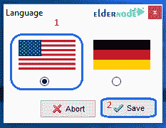

# 如何在 Windows 10 - Eldernode 上安装 XAMPP

> 原文：<https://blog.eldernode.com/install-xampp-on-windows-10/>

如何在 Windows 10 上安装 XAMPP 。Xampp 是可以运行本地 web 服务器的外围软件。这个产品的第一个版本是由 [Apachefriends](https://www.apachefriends.org/index.html) 在 2002 年发布的。过了一段时间，由于它的易用性，它获得了很多粉丝，该公司发布了更多功能更全面的下一个版本。今天， xampp 软件有 Windows、Linux 和 MacOS 版本。XamppServer 实际上在您的 Windows 环境中建立了一个完整的 web 服务器环境。

您可以从 eldernode 选择您最理想的 [Windows VPS Server](https://eldernode.com/windows-vps/) 软件包。

跟随我们学习 xampp 安装和设置教程。

## 在 Windows 10 上安装 XAMPP 教程

**1。** 首先，通过以下链接下载 xampp 软件。

[下载 xampp 软件](https://www.apachefriends.org/download.html)

如下图所示，点击XAMPP Windows 版开始下载。

**2。** 下载完成后，**双击该文件上的**开始安装过程。

**3。T3 在第一页点击下一个。**

**4。** 在这个部分，您可以选择您需要使用的组件。默认情况下，选择所有组件。

**5。** 在接下来的页面中，您指定 xampp 软件的安装路径。选择所需路径后，点击下一个的。

**6。** 在下一页，您可以点击链接来了解 bitnami 图书馆。点击下一个。

**7。** Xampp 现在准备安装，如果确认，点击下一步开始安装过程。

**8。** 等待软件安装完成。

点击完成运行软件。

**9。** 首先选择运行程序的语言，点击保存。

**10。** 通过以管理员身份运行选项启动。 XAMPP 控制面板会出现在屏幕上。点击开始动作，启动 **Apache** 和 **MySQL** 模块。

**尊敬的用户**，我们希望您能喜欢这个[教程](https://eldernode.com/category/tutorial/)，您可以在评论区提出关于本次培训的问题，或者解决[老年人节点培训](https://eldernode.com/blog/)领域的其他问题，请参考[提问页面](https://eldernode.com/ask)部分，并尽快提出您的问题。腾出时间给其他用户和专家来回答你的问题。

好运。