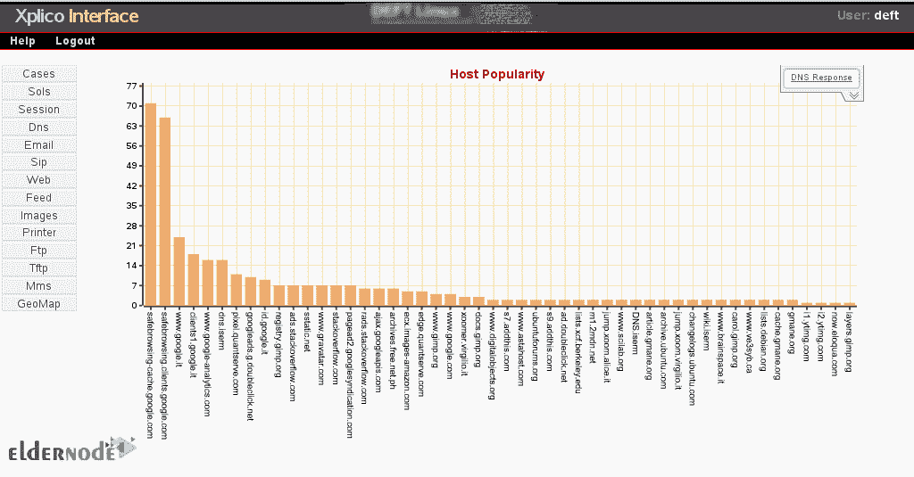
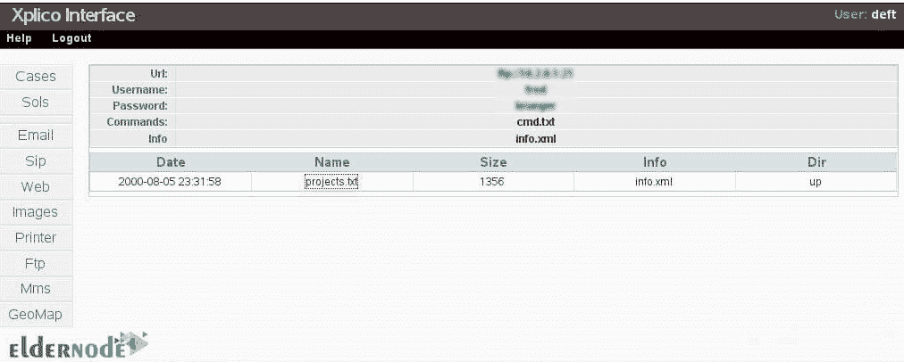

# Kali Linux - Eldernode 博客上的 Xplico 介绍及安装方法

> 原文：<https://blog.eldernode.com/install-xplico-on-kali-linux/>


Xplico 是一个 **N** 网络 **F** orensic **A** 分析 **T** 工具。使用**P**ort**I**n dependent**P**rotocol**I**识别技术识别协议并重构。这个软件是免费和开源的，在 GNU**G**general**P**public**L**license**v**version 2 下。Xplico 提取并重建所有网页和内容，如图像、文件、cookies 等。您可以从 internet 流量捕获中提取 Xplico 包含的应用程序数据。所以，和我们一起阅读这篇文章，阅读**介绍以及如何在 Kali Linux** 上安装 Xplico。在 [Eldernode](https://eldernode.com/) 上的可用包中购买你喜欢的 [Linux VPS](https://eldernode.com/linux-vps/) 并继续阅读。

## **Kali Linux 上的 Xplico 介绍**

### Xplico 特性

**1-** Xplico 支持 HTTP、SIP、POP、SMTP、TCP、UDP、IPv6 等协议。

**2-** Xplico 是多线程的。

**3-** 在 [SQLite 数据库](https://blog.eldernode.com/migrate-sql-databases/)或 Mysql 数据库和/或文件中输出数据和信息。

**4-** 根据流的数量、协议的类型以及计算机 RAM、CPU、HD 访问时间的性能，Xplico 提供了实时细化。

**5-** TCP 重组，对任何数据包进行 ACK 验证或软 ACK 验证；TCP/IP 协议解码器。

**6-** 从包含在输入文件中的 DNS 包进行反向 DNS 查找，而不是从外部 DNS 服务器。

**7-** 唯一的限制是高清大小，数据输入或文件输入数量没有大小限制。

**8-** 支持 IPv4 和 IPv6。

**9-** 输入接口、协议解码器和输出接口都是模块，而每个 Xplico 组件都是模块化的。

**10-** Xplico 能够轻松创建任何类型的调度程序，以最合适和最有用的方式组织提取的数据。

**11-** 网络和数字取证

**12-** 数据包嗅探器

**13-** 嗅探器

**14-** PCAP 解析器

**15-** Xplico 能够对 140 多种协议进行分类。(应用程序)

### 讲解模块

Xplico 能够读取流量数据。由于协议的种类，它将从这些数据中解析信息，并最终将信息发送到某个期望的输出目的地。这三个提到的部分是不同类型的模块，下面将解释它们是插件还是模块。

**捕获模块:**从理论上来说，这些模块允许与任何类型的数据采集系统接口。这些模块位于*船长解剖器*顶层目录中。

**解析器模块**:这些模块被分为支持 eth、IP、tcp 等协议的子目录。他们可以破译协议。此外，它们从流量中提取特定于协议的信息，位于解析器的顶级目录中。

**Dispatcher 模块**:从理论上来说，这些模块允许通过套接字连接与任何类型的数据存储系统接口，例如目录/文件、SQLite、Oracle、MysQL、PostgreSQL、系统存储。它将数据导出到提到的数据库和套接字目的地。调度程序模块能够做到这一点，而不需要轻易修改剖析器模块。这些位于调度顶层目录中。

### Xplico 接口

您可以使用带有 Web 界面的 Xplico 来创建新案例、上传新文件或显示任何已解码的材料。Xplico 接口基于 CakePHP 框架，用 PHP 开发。这个接口使用 SQLite 或 MySQL 数据库。此外，Xplico 在控制台模式下使用，作为允许您解码单个 *pcap* 文件、pcap 文件目录或从 eth0、eth1 等以太网接口实时解码的替代方案。

### Xplico 组件

Xplico 系统由以下 4 个组件构成:

**1-** 解码器管理器

**2-** IP 解码器

**3-** 数据操纵器

**4-** 可视化系统

但是，您可以通过上传 PCAP 捕获文件来开始新的案例。或者在连接到 Xplico web 界面时从现有界面实时获取数据。

### Xplico 替代品

您还可以使用其他一些取证分析工具，让我们来看看:

**1-** 黑客攻击

**2-** 无 SIF

凯恩

**4-** 预发现法医

五向取证

### 截图

**VoIP: SIP 和 RTP** (无信令协议)。


**Dns 图表**


*******



**登录页面，和病例列表页面。**


*******


**会话页面。**


*******


**电子邮件页面。**


**网页。**


**视频和图像页面。**


*******


**Ftp 页面。**


*******



**彩信页面。**


*******


**GeoMap 页面。**


**如何在 Kali Linux 上安装 Xplico**

默认情况下，Xplico 在 DEFT Linux、Kali Linux 和 CAINE Linux 上可用。Xplico 能够从 pcap 文件中提取每封电子邮件(POP、IMAP 和 SMTP 协议)、所有 HTTP 内容、每个 VoIP 呼叫(SIP、NGCP、H323)、FTP、TFTP 等。

要安装 Xplico，您只需运行以下命令:

它将安装 Xplico 和所有需要的软件包。

然后，使用下面的命令安装其依赖项:

## 最重要的是，你也可以通过[Kali.org](https://tools.kali.org/kali-metapackages)网站安装取证元包。如果您安装元包，您将被允许安装相同类别的所需工具，如无线、漏洞评估和取证工具。

结论

在本文中，您回顾了介绍以及如何在 Kali Linux 上安装 Xplico。从现在开始，您将知道如何安装 Xplico，以及为什么您需要使用这个伟大的工具来分析具有多个协议解析器的网络流量。如果您有兴趣阅读更多内容，可以找到另一篇关于【Kali Linux 服务器及其应用简介的文章

```
sudo apt-get update
```

```
sudo apt-get install xplico
```

It will install Xplico and all needed packages.

Then, use the command below to install its dependencies:

```
sudo apt-get install
```

Above all, you can also install the Forensic meta-packages via the [Kali.org](https://tools.kali.org/kali-metapackages) website. If you install meta-packages, you would be allowed to install the required tools of the same category such as wireless, vulnerability assessment, and forensic tools.

## Conclusion

In this article, you reviewed the Introducing And How To Install Xplico On Kali Linux. From now on you know how to install Xplico and why you need to use this great tool for analyzing network traffic with multiple protocol dissectors. In case you are interested in reading more, find another article on [Introduction Kali Linux Server and its applications](https://blog.eldernode.com/introduction-kali-linux-server-and-its-applications/)