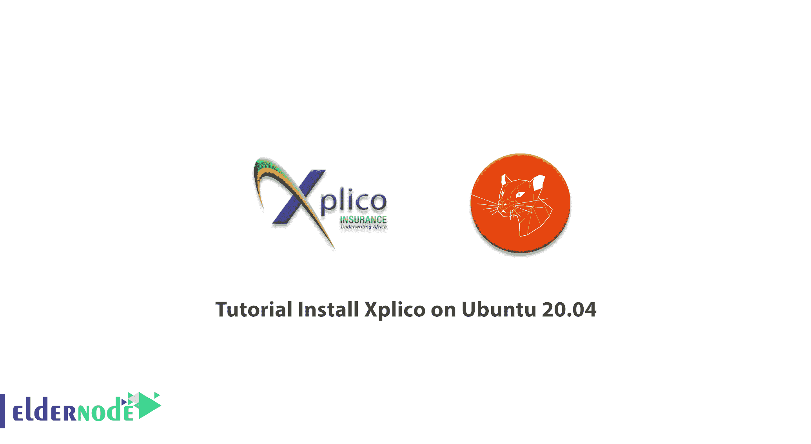

# 教程在 Ubuntu 20.04 上安装 XP lico-elder node 博客

> 原文：<https://blog.eldernode.com/install-xplico-on-ubuntu-20-04/>



Xplico 是一个网络取证分析工具(NFAT)，这是一个软件，重建内容的收购进行了数据包嗅探器。Xplico 旨在从现有的应用程序数据中提取互联网流量。需要注意的是，pcap、Xplico 提取每一封邮件(POP、IMAP 和 SMTP 协议)、所有 HTTP 内容、每一次 VoIP (SIP)通话、FTP、TFTP 等等。在本教程中，我们将向您介绍**教程在 Ubuntu 20.04 上安装 Xplico**。你也可以在 [Eldernode](https://eldernode.com/) 查看可用的包来购买 [Ubuntu VPS](https://eldernode.com/ubuntu-vps/) 服务器。

## **如何在 Ubuntu 20.04 上安装 Xplico**

Xplico 是在 GNU 通用公共许可证下发布的。该软件支持的协议包括 HTTP、SIP、IMAP、POP、SMTP、TCP、UDP 和 IPv6。应该注意的是，在 Xplico 收集的每个数据中，都有一个关联的 XML 文件，该文件唯一地标识包含所收集数据的流和 pcaps。能够创建任何类型的分发服务器，以最方便、最有用的方式轻松组织提取的数据，这是 Xplico 的一个重要特性。Xplico 的其他功能包括:

**–**每个应用协议的端口独立协议标识(PIPI)。

**–**多线程。

**–**输出 SQLite 数据库或 [Mysql](https://blog.eldernode.com/install-mysql-on-linux-ubuntu-20-04/) 数据库和/或文件中的数据和信息。

**–**Xplico 重组的每个数据都与一个 XML 文件相关联，该文件唯一地标识流和包含重组数据的 pcap。

**–**实时处理(取决于流的数量、协议的类型，以及计算机 RAM、CPU、硬盘访问时间的性能)。

**–**TCP 重组，对任何数据包进行 ACK 验证或软 ACK 验证。

**–**从包含在输入文件(pcap)中的 DNS 包进行反向 DNS 查找，而不是从外部 DNS 服务器。

**–**对数据输入或文件输入数量没有大小限制(唯一的限制是 HD 大小)。

**–**支持 IPv4 和 IPv6。

**–**模块化。

在本教程的续篇中，加入我们来学习如何在 Ubuntu 20.04 上安装 Xplico。

## **在 Ubuntu 20.04 | Ubuntu 18.04 上安装 XP lico**

要开始在 Ubuntu 20.04 上安装 Xplico，您必须首先输入以下命令:

```
sudo bash -c 'echo "deb http://repo.xplico.org/ $(lsb_release -s -c) main" >> /etc/apt/sources.list'
```

然后，在下一步中，您必须使用以下命令继续安装:

```
sudo apt-key adv --keyserver keyserver.ubuntu.com --recv-keys 791C25CE
```

现在，您需要更新系统，以应用使用以下命令所做的更改:

```
sudo apt-get update
```

最后，您需要使用以下命令安装 xplico:

```
sudo apt-get install xplico
```

## 结论

Xplico 是一款网络取证分析工具(NFAT)。该软件重建用包装液体采集的内容。有趣的是，Xplico 的诞生目标是恢复协议应用程序数据。Xplico 可以使用一种称为端口独立协议识别的技术来检测协议。在本文中，我们试图向您介绍在 Ubuntu 20.04 上安装 Xplico 的教程。