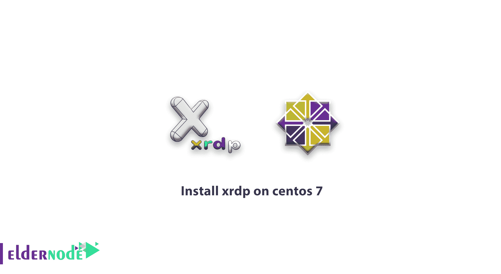
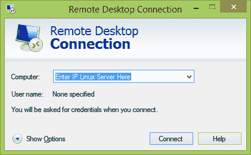
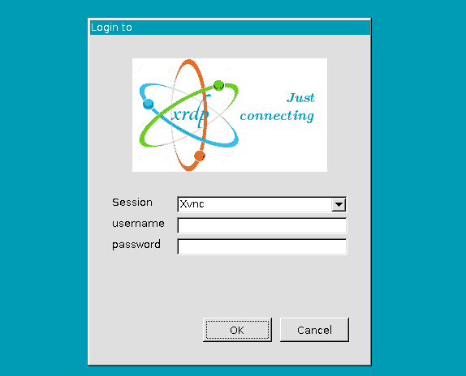

# 如何在 centos 7 上安装 xrdp-在 centos | Eldernode 上安装 xrdp

> 原文：<https://blog.eldernode.com/install-xrdp-on-centos-7/>



如何**在 centos 7** 上安装 xrdp，XRDP 是一款开源软件，可以让你从 Windows 系统远程访问你的 [Linux 服务器](https://blog.eldernode.com/tag/linux/)。与 Windows 一样，Linux 也没有远程桌面功能，但是有一些工具可以让您远程查看和使用 Linux 图形环境。在本文中，我们将研究一种远程访问 Centos 7 [Linux VPS](https://eldernode.com/linux-vps/) 服务器的方法。

先决条件:在执行以下步骤之前，必须在您的 [CentOS 7](https://eldernode.com/centos-vps/) 上安装 GNOME 图形界面。

## **安装 Xrdp CentOs**

**1:** 登录到 [Linux 服务器](https://eldernode.com/linux-vps/)终端。

**2:** 使用下面的命令安装 EPEL 库:

```
rpm -Uvh https://dl.fedoraproject.org/pub/epel/epel-release-latest-7.noarch.rpm
```

**3:** 安装 EPEL 库后，安装 nux 库如下:

```
rpm -Uvh http://li.nux.ro/download/nux/dextop/el7/x86_64/nux-dextop-release-0-1.el7.nux.noarch.rpm 
```

**4 :** 添加这两个库后，安装 [Xrdp](http://xrdp.org/) 和 tigervnc-server 如下:

```
yum -y install xrdp tigervnc-server 
```

现在，请等待工具下载并安装完毕。

**5:** 使用以下命令启动 xrdp 服务:

```
systemctl start xrdp.service 
```

**6 :** 在系统启动时，发出以下命令启用服务:

```
systemctl enable xrdp.service 
```

**7 :** 使用以下命令创建 iptables 规则以允许来自外部机器的 RDP 连接:

```
firewall-cmd --permanent --zone=public --add-port=3389/tcp    firewall-cmd –reload 
```

**8 :** 现在输入以下命令来配置 SeLinux 通信和访问:

```
chcon --type=bin_t /usr/sbin/xrdp  chcon --type=bin_t /usr/sbin/xrdp-sesman 
```

Xrdp 在 Centos 7 上的安装和设置已经完成。

#### **测试远程 Linux 连接**

现在从您的 Windows 机器上打开远程桌面连接实用程序，然后在 computer 字段中输入 Linux 服务器的 IP 地址并点击 connect。



它会要求输入用户名和密码。您可以使用 root 或任何其他 Linux 系统用户。确保使用模块“sesman-xvnc”。



如果你点击确定，你将得到一个桌面。