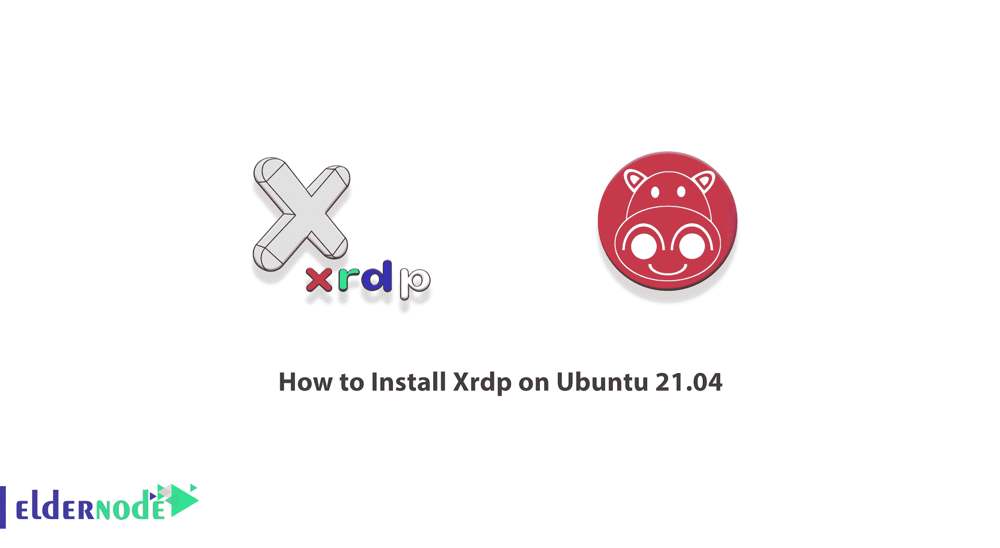
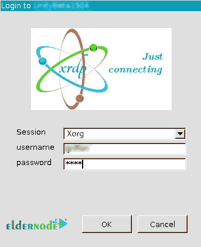
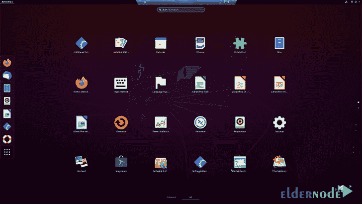

# 如何在 Ubuntu 21.04 | 20.04 - Eldernode 博客上安装 Xrdp

> 原文：<https://blog.eldernode.com/install-xrdp-on-ubuntu/>



如您所知，大多数 Windows 服务器使用 RDP 服务进行图形连接。但是在 Linux 中，各种服务都可以用于图形连接，其中一个就是 XRDP 服务。您可以使用远程桌面通过 Windows 连接到您想要的 Linux 发行版，但是在此之前，您需要在您的 Linux 上安装一个图形环境。这也是为什么我们要在本文中教大家**如何在 Ubuntu 21.04，Ubuntu 20.04** 上安装 Xrdp。如果你想购买一台 **[Ubuntu VPS](https://eldernode.com/ubuntu-vps/)** 服务器，你可以访问 [Eldernode](https://eldernode.com/) 中提供的软件包。

## **视频教程在 Ubuntu 21.04 上安装 Xrdp | Ubuntu 20.04**

使用 Xrdp，您将能够与您的设备建立远程桌面连接。在本文的下一部分，我们将向您介绍 Xrdp 及其一些特性。那么下一节，在熟悉了 Xrdp 之后，我们会教你如何在 [Ubuntu](https://blog.eldernode.com/tag/ubuntu/) 21.04 上安装。下一步，我们将配置 Xrdp，最后解释如何使用 Xrdp 连接到 Ubuntu 服务器。请继续关注本文的其余部分。

### **Xrdp 及其特点介绍**

您一定想在网络环境中从 Windows 系统远程访问您的 Linux 桌面屏幕。如你所知，不像 [Windows](https://blog.eldernode.com/tag/windows/) ，Linux 在默认情况下不支持 RDP，但是幸运的是，一个叫做 Xrdp 的工具使得这在 Linux 上也成为可能。

Xrdp 项目是一个开源工具，允许用户从 Windows 操作系统中访问他们的 Linux 桌面。除了支持 Windows [RDP](https://eldernode.com/buy-rdp/) 客户端，该工具还支持其他类似的客户端，如 FreeRDP、Rdesktop、NeutrinoRDP。

该程序的新版本还支持 TLS 以增加安全性。就像 Windows 到 Windows 远程桌面一样，Xrdp 不仅支持图形远程处理，还支持:

_ 双向剪贴板传输(文本、位图、文件)

_ 音频重定向

_ 驱动器重定向(在远程计算机上装载本地客户端驱动器)

_ RDP 传输默认使用 TLS 加密。

## **在 Ubuntu 21.04 上安装 Xrdp | Ubuntu 20.10**

在这一节，我们将教你一步一步地在 Ubuntu 21.04 上安装 Xrdp。为此，只需遵循以下步骤。第一步是使用以下命令更新 Ubuntu:

```
sudo apt update
```

```
sudo apt upgrade
```

由于 Xrdp 在 Ubuntu 包存储库中可用，所以只需运行下面的命令**来安装 Xrdp** :

```
sudo apt install xrdp gnome-tweak-tool
```

注意，Xrdp 服务经常使用存储在 **/etc/ssl/** 目录中的名为 **ssl-cert-snakeoil.key** 的证书。 **Xrdp 用户**可能有权访问这些文件。因此，您必须使用以下命令将该用户添加到 **ssl-cert** 组:

```
sudo usermod -a -G ssl-cert xrdp
```

### **如何在 Ubuntu 21.04 上配置 Xrdp**

现在我们想向您展示如何在 Ubuntu 21.04 上配置 Xrdp。在开始配置之前，我们必须告诉您，在使用 Xrdp 时，您可能会遇到黑屏，这将阻止您在系统上做任何事情。所以这里我们需要修改 Xrdp 用来运行窗口管理器的脚本。为此，您需要使用所需的文本编辑器打开配置文件。正如您在以下命令中看到的，我们使用了 nano 编辑器:

```
sudo nano /etc/xrdp/startwm.sh
```

打开文件后，您应该查找以下命令:

```
test -x /etc/X11/Xsession && exec /etc/X11/Xsession
```

现在，您需要将以下命令添加到上述命令的底部:

```
unset DBUS_SESSION_BUS_ADDRESS
```

```
unset XDG_RUNTIME_DIR
```

最后，您可以通过按下 **CTRL+X** ，然后按下 **Y** ，再按下 **ENTER** 键来**保存**文件。

### **如何连接 Ubuntu Xrdp**

在这一节中，我们将向您展示如何使用 Windows 远程桌面连接到 ubuntu Xrdp。所以首先在你的 Windows 上打开**远程桌面连接**。然后你需要输入 Ubuntu 服务器的 IP 地址，点击**连接**:


如果您通过查看下图认为显示的信息是正确的，请点击“**是**按钮确认连接:


成功完成上述步骤后，您现在可以看到 Xrdp 界面。输入**用户名**和**密码**后，可以点击 **OK** 按钮登录:



注意，如果你不能登录到 XRDP 环境，你应该检查你的 Gnome 状态。如果您的 Ubuntu 系统上没有安装 Gnome，您可以使用以下命令安装它:

```
sudo apt install gnome-session gdm3
```

您将会看到您已经成功登录到 Ubuntu 系统:



您可以使用以下命令检查 Ubuntu 上的 Xrdp 状态:

```
sudo systemctl status xrdp
```

## 结论

正如您在本教程中学到的，通过在 Ubuntu 上安装 Xrdp，用户可以使用 Microsoft 远程桌面客户端访问操作系统。在本文中，我们试图教你如何在 Ubuntu 21.04 上安装 Xrdp。如果你愿意，可以参考[如何在 centos 7](https://blog.eldernode.com/install-xrdp-on-centos-7/) 和 [Debian](https://blog.eldernode.com/install-xrdp-on-debian-10-buster/) 上安装 Xrdp。