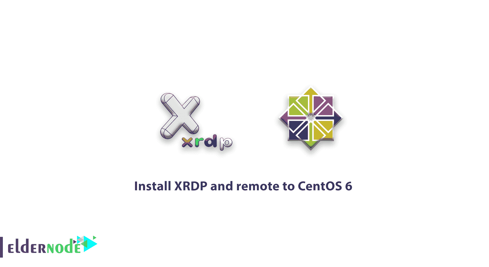
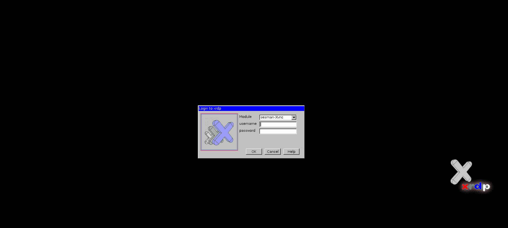
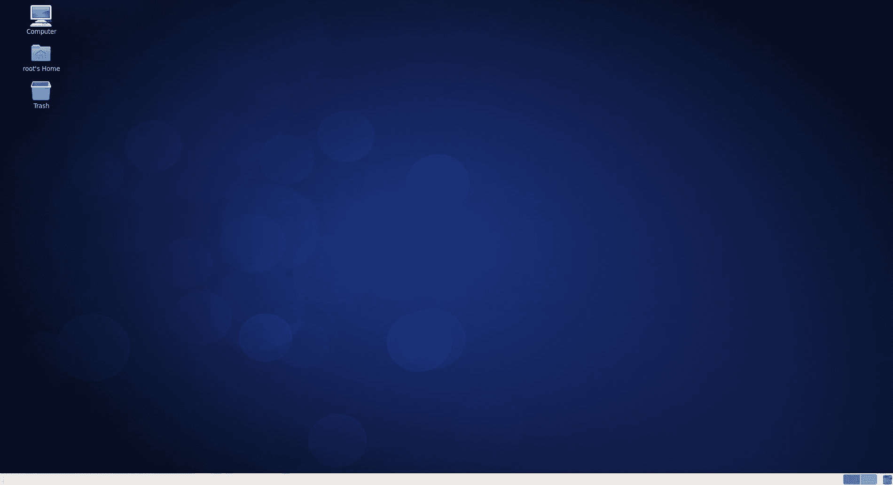

# 如何安装 XRDP 和远程到 CentOS 6 -远程桌面 CentOS 6

> 原文：<https://blog.eldernode.com/install-xrdp-remote-centos-6/>



正如您查看了在 CentOS Linux 上安装 VNC 的文章[，我们将向您介绍如何安装 XRDP 和 CentOS 6 远程，您可以轻松地远程连接到](https://eldernode.com/install-vnc-on-centos-linux/) [Centos 6](https://eldernode.com/create-user-on-debian-with-root-access/) ，无需任何其他设置。看过 VNC 服务器的安装过程后，你可能会后悔与 VNC 合作。因为它有很多步骤，对于没有足够 Linux 经验的人来说有点难。 [XRDP](http://xrdp.org/) 是一个非常高效的工具，在 **VNC 服务器**的帮助下安装后，你将能够远程使用你的 Windows 桌面远程软件到你的 Linux 并使用它。

## 如何安装 XRDP 并远程到 CentOS 6

### 安装并设置先决条件为远程 Centos 6

**1-** 首先，通过终端连接你的 **Centos 6** 服务器。

**2-** 然后输入以下命令获得最新的软件升级。

```
yum upgrade
```

**3-** 然后输入以下命令安装 **Xorg** 和相应的字体。

```
yum -y install xorg-x11-fonts-Type1 xorg-x11-fonts-truetype
```

**注意** :进入上述命令后，默认会安装 **Xorg** ，不会进行任何操作。

**4-** 在这一步，我们将去安装 **X window** 桌面环境。

```
yum -y groupinstall "X Window System" "Desktop"
```

安装的这一步可能需要一些时间，请耐心等待，直到安装完成。

**5-** 安装完 **X window** 环境后，安装 **Epel** 库。

在 Centos 6 32 位版本上安装 EPEL 存储库

```
rpm -Uvh http://download.fedoraproject.org/pub/epel/6/i386/epel-release-6-8.noarch.rpm
```

在 Centos 6 64 位版本上安装 EPEL 存储库

```
rpm -Uvh http://download.fedoraproject.org/pub/epel/6/x86_64/epel-release-6-8.noarch.rpm
```

安装设置好先决条件后，我们将继续安装 **XRDP** 。

[购买 Linux 虚拟私有服务器](https://eldernode.com/linux-vps/)

### 安装 XRDP 并设置

**1-** 首先，通过输入以下命令安装 **XRDP** 和 **VNC 服务器**。

```
yum install xrdp tigervnc-server
```

**2-** 然后启动 **xrdp** 服务。

```
service xrdp start
```

**3-** 输入以下命令，在**centos 6**重启**后，默认启动 **xrdp** 服务和 **vnc** 服务器。**

```
chkconfig xrdp on  chkconfig vncserver on
```

**4-** 最后，在防火墙中输入以下命令，打开服务器的远程端口。

```
iptables -A INPUT -p tcp -m state --state NEW -m tcp --dport 3389 -j ACCEPT
```

**5-** 然后输入以下命令以保存 [IPtables](https://eldernode.com/configure-firewalld-on-centos-8/) 中的更改，然后重启 **iptables 服务**。

```
service iptables save  service iptables restart
```

完成以上步骤后，我们将进入**遥控器到 Centos 6** 。

### 远程到 Centos 6

**1-** 打开 Windows 桌面远程窗口。

要打开此窗口，请在开始栏中搜索短语**远程桌面连接**。或者用**Winkey**+r 打开 **run** 窗口，输入 **mstsc** 点击确定。


**2-** 然后输入你的 **centos 6** 服务器的 **IP** ，点击**连接**。

**3-** 几秒钟后，会打开如下类似窗口确认连接，点击**是**。

如果您**不想**下次再问这个问题，请在同一个窗口的方框中打勾。


**4-** 然后在打开的页面上输入你的 Centos 6 用户名和密码，进入你的 Linux 桌面环境。

几秒钟后，将显示 **Centos 6** 桌面。



至此， **Centos 6** 的 **XRDP** 和远程安装教程完成。



亲爱的用户，我们希望您喜欢本教程，您可以在评论区提出关于本次培训的问题，或者解决[老年节点培训](https://eldernode.com/blog/)领域的其他问题，请参考[提问页面](https://eldernode.com/ask)部分并在其中提出您的问题。