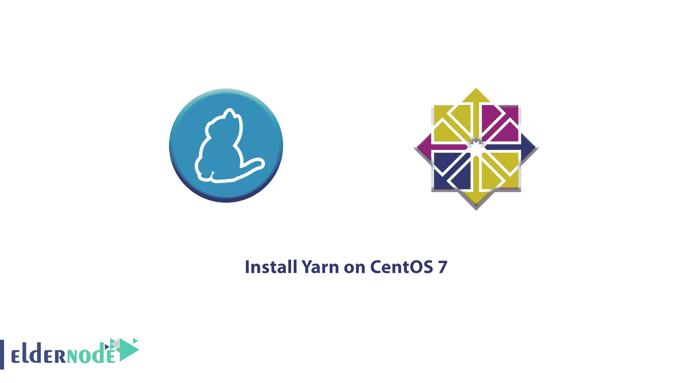

# 如何在 CentOS 7 - Eldernode 上安装纱线

> 原文：<https://blog.eldernode.com/install-yarn-centos-7/>



Yarn 是一个与 npm 兼容的 [JavaScript](https://www.javascript.com/) 包管理器，可以帮助您自动化安装、更新、配置和删除 npm 包的过程。它是为了解决 [npm](https://eldernode.com/install-yarn-on-linux-ubuntu-20-04/) 的一系列问题而创建的，例如通过并行化操作加速软件包安装过程，减少与网络连接相关的错误。首先，找一个好的供应商来建立你自己的 VPS。

为了让本教程更好地发挥作用，请考虑以下**先决条件**:

拥有 sudo 权限的非 root 用户。

## 如何在 CentOS 7 上安装纱线

Yarn 是一个超快速的依赖管理应用程序，设计用于缓存它下载的包，这样它们就不会被再次下载。这是一个安全可靠的程序，它并行处理所有操作，以提高资源利用率并加快安装时间。

与我们一起通过本指南来验证如何从 Yarn RPM 软件包存储库在 CentOS 7 系统上安装 Yarn。如果您使用的是新版本，请找到关于如何在 CentOS 8 上安装 Yarn 的[指南。](https://blog.eldernode.com/install-yarn-centos-8/)

### 第一步:在 CentOS 上安装纱线

如果您的系统上还没有安装 [Node.js](https://eldernode.com/install-node-js-centos-7/) ，请启用 Nodesource 存储库。

```
curl --silent --location https://rpm.nodesource.com/setup_10.x | sudo bash -
```

通过键入以下命令安装 Node.js 包:

```
sudo yum install nodejs
```

官方的 Yarn 存储库始终如一地维护并提供最新版本。要启用 Yarn 存储库并导入存储库的 GPG 键，请发出以下命令:

```
curl --silent --location https://dl.yarnpkg.com/rpm/SharePoint | sudo tee /etc/yum.repos.d/yarn.repo
```

```
sudo rpm --import https://dl.yarnpkg.com/rpm/pubkey.gpg
```

一旦添加了存储库，您就可以通过运行以下命令来安装 Yarn:

```
sudo yum install yarn
```

然后，通过打印纱线版本号来验证安装:

```
yarn --version
```

在撰写本文时，Yarn 的最新版本是版本 1.17.3 。

输出

```
1.17.3
```

第二步:使用纱线

现在您已经在 CentOS 系统上安装了 **Yarn** ，我们将探索一些最常见的 Yarn 命令。

创建新项目

要创建一个新的纱线项目，使用 **纱线初始化** 命令，后跟项目名称。例如，要创建一个名为 **my_project** 的项目，您可以键入:

### 脚本会问你几个问题。你可以回答或者按键**键**键键使用默认值:

输出

```
yarn init my_project
```

一旦完成，脚本将创建一个基本的 **package.json** 文件，其中包含您提供的信息。您可以随时打开并编辑该文件。

```
yarn init v1.17.3  question name (vagrant): Linuxize  question version (1.0.0): 0.0.1  question description: Testing Yarn  question entry point (index.js):   question repository url:   question author: Linuxize  question license (MIT):   question private:   success Saved package.json  Done in 20.18s.
```

添加依赖关系

要升级软件包，请使用以下命令之一:

### 如果没有给出包名，该命令将根据 package.json 文件中指定的版本范围将项目依赖项更新到最新版本。否则，只更新指定的包。

```
yarn upgrade
```

```
yarn upgrade [package_name]
```

```
yarn upgrade [package_name]@[version_or_tag]
```

升级依赖关系

要升级依赖关系，请使用以下方法之一:

### 上面的命令会根据 package.json 文件中指定的版本范围将项目依赖项更新到最新版本。

```
yarn upgrade [package_name]
```

```
yarn upgrade [package_name]@[version_or_tag]
```

移除依赖关系

要删除依赖关系，只需键入:

### 该命令还将更新项目的 package.json 和 yarn.lock 文件。

To remove a dependency simply type:

```
yarn remove [package_name] 
```

This command will also update the project’s package.json and yarn.lock files.

### 步骤 3:安装所有项目依赖关系

### 因此，在这一步中安装一个现有项目的所有依赖项，在 package.json 文件中指定运行:

### 运筹学

结论

```
yarn
```

在这篇文章中 **，** 你已经成功的在 CentOS 7 上安装了纱。 还有，你了解基本的纱线使用命令，应该不难上手。如果你想深入了解如何使用 Yarn，请访问官方 **Yarn 文档**网页。如果你使用的是另一个操作系统或 windows 的[操作系统，可以找到更多相关的](https://blog.eldernode.com/install-yarn-on-windows/)[文章](https://blog.eldernode.com/install-yarn-on-linux-ubuntu-20-04/)。

```
yarn install
```

## Conclusion

In this article**,** you have successfully installed Yarn on CentOS 7.Also, you understand the basic Yarn usage commands and it should not be difficult to get started. If you want in-depth details on how to use Yarn, go to the official **Yarn documentation** web page. Find more related [articles](https://blog.eldernode.com/install-yarn-on-linux-ubuntu-20-04/) if you use another OS or [windows](https://blog.eldernode.com/install-yarn-on-windows/).