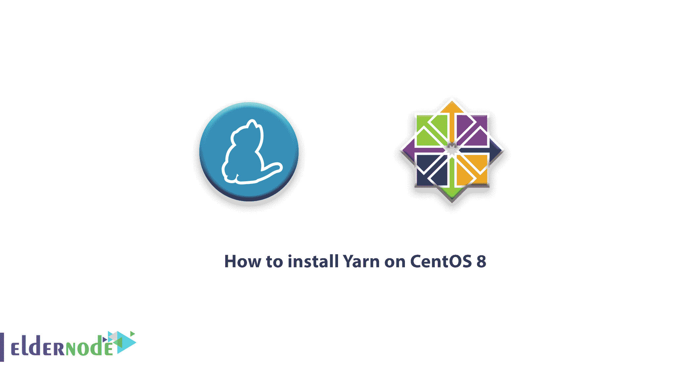

# 如何在 CentOS 8 - Eldernode 博客上安装 Yarn

> 原文：<https://blog.eldernode.com/install-yarn-centos-8/>



教程如何在 CentOS 8 Linux 上安装 Yarn。由脸书创建，加入我们学习安装 CentOS 8 服务器纱。在本文中，您将了解到 NodeJS 最酷、最新的[包管理器](https://en.wikipedia.org/wiki/Package_manager)，它已经取代了 npm。虽然 npm 工作得还不错，但 Yarn 进行了一些改进，这使它比 **npm** 更具竞争力。事实上，开发者现在正在迁移他们的 [**节点。JS**](https://eldernode.com/install-node-js-on-debian-10/) 投射到纱线上。

首先，在包装安装速度方面，纱线使 **npm** 相形见绌。 **Yarn** 比 npm 快得多，并且可以同时安装软件包，这使它成为比 npm 更好的选择。

此外，当安装软件包时，会安装一个包含所有依赖项的全局缓存。这样就不需要再回到网上下载它们了，使得后续的安装更快。

其次，Yarn 被认为比 npm 更安全。这是因为它从 package.json 或 yarn.lock 文件安装软件包。

此外，Yarn.lock 保证在所有设备上安装相同的软件包，从而避免因安装不同版本而产生的错误。相比之下， **npm** 从依赖关系安装软件包，由于安装的软件包版本不一致，会引起安全问题。

## 如何在 CentOS 8 上安装纱线

让我们从这份指南开始，成为如何在 **CentOS 8** 上安装**纱线**的专家。为了让你的研究更有用，联系 Eldernode 团队作为 [VPS](https://eldernode.com/centos-vps/) 提供商，拥有你自己的 Linux 虚拟服务器。如果你需要之前版本的指导，可以找我们的文章 [如何在 CentOS 7](https://blog.eldernode.com/install-yarn-centos-7/) 上安装 Yarn。

### 1-如何在 CentOS 8 中安装 NodeJS

以 root 用户身份登录您的 **CentOS 8** 系统，安装 **EPEL** 库。

```
yum install epel-release
```

使用以下命令在 CentOS 8 上安装 [NodeJS。](https://blog.eldernode.com/install-node-js-centos-8/)

```
yum module install nodejs
```

运行下面的命令确认**node . js .**T3 的安装

```
node -v  node --version
```

### 2-如何启用纱库

一旦安装了 **Node.js** ，你需要启用 **Yarn** 库。

```
curl --silent --location https://dl.yarnpkg.com/rpm/yarn.repo | tee /etc/yum.repos.d/yarn.repo 
```

然后，添加 GPG 键:

```
rpm --import https://dl.yarnpkg.com/rpm/pubkey.gpg 
```

### 3-如何在 CentOS 中安装纱线 8

使用下面的命令安装**纱线。**

```
yum install yarn
```

检查您已经安装的**纱**的版本:

```
yarn --version    **1.21.1**
```

### 4-如何在纱 中创建新项目

在这一步中，使用 **yarn init** 命令创建一个新项目，后面跟项目名称。例如:

```
yarn init my_first_project
```

之后，系统会提示你回答几个问题。您可以决定回答**是**或**否**或简单地点击**回车**进入下一个问题。

最后创建一个 **package.json** 文件，你可以确认。

```
ls -l package.json
```

这个文件包含了你刚才提供的所有信息。

查看内容:

```
cat package.json
```

### 5-如何使用纱安装包

键入以下命令安装软件包:

```
yarn add [package_name]
```

例如，

```
yarn add express
```

此外，您还可以删除该包，只需运行:

```
yarn remove express
```

## 结论

在本文中，您学习了如何在 CentOS 8 上安装 Yarn。请注意，Yarn 有一些有用的好处，可以弥补 npm 的缺点。它更快、更安全，并逐渐取代 NPM T2 成为 Node 最受欢迎的包管理器。借助 **Yarn** ，您可以轻松舒适地部署您的项目，同时避免 npm 带来的不便。简单来说，**纱**是两者中较好的。如果你需要看到同样的指南，在我们的网站上查看。