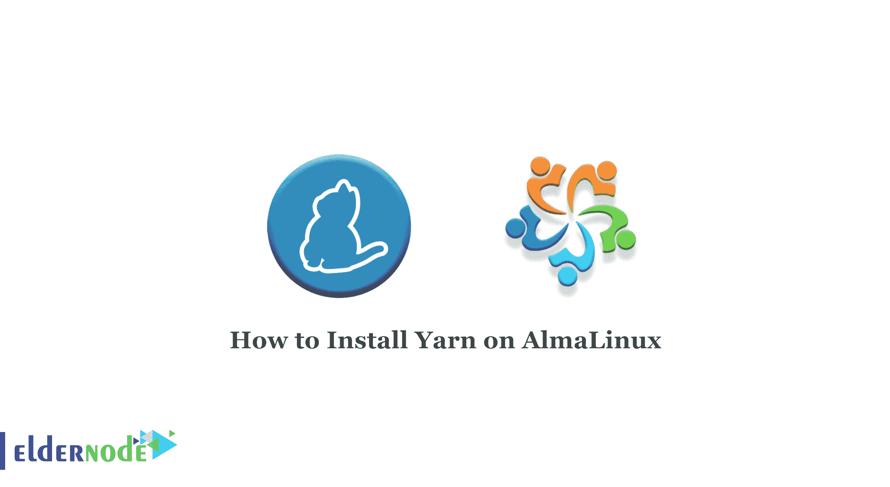

# 如何在 AlmaLinux 8.4 和 8.5 上安装 Yarn-elder node 博客

> 原文：<https://blog.eldernode.com/install-yarn-on-almalinux/>



YARN 代表另一种资源导航器，一种快速、稳定、可靠的 JavaScript 包管理器，与 npm(节点包管理器)兼容。Yarn 帮助管理 npm 包，包括安装、更新、配置和删除包。本文假设您至少对 Linux 有基本的了解，知道如何使用布局，最重要的是，您在 VPS 上托管您的站点。在这篇文章中，我们将教你如何在 alma Linux 8.4 或 8.5 上安装 Yarn。想买一个便宜的有即时激活功能的 [Linux VPS](https://eldernode.com/linux-vps/) ，在 [Eldernode](https://eldernode.com/) 上订购你需要的东西。

## **教程一步步在 AlmaLinux 上安装 Yarn**

Yarn 安装非常简单，并假设您在 root 帐户下运行，否则您可能需要在命令中添加“sudo”来获得 root 权限。

### 纱线特性:

高度的兼容性:创建的应用程序使用 MapReduce 框架，可以很容易地在 YARN 上运行。

最大的可伸缩性:每当 Hadoop 集群中的节点数量增加时，YARN 资源管理器都会确保它满足用户的需求。

更好的集群利用率: [YARN](https://yarnpkg.com/) 高效、动态地分配所有集群资源，相比其前身，Hadoop 得到了更好的利用。

多租约:访问 Hadoop 集群数据的不同引擎可以有效地协同工作，因为 YARN 是一种非常通用的技术。

## **在 AlmaLinux 8.4 上安装 Yarn | alma Linux 8.5**

步骤 1)你需要确保系统是最新的。为此，请遵循以下步骤:

```
sudo dnf update
```

```
sudo dnf install epel-release
```

步骤 2)在 [AlmaLinux](https://blog.eldernode.com/install-and-use-almalinux/) 上安装 Node.js。

现在使用以下命令检查可用的 Node.js 列表:

```
sudo dnf module list nodejs
```

然后，使用以下命令安装 Node.js:

```
sudo dnf module install nodejs
```

然后检查节点版本:

```
node -v
```

要检查 NPM 版本:

```
npm –v
```

步骤 3)在这一步中，你应该使用 NPM 在 AlmaLinux 上安装 Yarn:

```
npm install --global yarn
```

安装后，检查纱线版本:

```
yarn –v
```

## 结论

在本教程中，您学习了如何在 AlmaLinux 8.4 和 8.5 上安装 Yarn。您还了解了纱线可能具有的特性。您还了解到 Yarn 是一个包管理器，同时也是一个项目管理器。