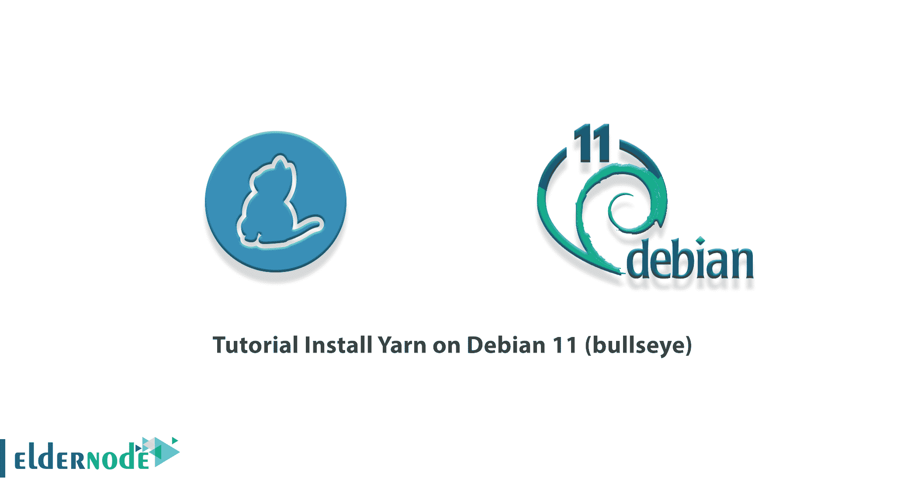

# 教程在 Debian 11(牛眼)- Eldernode 博客上安装 Yarn

> 原文：<https://blog.eldernode.com/install-yarn-on-debian-11/>



Yarn 是 Node.js 的一个包管理器，它取代了 NPM。“纱线”的开发目标是改善和解决 NPM 存在的问题，目前正由数十家公司和数百名开发商进行扩展。由于 Yarn 的良好特性，该项目的 Github 明星现在几乎是 NPM 的两倍。在本文中，我们将一步一步地教你如何在 Debian 11(牛眼)上安装 Yarn。如果你想买一个 [**Linux VPS**](https://eldernode.com/linux-vps/) 服务器，你可以在 [Eldernode](https://eldernode.com/) 看到可用的软件包。

## **如何在 Debian 11 上安装 Yarn | Debian 10**

### **介绍纱线及其特性**

Yarn 实际上是脸书试图弥补 npm 的不足。从技术上讲，Yarn 不是代替 npm 创建的，因为它仍然使用 npm 注册表模块，而是一个新的安装程序，仍然使用 npm 结构。用更简单的语言来说，注册表还是同一个注册表，只是安装方式不同。因为 Yarn 和 npm 有一个包集，如果你想从 Yarn 到 npm 或者相反，你不需要做很大的改变。

Yarn 使您能够在 Hadoop 中管理资源和计划作业。以下是纱线的一些特性:

**1。多租户**

有了这个特性，您可以使用多个开源和专用的数据访问引擎对同一个数据集进行批处理、交互式和实时访问。

**2。集群利用率**

您可以动态分配群集资源以提高资源利用率。

**3。多种资源类型**

您可以使用几种不同的资源，如内存、CPU 和 GPU。

**4。可扩展性**

通过使用 Yarn，您可以显著提高数据中心的处理能力。ResourceManager YARN 专注于调度，并通过将集群扩展到数千 Pb 的数据管理节点来保持其速度。

**5。兼容性**

为 Hadoop 1 开发的 MapReduce 应用程序运行在 YARN 上，不会中断任何现有的进程。YARN 保持了与 Hadoop 之前稳定版本的 API 兼容性。

在这篇文章的续篇中，加入我们向您展示如何在 [Debian 11](https://blog.eldernode.com/initial-server-setup-on-debian-11/) 上安装 Yarn。

## **在 Debian 11 上安装纱| Debian 10**

在这一节，我们想教你如何在 Debian 11 上安装 Yarn。要做到这一点，你需要以 root 或拥有 Sudo 权限的用户身份执行以下步骤，在 Debian 11 或 Debian 10 中安装 Yarn。

因为 yarn 包在 Yarn 存储库中可用，所以您必须运行以下命令来输入存储库 GPG 密钥并激活 APT 存储库:

```
curl -sS https://dl.yarnpkg.com/debian/pubkey.gpg | sudo apt-key add -
```

```
echo "deb https://dl.yarnpkg.com/debian/ stable main" | sudo tee /etc/apt/sources.list.d/yarn.list
```

然后，您需要使用以下命令更新包列表并安装 Yarn:

```
sudo apt update
```

```
sudo apt install yarn
```

请注意，Node.js 将通过执行上面的命令安装在您的系统上。如果您使用的是 nvm，可以跳过安装 Node.js，如下所示:

```
sudo apt install --no-install-recommends yarn
```

最后，通过执行以下命令，您可以检查 Yarn 的安装状态:

```
yarn --version
```

### **如何在 Debian 11(牛眼)上使用纱线**

在你成功地在 Debian 11 上安装了任亚之后，我们现在想教你如何使用它。请遵循以下步骤。

首先，我们想向您展示如何**创建一个纱线项目**。为此，您必须首先输入 yarn init 命令，然后输入项目名称。例如，要创建一个名为 **my_project** 的项目，您必须执行以下操作:

```
yarn init my_project
```

您也可以在现有目录中启动 Yarn 项目，方法是转到以下目录:

```
yarn init
```

在下一步中，您可以使用以下命令将包作为依赖项添加到项目中:

```
yarn add [package_name]
```

如果要安装特殊版本或标签，可以使用以下命令:

```
yarn add [package_name]@[version_or_tag]
```

下一步是**升级依赖关系**。您可以通过运行以下命令之一来升级包:

```
yarn upgrade
```

或者

```
yarn upgrade [package_name]
```

或者

```
yarn upgrade [package_name]@[version_or_tag]
```

您也可以使用以下命令移除项目依赖项包:

```
yarn remove [package_name]
```

最后，运行以下命令之一，安装 package.json 文件中指定的现有项目的所有依赖项:

```
yarn
```

或者

```
yarn install
```

## 结论

Yarn 使用 NPM 库，并且与这个工具高度兼容，所以从 NPM 迁移到 Yarn 很容易。在本文中，我们在介绍了 Yarn 及其特性之后，试图教你如何在 Debian 11(牛眼)上安装 Yarn。如果你愿意，可以参考文章[如何在 CentOS 8](https://blog.eldernode.com/install-yarn-centos-8/) 和 [Ubuntu 20.04](https://blog.eldernode.com/install-yarn-on-linux-ubuntu-20-04/) 上安装 Yarn。