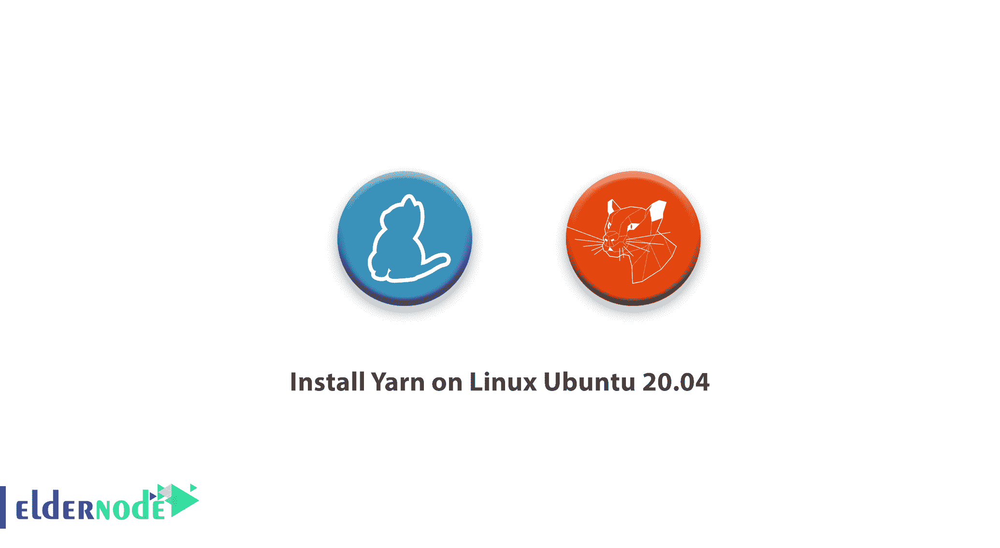

# 如何在 Linux Ubuntu 20.04 上安装 Yarn-elder node 博客

> 原文：<https://blog.eldernode.com/install-yarn-on-linux-ubuntu-20-04/>



在本教程中，您将了解**如何在 Linux Ubuntu 20.04** 上安装 Yarn。和我们一起验证在 Ubuntu 上安装 Yarn 的两种方法。但首先，让我们看看什么是纱，为什么你需要使用它。当您开始一个编程项目时，您需要帮助来正确地管理依赖项。由于项目库在控制项目的开发方面有一定的作用，你需要选择一个合适的工具。要熟悉 Yarn，这是一个快速安全的工具，是 Nodejs 应用程序的可靠的包依赖管理器，请遵循本指南。从你自己的 [Linux VPS](https://eldernode.com/linux-vps/) 服务器开始，依靠 [Eldernode](https://eldernode.com/) best services。

## **Linux 上安装 Yarn 教程 Ubuntu 20.04**

在你开始在 [Ubuntu](https://blog.eldernode.com/tag/ubuntu/) 上安装 [Yarn](https://yarnpkg.com/) 之前，别忘了在你的系统上安装 [Node.js](https://blog.eldernode.com/install-and-config-node-js-on-ubuntu-20-04/) 。

## **在 Linux 上安装 Yarn Ubuntu 20.04 | Ubuntu 18.04**

Yarn 是 JavaScript 的一个包管理器。这可以为您提供多种好处，是 NPM 的最佳选择。与他相对的是他的主要对手 NPM。Yarn 没有自己的库，而是使用其他几个库，包括 NPM。此外，如果你使用的是 windows，请阅读相关指南[如何在 Windows](https://blog.eldernode.com/install-yarn-on-windows/) 上安装 Yarn。在这篇文章的续篇中，加入我们来学习如何通过两种方式在 [Linux](https://blog.eldernode.com/tag/linux/) Ubuntu 20.04 上安装 Yarn。

### **如何用 PPA** 装纱 

安装前，导入 GPG 键以验证纱线卷装:

```
curl -sL https://dl.yarnpkg.com/debian/pubkey.gpg | sudo apt-key add - 
```

然后，启用 Yarn package manager 存储库，输入以下命令:

```
echo "deb https://dl.yarnpkg.com/debian/ stable main" | sudo tee /etc/apt/sources.list.d/yarn.list 
```

然后安装纱线卷装管理器，运行以下命令:

```
sudo apt update && sudo apt install yarn 
```

安装完成后，使用以下命令检查已安装的纱线版本:

```
yarn --version 
```

### **如何用 NPM** 装纱 

对于使用 npm 安装 Yarn package manager 这就够了，运行下面的命令:

```
npm install -g yarn 
```

至此，您已经学会了如何以两种方式安装 yarn package manager。如果你继续学习 CentOS 7 上的 [Yarn 和 CentOS 8](https://blog.eldernode.com/install-yarn-centos-7/) 上的 [Yarn 的相同指南，你可以在我们的](https://blog.eldernode.com/install-yarn-centos-8/)[博客](https://blog.eldernode.com/)上找到它们。

### **为什么纱比 NPM 快？**

毫无疑问，纱线在安装过程中的工作效率要高得多。NPM 首先跟踪依赖关系的所有分支，然后接收所需的包。但是纱没有。它首先在注册表中搜索依赖项。然后，它从缓存目录接收下载的包。如果找到依赖项，它就使用它，如果没有，它就把它作为 tar 下载下来。最后，它将所有包从全局缓存复制到 node_modules 目录。所有这些操作都是并行执行的，以提高安装速度。使用全局缓存比每次需要的时候下载所有的包要快得多。Yarn 还有一个额外的优势:它允许 Yarn 离线工作！

## 结论

在本文中，你已经学习了如何在 Ubuntu 上安装 Yarn。除了这个能力，现在你清楚地知道纱比 NPM 好得多。从现在开始，您就可以使用这个工具并享受它的功能了。