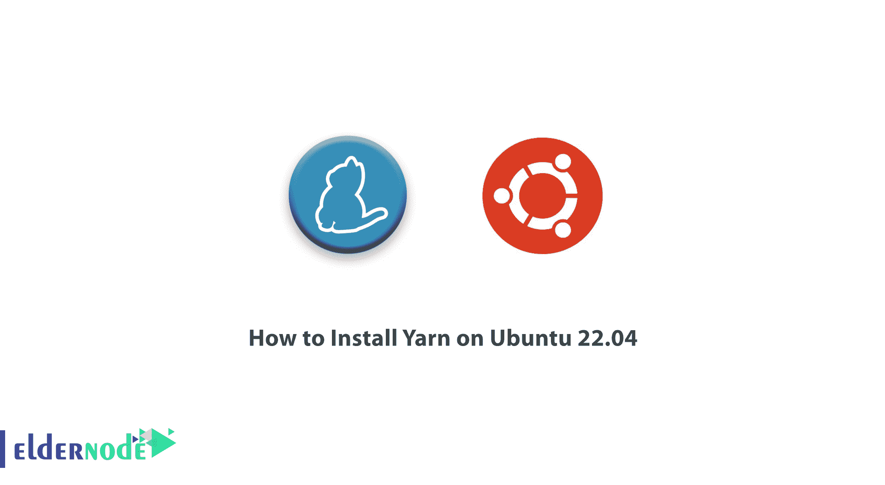
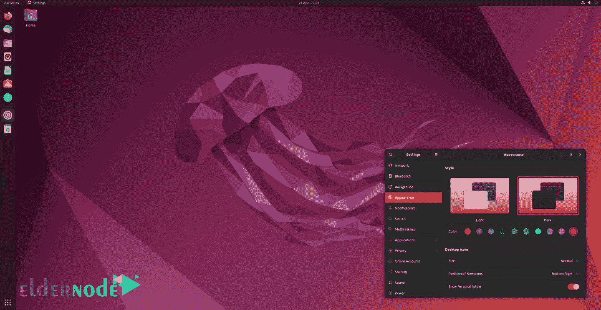

# 如何在 Ubuntu 22.04 - Eldernode 博客上安装 Yarn

> 原文：<https://blog.eldernode.com/install-yarn-on-ubuntu-22-04/>



软件包管理器是一个安装、更新和管理您需要的软件包的工具。有了这样的工具的帮助，你就可以随时拥有你的软件所需要的最新版本的库，而不必去搜索和检查它们的包和外设，你可以只考虑开发你的软件的核心。Yarn 也是一个包管理器，在这篇文章中，我们将教你如何在 Ubuntu 22.04 上安装 Yarn。另外，如果你想购买一个 [**Linux VPS**](https://eldernode.com/linux-vps/) 主机，你可以访问 [Eldernode](https://eldernode.com/) 中的软件包。

## **什么是纱线？**

Yarn 代表另一个资源协商者，是替代 NPM 的 JavaScript 中 Node.js 的包管理器。该纱线由该公司和开发商开发，以改善和解决 NPM 存在的问题。纱线是由脸书、谷歌、指数和波浪号开发的。Yarn 允许用户使用他们的代码，并与世界各地的其他开发者共享。此外，它允许您使用其他开发人员的解决方案来解决各种问题，并使软件开发对您来说更容易。

### **纱线特性**

*   从系统的本地缓存安装软件包，无需互联网
*   并行安装软件包
*   牢牢绑定包版本
*   安装软件包的速度很快
*   CLI 中简单易读的命令
*   在包管理领域提供更多功能
*   有不同的插件

## 

## **在 Ubuntu 上安装 Yarn 22.04**

在安装 Yarn 之前，你需要在你的 Ubuntu 22.04 系统上安装 npm(节点包管理器)。npm 自带 Node.js。

可以在 NodeSource 存储库的帮助下安装 Node.js。首先打开终端，为所需的 Node.js 版本设置 NodeSource 存储库。

要设置节点源存储库 16.x (LTS)，请执行以下操作:

```
wget -qO- https://deb.nodesource.com/setup_16.x | sudo -E bash
```

要设置节点源存储库 18.x(当前版本)，请执行以下操作:

```
wget -qO- https://deb.nodesource.com/setup_18.x | sudo -E bash
```

现在，通过运行以下命令安装 Node.js 和 npm:

```
sudo apt install -y nodejs
```

您可以使用以下命令检查 Node.js 版本:

```
node --version
```

此外，您可以通过输入以下命令来检查 npm 版本:

```
npm --version
```

现在该装纱了。为此，请运行以下命令:

```
sudo npm install --global yarn
```

然后输入密码。

您可以使用以下命令检查纱线版本:

```
yarn --version
```

在这一步中，借助以下命令转到您现有的项目目录:

```
cd your_project
```

现在，您需要通过输入以下命令为您的项目安装最新的 Yarn 二进制文件:

```
yarn set version berry
```

然后使用以下命令再次检查纱线版本:

```
yarn --version
```

收到的输出表明您的项目拥有最新版本的 Yarn。

## **如何在 Ubuntu 22.04 上使用 Yarn**

以下命令可以指导您使用现有命令:

```
yarn help
```

您可以借助以下命令创建一个目录:

```
mkdir my_project && cd my_project
```

要创建新项目，只需运行以下命令:

```
yarn init
```

输入上述命令后，将会询问您一系列与您的项目相关的问题，您可以通过按 **Enter** 使用默认值。上面的命令还放置 package.json 和 yarn.lock，前者包含您提供的项目信息，后者包含关于项目依赖项的所有信息。

若要向项目中添加依赖项，可以运行以下命令:

```
yarn add (package-name)
```

```
yarn add (package-name)@(version)
```

```
yarn add (package-name)@(tag)
```

上面的命令下载并安装依赖包，并更新 package.json 和 yarn.lock 中的依赖细节。

您可以使用以下命令安装项目的所有依赖项:

```
yarn
```

```
yarn install
```

要升级项目的依赖项，请输入以下带有包名的命令:

```
yarn upgrade (package-name)    yarn upgrade (package-name)@(version)
```

```
yarn upgrade (package-name)@(tag)
```

若要删除项目中不再需要的依赖项，请运行以下命令:

```
yarn remove (package-name)
```

您可以使用以下命令来更新 Yarn:

```
yarn set version latest
```

## 结论

这篇文章教你如何在 Ubuntu 22.04 上安装和使用 Yarn。通过安装 Yarn，您可以安装软件包，启动新项目，并安全可靠地共享软件包。我希望这篇文章对你有用，你可以很容易地在你的 Ubuntu 系统上安装 Yarn。