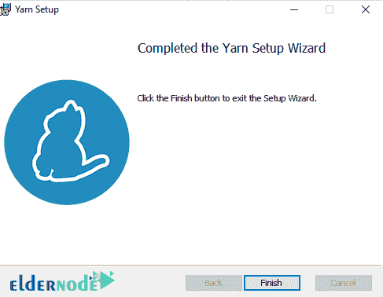

# 如何在 Windows 上安装 Yarn-教程 Yarn

> 原文：<https://blog.eldernode.com/install-yarn-on-windows/>


如何在 Windows 上安装纱线？ 纱是代替 NPM 的 Node.js 的包管理器。 Yarn 已经被公司和开发者开发和扩展，以改善 NPM 存在的问题。 由于 Yarn 的良好特性，项目的 Github 明星现在几乎是 NPM 的两倍。 在本文中，我们将教你如何在 Windows 中安装 Yarn。

**[购买 Windows 虚拟专用服务器](https://eldernode.com/windows-vps/)**

## 什么是包经理？

软件包管理器是一个安装、更新和管理你需要的软件包的工具。 有了这类工具的帮助，你可以随时随你的软件拥有你所需要的最新版本的库。 你也可以只想到开发你软件的核心，而不必去寻找软件包和它们的外围设备。

Yarn 使用 NPM 库，并且与这个工具高度兼容，所以从 NPM 迁移到 Yarn 很容易。 与 npm 相比，Yarn 被认为是更好的选择，在以下参数上超过了 npm:

*   速度更快
*   更多安全性
*   库的同时安装
*   更多集成
*   离线安装要求(在新的 NPM 版本中也增加了)

**注意:** Node.js 安装纱线前必须安装。

**[如何在 Windows 上安装 node . js](https://eldernode.com/install-node-js-on-windows/)**

## MSI 安装

要安装 Yarn，必须先[下载 Yarn。msi 安装程序](https://classic.yarnpkg.com/latest.msi)来自 [官方 纱](https://classic.yarnpkg.com/latest.msi) 网站。 下载后，安装到你的本地电脑上。


接下来，您将运行。msi 安装程序。


接受许可协议。


然后，点击安装。


最后，点击完成按钮。



现在，您可以使用以下 CLI 命令来验证 Yarn 是否已安装:

```
C:\Windows\system32>yarn --version  1.22.4  C:\Windows\system32>
```

巧克力安装

## 另一种安装 Yarn 的方法是使用 Windows 的 Chocolatey 软件包管理器。这个方法很方便，因为 Chocolatey 将确定 node.js 是否已经安装，如果没有，它将自动为我们安装。作为管理员做任何事情都很重要。

这里是安装巧克力 T2 的说明。

设置好 Chocolatey 后，您可以使用以下命令安装 Yarn:

```
C:\Windows\system32>choco install yarn  Chocolatey v0.10.15  Installing the following packages:  yarn  By installing you accept licenses for the packages.    yarn v1.22.4 [Approved]  yarn package files install completed. Performing other installation steps.  The package yarn wants to run 'chocolateyinstall.ps1'.  Note: If you don't run this script, the installation will fail.  Note: To confirm automatically next time, use '-y' or consider:  choco feature enable -n allowGlobalConfirmation  Do you want to run the script?([Y]es/[A]ll - yes to all/[N]o/[P]rint): Y    Downloading yarn  from 'https://yarnpkg.com/downloads/1.22.4/yarn-1.22.4.msi'  Progress: 100% - Completed download of C:\Users\Dmitry\AppData\Local\Temp\chocolatey\yarn\1.22.4\yarn-1.22.4.msi (1.57 MB).  Download of yarn-1.22.4.msi (1.57 MB) completed.  Hashes match.  Installing yarn...  yarn has been installed.  #< CLIXML  <Objs Version="1.1.0.1" ><Obj S="progress" RefId="0"><TN RefId="0"><T>System.Management.Automation.PSCustomObject</T><T>System.Object</T></TN><MS><I64 N="SourceId">1</I64><PR N="Record"><AV>Preparing modules for first use.</AV><AI>0</AI><Nil /><PI>-1</PI><PC>-1</PC><T>Completed</T><SR>-1</SR><SD> </SD></PR></MS></Obj><Obj S="progress" RefId="1"><TNRef RefId="0" /><MS><I64 N="SourceId">1</I64><PR N="Record"><AV>Preparing modules for first use.</AV><AI>0</AI><Nil /><PI>-1</PI><PC>-1</PC><T>Completed</T><SR>-1</SR><SD> </SD></PR></MS></Obj><S S="debug">Host version is 5.1.18362.752, PowerShell Version is '5.1.18362.752' and CLR Version is '4.0.30319.42000'.</S><S S="verbose">Exporting function 'Format-FileSize'.</S><S S="verbose">Exporting function 'Get-ChecksumValid'.</S><S S="verbose">Exporting function 'Get-ChocolateyUnzip'.</S><S S="verbose">Exporting function 'Get-ChocolateyWebFile'.</S><S S="verbose">Exporting function 'Get-EnvironmentVariable'.</S><S S="verbose">Exporting function 'Get-EnvironmentVariableNames'.</S><S S="verbose">Exporting function 'Get-FtpFile'.</S><S S="verbose">Exporting function 'Get-OSArchitectureWidth'.</S><S S="verbose">Exporting function 'Get-PackageParameters'.</S><S S="verbose">Exporting function 'Get-PackageParametersBuiltIn'.</S><S S="verbose">Exporting function 'Get-ToolsLocation'.</S><S S="verbose">Exporting function 'Get-UACEnabled'.</S><S S="verbose">Exporting function 'Get-UninstallRegistryKey'.</S><S S="verbose">Exporting function 'Get-VirusCheckValid'.</S><S S="verbose">Exporting function 'Get-WebFile'.</S><S S="verbose">Exporting function 'Get-WebFileName'.</S><S S="verbose">Exporting function 'Get-WebHeaders'.</S><S S="verbose">Exporting function 'Install-BinFile'.</S><S S="verbose">Exporting function 'Install-ChocolateyDesktopLink'.</S><S S="verbose">Exporting function 'Install-ChocolateyEnvironmentVariable'.</S><S S="verbose">Exporting function 'Install-ChocolateyExplorerMenuItem'.</S><S S="verbose">Exporting function 'Install-ChocolateyFileAssociation'.</S><S S="verbose">Exporting function 'Install-ChocolateyInstallPackage'.</S><S S="verbose">Exporting function 'Install-ChocolateyPackage'.</S><S S="verbose">Exporting function 'Install-ChocolateyPath'.</S><S S="verbose">Exporting function 'Install-ChocolateyPinnedTaskBarItem'.</S><S S="verbose">Exporting function 'Install-ChocolateyPowershellCommand'.</S><S S="verbose">Exporting function 'Install-ChocolateyShortcut'.</S><S S="verbose">Exporting function 'Install-ChocolateyVsixPackage'.</S><S S="verbose">Exporting function 'Install-ChocolateyZipPackage'.</S><S S="verbose">Exporting function 'Install-Vsix'.</S><S S="verbose">Exporting function 'Set-EnvironmentVariable'.</S><S S="verbose">Exporting function 'Set-PowerShellExitCode'.</S><S S="verbose">Exporting function 'Start-ChocolateyProcessAsAdmin'.</S><S S="verbose">Exporting function 'Test-ProcessAdminRights'.</S><S S="verbose">Exporting function 'Uninstall-BinFile'.</S><S S="verbose">Exporting function 'Uninstall-ChocolateyEnvironmentVariable'.</S><S S="verbose">Exporting function 'Uninstall-ChocolateyPackage'.</S><S S="verbose">Exporting function 'Uninstall-ChocolateyZipPackage'.</S><S S="verbose">Exporting function 'Update-SessionEnvironment'.</S><S S="verbose">Exporting function 'Write-ChocolateyFailure'.</S><S S="verbose">Exporting function 'Write-ChocolateySuccess'.</S><S S="verbose">Exporting function 'Write-FileUpdateLog'.</S><S S="verbose">Exporting function 'Write-FunctionCallLogMessage'.</S><S S="verbose">Exporting alias 'Get-ProcessorBits'.</S><S S="verbose">Exporting alias 'Get-OSBitness'.</S><S S="verbose">Exporting alias 'Get-InstallRegistryKey'.</S><S S="verbose">Exporting alias 'Generate-BinFile'.</S><S S="verbose">Exporting alias 'Add-BinFile'.</S><S S="verbose">Exporting alias 'Start-ChocolateyProcess'.</S><S S="verbose">Exporting alias 'Invoke-ChocolateyProcess'.</S><S S="verbose">Exporting alias 'Remove-BinFile'.</S><S S="verbose">Exporting alias 'refreshenv'.</S><S S="verbose">Exporting function 'Format-FileSize'.</S><S S="verbose">Exporting function 'Get-ChecksumValid'.</S><S S="verbose">Exporting function 'Get-ChocolateyUnzip'.</S><S S="verbose">Exporting function 'Get-ChocolateyWebFile'.</S><S S="verbose">Exporting function 'Get-EnvironmentVariable'.</S><S S="verbose">Exporting function 'Get-EnvironmentVariableNames'.</S><S S="verbose">Exporting function 'Get-FtpFile'.</S><S S="verbose">Exporting function 'Get-OSArchitectureWidth'.</S><S S="verbose">Exporting function 'Get-PackageParameters'.</S><S S="verbose">Exporting function 'Get-PackageParametersBuiltIn'.</S><S S="verbose">Exporting function 'Get-ToolsLocation'.</S><S S="verbose">Exporting function 'Get-UACEnabled'.</S><S S="verbose">Exporting function 'Get-UninstallRegistryKey'.</S><S S="verbose">Exporting function 'Get-VirusCheckValid'.</S><S S="verbose">Exporting function 'Get-WebFile'.</S><S S="verbose">Exporting function 'Get-WebFileName'.</S><S S="verbose">Exporting function 'Get-WebHeaders'.</S><S S="verbose">Exporting function 'Install-BinFile'.</S><S S="verbose">Exporting function 'Install-ChocolateyDesktopLink'.</S><S S="verbose">Exporting function 'Install-ChocolateyEnvironmentVariable'.</S><S S="verbose">Exporting function 'Install-ChocolateyExplorerMenuItem'.</S><S S="verbose">Exporting function 'Install-ChocolateyFileAssociation'.</S><S S="verbose">Exporting function 'Install-ChocolateyInstallPackage'.</S><S S="verbose">Exporting function 'Install-ChocolateyPackage'.</S><S S="verbose">Exporting function 'Install-ChocolateyPath'.</S><S S="verbose">Exporting function 'Install-ChocolateyPinnedTaskBarItem'.</S><S S="verbose">Exporting function 'Install-ChocolateyPowershellCommand'.</S><S S="verbose">Exporting function 'Install-ChocolateyShortcut'.</S><S S="verbose">Exporting function 'Install-ChocolateyVsixPackage'.</S><S S="verbose">Exporting function 'Install-ChocolateyZipPackage'.</S><S S="verbose">Exporting function 'Install-Vsix'.</S><S S="verbose">Exporting function 'Set-EnvironmentVariable'.</S><S S="verbose">Exporting function 'Set-PowerShellExitCode'.</S><S S="verbose">Exporting function 'Start-ChocolateyProcessAsAdmin'.</S><S S="verbose">Exporting function 'Test-ProcessAdminRights'.</S><S S="verbose">Exporting function 'Uninstall-BinFile'.</S><S S="verbose">Exporting function 'Uninstall-ChocolateyEnvironmentVariable'.</S><S S="verbose">Exporting function 'Uninstall-ChocolateyPackage'.</S><S S="verbose">Exporting function 'Uninstall-ChocolateyZipPackage'.</S><S S="verbose">Exporting function 'Update-SessionEnvironment'.</S><S S="verbose">Exporting function 'Write-ChocolateyFailure'.</S><S S="verbose">Exporting function 'Write-ChocolateySuccess'.</S><S S="verbose">Exporting function 'Write-FileUpdateLog'.</S><S S="verbose">Exporting function 'Write-FunctionCallLogMessage'.</S><S S="verbose">Exporting alias 'Get-ProcessorBits'.</S><S S="verbose">Exporting alias 'Get-OSBitness'.</S><S S="verbose">Exporting alias 'Get-InstallRegistryKey'.</S><S S="verbose">Exporting alias 'Generate-BinFile'.</S><S S="verbose">Exporting alias 'Add-BinFile'.</S><S S="verbose">Exporting alias 'Start-ChocolateyProcess'.</S><S S="verbose">Exporting alias 'Invoke-ChocolateyProcess'.</S><S S="verbose">Exporting alias 'Remove-BinFile'.</S><S S="verbose">Exporting alias 'refreshenv'.</S></Objs>  0  Only an exit code of non-zero will fail the package by default. Set  `--failonstderr` if you want error messages to also fail a script. See  `choco -h` for details.  The install of yarn was successful.  Software installed as 'msi', install location is likely default.    Chocolatey installed 1/1 packages.  See the log for details (C:\ProgramData\chocolatey\logs\chocolatey.log).    C:\Windows\system32>
```

您可以使用以下命令验证纱线的安装:

```
C:\Windows\system32>yarn --version  1.22.4  C:\Windows\system32>
```

铲斗安装

## 安装 Yarn 的第三种方法是使用 Scoop 命令行安装程序。

Scoop 的功能与 Chocolatey 相似，但主要区别在于，如果我们还没有安装 node.js ，Chocolatey 会安装 node.js ，而 Scoop 不会。

[Scoop 可以使用在](https://github.com/lukesampson/scoop/wiki/Quick-Start) [scoop 网站](http://scoop.sh/)找到的信息安装。要使用 scoop 安装 node.js，请运行以下命令:

接下来，你可以使用以下命令安装纱线:

```
scoop install nodejs
```

```
scoop install yarnd
```

查看许多 Yarn 命令的最佳方法是运行 help 命令:

```
yarn help
```

开始新项目

### 要创建一个新项目，运行以下命令:

```
yarn init
```

安装依赖关系

### 使用以下两个命令之一来安装项目的所有依赖项:

```
yarn  yarn install
```

到添加一个依赖到一个项目，使用以下命令格式之一:

```
yarn add [package]  yarn add [package]@[version]  yarn add [package]@[tag]
```

要向特定类别添加依赖关系，您可以使用以下三个选项之一:

**1)** dev 依赖关系
2)peer 依赖关系
**3)** 可选依赖关系

```
yarn add [package] --dev # dev-dependency  yarn add [package] --peer # peer-dependency  yarn add [package] --optimal # optimal-dependency
```

要升级和现有的依赖关系，可以使用 yarn up 命令。

```
yarn up [packagename]  yarn up [packagename]@[version]  yarn up [packagename]@[tag]
```

要 **删除** 和现有的依赖关系，应该使用以下命令:

升级纱线

```
yarn remove [package]
```

## 为了将纱升级到最新版本，运行以下命令之一:

```
yarn set version latest  yarn set version from sources
```

**亦作，见:**

[1) 如何在 Windows 上安装 node . js](https://eldernode.com/install-node-js-on-windows/)

[2) 如何在 Linux Ubuntu 20.04 上安装 Yarn](https://eldernode.com/install-yarn-on-linux-ubuntu-20-04/)

[3) 如何在 Windows 上使用巧克力套装管理器](https://eldernode.com/use-chocolatey-package-manager-on-windows/)

[4)如何在 Linux Ubuntu 20.04 上安装 Yarn](https://eldernode.com/install-yarn-on-linux-ubuntu-20-04/)

[5) 如何在 CentOS 上安装纱线 8](https://eldernode.com/install-yarn-centos-8/)

[6) 如何在 CentOS 7 上安装 node . js](https://eldernode.com/install-node-js-centos-7/)

[7) 如何在 Windows 上安装 node . js](https://eldernode.com/install-node-js-centos-7/)

[8) 如何在 CentOS 8 上安装 node . js](https://eldernode.com/install-node-js-centos-8/)

[9) 如何在 CentOS 7 上安装纱线](https://eldernode.com/install-yarn-centos-7/)

**尊敬的用户**，我们希望您能喜欢这个[教程](https://eldernode.com/category/tutorial/)，您可以在评论区提出关于本次培训的问题，或者想解决[老年人节点培训](https://eldernode.com/blog/)领域的其他问题，请参考[提问页面](https://eldernode.com/ask)部分，并尽快提出您的问题。腾出时间给其他用户和专家来回答你的问题。

好运。

Goodluck.