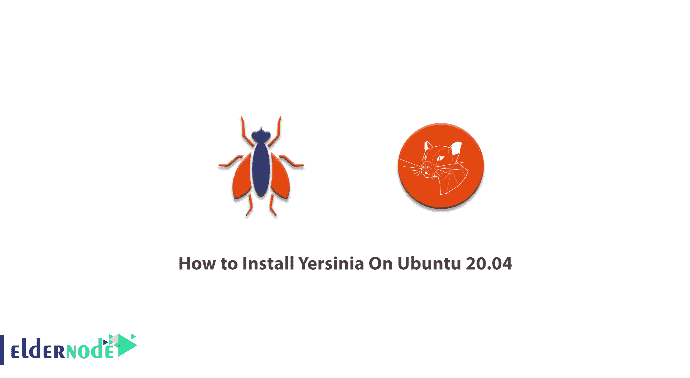

# 如何在 Ubuntu 20.04 - Eldernode 博客上安装 Yersinia

> 原文：<https://blog.eldernode.com/install-yersinia-on-ubuntu-20-04/>



计算机网络将对我们的生活产生深远的影响，并使信息的传递变得更加容易。现在，大多数公司都需要自己的内部网络来与外界沟通。即使是家庭用户也无法想象没有万维网的世界。由于计算机网络中的高信息流，它们的[安全性](https://blog.eldernode.com/tag/security/)非常重要。如果计算机专家没有正确配置网络，攻击者可以迅速渗透网络并窃取重要信息。一种为网络攻击设计的工具叫做耶尔森氏菌工具。耶尔森菌工具是对网络第二层进行网络攻击的强大工具。在本文中，我们试着教你**如何在 Ubuntu 20.04** 上安装耶尔森菌。你可以在 [Eldernode](https://eldernode.com/) 查看可用的包来购买 [Ubuntu VPS](https://eldernode.com/ubuntu-vps/) 服务器。

## **教程在 Ubuntu 20.04 上安装耶尔森菌**

### 耶尔森氏菌工具功能:

耶尔森氏菌工具能够攻击以下协议:

1.  生成树协议(STP)
2.  思科发现协议(CDP)
3.  动态中继协议(DTP)
4.  动态主机配置协议(DHCP)
5.  热备用路由器协议(HSRP
6.  交换机间链路协议(ISL)
7.  VLAN 中继协议(VTP)

这个工具利用它们的弱点对这些协议进行网络攻击。在这篇文章的后续部分，加入我们来学习如何在 Ubuntu 20.04 上安装 Yersinia。

**在 Ubuntu 20.04 上安装耶尔森菌| Ubuntu 18.04**

### 要在 Ubuntu 20.04 上安装 Yersinia，只需遵循以下步骤。在第一步中，您必须使用以下命令来更新软件包仓库并接收最新的软件包信息:

步骤 1)使用以下命令更新 Ubuntu 服务器:

在您能够成功地更新包存储库之后，您现在应该使用下面的命令。

```
sudo apt-get update -y
```

要快速安装软件包和依赖项，运行带有 **-y 标志**的 install 命令:

结论

```
sudo apt-get install -y yersinia
```

## Yersinia 是一种用于渗透测试的低级协议攻击工具。它能够通过多种协议进行多种攻击，例如成为生成树(生成树协议)中的根角色、创建虚拟 CDP (Cisco 发现协议)邻居、成为 HSRP(热备用路由器协议)场景中的活动路由器、伪造 DHCP 回复以及其他低级攻击。在本文中，我们试图向您学习如何在 Ubuntu 20.04 上安装 Yersinia。

Yersinia is a low-level protocol attack tool useful for penetration testing. It is capable of many diverse attacks over multiple protocols, such as becoming the root role in the Spanning Tree (Spanning Tree Protocol), creating virtual CDP (Cisco Discovery Protocol) neighbors, becoming the active router in an HSRP (Hot Standby Router Protocol) scenario, faking DHCP replies, and other low-level attacks. In this article, we tried to learn you how to install Yersinia On Ubuntu 20.04.