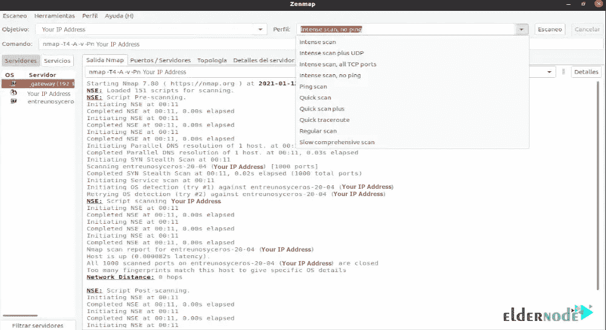

# 如何在 Ubuntu 22.04 - Eldernode 博客上安装 Zenmap

> 原文：<https://blog.eldernode.com/install-zenmap-on-ubuntu-22-04/>


Zenmap 由 nmap 开发，是一款网络扫描和分析工具。Zenmap 和 nmap 工具的主要区别在于它们的图形界面，可以适合初学者，也可以加快工作进程。在本文中，我们将教你**如何在 Ubuntu 22.04** 上安装 Zenmap。如果你想购买一台 **[Ubuntu VPS](https://eldernode.com/ubuntu-vps/)** 服务器，你可以查看 [Eldernode](https://eldernode.com/) 网站上提供的软件包。

## **教程在 Ubuntu 22.04 上设置 Zenmap**

### **Zen map 是什么？**

Zenmap 是一个免费的、开源的、多平台的应用程序，它是 nmap 安全扫描器的官方 GUI，设计用于 Nmap。它支持 Windows，Linux，Ubuntu，Fedora，Kali，Mint，MacOS，BSD，CentOS 等。Zenmap 使 nmap 对初学者来说更容易，并为有经验的 Nmap 用户提供高级功能。此外，初学者可以使用它来扫描网络和发现漏洞。Zenmap 扫描特定 IP 地址或域的网络，并显示域的详细信息。

### **Zenmap 特性**

1)扫描多个端口

2)扫描基本 Nmap IP 或主机

3)扫描 TCP 或 UDP 端口

4)扫描 MAC 地址欺骗

5)扫描 IPv6 地址

6)检测远程主机上的恶意软件感染

7)检测服务/守护程序版本

8)启动 DOS

9)发动暴力攻击

10)禁用 DNS 名称解析

11)找到打开的端口

12)检查发送或接收的数据包数量

### **Zenmap 和 nmap 的区别**

Zenmap 拥有先进的特性，使得新手开发者可以轻松使用 [Nmap](https://blog.eldernode.com/install-nmap-on-linux/) 。Zenmap 还使用来显示 nmap 输出，这可以显示两个扫描之间的差异，其中这些扫描运行多次。这意味着 Zenmap 提供了一个比较扫描结果的界面，即使在不同的日子运行相同的扫描，也可以检测到变化。

Nmap 是一种网络扫描器，以用于识别主机和服务的端口映射而闻名。Nmap 扫描计算机网络，并提供用于托管探索和服务的网络。它可以检测用于扫描的网络的主机和服务。应该注意的是，nmap 是用 C、C++、Python 和 Lua 编写的，但是 Zenmap 是 Nmap 的 GUI，所以不可能说出它是用哪种编程语言编写的。

在这篇文章的后续部分，和我们一起向你展示如何在 Ubuntu 22.04 上安装 Zenmap。

## **在 Ubuntu 22.04 上安装 Zenmap**

官方的 Ubuntu 库上没有 Zenmap，你必须手动安装。在执行任何操作之前，**通过输入以下命令更新您的系统** **软件包**:

```
sudo apt update
```

现在您应该使用以下命令**安装 Nmap** :

```
sudo apt install nmap
```

在这一步中，您需要通过运行以下命令在 Ubuntu 22.04 系统上安装 Python GTK。因为 Zenmap 使用 Python GTK 来创建图形用户界面。

```
wget http://archive.ubuntu.com/ubuntu/pool/universe/p/pygtk/python-gtk2_2.24.0-5.1ubuntu2_amd64.deb 
```

```
sudo apt install ./python-gtk2_2.24.0-5.1ubuntu2_amd64.deb
```

现在是时候**下载 Zenmap Debian 包**了。为此，请运行以下命令:

```
wget http://archive.ubuntu.com/ubuntu/pool/universe/n/nmap/zenmap_7.60-1ubuntu5_all.deb
```

此外，您也可以通过访问以下地址下载该软件:

```
http://archive.ubuntu.com/ubuntu/pool/universe/n/nmap/
```

要安装 Zenmap ,只需输入以下命令:

```
sudo apt install ./zenmap_7.60-1ubuntu5_all.deb
```

### **如何在 Ubuntu 22.04 上使用 Zenmap**

如果你想**访问 Zenmap** 特性并在你的 Ubuntu 22.04 系统上使用它，你应该以 root 用户的身份运行 Zenmap。为此，请使用以下命令:

```
sudo zenmap
```

您可以通过键入 IP 地址或主机名来扫描网络。

为了让用户确认计算机的可用性，他们必须从下拉框中选择各种分析，如完全扫描、简单扫描或 ping 扫描。您可以在右侧的 Nmap 输出窗口中看到 Nmap 中的各个步骤:



## 结论

首先，我们介绍了 Zenmap 并列举其特性。我们还解释了 Zenmap 和 nmap 之间的区别。然后我们教你如何在 Ubuntu 22.04 上安装 Zenmap。Zenmap 允许用户保存和比较所执行的扫描，还允许他们查看网络拓扑图、在网络上的主机上运行的视窗，并将扫描存储在可搜索的数据库中。我希望这篇教程对你有用。