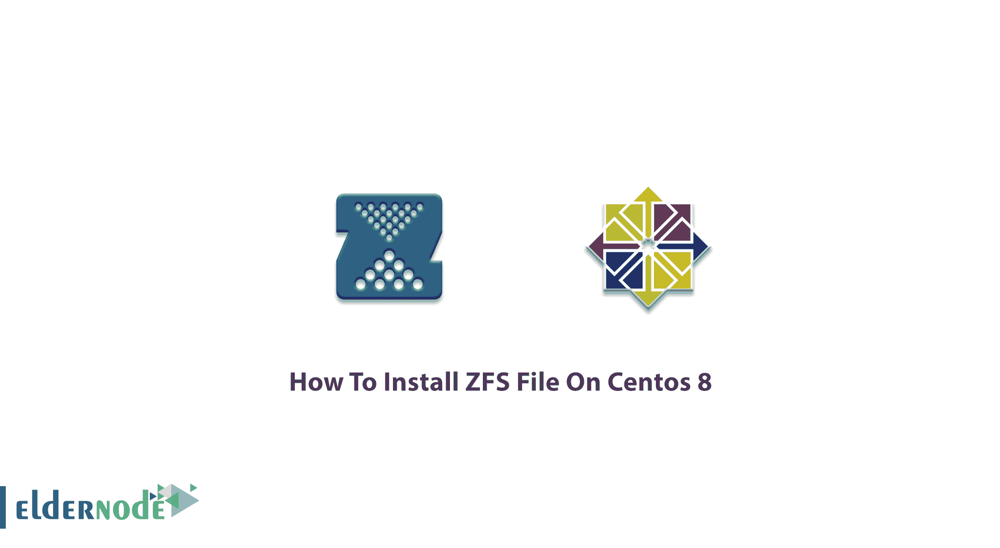

# 如何在 Centos 8 - Eldernode 博客上安装 ZFS 文件

> 原文：<https://blog.eldernode.com/install-zfs-file-on-centos-8/>



它是关于管理文件系统的。Z **F** ile **S** 系统因其独有的特性而被管理员广泛使用，这些特性可以保证数据的持久性，从而将正确的数据返回给应用程序。使用 ZFS 时，您不再需要创建虚拟化卷，因为它可以将设备聚合到一个存储工具中，并消除卷管理。在本文中，您将学习**如何在 Centos 8** 上 **安装 ZFS 文件。由于 ZFS 仅限于在单个服务器上运行，所以请准备好您自己的 [Linux VPS](https://eldernode.com/linux-vps/) 以便能够在您的 [Centos VPS 服务器](https://eldernode.com/centos-vps/)上安装 ZFS，并利用其优势。**

为了让本教程更好地发挥作用，请考虑以下**先决条件**:

拥有 sudo 权限的非 root 用户

要进行设置，请遵循我们的[初始设置 CentOs 8](https://blog.eldernode.com/initial-set-up-centos-8/) 。

## **教程在 Centos 上安装 ZFS 文件**

使用开源的 ZFS 及其数据服务是免费的。通常内置于 Oracle 操作系统中，在技术人员和企业中非常流行。对美国人来说，把它读成 ZedFS 比 ZeeFS 更好听。然而，这取决于你。

## **在 Centos 8 上逐步安装 ZFS 文件**

让我们开始复习这个指南的步骤来学习并完成它。

**第一步:**首先，建议您检查已经安装在 Oracle Linux 8 上的**库**，使用下面的命令显示已经安装的库。

```
yum repolist
```

**第二步:**

然后，安装 **Yum utilities** 以防止在安装过程中可能出现的问题。

```
yum install yum-utils
```

**第三步:**

在这一步中，您必须在 Oracle Linux 8 中安装 **EPEL 存储库**。这是 ZFS 文件系统安装的关键步骤。你建议直接从 Fedora 项目官方网站安装 EPEL RPM 文件。

```
dnf install https://dl.fedoraproject.org/pub/epel/epel-release  -latest-8.noarch.rpm
```

***注意*** :如果你被要求按“Y”或“Y”继续安装，从键盘上击“Y”让 EPEL 库被下载和安装。等待一段时间，在 Oracle CentOs 8 上安装 EPEL 存储库。

同样，通过与下面相同的命令确认安装:

```
yum repolist
```

**第四步:**

一旦你确认了你的安装，你应该**启用**你系统中的 EPEL 实用程序。在终端中运行以下命令，后跟 epel 名称。

```
yum config-manager –enable epel
```

您可能感觉有些 EPEL 模块没有被安装，所以您可以通过运行下面的命令安装 Enterprise Linux Modular 8 的一个额外的**包**:

```
yum install –y dkms
```

**第五步:**

在你的系统上安装 **ZFS 文件系统**的最新步骤是从 ZFS 官方网站下载。为此，您可以使用 rpm 命令后跟一个链接。

```
rpm –Uvh <a href="http://download.zfsonlinux.org/epel/zfs  -release.el8_2.noarch.rpm">http://download.zfsonlinux.org/epel  /zfs-release.el8_2.noarch.rpm</a>
```

这样，ZFs rpm 文件就会被**成功地**下载到您的 Oracle Linux 8 中。

**第六步:**

刚才，您将能够通过运行 yum 命令后跟关键字 ZFS 来安装 **ZFS 文件系统**，如下所示:

```
yum install –y zfs
```

通过键入这个，ZFS 的安装将**开始**。您可以等待一段时间，让它完成。

**第七步:**

要开始使用 **ZFS 驱动程序**，你需要加载它。运行以下命令加载驱动程序:

```
/sbin/modprobe zfs
```

**第八步:**

一旦加载了驱动程序，就可以使用以下命令检查 ZFS 文件系统的**加载包状态**:

```
systemctl –a | grep zfs
```

运行上面的命令有助于您观察**活动的**、**非活动的**和**失败的**实用程序和服务。

此外，要查看哪些实用程序**被启用**和**被禁用**，请键入以下命令:

```
systemctl list-unit-files | grep zfs
```

**第九步:**

使用以下命令**同时相互连接**公用服务。

```
systemctl preset zfs-import-cache zfs-mount zfs-share zfs-zed  zfs-import-scan zfs-target
```

这样，您可以启用服务。键入下面的命令以**启用**单个禁用的实用程序服务。

```
systemctl enable zfs-import-scan.service
```

如果您对公用服务进行验证，您会看到以前被禁用的服务现在被启用的**。**

```
`systemctl list-unit-files | grep zfs`
```

****第十步:****

**现在，您可以根据 ZFS 文件系统检查已经运行的设备。使用以下带有 _l 关键字的命令来**列出**设备。**

```
`fdisk -l`
```

**运行后，您可以看到系统中当前存在的设备和磁盘列表，以及它们的大小、ID、类型、开始和结束信息。**

**并检查已经由**创建的**和由**装载的**池:**

```
`df –h`
```

**最后，此时，您已经在 Oracle Linux 8 上成功安装了 ZFS 文件系统。您可以在系统上创建池、装载池、导入和导出池、删除池以及其他与文件相关的事情。**

### **ZFS 命令**

**让我们回顾一下在 ZFS 系统中尝试使用的一些命令。**

****1-** 执行下面的命令以**在 ZFS 文件系统中创建一个池**。**

```
`zpool create pool_name /dev/sdc`
```

****2-** 使用以下命令**检查池**:**

```
`zpool list`
```

****3-** 您可以通过以下方式查看数据库的**列表:****

```
`zfs-list`
```

****4-** Aso，检查当前**池的状态**:**

```
`zpool status`
```

****5-** 运行以下命令以**导入池**:**

```
`zpool import pool_name`
```

****6-** 和**出口池**:**

```
`zpool export pool_name`
```

****7-** 随时使用下面的命令**删除池****

```
`zpool destroy pool_name`
```

****8-** 要使用池创建 ZFS 文件系统**，请运行:****

```
`zfs create pool_name/myfs`
```

****9-** 最后，您可以通过运行如下简单的挂载命令来**挂载池**:**

```
`mount`
```

**就是这样！从现在开始，改进你处理数据文件的方式。**

****结论****

**在本文中，您学习了如何在 Centos 8 上安装 ZFS 文件。安装 ZFS，享受其功能和优势，并作为您的存储文件系统。它还可以处理 RAID，而不需要额外的软件或硬件。**