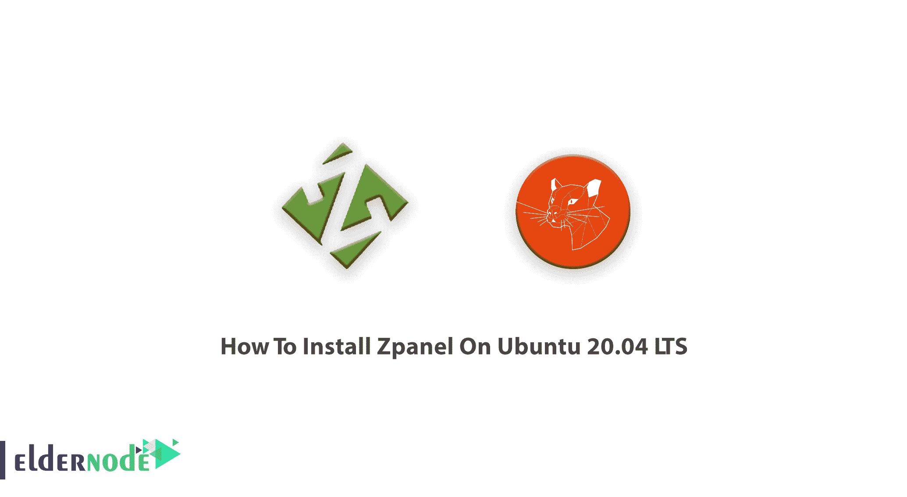

# 如何在 Ubuntu 20.04 & 19.10 上安装 z panel-elder node 博客

> 原文：<https://blog.eldernode.com/install-zpanel-on-ubuntu-20-04/>



作为服务器管理员，您可能希望设置自己的主机。因此，您需要为您的服务器配备一个合适的控制面板，以便轻松管理。如果你使用的是 Linux 操作系统，你会有几种选择。在这篇文章中，Zpanel 是一个自由的被选择来教。所以，加入我们来学习如何**在 Ubuntu 20.04 & 19.10** 上安装 Zpanel。如果你还没有购买你认为合适的 [Linux VPS](https://eldernode.com/linux-vps/) ，看看我们完美的软件包，购买一个，并遵循本教程的其余部分。

## 教程在 Ubuntu 20.04 LTS 上安装 Zpanel

正如你在上面读到的，Zpanel 可以免费使用、下载和管理你的[服务器主机](https://eldernode.com/)，它使用几个开源软件包为你提供一个安全的网络主机系统。一些用户认为 Zpanle 是 [Cpanel](https://blog.eldernode.com/tag/cpanel/) 的最佳替代品，所以请和我们一起回顾它在 Ubuntu 上的安装并找到正确答案。注意不要是以前安装的任何控制面板，你的 Linux 操作系统必须是新的，没有安装软件包。此外，一些包如 [MySQL](https://blog.eldernode.com/installing-mysql-on-ubuntu-20/) 、 [Apache](https://blog.eldernode.com/apache-web-server-ubuntu-20/) 、 [Bind](https://blog.eldernode.com/private-dns-server-on-ubuntu-20-04/) 、Dovecot、Postfix 和 proFTPd 是由 Zpanel 安装在服务器上的，不应该已经安装在服务器上。如果您已经安装了最新的软件包，不要担心，只需通过运行以下命令删除它们:

```
apt-get -y remove mysql* apache* bind* dovecot* postfix* proftpd*
```

**注意**:请记住，您还需要删除任何提供 Web 服务器、FTP 服务器、POP3/IMAP 服务器或 DNS 服务器服务的应用程序。

## 在 Ubuntu 20.04 和 19.10 上安装 Zpanel

准备好您的 [Ubuntu VPS](https://eldernode.com/ubuntu-vps/) 后，以 root 身份登录并按照以下步骤安装 zpanel。

考虑**安全性**，更新和升级您的系统:

```
apt-get update -y
```

```
apt-get upgrade -y
```

然后，您应该下载 **Zpanel 安装脚本**，为此，运行:

```
wget https://raw.github.com/zpanel/installers/master/install/Ubuntu-20_04/10_1_1.sh
```

现在，执行并运行脚本，然后您需要按下 **y** 来开始安装。

```
chmod +x 10_1_1.sh
```

```
sudo ./10_1_1.sh
```

一旦你通过了上面的步骤，你应该确认你想要运行 Zpanel 的安装程序。您将被提示回答一些问题，如您的国家、**FQDN**Zpanle 和公共 **IP** 。当你回答后，再次按下 **y** 继续安装。

接下来，你会看到一个页面，要求你输入你的管理员用户名和密码，通过这一步，你就可以在登录后查看 Zpanel 的仪表盘。

就是这样！都是随时可以使用的。尽情享受吧！

结论

## 在本文中，您了解了如何在 Ubuntu 20.04 和 19.10 LTS 版上安装 Zpanel。您可以安全地选择 zpanel，并享受其功能，如 Webmail、SMTP、POP3 和 IMAP4 电子邮件访问、FTP、Web 服务器和 DNS，这些功能都非常令人满意。如果你对这个主题感兴趣，可以找到关于如何在 Centos 7 & 8 上安装和配置 Zpanel 的相关文章。

In this article, you learned How To Install Zpanel On Ubuntu 20.04 & 19.10 LTS. You can choose zpanel safely and enjoy its features such as Webmail, SMTP, POP3, and IMAP4 email access, FTP, Web server, and DNS which are really satisfying. In case you are interested in this subject, find the related article on [How to Install and Configure Zpanel on Centos 7 & 8](https://blog.eldernode.com/install-and-configure-zpanel-on-centos/).