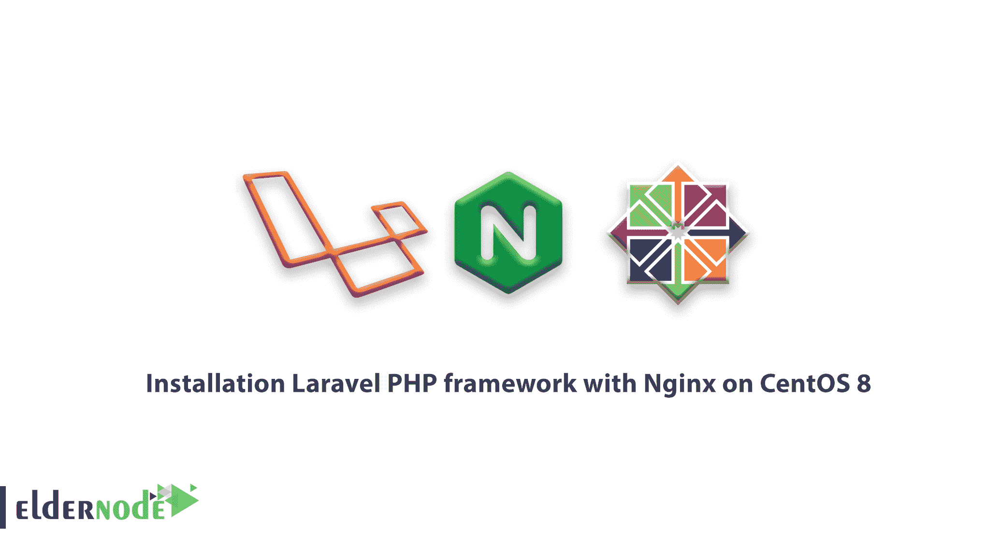
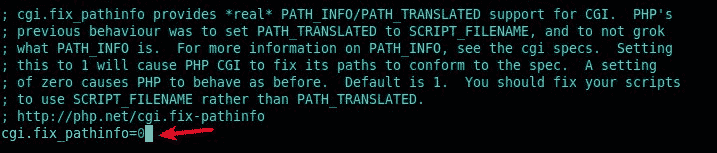
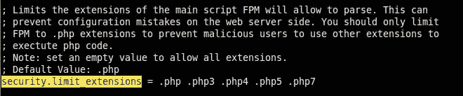
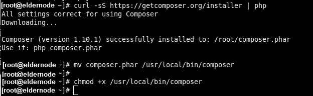
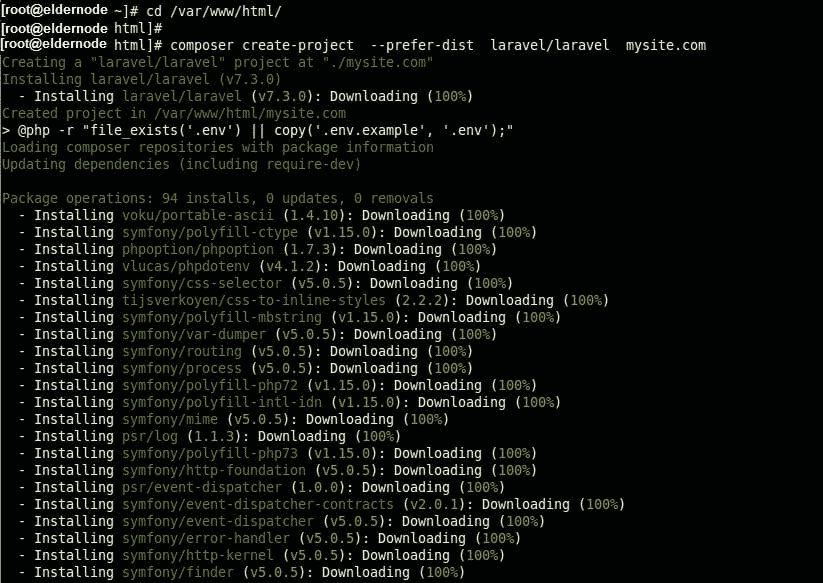
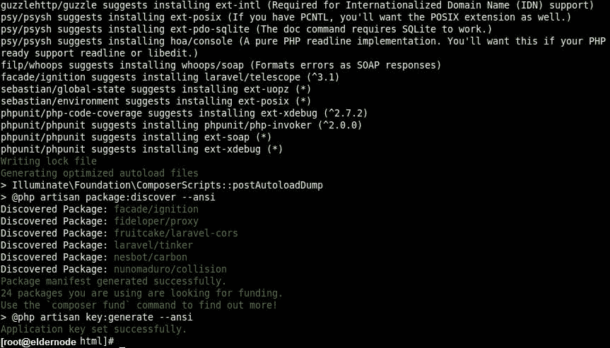
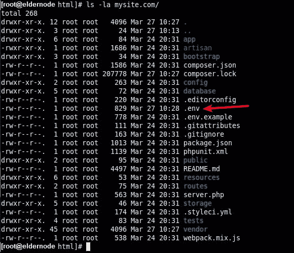
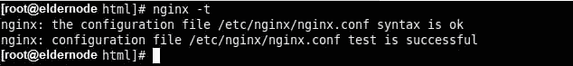

# 教程在 CentOS 8 - Eldernode 上使用 Nginx 安装 Laravel PHP 框架

> 原文：<https://blog.eldernode.com/installation-laravel-nginx-centos-8/>



我们又回来了另一个 [CentOS 教程](https://eldernode.com/tag/learning-centos-8/) 。在本文中，我们介绍了在 CentOS 8 上使用 Nginx 安装 Laravel PHP 框架的**教程。Laravel** 是一个开源的、流行的、现代的基于 PHP 的 web 框架，具有丰富的、优雅的、易于理解的语法，使得构建大型的、健壮的 web 应用程序变得容易。

Laravel 使用**Composer**——一个用于管理依赖关系的 PHP 包管理器和**Artisan**——一个用于构建和管理 web 应用程序的命令行界面。

这个简单、快速的路由引擎、强大的依赖注入容器、用于会话和缓存存储的多个后端、富有表现力和直观的数据库 ORM、健壮的后台作业处理和实时事件广播。

#### 要求

如果您考虑以下因素，本教程可能会更有用:

*   **PHP > = 7.2.5** 带这些 PHP 扩展 OpenSSL、PDO、Mbstring、Tokenizer、XML、Ctype 和 JSON。
*   [**作曲**](https://getcomposer.org/doc/00-intro.md)——用于安装和管理依赖项。

## 教程 CentOS 8 上用 Nginx 安装 Laravel PHP 框架

加入我们，了解如何在 **CentOS 8** Linux 发行版上安装最新版本的 **Laravel PHP** web 框架

### 1-在 CentOS 中安装 LEMP 堆栈 8

首先需要更新系统软件包 [安装](https://eldernode.com/install-lemp-on-centos-8/)**栈，使用下面的 [dnf 命令](https://eldernode.com/dnf-command-on-centos-8/) 。**

```
`dnf update  dnf install nginx php php-fpm php-common php-xml php-mbstring php-json php-zip mariadb-server php-mysqlnd`
```

**安装完成后，使用以下 systemctl 命令启动 **PHP_PFM** 、 **Nginx、**和 **MariaDB 服务**。**

```
`systemctl start php-fpm nginx mariadb  systemctl enable php-fpm nginx mariadb  systemctl status php-fpm nginx mariadb`
```

**通过使用安全脚本，您将能够保护和强化 **MariaDB** 数据库引擎。**

```
`mysql_secure_installation` 
```

**为了确保服务器安装的安全，请回答下列问题。**

```
`Enter current password for root (enter for none): Enter Set root password? [Y/n] y #set new root password Remove anonymous users? [Y/n] y Disallow root login remotely? [Y/n] y Remove test database and access to it? [Y/n] y Reload privilege tables now? [Y/n] y`
```

**如果您的服务运行的是**防火墙，** 打开防火墙中的 **HTTP** 和 **HTTPS** 服务，使客户端请求能够到达 Nginx webserver**

```
`firewall-cmd --zone=public --permanent --add-service=http  firewall-cmd --zone=public --permanent --add-service=https  firewall-cmd --reload`
```

**[购买 Linux 虚拟主机](https://eldernode.com/linux-hosting/)**

**然后，使用浏览器在您系统的 IP 地址上确认您的 **LEMP** 堆栈正在运行**

```
`http://server-IP`
```

```
`` 
```

### **2-配置和保护 PHP-FPM 和 Nginx**

**另外， **PHP-FPM** 可以监听 Unix 套接字或 TCP 套接字，以处理来自 **Nginx** web 服务器的请求。而这是由 **/etc/php-fpm.d/www.conf** 配置文件中的 **listen** 参数定义的。**

```
`vi /etc/php-fpm.d/www.conf  `
```

**如果您使用的是 Unix 套接字，您需要设置正确的所有权和权限，如屏幕截图所示。因此，取消对以下参数的注释，并将它们的值设置为用户和组，以匹配运行 Nginx 的用户和组。**

```
`listen.owner = nginx listen.group = nginx listen.mode = 066`
```

****

**另外，您需要在 **/etc/php.ini** 配置文件中设置系统范围的时区。**

```
`vi /etc/php.ini` 
```

**要继续，请查找行"；date.timezone" 并取消注释，然后设置它的值，如屏幕截图所示。**

```
`date.timezone = Africa/Kampala`
```

****

**如果你想摆脱 **Nginx** 将使用其他扩展执行 PHP 代码的恶意用户的请求传递给 PHP-FPM，取消对以下参数的注释并将其值设置为 0 。**

```
`cgi.fix_pathinfo=1`
```

****

****同样，参见****

**[在 centos 8 上配置 Firewalld](https://eldernode.com/configure-firewalld-on-centos-8/)**

**[如何在 CentOS 8 上安装 MySQL](https://eldernode.com/how-to-install-mysql-on-centos-8/)**

**您可以在 **/etc/php-fpm.d/www.conf** 文件中取消对以下参数的注释。阅读评论获得更多解释。**

```
`security.limit_extensions = .php .php3 .php4 .php5 .php7`
```

****

****

**3-安装 Composer 和 Laravel PHP 框架**

### **使用以下命令安装 **Composer** 包。第一个命令下载安装程序，然后使用 PHP 运行它。**

****

```
`curl -sS https://getcomposer.org/installer | php  mv composer.phar /usr/local/bin/composer  chmod +x /usr/local/bin/composer`
```

**随着 **Composer** 的安装，您可以使用它来安装 Laravel 文件和依赖项，如下所示。**

****

```
`cd /var/www/html/ composer create-project --prefer-dist laravel/laravel mysite.com`
```

**如果过程顺利，应用程序应该会成功安装，并生成一个密钥，如下图所示。**

****

**现在的。env 环境文件已创建，所需的应用程序也已生成。在安装期间。您不应该像以前那样手动创建它们。为了确认这一点，使用 ls 命令运行一长串的 **laravel** 根目录。**

****

```
`ls -la mysite.com/`
```

**然后，开始在**存储**和**引导/缓存**目录上配置正确的所有权和权限，使其可由 Nginx web 服务器写入。**

**如果在您的服务器上启用了 **SELinux** ，您需要更新**存储**和**引导/缓存**目录的安全上下文。**

```
`chown -R :nginx /var/www/html/mysite.com/storage/  chown -R :nginx /var/www/html/mysite.com/bootstrap/cache/  chmod -R 0777 /var/www/html/mysite.com/storage/  chmod -R 0775 /var/www/html/mysite.com/bootstrap/cache/`
```

**You need to update the security context of the **storage** and **bootstrap/cache** directories if **SELinux** enabled on your server.**

```
`semanage fcontext -a -t httpd_sys_rw_content_t '/var/www/html/mysite.com/storage(/.*)?'  semanage fcontext -a -t httpd_sys_rw_content_t '/var/www/html/mysite.com/bootstrap/cache(/.*)?'  restorecon -Rv '/var/www/html/mysite.com'`
```

### **4-为 Laravel 配置 Nginx 服务器块**

### **为了让 **Nginx** 开始为你的网站或应用服务，在中为它创建一个服务器块。conf 文件在 **/etc/nginx/conf.d/** 目录下。**

**VI/etc/nginx/conf . d/my site . com . conf**

**注意 root 和 **fastcgi_pass** 参数，将以下配置复制并粘贴到文件中**

**运行并保存文件，检查 **Nginx** 配置语法是否正确。**

```
`server { listen 80; server_name mysite.com; root /var/www/html/mysite.com/public; index index.php; charset utf-8; gzip on; gzip_types text/css application/javascript text/javascript application/x-javascript image/svg+xml text/plain text/xsd text/xsl text/xml image/x-icon; location / { try_files $uri $uri/ /index.php?$query_string; } location ~ \.php { include fastcgi.conf; fastcgi_split_path_info ^(.+\.php)(/.+)$; fastcgi_pass unix:/run/php-fpm/www.sock; } location ~ /\.ht { deny all; } }`
```

**nginx -t**

****

**然后重启 **PHP-FPM** 和 **Nginx** 服务，让最近的修改生效。**

**5-从网络浏览器访问 Laravel 网站**

**您需要使用本地机器上的**/etc/hosts】**文件创建本地域名系统，以访问位于**mysite.com**的 Laravel 网站，该网站不是完全限定域名(FQDN)，也未注册。**

**要在所需文件中添加服务器 IP 地址和域，请运行以下命令。**

```
`systemctl restart php-fpm  systemctl restart Nginx`
```

### **``**

**`是时候在本地机器上打开一个 web 浏览器，并使用下面的地址进行导航了。`**

**``**

```
``ip add		#get remote server IP  echo "10.42.0.21  mysite.com" | sudo tee -a /etc/hosts``
```

**`就是这样！你成功地在 **CentOS 8** 部署了 **Laravel** 。您现在可以开始使用 **Laravel** 开发您的网站或网络应用程序。`**

```
``http://mysite.com``
```

**`亲爱的用户，我们希望这篇教程能对你有所帮助，如果你有任何问题或想查看我们的用户关于这篇文章的对话，请访问[提问页面](https://eldernode.com/ask)。也为了提高你的知识，有这么多有用的教程为[老年节点培训](https://eldernode.com/blog/)准备。`**

**`**同样，参见**`**

**`[教程 CentOS 8 上安装 Nginx](https://eldernode.com/installation-nginx-on-centos-8/)`**

**`[如何在 Ubuntu 20.04 LTS 上安装 Laravel【完整】](https://eldernode.com/install-laravel-on-ubuntu-20-04-lts/)`**

**`**Also, see**`**

**`[如何在 Debian 10 上安装 Composer](https://eldernode.com/install-composer-debian-10/)`**

**`[How to install Laravel on Ubuntu 20.04 LTS [complete]](https://eldernode.com/install-laravel-on-ubuntu-20-04-lts/)`**

**`[How To Install Composer on Debian 10](https://eldernode.com/install-composer-debian-10/)`**