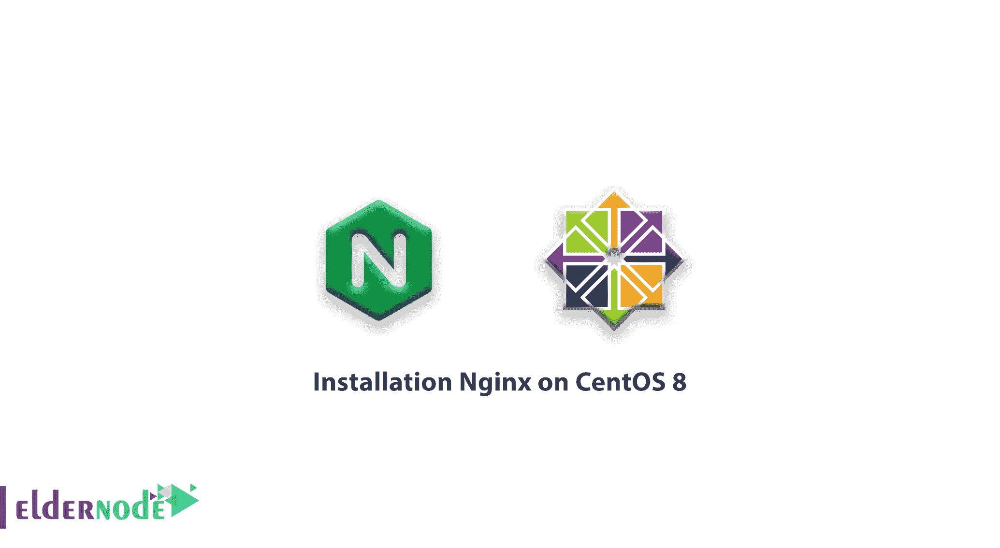
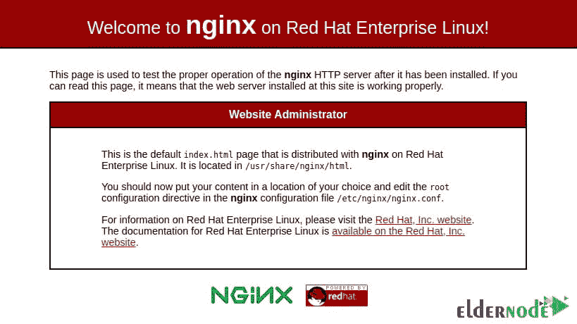

# 教程在 CentOS 8 上安装 Nginx-设置 Nginx Centos 8

> 原文：<https://blog.eldernode.com/installation-nginx-on-centos-8/>



为了介绍世界上最受欢迎的 web 服务器之一，今天我们将展示教程**在 CentOS 8** 上安装 Nginx。它负责托管互联网上一些最大和最受欢迎的网站。在大多数情况下， [Nginx](https://www.nginx.com/resources/wiki/) 比 Apache 更加资源友好，Apache 可以用作 web 服务器或反向代理。

**先决条件**

如果您知道以下内容，本教程可能会更有用:

## 教程 CentOS 8 上安装 Nginx

### 1- 安装 Nginx Web 服务器

首先，你需要使用 DNF 包管理器。它是 CentOS 8 上一个新的默认包管理器。

要安装 Nginx 包，请使用:

```
sudo dnf install nginx
```

要安装 Nginx ，如果提示，输入 y 确认安装。然后运行以下命令来启用并启动服务器:

```
sudo systemctl enable Nginx    sudo systemctl start nginx
```

### 

[购买 Linux 虚拟私有服务器](https://eldernode.com/linux-vps/)

### 2- 调整防火墙规则

要允许 Nginx web 服务器上的外部连接，您需要调整防火墙设置，默认情况下，它在端口 80 上运行。

因此，输入以下命令永久启用端口 80 上的 HTTP 连接:

```
sudo firewall-cmd --permanent --add-service=http 
```

现在，如果您需要检查是否正确添加了 HTTP 防火墙服务，请运行以下命令:

```
sudo firewall-cmd --permanent --list-all 
```

输出应该类似于以下内容:

输出

```
public    target: default    icmp-block-inversion: no    interfaces:     sources:     services: cockpit dhcpv6-client http ssh    ports:     protocols:     masquerade: no    forward-ports:     source-ports:     icmp-blocks:     rich rules:
```

重新加载防火墙服务以应用更改:

```
sudo firewall-cmd --reload 
```

您现在已经成功安装了 Nginx 服务器。

### 3- 检查你的网络服务器

要查找服务器的公共 IP 地址，请运行以下命令

```
ip addr show eth0 | grep inet | awk '{ print $2; }' | sed 's/\/.*$//' 
```

要验证可访问的 IP 地址，请运行以下命令。

```
curl -4 icanhazip.com
```

然后，在你的网络浏览器中输入结果地址，你将被带到 Nginx 的默认登陆页面:



查看此页面后，您可以确保 web 服务器安装正确。

在接下来的文章中，我们将解释如何管理 Nginx 进程，熟悉重要的 Nginx 文件和目录，设置服务器块。

亲爱的用户，我们希望您喜欢本教程，您可以在评论区提出关于本次培训的问题，或者解决[老年节点培训](https://eldernode.com/blog/)领域的其他问题，请参考[提问页面](https://eldernode.com/ask)部分并在其中提出您的问题。