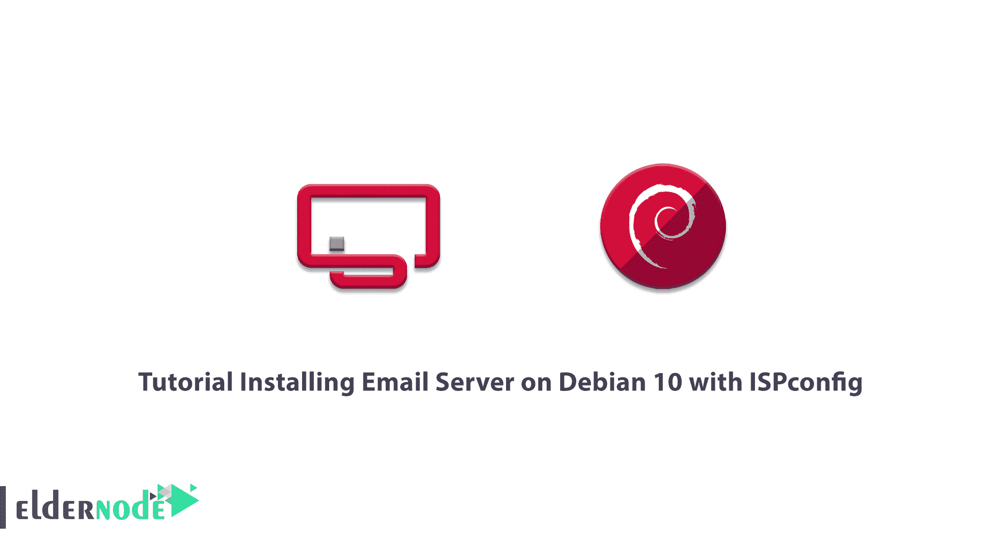
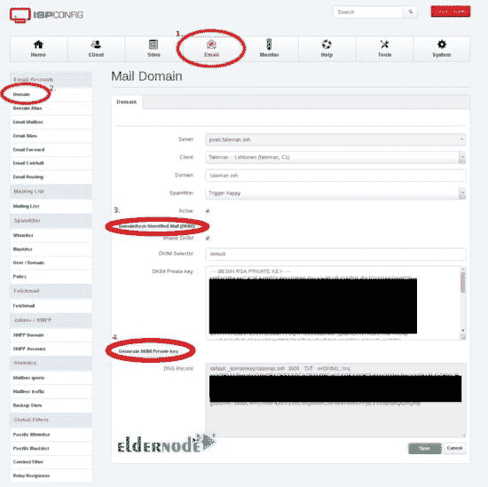
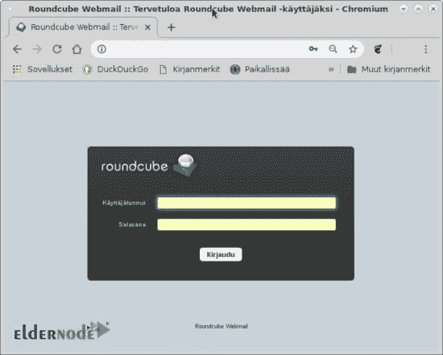
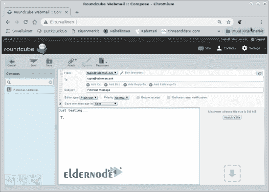
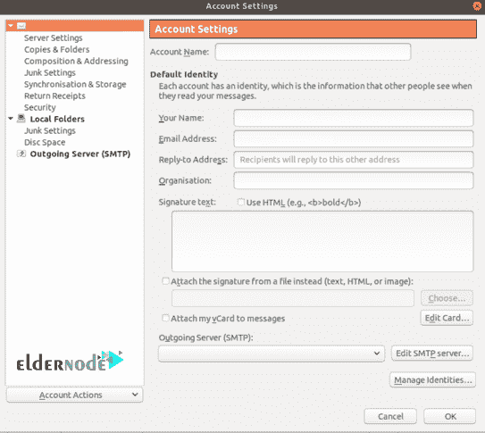
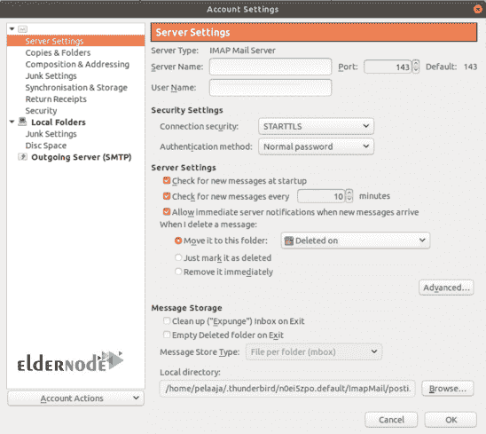
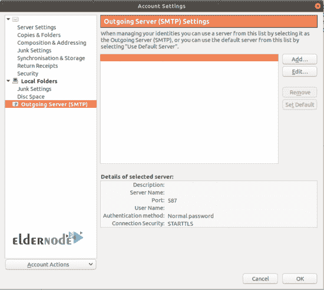

# 教程用 ISPconfig - Eldernode 在 Debian 10 上安装邮件服务器

> 原文：<https://blog.eldernode.com/installing-email-server-on-debian-10/>



虽然我们使用各种应用程序来发送和接收消息，并且它们总是被升级以提供更多的访问和设施，但是使用电子邮件将不会过期。我们账户的大部分官方谈判和认证都是通过我们的电子邮件完成的。在本文中，你可以回顾一下教程**用 ISPconfig** 在 Debian 10 上安装邮件服务器。如果你最近准备了一台 [Linux VPS](https://eldernode.com/linux-vps/) 或 Debian 服务器，这可能会很有帮助。

## 如何用 ISPconfig 在 Debian 10 上安装邮件服务器

为了让本教程更好地发挥作用，请考虑以下**先决条件**:

1-准备安装操作系统和 ISPConfig 的主机。

2- 2GB 内存，带 4GB 交换空间。

*注意*:你需要内存来过滤垃圾邮件。如果 4GB 交换避免了内存不足的情况，1GB 可能就足够了。

3-主机应该有一个双向开放端口 25 的互联网连接。

4-为主机准备一个固定的 IP 地址。

5-主机应该有其 IP 地址的记录。

6-为主机的 DNS 名称服务创建 MX 记录。

7-获取与主机 FQDN 匹配的主机反向 DNS 名称服务 [PTR](https://en.wikipedia.org/wiki/List_of_DNS_record_types#PTR) 记录。

8-拥有 sudo 权限的非根用户。

要进行设置，请按照 Debian 10 的[初始设置进行。](https://blog.eldernode.com/initial-setup-with-debian-10/)

## **用 ISPconfig** 在 Debian 10 上安装邮件服务器

根据它的隐私，使用电子邮件总是例行公事和受欢迎的。加入我们的指南，安装一个电子邮件服务器，以便能够完全控制如何访问、管理和存储您的电子邮件。在您的主机上设置电子邮件服务器之前，您应该检查邮件服务器的端口 25 是否同时打开了正在进行的发送和发送。此外，请确保您的主机已打开该端口。虽然即使在端口 25 未打开的情况下，也有办法让电子邮件正常工作，但我们建议您在另一台主机上安装电子邮件服务器，并在发送电子邮件时完全忘记第一台服务器。

### DNS 名称服务

什么是 [DNS](https://blog.eldernode.com/private-dns-server-in-debian-10/) mane 服务条目？邮件服务器需要一个 FQDN 和完全合格的域名。在本例中，我们考虑使用 eldernode.com 作为域名，为了表明邮件服务器的主机名不必是 mail，我们使用 DNS1 作为主机名。你会在下面看到 Dns1.eldernode.com。该主机安装在服务提供商的系统上，提供域名注册、域名服务和反向域名服务。

虽然 IP 地址是 178.33.154.66，看看下面的列表:

1-注册了 eldernode.com 域名

2-将此 IP 地址作为记录添加到名为 Dns1.eldernode.com 的 DNS 名称服务

3-添加了值为 Dns1.eldernode.com 的域 eldernode.com 的 MX 记录

4-添加了该 IP 地址的反向名称服务 PTR 记录，指向 Dns1.eldernode.com

因为 MX 记录是为电子邮件域创建的，所以我们为 eldernode.com 创建它，它指向接收该域电子邮件的电子邮件服务器 Dns1.eldernode.com。

### 反向名称服务

在这个例子中，反向名称服务应该返回 Dns1.eldernode.com。在添加相应的 PTR 网站之前，我的服务提供商检查了记录是否存在。

### 如何测试名称服务

现在测试名称服务似乎是一个好主意，因为如果名称服务设置不正确，发送和接收电子邮件将无法工作。如果您使用 [Windows](https://blog.eldernode.com/tag/windows/) 而不是 Linux 或 Unix 作为您的工作站，您需要使用命令 *nslookup* 而不是*主机*。

```
host domain.com  domain.com has address 188.165.143.5  domain.com mail is handled by 10 Dns1.domain.com.
```

如果你看到，这表明该域名有一个相关的 IP 号码。还有，有一条 MX 记录指向 Dns1.domain.com。“邮件由谁处理”部分来自 MX 记录。当电子邮件发送到@domain.com 地址并在 Dns1.domain.com 接收时，需要 MX 记录。不要忘记检查邮件服务器的名称服务 FQDN 是一个 A 记录，并指向正确的 IP 号码。

```
dig Dns1.domain.com |grep "ANSWER SECTION" --after-context=3   ;; ANSWER SECTION:  Dns1.domain.com. 3600 IN A 178.33.154.66   ;; Query time: 56 msec
```

然后，检查反向名称服务将 IP 号码解析回邮件服务器的 FQDN。

```
host 178.33.154.66  66.154.33.178.in-addr.arpa domain name pointer Dns1.domain.com.
```

注意:请记住，您可以使用网页来测试名称服务，而不是使用 host 和 dig 命令。其中两个是 [intoDNS](https://intodns.com/) 和 MXToolbox。

### 如何在 Linux Debian 上安装 OS

不要忘记用您的值替换 IP 号、主机名和域名。

```
[[email protected]](/cdn-cgi/l/email-protection):/tmp# cat /etc/debian_version 10.0
```

此外，您需要验证主机名设置的正确性，以帮助邮件系统配置 ISPconfig 正常工作。

```
[[email protected]](/cdn-cgi/l/email-protection):~# hostname dns1  [[email protected]](/cdn-cgi/l/email-protection):~# hostname -fDns1.domain.com  [[email protected]](/cdn-cgi/l/email-protection):~#
```

### 如何安装 ISPConfig

在这一步中，您可以在主机上安装 [Apache](https://blog.eldernode.com/install-apache-web-server-debian/) web 服务器、OpenSSH-server，并使用 SSH 密钥设置 root 登录。因此，您可以直接以 root 身份 ssh 主机。

```
[[email protected]](/cdn-cgi/l/email-protection):/tmp# free -h
```

如果你更喜欢使用 Emacs 风格的编辑器而不是 nano，你需要安装 jed。安装操作系统后，您已经正确设置了/etc/host 和/etc/hostname。因此，请遵循完美的服务器指南来验证它们的正确性。如果你不注意主机名和 FQDN，以不面对任何问题，在邮件服务器工作结束。

```
[[email protected]](/cdn-cgi/l/email-protection):/tmp# hostname  dns1  [[email protected]](/cdn-cgi/l/email-protection):/tmp# hostname -f  Dns1.domain.com
```

在本文中，我们遵循了完美服务器指南。这样，您就可以将指南中的命令剪切并粘贴到命令行中。我们没有在这台主机上安装和使用 Mailman。因此，我们省略了 BIND DNS 服务器、Webalizer 和 AWStats 的安装。我们安装了 Roundcube Webmail，因为这台主机成为了一台电子邮件服务器。运行下面的命令生成 32 个字符长的河豚秘密。

```
/usr/bin/apg -m 32 -x 32
```

### 如何使用系统

在这一步中，您将看到**如何创建电子邮件域和邮箱**。

您需要首先以管理员身份登录到 ISPConfig，然后添加一个新的客户端、新的域并填写表单，还要添加一个新的邮箱。

毕竟，创建 DKIM 键，并通过按图像中编号的顺序单击按钮进行记录。



现在，等待大约 2 分钟，或者直到 ISPConfig 面板上部带有数字的红色球消失。作为第一个测试，您需要使用上面创建的邮箱登录到 Roundcube Webmail，并向相同的地址发送一封电子邮件。ISPConfig 会向每个创建的邮箱发送一条欢迎消息，所以那里应该已经有一条消息了。要编写简短的测试消息，请使用编写按钮。



***



然后，你会在邮箱里收到邮件。现在，您可以测试向您拥有的其他邮箱发送电子邮件。另外，检查邮件是否到达那里。接下来，开始测试是否可以从其他地方发送到上面创建的邮箱。

请注意，如果您为邮箱启用灰名单，从服务器外部发送的电子邮件不会立即到达邮箱。我的意思是，您将立即在邮件日志中看到尝试传递的条目，这样您就可以看到邮件可以到达您的服务器。文件/var/log/mail.log 中的灰名单条目如下所示:

```
Jan 02 20:23:12 dns1 postfix/smtpd[16911]: NOQUEUE: reject:   RCPT from mta-out1.inet.fi[62.71.2.194]: 450 4.2.0   <[[email protected]](/cdn-cgi/l/email-protection)>: Recipient address rejected: Greylisted,   from=<****@*****.***> to=<[[email protected]](/cdn-cgi/l/email-protection)> proto=ESMTP   helo=<******.****.***>
```

此外，还可以在终端窗口中监控邮件日志，如下例所示:

```
tail -f /var/log/mail.log
```

如果灰名单是您的目标，请使用以下命令:

```
tail -f /var/log/mail.log | grep Greylisted
```

运筹学

```
grep Greylisted /var/log/mail.log
```

灰名单的作用是延迟同一发件人发给同一收件人的第一封电子邮件。当收到第一封电子邮件时，接下来的电子邮件会毫不延迟地到达。如果您在第一次尝试时看到一切正常，您可以确保 ISPConfig Perfect 服务器指南正常工作。

### 如何连接电子邮件客户端

Thunderbird 可以作为邮件客户端的一个例子。其他邮件应用程序以类似的方式工作。ISPConfig 使帐户名成为电子邮件地址。



***



STARTTLS 表示连接在不受保护的情况下开始，然后如果双方都支持加密，则切换到加密状态。如您所知，SSL/TSL 意味着会话从一开始就是加密的。当然是 SSL。TSL 更安全。所以，如果你的客户问起，试着做好准备。



### 如何使用 SPF

允许你自己创造记录。你只需要检查你的名字 servo=ice 提供者是否能生成一个 [SPF](https://en.wikipedia.org/wiki/Sender_Policy_Framework) 记录，或者运行下面的命令来使用互联网搜索引擎。

```
SPF wizard
```

可以找个网站创建一个 SPF 名称服务记录。然后，将记录剪切并粘贴到您的名称服务中。并添加 TXT 记录，或者在某些 DNS 系统上添加 SFP 记录。

下面是一个示例，用于检查 SPF 在名称服务器中的外观:

```
dig domain.com -t TXT | grep spf  domain.com. 3000 IN TXT "v=spf1 mx ~all"
```

或者甚至:

```
dig +short domain.com TXT  "v=spf1 mx ~all"  "1|www.domain.com"
```

### 如何使用 DKIM

ISPConfig 在创建电子邮件域时为您创建了 **D** 域**K**eyes**I**identified**M**ail。剪切并粘贴 DNS 记录，它是您的名称服务的公钥，作为 TXT 记录。您的域名服务提供商可能会提供一个工具，使创建 [DKIM](https://en.wikipedia.org/wiki/DomainKeys_Identified_Mail) 记录变得更加容易。保持 DKIM 私钥的秘密。要检查 DKIM 在名称服务中的外观:

```
host -t txt default._domainkey.domain.com.  default._domainkey.domain.com descriptive text "v=DKIM1;h=sha256;s=*;p=MIIB(I cut long string shorter)0rp" "sTGLXyK(cut shorter)B;t=s;"
```

当 ISPConfig 创建 DKIM 密钥时，私钥被复制到 *amavis* 设置中的正确位置。

此外，你可以使用 mail-tester.com 网站来检查 SPF 和 DKIM 的工作。该网站会给你一个电子邮件地址，你从你的服务器发送一封电子邮件。那么，你必须等一会儿，再检查一遍。

### 如何创建证书

由于 ISPConfig 可以创建自签名证书，因此除非您选择不创建它们，否则它们会在 ISPConfig 安装期间创建。创建浏览器、电子邮件程序和其他电子邮件服务器信任的适当证书是一个好主意，不管您是否创建了那些自签名证书。

请注意，创建的网站显示 Debian 默认网页，直到您为网站创建 LE 证书。此外，IsPconfig 面板不可靠，它有自签名证书。现在，这个新证书或者根本没有证书。设置证书时，在浏览器中输入服务器的 https 地址。用另一个显示证书信息的鼠标按钮单击浏览器地址栏左侧的图标。最后，转到 ISPConfig 面板系统选项卡、接口主配置和邮件选项卡。那里设置:

```
Use SSL/TLS encrypted connection for SMTP
```

到 SSL。

你可以在网站上用工具测试证书，使用互联网搜索引擎

```
ssl testing
```

那些工具在测试电子邮件服务器拥有的证书时测试网站，用

```
ssl testing mail server
```

### ISPConfig Roundcube 插件

要被允许在 Roundcube 中更改电子邮件密码，你需要使用有用的插件。此外，也可以在 Roundcube 中修改其他设置。这些插件对网络邮件用户很有用。你可以安装 ISPCongif Roundcube 插件，它可以在 Debian 10 中工作，只是现在 ISPCongif 3 _ account/conf/config . Inc . PHP 多了一行:

```
config['soap_validate_cert'] = true;
```

由于证书是在本教程的前一章中设置和测试的，因此它可以保持值 true。Som 如果主机没有有效的证书，请将此设置更改为 false。

您可能会看到帐户部分的某些项目已耗尽的错误消息。

```
An error occurred.  Soap Error: The login is not allowed from <host ip-number>
```

您可以通过单击远程访问并为您按照教程创建的 rcmail-remote 用户编写 Dns1.domaincom 来解决这个问题。单服务器安装和带有单独电子邮件服务器的 ISPConfig 多服务器安装都需要它。

### 进一步用法

您可以创建另一个电子邮件域。您必须为该域创建 MX 记录，并将其指向您的电子邮件服务器。此外，您可以为您创建的所有电子邮件域使用同一个电子邮件服务器。为每个电子邮件域创建单独的电子邮件服务器是非常浪费的。

### 故障排除

如果您仔细地遵循了本指南，您应该不会遇到任何问题，并且可以成功地设置电子邮件服务器。但是，如果您需要检查 DNS 名称服务，请通过以下网站检查它们的 DNS:

1.  intodns.com
2.  dnschecker.com
3.  mxtoolbox.com

如果您没有接收或发送电子邮件，则由 postfix 来执行这些功能，并将其记录到/var/log.mail.log 中

```
tail -f /var/log/mail.log | grep postfix to see what happens when mail is being received or sent.
```

但是，如果您在连接电子邮件客户端(如 Thunderbird)时仍然遇到一些问题，请使用下面的命令:

```
tail -f /var/log/mail.log | grep dovecot
```

如果特定的电子邮件有问题，您可以使用该电子邮件的 ID 来查找电子邮件日志条目。例如:

```
Jan 2 21:45:03 dns1 postfix/smtps/smtpd[10260]: A9F2880C76:  client=dsl-tkubng21-58c1ce-191.dhcp.inet.fi[99.99.99.99],  sasl_method=PLAIN, [[email protected]](/cdn-cgi/l/email-protection)
```

该电子邮件的 ID 是 A9F2880C76。使用以下命令，查找该电子邮件的日志条目。

grep a9f 2880 c 76/var/log/mail . log

命令 mailq 显示 postfix 延迟队列中的电子邮件(尚未发送的邮件)。那里有一些最近的条目是正常的，电子邮件并不总是能被立即发送。您还可以使用队列 ID 查看这些电子邮件的内容:

```
postcat /var/spool/postfix/deferred/A/A9F2880C76
```

## 结论

在本文中，我们介绍了使用 ISPconfig 在 Debian 10 上安装电子邮件服务器的教程。你可以和客户发送电子邮件，也可以使用邮件传输代理或邮件发送代理等电子邮件软件。如果您有兴趣阅读更多内容，请阅读关于如何找到 SMTP 地址的文章。