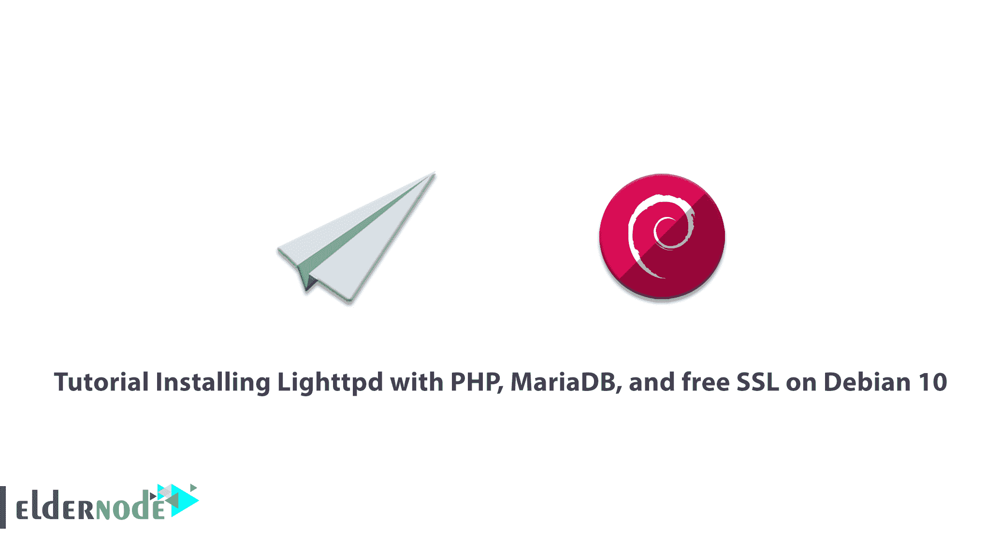
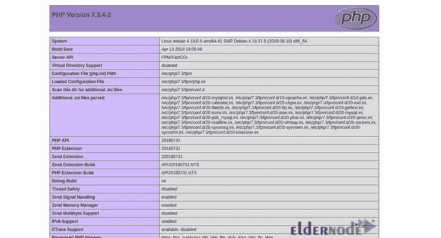

# 在 Debian 10 上安装带有 PHP、MariaDB 和免费 SSL 的 Lighttpd

> 原文：<https://blog.eldernode.com/installing-lighttpd-debian-10/>



Lighttpd(读作“lighty”)是一个开源、免费、高速的 web 服务器。Lighttpd 针对速度关键型环境进行了优化。它安全、灵活，并且需要的内存少，这使得它在其他 web 服务器中很受欢迎。它的体积很小，只有 1MB，CPU 和 RAM 的使用率很低。使用 Lighttpd，您可以使用 FastCGI、SCGI 和 CGI 接口托管用其他编程语言编写的 web 应用程序。Lighttpd 受 BSD 许可，支持使用 [OpenSSL](https://blog.eldernode.com/install-openssl-on-windows-server-2019/) 的 TLS/SSL。加入我们的教程**在 Debian 10** 上安装带有 PHP、MariaDB 和免费 SSL 的 Lighttpd。要购买自己的 [Linux VPS](https://eldernode.com/linux-vps/) ，查看 [Eldernode](https://eldernode.com/) 的完美包并购买一个。

## **如何在 Debian 10** 上用 PHP、MariaDB、免费 SSL 安装 Lighttpd

为了让本教程更好地发挥作用，请考虑以下**先决条件**:

拥有 sudo 权限的非 root 用户。

要进行设置，请按照 Debian 10 的[初始设置进行。](https://blog.eldernode.com/initial-setup-with-debian-10/)

注意:在本指南中，域名假定为“example.com”。对于您的情况，请记住用您自己的域名替换所有填充名称和配置设置中的 example.com。

## **在 Debian 10** 上安装带有 PHP、MariaDB、免费 SSL 的 Lighttpd

如果您正在寻找解决服务器负载问题的解决方案，Lighttpd 可能是一个理想的选择。它支持使用 chroot 和 mod_rewrite。让我们从更新您的系统开始吧。使用下面的命令来完成此操作。完成后，重新启动服务器以使更改生效。

```
apt-get update -y
```

```
apt-get upgrade -y
```

### **如何安装 Lighttpd**

因为 Lighttpd 在 Debian 10 默认存储库中可用，所以运行下面的命令来安装它。

```
apt-get install lighttpd -y
```

安装完成后，您可以启动 Lighttpd 服务。要使其能够在系统重新启动后启动，请键入:

```
systemctl start lighttpd
```

```
systemctl enable lighttpd
```

此外，您可以通过运行以下命令来检查 Lighttpd 的状态:

```
systemctl status lighttpd
```

### **如何安装 MariaDB 服务器**

使用以下命令安装 [MariaDB](https://blog.eldernode.com/mariadb-installation-on-debian-10/) 服务器。

```
apt-get install mariadb-server mariadb-client -y
```

您应该在完成安装后保护 MariaDB。要保护它，请键入:

```
mysql_secure_installation
```

### **如何安装 PHP 和 PHP-FPM**

在这一步中，您将在您的系统中安装 PHP、PHP-FPM 和 FastCGI。因为 Debian 10 默认自带 PHP 7.3 版本。使用以下命令安装:

```
apt-get install php php-cgi php-fpm php-mysql -y
```

确保安装了软件包后，编辑 pho.ini 文件，并通过运行以下命令将 cgi.fix_pathinfo 设置为 1:

```
nano /etc/php/7.3/fpm/php.ini
```

然后，更改以下行:

```
cgi.fix_pathinfo=1
```

现在，您可以保存并关闭文件。

PHP 默认指向 UNIX socket/var/run/PHP/PHP 7.3-fpm . sock。此时，您应该配置 PHP-FPM 池来设置 PHP 监听 TCP 套接字。为此，请编辑/etc/PHP/7.3/fpm/pool . d/www . conf 文件:

```
nano /etc/php/7.3/fpm/pool.d/www.conf
```

然后，找到下面一行:

```
listen = /run/php/php7.3-fpm.sock
```

现在，用下面一行替换它:

```
listen = 127.0.0.1:9000
```

一旦你完成了上述步骤，戴夫便关闭文件。要重新启动 PHP-FPM 服务以应用配置更改，请键入:

```
systemctl restart php7.3-fpm
```

现在，您可以使用下面的命令修改 15-fastcgi-php.conf 文件:

```
nano /etc/lighttpd/conf-available/15-fastcgi-php.conf
```

再次找到以下几行:

```
"bin-path" => "/usr/bin/php-cgi",  "socket" => "/var/run/lighttpd/php.socket",
```

用下面的替换它们:

```
"host" => "127.0.0.1",  "port" => "9000",
```

现在，当所有操作成功完成后，您可以保存并关闭文件。要启用 FastCGI 和 FastCHI-PHP 模块，请运行:

```
lighty-enable-mod fastcgi  lighty-enable-mod fastcgi-php
```

然后，要应用您所做的更改，请通过以下方式重新启动 Lighttpd:

```
systemctl restart lighttpd
```

### **如何创建 Lighttpd 虚拟主机**

要创建一个新的虚拟主机文件来用 Lighttpd 测试 PHP，请键入:

```
nano /etc/lighttpd/conf-available/example.com.conf
```

并且，添加下面的行:

```
$HTTP["host"] == "www.example.com" {  server.document-root = "/var/www/html/"  server.errorlog = "/var/log/lighttpd/example.com-error.log"  }
```

现在，您可以保存并关闭文件。使用下面的命令启用虚拟主机。

```
ln -s /etc/lighttpd/conf-available/example.com.conf /etc/lighttpd/conf-enabled/
```

然后，使用下面的命令在 Lighttpd 文档根目录中创建一个示例 index.php 文件:

```
nano /var/www/html/index.php
```

添加以下一行:

```
<?php phpinfo(); ?>
```

保存并关闭文件。运行以下命令将 Lighttpd 文档根目录的所有权更改为 www-data。

```
chown -R www-data:www-data /var/www/html/
```

最后，要重新启动 Lighttpd 服务，请键入以下命令。它将应用配置更改:

```
systemctl restart lighttpd
```

### **如何用 Let's Encrypt 免费 SSL 保护 Lighttpd with】**

要完成这一步，您需要首先安装 Certbot 工具，用 Let's Encrypt 来保护您的 web 服务器。由于 Debian 10 默认仓库中没有最新版本的 Certbot，所以需要添加 Certbot 仓库。为此，请运行以下命令:

```
apt-get install software-properties-common  add-apt-repository ppa:certbot/certbot
```

然后，您应该更新存储库并安装 Certbot。因此，键入:

```
apt-get update -y  apt-get install certbot -y
```

此时，您需要使用下面的命令创建一个加密证书:

```
certbot certonly --webroot -w /var/www/html/ -d www.example.com
```

接下来，您将被要求提供您的电子邮件地址并接受许可条款，如下所示:

```
Saving debug log to /var/log/letsencrypt/letsencrypt.log  Plugins selected: Authenticator webroot, Installer None  Enter email address (used for urgent renewal and security notices) (Enter 'c' to  cancel): [[email protected]](/cdn-cgi/l/email-protection)
```

```
- - - - - - - - - - - - - - - - - - - - - - - - - - - - - - - - - - - - - - - -  Please read the Terms of Service at  https://letsencrypt.org/documents/LE-SA-v1.2-November-15-2017.pdf. You must  agree in order to register with the ACME server at  https://acme-v02.api.letsencrypt.org/directory  - - - - - - - - - - - - - - - - - - - - - - - - - - - - - - - - - - - - - - - -  (A)gree/(C)ancel: A
```

```
- - - - - - - - - - - - - - - - - - - - - - - - - - - - - - - - - - - - - - - -  Would you be willing to share your email address with the Electronic Frontier  Foundation, a founding partner of the Let's Encrypt project and the non-profit  organization that develops Certbot? We'd like to send you email about our work  encrypting the web, EFF news, campaigns, and ways to support digital freedom.  - - - - - - - - - - - - - - - - - - - - - - - - - - - - - - - - - - - - - - - -  (Y)es/(N)o: Y
```

接下来，当证书下载成功完成时，您将看到下面的输出。

```
IMPORTANT NOTES:  - Congratulations! Your certificate and chain have been saved at:  /etc/letsencrypt/live/example.com/fullchain.pem  Your key file has been saved at:  /etc/letsencrypt/live/example.com/privkey.pem  Your cert will expire on 2019-12-06\. To obtain a new or tweaked  version of this certificate in the future, simply run certbot  again. To non-interactively renew *all* of your certificates, run  "certbot renew"  - If you like Certbot, please consider supporting our work by:
```

```
Donating to ISRG / Let's Encrypt: https://letsencrypt.org/donate  Donating to EFF: https://eff.org/donate-le
```

是时候将证书和私钥合并到一个文件中了。所以，运行:

```
cat /etc/letsencrypt/live/example.com/cert.pem /etc/letsencrypt/live/example.com/privkey.pem > /etc/letsencrypt/live/example.com/web.pem
```

因为您需要编辑 Lihghttpd 虚拟主机文件并定义加密 SSL 证书路径。使用以下命令来完成此操作:

```
nano /etc/lighttpd/conf-enabled/example.com.conf
```

现在，完成后，您可以保存并关闭文件。同样，您应该重新启动 Lighttpd 服务来应用配置更改:

```
systemctl restart lighttpd
```

### **如何访问 Lighttpd web 界面**

至此，Lighttpd 已经安装并配置了 PHP 和 PHP-FPM 支持。所以，现在就来测试一下吧。打开你的网页浏览器，输入网址 https://www.example.com。然后，您将被重定向到以下页面:



就是这样！通过这种方式，您可以确保 PHP 与 FastCGI 配合良好。

## 结论

在本文中，您阅读了在 Debian 10 上使用 PHP、MariaDB 和免费 SSL 安装 Lighttpd 的教程。如果你已经仔细阅读了本指南的步骤，现在你可以享受托管自己的 web 服务器了。