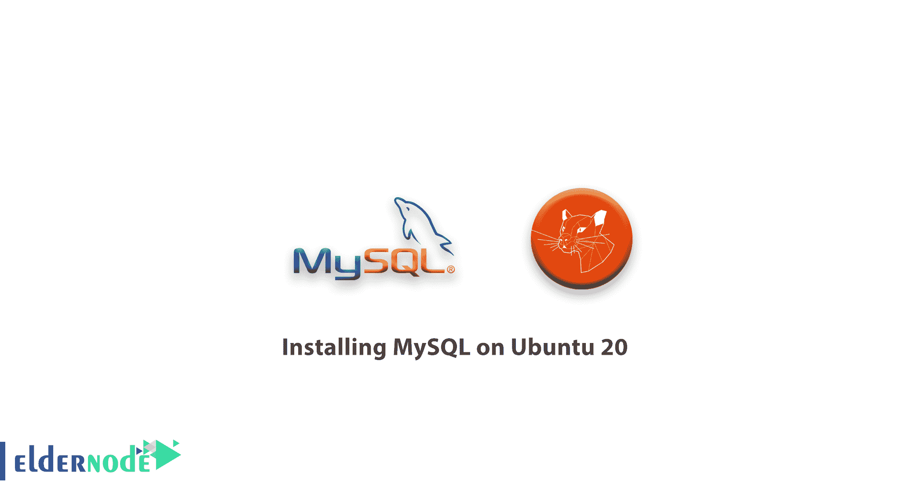

# 教程在 Ubuntu 20 上安装 MySQL-安装 MySQL 版本 8

> 原文：<https://blog.eldernode.com/installing-mysql-on-ubuntu-20/>



众所周知， [MySQL](https://www.mysql.com/) 是一个开源的数据库管理系统。在本文中，让我们了解更多关于在 Ubuntu 20.04 上安装 MySQL 的**教程。它是作为流行的 [LAMP](https://eldernode.com/how-to-install-lamp-on-ubuntu-20-04/) (Linux，Apache，MySQL，PHP/Python/Perl)栈的一部分安装的**

**先决条件**

如果您知道以下内容，本教程可能会更有用:

## 教程在 Ubuntu 20.04 上安装 MySQL

### 1- 安装 MySQL

当我们开始大部分安装时，首先更新你的服务器的包索引。

```
sudo apt update 
```

```
Install the mysql-server package:
```

```
sudo apt install mysql-server
```

[购买 Linux 虚拟私有服务器](https://eldernode.com/linux-vps/)

### 2- 配置 MySQL

使用 sudo 运行 MySQL 的安全脚本:

```
sudo mysql_secure_installation 
```

**然后**，你可能会面对一些提示。第一个是如果你想设置验证密码插件。为此，脚本会要求您选择一个密码验证级别，最弱的是 0 ，最强的是 2 :

输出

```
Securing the MySQL server deployment.    Connecting to MySQL using a blank password.    VALIDATE PASSWORD COMPONENT can be used to test passwords  and improve security. It checks the strength of password  and allows the users to set only those passwords which are  secure enough. Would you like to setup VALIDATE PASSWORD component?    Press y|Y for Yes, any other key for No: Y    There are three levels of password validation policy:    LOW    Length >= 8  MEDIUM Length >= 8, numeric, mixed case, and special characters  STRONG Length >= 8, numeric, mixed case, special characters and dictionary                  file    Please enter 0 = LOW, 1 = MEDIUM and 2 = STRONG:  2 
```

在下一个提示中，您应该输入并确认 MySQL **root** 用户的密码。

输出

```
Estimated strength of the password: 100   Do you wish to continue with the password provided?(Press y|Y for Yes, any other key for No) : Y
```

要接受所有后续问题的默认设置，您可以按下 Y ，然后输入。

### 3- 调整用户认证和权限

要使用密码作为 **root** 连接 MySQL，您需要将认证方法从默认的认证插件 auth_socket 切换到另一个插件，如 caching_sha2_password 或 mysql_native_password 。可以从 yo ur 终端打开 MySQL 提示符:

```
sudo mysql 
```

此外，要更改它使用的身份验证插件并设置新密码，运行一个 ALTER USER。你应该选择新的[和强密码](https://eldernode.com/how-to-create-strong-password/)

此命令将更改您在步骤 2 中设置的 root 密码:

```
mysql>  ALTER USER 'root'@'localhost' IDENTIFIED WITH caching_sha2_password BY 'password'; 
```

要告诉服务器重新加载授权表并使您的新更改生效，您可以运行 FLUSH PRIVILEGES

```
MySQL> FLUSH PRIVILEGES;
```

现在，您需要再次检查每个用户使用的身份验证方法，以确认 root 用户不再进行身份验证。为此，请使用 auth_socket 插件:

```
MySQL> SELECT user,authentication_string,plugin,host FROM mysql.user; 
```

`输出`

```
`+------------------+------------------------------------------------------------------------+-----------------------+-----------+  | user             | authentication_string                                                  | plugin                | host      |  +------------------+------------------------------------------------------------------------+-----------------------+-----------+  | debian-sys-maint | $A$005$lS|M#3K #XslZ.xXUq.crEqTjMvhgOIX7B/zki5DeLA3JB9nh0KwENtwQ4 | caching_sha2_password | localhost |  | mysql.infoschema | $A$005$THISISACOMBINATIONOFINVALIDSALTANDPASSWORDTHATMUSTNEVERBRBEUSED | caching_sha2_password | localhost |  | mysql.session    | $A$005$THISISACOMBINATIONOFINVALIDSALTANDPASSWORDTHATMUSTNEVERBRBEUSED | caching_sha2_password | localhost |  | mysql.sys        | $A$005$THISISACOMBINATIONOFINVALIDSALTANDPASSWORDTHATMUSTNEVERBRBEUSED | caching_sha2_password | localhost |  | root             | *3636DACC8616D997782ADD0839F92C1571D6D78F                              | caching_sha2_password | localhost |  +------------------+------------------------------------------------------------------------+-----------------------+-----------+  5 rows in set (0.00 sec)`
```

`在您的服务器上确认后，您将能够退出 MySQL shell:`

```
`MySQL> exit`
```

`创建一个新用户，并给它一个强密码:`

```
`CREATE USER 'noodi'@'localhost' IDENTIFIED BY 'password';` 
```

`现在，是时候授予您的新用户适当的权限了。运行以下命令添加、更改和删除用户权限。`

```
``MySQL> GRANT ALL PRIVILEGES ON *.* TO 'noodi'@'localhost' WITH GRANT OPTION;`` 
```

```要退出 MySQL shell:```

```
```MySQL> exit```
```

``到目前为止，您的服务器上已经安装了一个基本的 MySQL 设置。``

``亲爱的用户，我们希望这篇在 Ubuntu 20 上安装 MySQL 的教程能对你有所帮助，如果你有任何问题或想查看我们用户关于这篇文章的对话，请访问[提问页面](https://eldernode.com/ask)。也为了提高你的知识，有这么多有用的教程为[老年节点培训](https://eldernode.com/blog/)准备。``

``**不要错过**``

``[教程在 Ubuntu 20.04 Linux 上安装最新的 phpMyAdmin](https://eldernode.com/install-the-latest-phpmyadmin-on-ubuntu-20/)``

``[Tutorial Install the Latest phpMyAdmin on Ubuntu 20.04 Linux](https://eldernode.com/install-the-latest-phpmyadmin-on-ubuntu-20/)``