# 在微软 IIS 上安装-如何安装 IIS 8.5 和 WordPress

> 原文：<https://blog.eldernode.com/installing-on-microsoft-iis/>

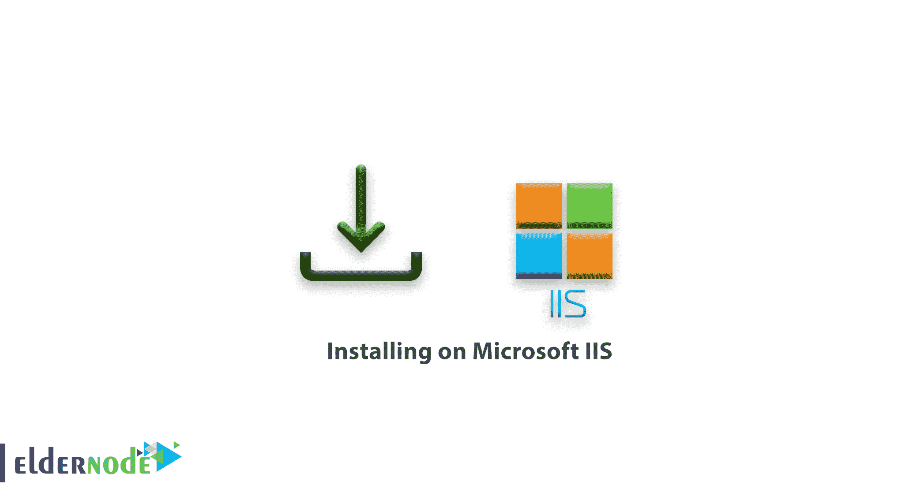

在 Microsoft IIS 上安装。如何使用微软 Web 平台安装程序 5.0 安装 IIS 8.5 和 WordPress 3.x？本文描述了如何使用微软网络平台安装程序(Web PI)5.0 版在 Windows 客户端和服务器上安装和配置 WordPress 3.x。

**注:** 截至2020 年 2 月 12 日。微软 WPI (5.1)没有在 Windows 10 上正确安装 PHP 支持，因此 WordPress 安装失败。

[**购买 SSD VPS 托管服务器**](https://eldernode.com/ssd-vps/)

## 什么是 Web PI？

Web PI 是一个免费的工具，可以让你获得微软网络平台的最新组件，包括互联网信息服务(IIS)、MySQL、PHP、微软。NET 框架和 Visual Web Developer—快速而简单。

Web PI 还允许你通过内置的 Windows [Web App Gallery](http://www.microsoft.com/web/gallery/) 安装 Web 应用程序，比如 WordPress。

## 先决条件

MicrosoftWeb Platform Installer(Web PI)5.0 支持的操作系统有:

Windows XP (SP2)、Windows Vista、Windows 7、Windows 8 和 8.1、Windows Server 2003 (SP1)和更高版本、Windows Server 2008 和 r 2、Windows Server 2012 和 r 2。

**对于本指南**，假设您的计算机上安装了 Windows Server 2012 R2 或 Windows 8.1 Pro 客户端。

你还需要一个互联网连接和管理员权限。

### 如何安装微软网络平台安装程序 5.0

在这一步中，您必须下载、安装并启动 MS Web 平台安装程序。为此，请遵循以下步骤:

**1。** 以拥有管理权限的用户身份登录您的 Windows 机器。

**2。** **启动浏览器之一的**。

**3。** 进入下面的链接，点击免费下载按钮:

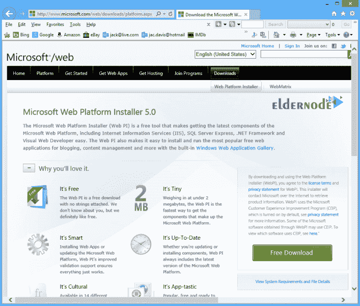

**4。** 点击运行。

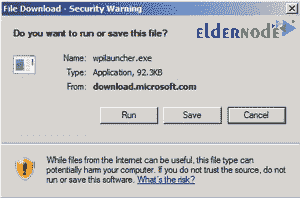

**5。的**点击再次运行。

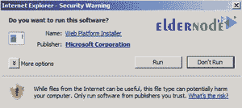

**6。T3 等待几秒钟 Web PI 5.0 到**开始**。**

### 如何选择要安装的产品和应用程序

在这一步，你选择你想要安装的 WordPress 的版本。

**注:** 本指南使用 WordPress 3.9.1。

**1。** 在 Web 平台安装程序开始屏幕上点击应用标签，然后点击添加按钮与文字按钮关联。

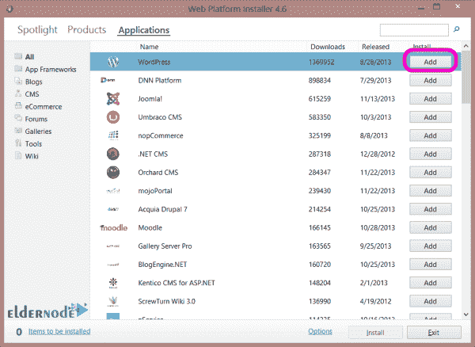

**2。T3 点击安装。**

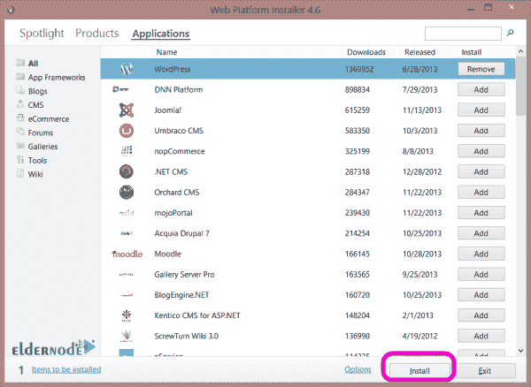

### 如何查看和配置所选产品和应用

在此步骤中，您将检查并配置您添加的内容。此外，添加数据库并为其配置密码。

**1。** 当问**你想使用哪种类型的数据库**时，选择 MySQL 。

**注意:** 这将安装 MySQL 5.1 for Windows 来处理 WordPress 需要的所有数据库事务。

**2。** 在密码字段中，输入您的数据库的密码，然后点击继续。

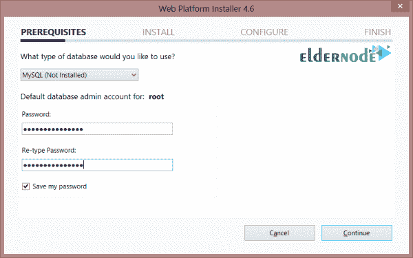

**3。** 查看要下载安装的文件，以及许可协议，然后点击我接受。

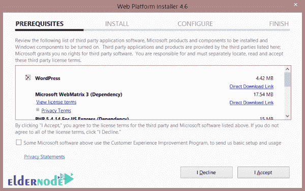

**4。**中的这一关允许的 Web PI 安装到**完成**。

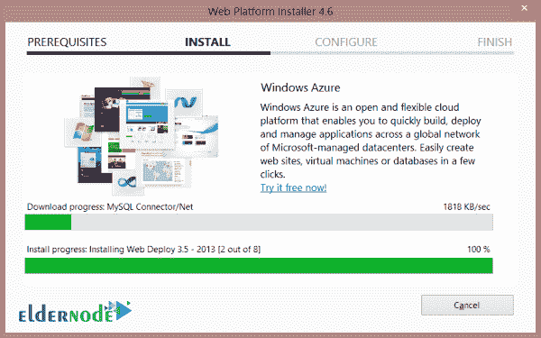

**5。** 配置安全密钥。

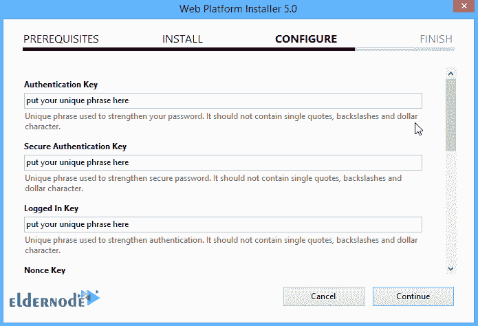

钥匙不需要记忆，应该只是归属，随机，复杂。

生成密钥的一个简单方法是使用[在线密钥生成器](https://api.wordpress.org/secret-key/1.1/salt/)。每次单击浏览器刷新，在线密钥生成器都会创建一组新的密钥。

**注:** 在线密钥生成器生成的密钥可能包含美元符号' $ '，不能与输入到 Web-PI 中的密钥一起使用。在这个 Web-PI 问题解决之前，一个简单的解决方案是检查美元符号字符，并简单地将' $ '替换为' S '。

考虑下面的例子:

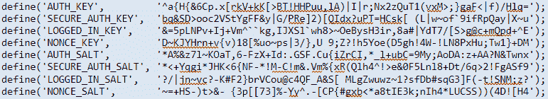

**6。** 完成。

在完成对话框上点击复制 到剪贴板链接，粘贴和保存这些信息在一个文件中备查，然后点击完成按钮。

**注意:** 这会把你的数据库设置和密码复制到剪贴板上。

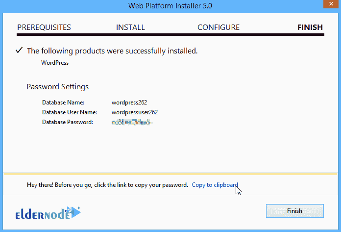

**7。** 微软网络矩阵将会打开，允许你**配置**与你的 WordPress 站点相关的附加设置:

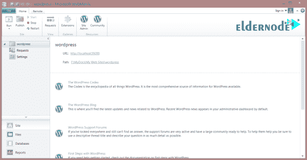

### 如何完成安装和配置

**1。** 切换到浏览器之一。

**2。** 去你的 WordPress 网站。

**比如**，去http://localhost/my WordPress。

**3。** 在站点标题框中，键入您站点的名称。

**4。** 在密码、**两次**框中，输入管理员账号的密码。

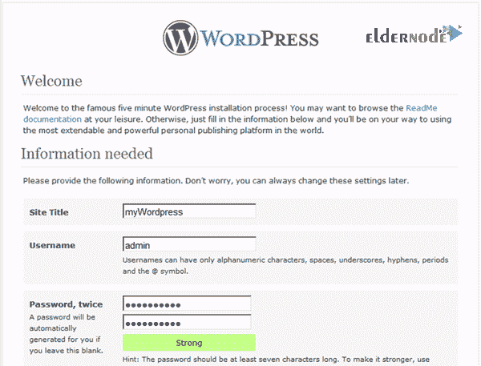

**5。** 在您的电子邮件框中，键入管理员帐户的电子邮件地址。

**6。**T3 点击安装 WordPress。

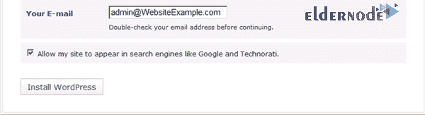

**7。T3 点击登录。**

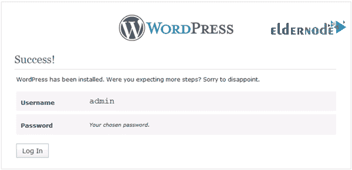

**8。**T3 输入你的用户名和密码然后点击登录。

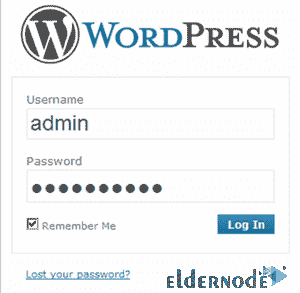

### 如何启用干净网址(永久链接)

现在 WordPress 已经安装好了，在这一步中，您可以启用 Pretty Permalinks 。

**1。在仪表盘菜单中，点击设置。**

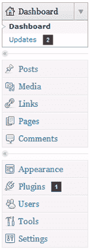

**2。向下滚动**，然后点击永久链接。

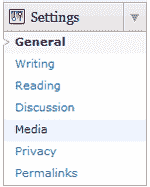

**3。** 在常用设置下，选择一个常用永久链接设置或者选择自定义结构创建自己的永久链接。

然后点击保存更改。

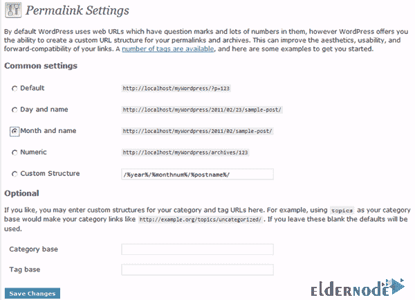

安装成功完成！

在 Microsoft IIS 上安装。

如何用 WordPress 运行 Microsoft WebMatrix】

### 微软 Web PI 安装 WordPress 结合微软 WebMatrix 在本地主机配置中运行。

当 WebMatrix 没有运行时，您将无法访问您的 localhost WordPress 站点，直到 WebMatrix 重新启动。

使用以下步骤启动 WebMatrix 并启动您的本地主机 WordPress 站点:

**1。** 点击开始 > > 所有程序 > > 打开微软 WebMatrix 文件夹 > > 点击启动微软 WebMatrix 。

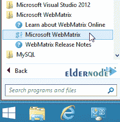

**2。** 在 **WebMatrix** 开始页面，点击 **我的站点** 按钮显示已安装的站点，然后点击弹出的上下文菜单中显示的 wordpress 站点。

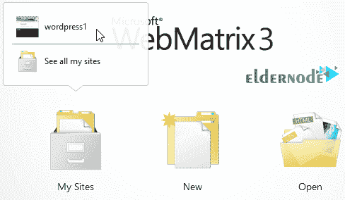

**3。** 网站打开后，点击网站左下方的标签，显示 WordPress 启动 URL 和文件路径的链接。

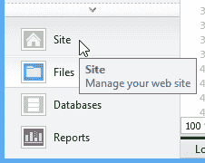

**4。** 点击站点 URL 链接来启动你的本地主机站点。

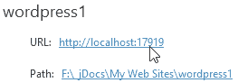

**5。** 最后， WebMatrix 会打开一个浏览器窗口到你的 localhost WordPress 站点，你可以定制和添加内容。

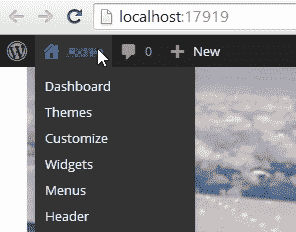

**注意:** 当你与本地主机 WordPress 站点交互时，WebMatrix 必须保持运行。

**尊敬的用户**，我们希望您能喜欢这个[教程](https://eldernode.com/category/tutorial/)，您可以在评论区提出关于本次培训的问题，或者解决[老年人节点培训](https://eldernode.com/blog/)领域的其他问题，请参考[提问页面](https://eldernode.com/ask)部分，并尽快提出您的问题。腾出时间给其他用户和专家来回答你的问题。

在 Microsoft IIS 上安装。

好运。

Goodluck.