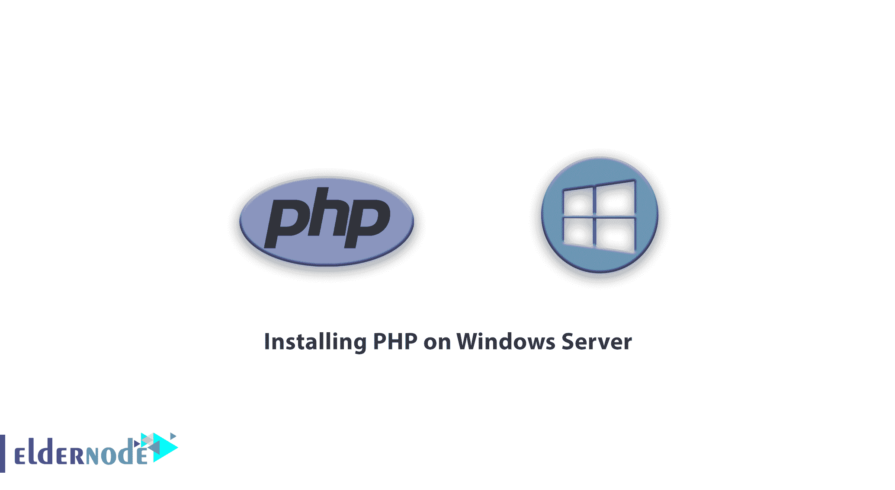
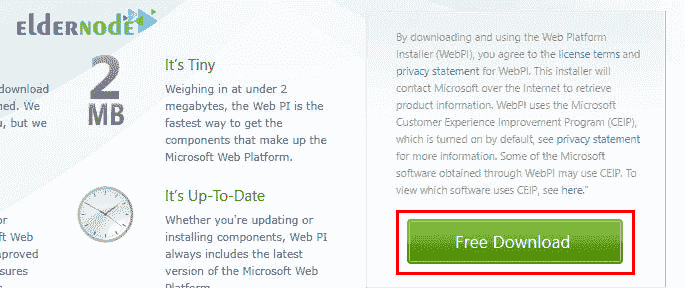
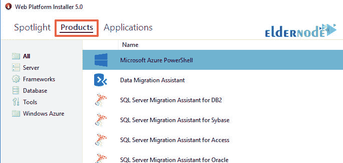
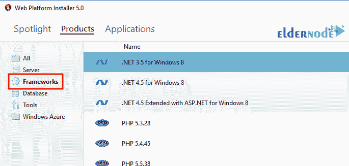
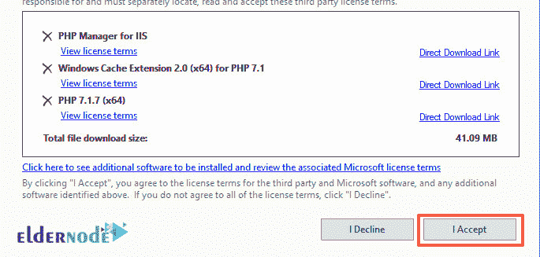
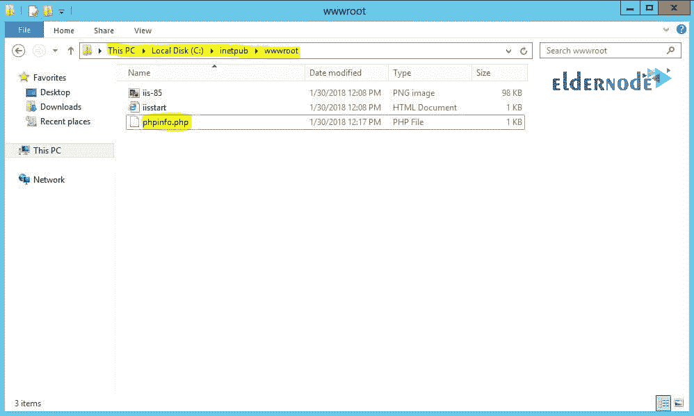
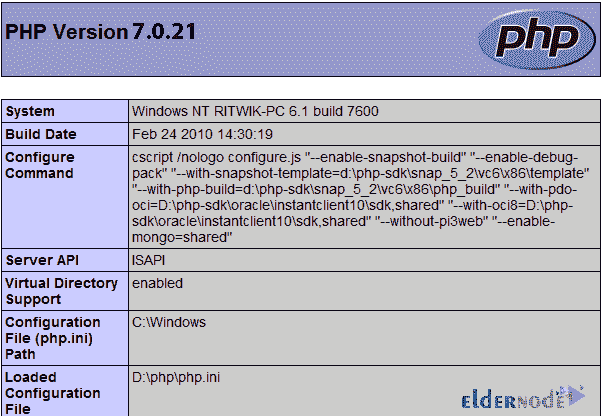

# 在 Windows Server - Eldernode 上安装 PHP

> 原文：<https://blog.eldernode.com/installing-php-on-windows-server/>



PHP 是网络上最常见的服务器端编程语言。PHP 通常被大多数虚拟主机提供商预装在服务器上。简单的学习路径、与 MySQL 数据库的密切关系以及大量的库将节省您成为开发人员的时间。PHP 可能不太好，但对于您的第二个学习应用程序来说，它肯定是一个不错的选择。你可以从 [Eldernode](https://eldernode.com/) 选择你最完美的 [Windows VPS](https://eldernode.com/windows-vps/) 服务器包来安装 windows server。

本文解释了如何在 Windows Server 上安装和测试 PHP。在 Windows 服务器上安装 PHP 允许您安全地创建和测试 web 应用程序，而不用担心影响您网站上的数据或系统。本教程使用 Microsoft Web Platform Installer(WebPI)进行安装，不包括从源代码安装 PHP。和我们在一起。

## **教程在 Windows 服务器上安装 PHP**

### **PHP 简介**

PHP 是一种 web 脚本语言，由于其高速、强大和安全，在开发人员中很受欢迎。互联网上大约 60%的网站都是用 PHP 制作的。PHP 如此强大，以至于像脸书、雅虎、维基百科、苹果这样的流行网站，以及像 Joomla、WordPress 和 Drupal 这样的流行而强大的内容管理系统，或者像 Vbulletin 这样的论坛都是由 PHP 创建和开发的。

PHP 代表 PHP 超文本预处理器。需要注意的是，PHP 是一种开源语言，是一种服务器端脚本语言。PHP 总是免费的。

PHP 的结构与 C 编程语言非常相似，并且非常容易学习。用 PHP 你可以很容易地静态页面，打开服务器上的文件，读取，修改或删除，连接到各种数据库和保存，检索和编辑数据，你还可以发送和接收 cookies。PHP 目前有 3 个版本，5.6、7.0、7.1，5.3、5.4、5.5 版本已经过期，不再支持。

PHP 是一种免费的开源语言，运行在服务器端，以 HTML 的形式返回结果。当然 PHP 需要运行在 Linux 服务器上，而要运行在 [Windows](https://blog.eldernode.com/tag/windows/) 等操作系统上，就必须在 Windows 中创建一个虚拟的 Linux 服务器。在 PHP 安装培训主题的延续中，我们将解释工作方法，加入我们与 PHP 语言安装培训主题的延续。在这篇文章中，我们将教你如何在 Windows 服务器上安装 PHP 7。请注意，这需要完整的 iis 安装，您应该启用它。

## **如何在 Windows 服务器上安装 PHP**

PHP 是使用最广泛的服务器端编程语言之一。很多流行的 CMS 和框架如 WordPress，Magento 和 Laravel 都是用 PHP 构建的。在这一节中，我们将解释如何使用 Windows Installer 在 Windows 服务器上安装 PHP。要开始安装，您必须首先访问 Microsoft web platform 的官方网站并下载该程序:



下载后，运行程序并转到产品部分:



然后在左边的窗口中，您必须转到**框架**部分。

你必须找到你想要的 PHP 版本(你必须确保选择的版本与 Windows 架构相同。)

然后点击**添加**，最后点击**安装**。



***注:*** 以上为 x64 为 64 位 windows，x86 为 32 位 windows。

接下来，在新窗口中，选择**我接受**选项。



在这个阶段，你必须等待安装完成，最后选择**完成**选项。

您现在已经成功安装了它。

### **如何在 windows 服务器上测试 PHP 安装**

接下来，我们必须测试程序一次:

你必须先去**驱动器 C** 。然后进入 **inetpub** 目录，再进入 **wwwroot** 。

这里您需要创建一个名为**phpinfo.php**的文件，并将以下代码放入其中:

```
<?php  phpinfo();  ?>
```



接下来，您需要打开浏览器并转到以下地址:

```
http://localhost/phpinfo.php
```

转到这个地址，您应该会看到一个类似于下面的页面。这意味着 PHP 已经安装并且运行良好。



## 常见问题解答

**1。如何用 Apache 安装 PHP 7.4？**

如果使用 apache 作为 web 服务器，请将以下命令添加到 Apache 的 httpd.conf 文件中，以安装 PHP 和 Apache PHP 模块:

```
LoadModule php_module "C:\PHP\php8apache2_4.dll"   AddHandler application/x-httpd-php .php
```

保存文件并启动 Apache。然后在 apache 的 htdocs 中创建一个 pinfo.php 文件，创建完成后，转到以下 URL:

```
http://127.0.0.1/pinfo.php
```

**2。如何用 Nginx 安装 PHP 7.4？**

运行以下命令来安装 PHP 和 PHP FPM 包:

```
sudo apt update  sudo apt install php-fpm
```

安装完成后，FPM 服务将自动启动。要检查服务的状态，请运行以下命令:

```
systemctl status php7.4-fpm
```

`php7.4-fpm.service - The PHP 7.4 FastCGI Process Manager
Loaded: loaded (/lib/systemd/system/php7.4-fpm.service; enabled; vendor preset: enabled)
Active: active (running) since Tue 2020-06-09 19:07:05 UTC; 37s ago`
您现在可以编辑 Nginx 服务器块并添加以下代码行，以便 Nginx 可以处理 PHP 文件:

```
server {        # . . . other code        location ~ \.php$ {          include snippets/fastcgi-php.conf;          fastcgi_pass unix:q;      }  }
```

不要忘记重新启动 Nginx 服务来启动和运行新的配置:

```
sudo systemctl restart nginx
```

**3。电脑上要装什么程序才能开始 PHP 编程？**

你应该在电脑上安装三样东西:

***Web 服务器:*** PHP 可以运行在大多数虚拟 Web 服务器上，包括微软 IIS。但是最好使用免费的阿帕奇网络服务器，你可以从[阿帕奇网站](https://httpd.apache.org/download.cgi)下载。

***数据库:*** PHP 可以和大部分数据库通信，包括 Oracle 和 Sybase。但是 MySQL 比较常用，可以从 [MySQL 网站](https://www.mysql.com/downloads/)下载。

***PHP 解析器:*** 为了让 PHP 代码得到处理并最终作为 HTML 输出发送到浏览器，你应该安装 PHP 解析器语言必须安装。

**4。什么是 PHP 应用？**

您可以将 PHP 用于 3 个一般目的:

–网站和网络应用程序(服务器端脚本)

–桌面应用程序(GUI)

–命令行编程

## 结论

在本文中，首先，我们解释了 PHP 简介。然后我们教你如何在 Windows Server 上安装 PHP。在下文中，我们解释了如何测试该程序的正确安装。另外，在上一节中，我们问了关于在不同版本中安装 PHP 的常见问题。