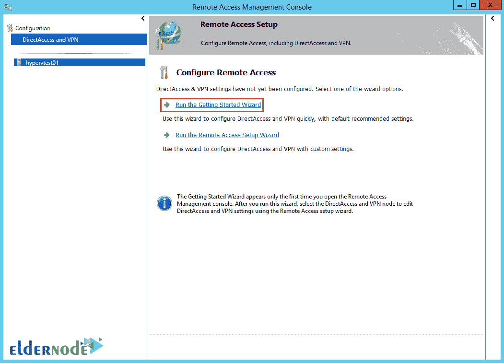

# 如何在 Windows Server 2012 - Eldernode 上安装 VPN

> 原文：<https://blog.eldernode.com/installing-vpn-on-windows-server-2012/>

我们决定通过 Windows Server 培训系列来教你如何在 Windows Server 2012 上安装 [VPN](https://en.wikipedia.org/wiki/Virtual_private_network) 。在我们开始在 Windows Server 上配置 VPN 之前，我们先来看看 VPN 及其性能。如果你愿意，你可以选择你的完美的 [Windows 虚拟专用服务器](https://eldernode.com/windows-vps/)包并在上面安装 Windows Server 2012，然后继续按照说明操作。

VPN 或虚拟专用网络是一组连接到公共网络(如互联网)的计算机。在商业场所，VPN 用于与远程数据中心通信。人们可以使用 VPN 来访问实际上不在 Lan 上的网络资源(例如，您在另一个国家，在 VPN 的帮助下连接到您的组织，您可以控制所有的服务器)。此外，VPN 可以加密通信。

## 如何在 Windows Server 2012 上安装 VPN

当您连接到 VPN 时，您实际上正在使用 VPN 客户端，并且您正在使用密码连接到互联网上的 VPN 服务器。因此，您与连接到该服务器的其他人在一个网络上，并且您可以根据您组织的策略来使用资源。

最重要的是你的通信是用 VPN 加密的。

在 Windows Server 2012 上安装 VPN 很容易，请执行以下步骤。这个配置是服务器端的。这意味着在另一个地方配置了一个 VPN 服务器，您作为客户端连接到它。

### 1。如何安装与远程访问相关的角色

打开 [**服务器管理器**](https://docs.microsoft.com/en-us/windows-server/administration/server-manager/server-manager) ，点击**管理**。然后选择**添加角色和功能**。

点击**下一个**进入**角色**页签:

***

***

然后选择**远程访问**，点击**下一步**:

您不需要从**功能**选项卡中选择任何内容。点击**下一个**:

再次点击**下一个**:

选择**直接访问和 VPN** (RAS):

将出现一个对话框，介绍系统中不存在的功能。点击**添加功能**:

安装**远程访问** **角色。**需要几分钟:

***

### 2。安装和配置 VPN 教程

回到服务器管理控制台，点击**远程访问**。选择您的服务器并右键单击它。然后点击**远程访问管理**:

选择**运行入门向导**，如下图所示:

选择**仅部署 VPN**，这里程序将开始安装:

现在选择您的服务器并右键单击它。

选择**配置并启用路由和远程访问**:

将出现新的安装指南:

选择**自定义配置**，点击**下一步**:

只需选择 **VPN 访问**选项:

**最后**，完成流程，打开程序:

***

***注意:*** 路由器和防火墙必须正确配置才能支持 VPN 性能。

### 3。如何启用远程控制的用户访问

您可以允许用户通过 **Active Directory** 设置进行远程访问。

## 结论

由于用户的高需求，如何在 Windows Server 2012 中安装 VPN 是本文中最重要和最实用的案例之一。本教程还解释了如何安装与远程访问相关的角色以及如何为远程控制启用用户访问的完整步骤。