# 介绍 aaPanel 托管控制面板- Eldernode 博客

> 原文：<https://blog.eldernode.com/introducing-aapanel-hosting-control-panel/>

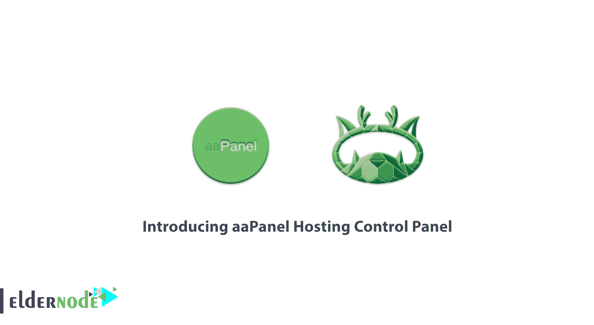

专业管理员使用管理工具来提高系统的效率。这种方法甚至对新用户也很有用。aaPanel 弥补了管理知识的不足，因为 BaoTa 的创始研发团队向普通用户和不太懂技术的人提供软件。aaPanel 是一个免费的主机控制面板，有很多你需要的功能。因此，通过这篇文章来加入我们，了解一下**引入 aaPanel 托管控制面板**。安装和使用这个工具一点都不难，只需要选择你的 [VPS 托管](https://eldernode.com/vps-hosting/)计划，继续阅读，就可以完成管理自己主机所需的步骤。

## **关于 aaPanel 托管控制面板的一切**

aaPanel 是一个开源和免费托管的控制面板。写这篇文章的时候，最新的官方版本是 6.8.6。最近，你已经了解了 [Cpanel](https://blog.eldernode.com/tag/cpanel/) 和 [Directadmin](https://blog.eldernode.com/tag/directadmin/) 。在接下来的内容中，你将会了解到许多与 aaPanle 相似的特性，甚至更多。如果你正在准备你的 [Linux VPS](https://eldernode.com/linux-vps/) ，阅读这个指南应该是你的首要任务。这个强大的控制面板将通过一个基于网络的接口来管理网络服务器。不仅仅是一个声明，你真的可以在所有的 Linux 发行版上一键安装它，比如 Debian、Ubuntu、Fedora、Deepin 和 CentOS(建议使用 CentOS ),并节省你的时间来更好地推进你的项目，让你自己成为它的粉丝之一。

### 面板功能

当你能够用可视化文件管理器、可视化软件管理器、可视化 CPU、内存、流程监控图、任务调度和 Docker 管理**网站**、**数据库**、 **FTP** 时，那将会是令人惊奇的。你可以用一个简单的向导安装任何脚本和 CMS，也不需要 SSH，你可以使用终端环境。aaPanle 使用 API 来控制开发人员，并提供可部署的 web 环境，支持以下环境:

【基尼】& Apache

**注意**:请考虑你必须提供一个干净的服务器，不要安装 Apache、Nginx 之类的服务器环境。

**2-** MySQL，MariaDB & MongoDB

**3-** PHP

**4-** 重定向&模棱两可

**5-** Openlitspeed

**6-** 文件管理器

**7-** Cronjob

**8-**CSF–防火墙、iptables

建议您使用一个完美的 VPS 来帮助您快速安装它们，否则，可能会有点费时。如果你正在寻找**免费的 Litespeed** ，aaPanle 对你来说是一个管理主机的好主意，因为它为 Open Litespeed 创建了一个漂亮而高效的面板。所以，**没有**必要成为开放式 Litespeed 配置的专家。aaPanel 要求你忘记你的命令行，只需点击一下鼠标就可以开始使用你所需要的一切来部署和管理你的主机。让我们来看看它的**环境**如何，并更熟悉使用它时你会看到什么。

登录时，系统会提示您选择**灯**或 **LNMP** 。再解释一下，LAMP 包括 Apache、MySQL、PHP、Pure-Ftpd 和 phpMyAdmin。此外，LNMP 将安装 Nginx、MySQL、PHP、Pure-Ftpd 和 PHPMyAdmin。

**首页:**

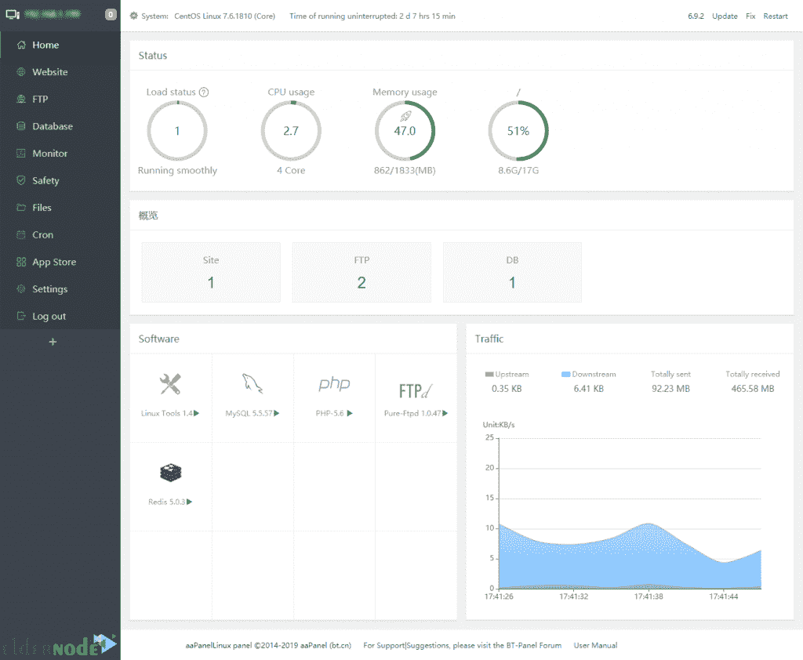

**网站经理:**

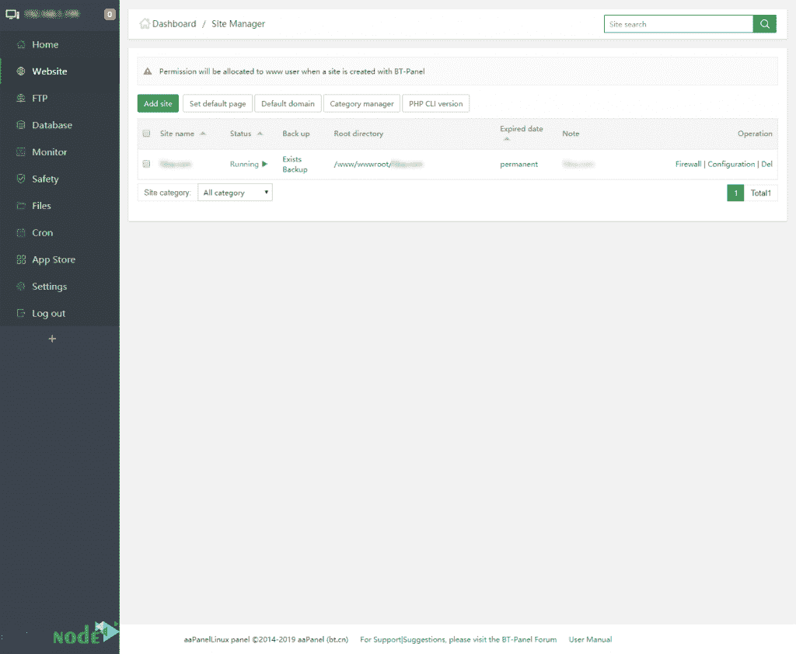

**FTP 管理器:**

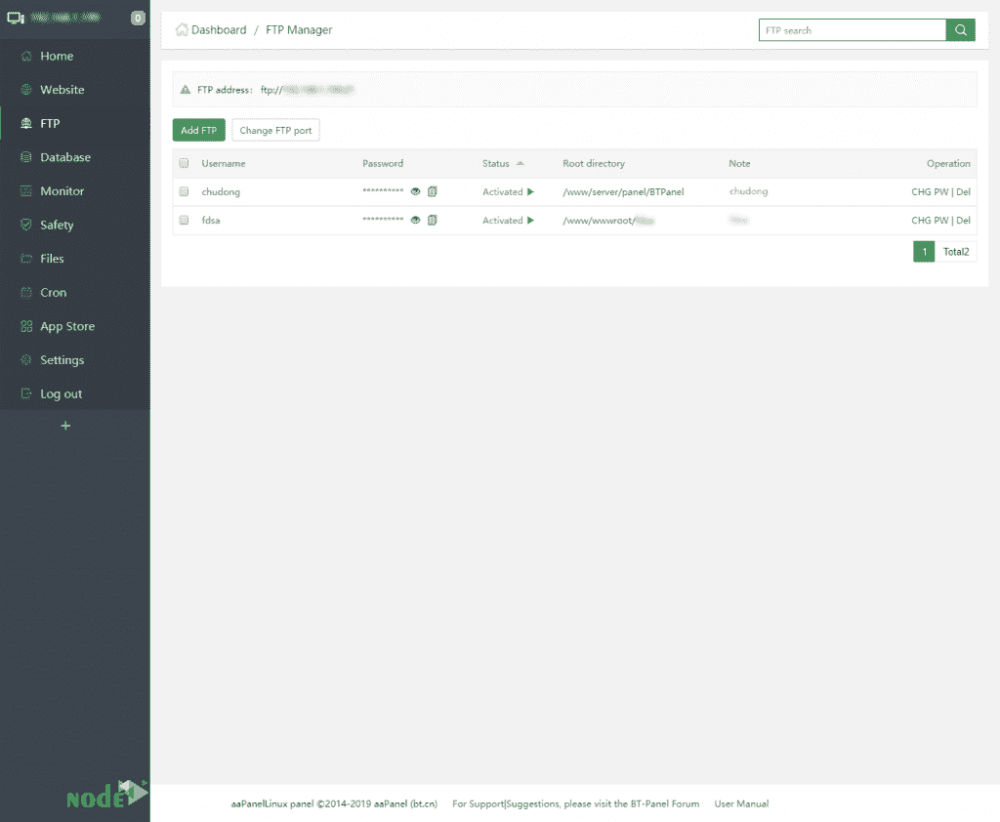

**数据库管理器:**

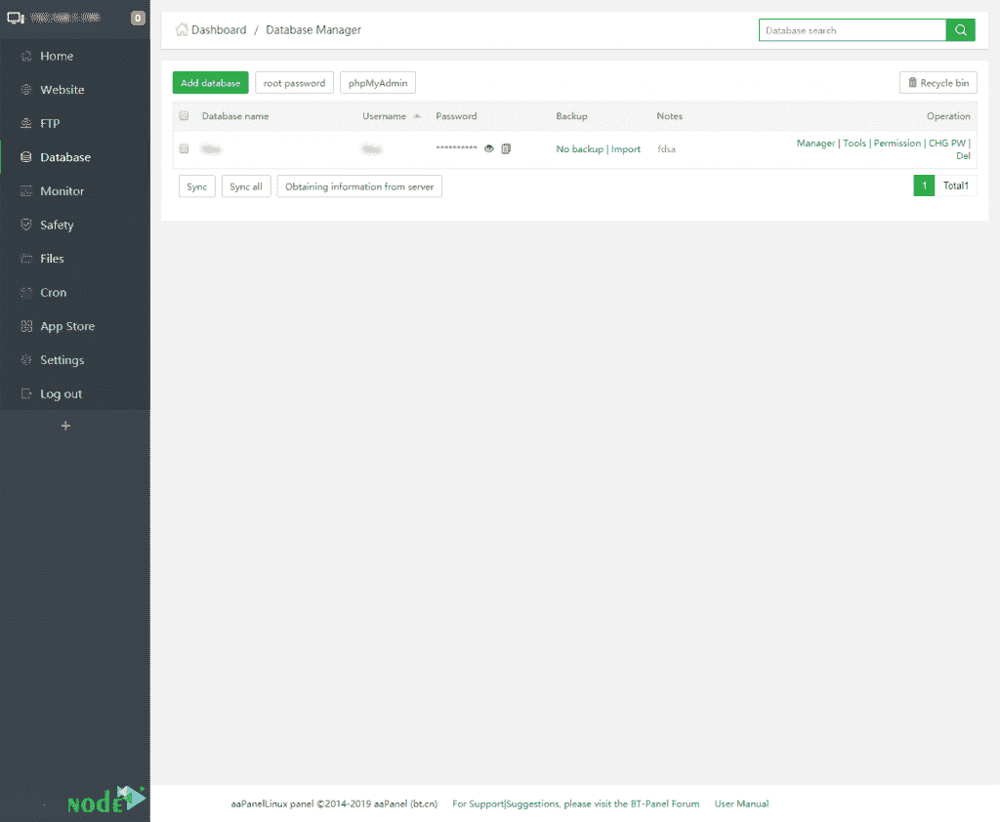

**文件管理器:**

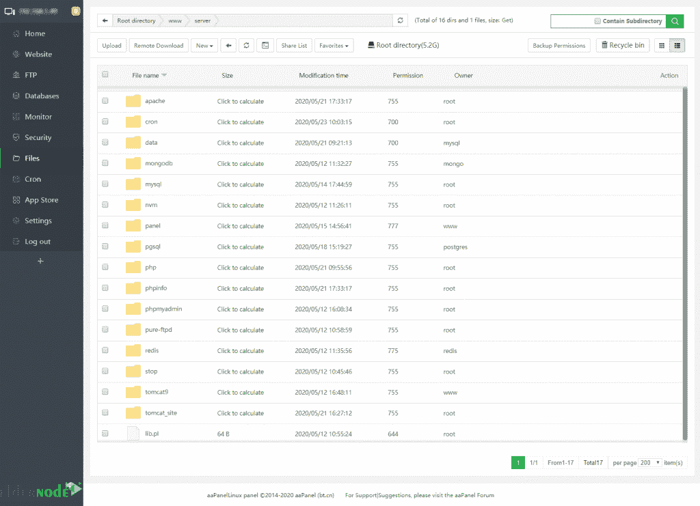

**Cron 管理器:**

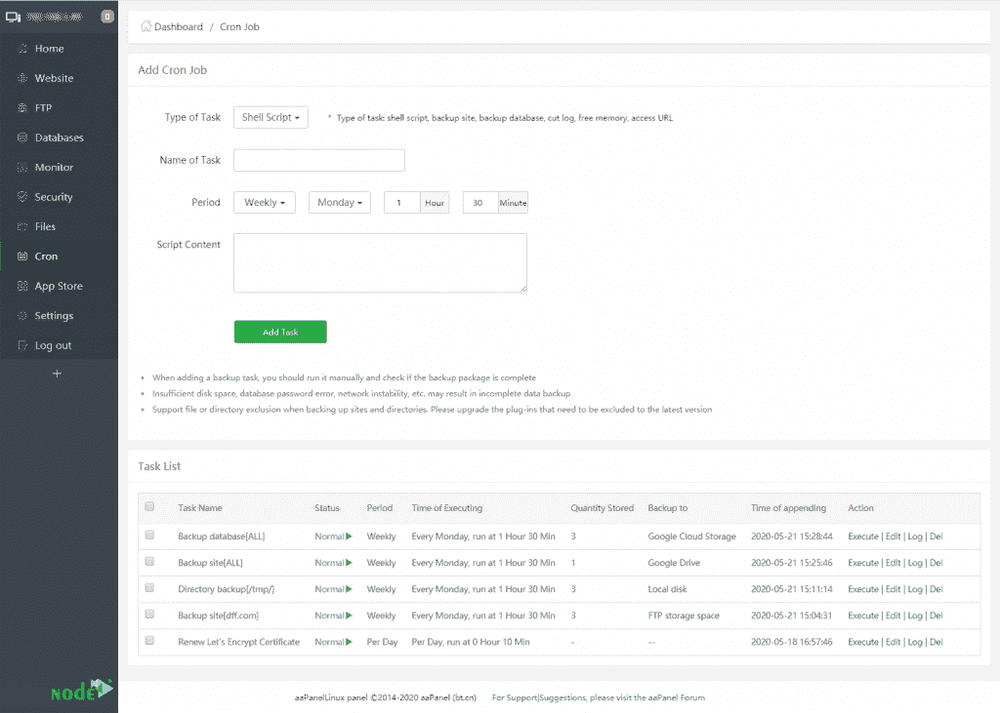

**监控:**

监控能力始终是重要且必需的。您可以监控服务器资源占用情况，以帮助您实时观察其负载能力。

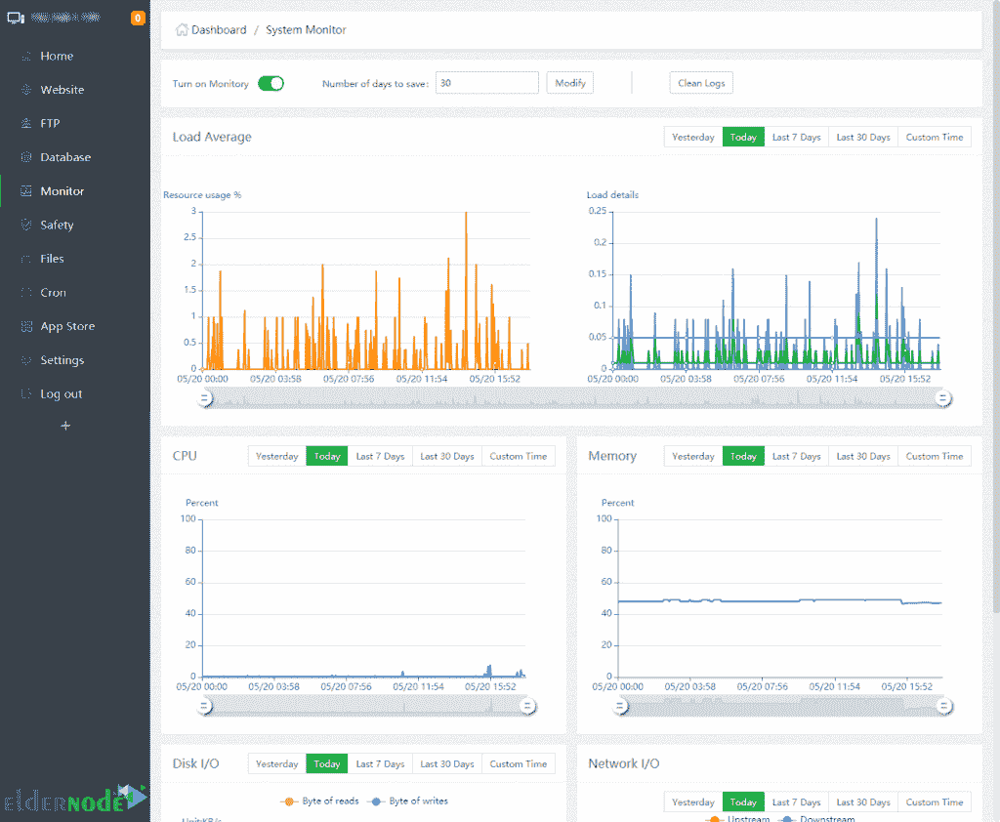

**安全性:**

安全扩展在苹果是免费的。你可以用它来拥有一个免费的反垃圾邮件网关，Nginx WAF，SSH 登录提醒，系统防火墙安全。

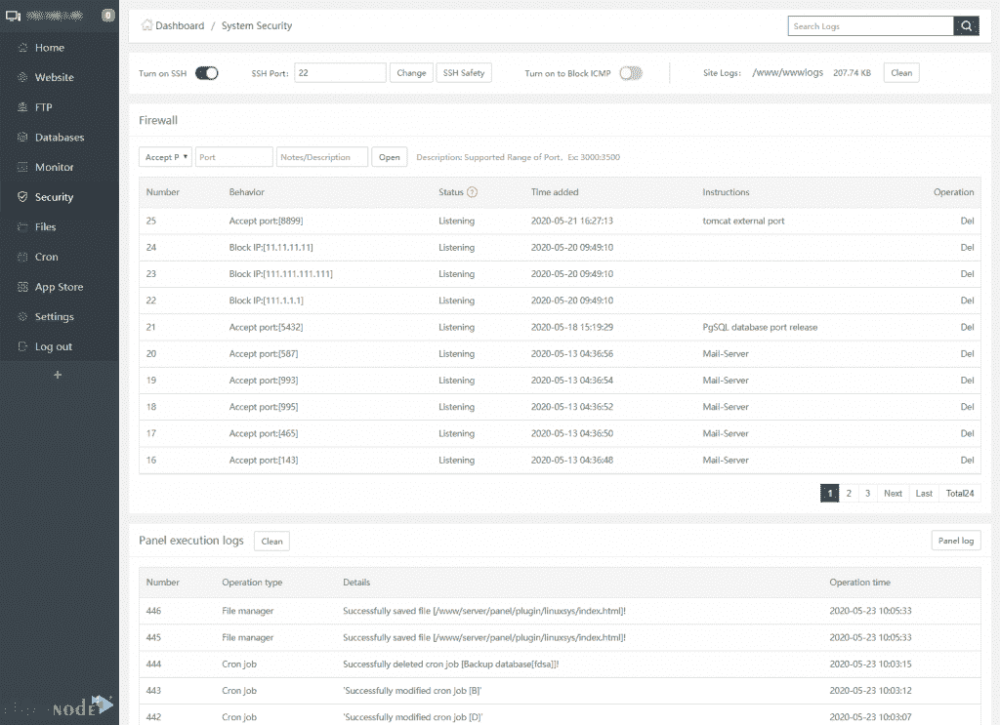

**软件:**

您将只安装您需要的扩展，以防止您的服务器臃肿。由于模块化开发，aaPanle 可以为您提供这种情况。您不需要使用命令行来安装主要的应用程序，如邮件服务器、Java、Google Drive、Python 等，因此，只需点击一下。

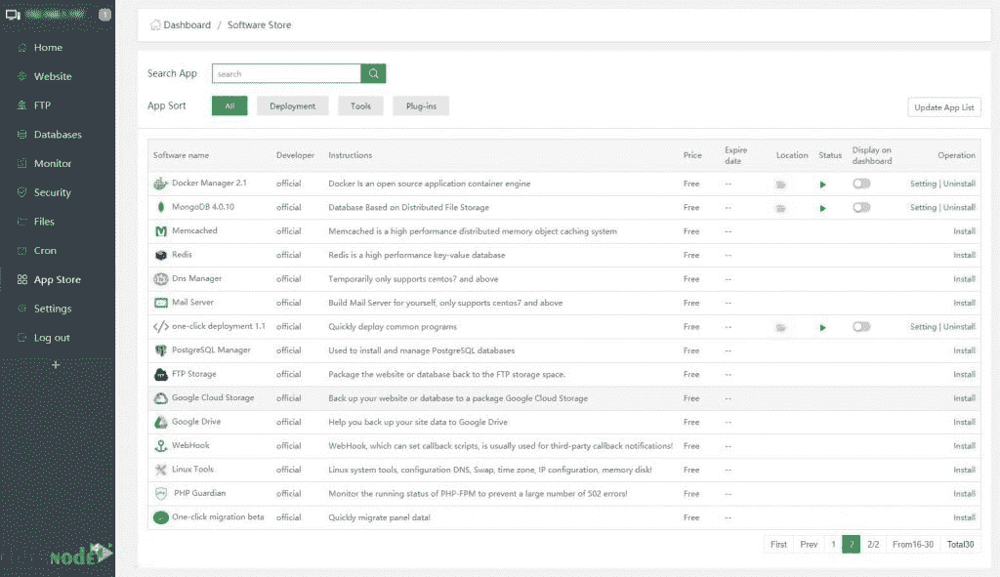

**设置:**

工具中非常有用和实用的部分。此部分允许您启用 SSL 支持、通过 Google 身份验证的双因素身份验证、监听 IPv6、API、更改控制面板用户名和密码。

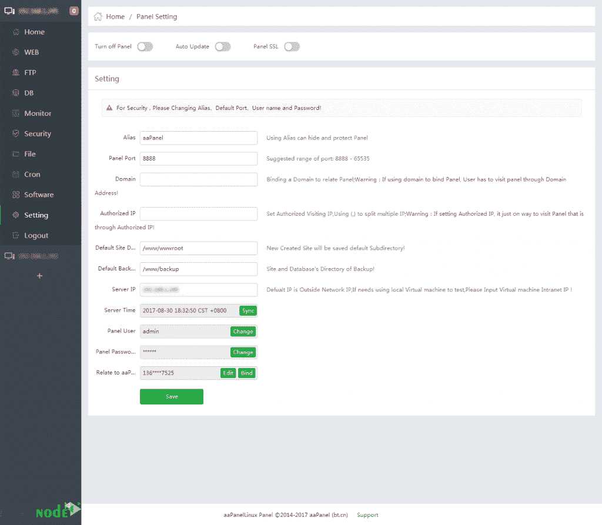

就是这样！开始管理您的服务器，享受这个免费且受欢迎的[托管](https://blog.eldernode.com/what-is-hosting-a-website-mean/)控制面板。手表要有 512M 以上的内存和 100M 以上的空闲硬盘空间。

**结论**

在本文中，您了解了控制面板中的面板介绍。你可以在 CentOS、Debian 和 Ubuntu 上使用这个简单的主机控制面板。如果需要使用一键式应用，使用 DNS manager CentOS 是更好的选择。然而，只要你决定安装一个面板，你只需要 2 分钟(除了安装灯)。

[yasr _ visitor _ votes size = " medium "]

The very useful and practical part of tools. This section allows you to enable SSL support, two-factor authentication via Google authentication, Listen IPv6, API, changing of control panel username and password.

That’s that! Start managing your server and enjoy this free and popular [hosting](https://blog.eldernode.com/what-is-hosting-a-website-mean/) control panel. Watch to have more than 512M memory and more than 100M free hard disk space.

**Conclusion**

In this article, you learned about Introducing aaPanel ing Control Panel. You can use this simple hosting control panel on CentOS, Debian, and Ubuntu. If you need to use one-click applications, CentOS is a better choice to use DNS manager. However, you will need just 2 minutes (Except installing LAMP) anytime you decide to install aaPanel.

[yasr_visitor_votes size=”medium”]