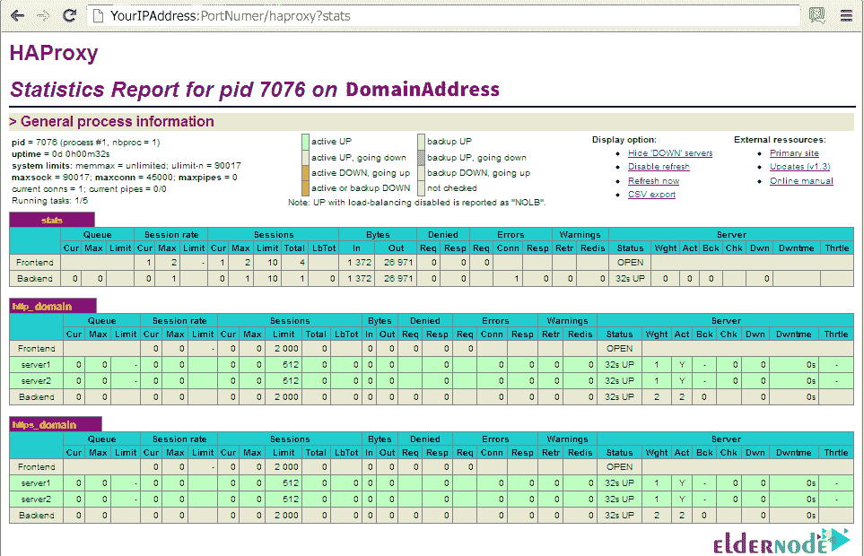

# 介绍和配置 HAProxy Stats - Eldernode 博客

> 原文：<https://blog.eldernode.com/introducing-and-configure-haproxy-stats/>


HAProxy 是一个软件，通过它你将能够创建一个强大的负载平衡器。HAProxy 代表高可用性代理。该软件是负载平衡领域中最强大、最好、最专业的软件之一。有了这个系统，你就可以在不同的服务器之间分配你的访问者。这将增加您的正常运行时间。此外，并非所有的压力都集中在一台服务器上，而是分散在几台服务器上。这篇文章是关于**介绍和配置 HAProxy Stats** 。注意，如果你想买一个 [VPS 服务器](https://eldernode.com/vps/)，你可以在 [Eldernode](https://eldernode.com/) 看到可用的包。

## **介绍 HAProxy 统计【完整】**

HAproxy 是最流行的负载平衡软件之一。需要注意的是，HAproxy 被用于很多高负载环境，比如 GitHub、Imgur、Instagram、Twitter。在下一节中，我们将尝试为您提供一个 HAProxy 统计的定义。在熟悉了 HAProxy Stats 的定义之后，下一步，我们将提到 HAProxy Stats 的一些特性。然后我们将一步一步地解释如何在 Ubuntu/CentOS 上安装 HAProxy，在最后一部分我们将教你如何配置 HAProxy Stats。请陪我们继续这篇文章。

### **什么是 HAProxy Stats？**

HAProxy 是开源软件，通常用作 web 服务的负载平衡器和代理。这个工具甚至可以用来平衡 TCP 流量。负载平衡是对多个资源(如网络、处理器、磁盘等)之间负载分布的改进。).这项工作的目的是什么？提高资源利用率，增加吞吐量，减少响应时间，并防止资源过载。

HAProxy 服务器不是在物理上，而是在逻辑上位于 web 服务器的前面，用户请求首先被发送到这个服务器。然后，该服务器根据为其定义的算法调整 web 服务器的负载。

### **HAProxy Stats 特性**

HAProxy 会给你很棒的功能。例如，使用该软件，如果您的一台服务器崩溃并停机，您可以将用户重定向到第二台/第三台服务器。这将减少您的停机时间，并防止对服务器的压力。有了 HAProxy，你还可以根据每台服务器的能力来分配访客。

为了说明为什么它的性能如此之好，HAProxy 列出了许多架构特性，包括事件驱动、零拷贝转发、O (1)事件检查器等等。

## **如何在 Ubuntu/CentOS 上安装 ha proxy**

在这一节中，我们将一步步教你如何在 [Ubuntu](https://blog.eldernode.com/tag/ubuntu/) /CentOS 上安装 HAProxy。基于此，第一步，我们将教你如何在 Ubuntu 上安装 HAProxy，然后在 [CentOS](https://blog.eldernode.com/tag/centos/) 上安装。请加入我们。

**在 Ubuntu 上安装 ha proxy**

在这一节的开始，我们将教你如何**在 Ubuntu** 上安装 HAProxy。第一步，您可以输入以下命令来了解通过官方渠道提供的版本号:

```
sudo apt show haproxy
```

然后，要从外部存储库安装 HAProxy，必须使用以下命令添加新的存储库。键入以下命令后，按**回车**确认添加新的 PPA:

```
sudo add-apt-repository ppa:vbernat/haproxy-1.7
```

下一步是使用以下命令更新您的资源列表:

```
sudo apt update
```

最后，您可以通过运行以下命令在 Ubuntu 系统上安装 HAProxy :

```
sudo apt install -y haproxy
```

**在 CentOS 8 上安装 ha proxy**

下面介绍如何**在 CentOS 8** 上安装 HAProxy。首先，您需要运行以下命令来找到 HAProxy 的最新版本:

```
sudo yum info haproxy
```

然后你需要检查你是否具备下载和编辑程序的先决条件。为此，请使用以下命令:

```
sudo yum install gcc pcre-devel tar make -y
```

在下一步中，您必须使用以下命令**下载**源代码:

```
wget http://www.haproxy.org/download/2.0/src/haproxy-2.0.7.tar.gz -O ~/haproxy.tar.gz
```

***注:*** 最新版本的 HAProxy 参见 [HAProxy 下载页面](http://www.haproxy.org/#down)。

现在，您需要通过执行以下命令来**提取**文件:

```
tar xzvf ~/haproxy.tar.gz -C ~/
```

成功提取文件后，现在必须通过以下命令输入提取的源代码列表:

```
cd ~/haproxy-2.0.7
```

注意，你必须**为你的系统编译**这个程序。为此，您必须使用以下命令:

```
make TARGET=linux-glibc
```

最后，您可以使用以下命令**安装 HAProxy** :

```
sudo make install
```

### **如何配置 HAProxy Stats**

在您成功完成上一步中的 HAProxy 安装步骤后，现在是时候配置它了。您可以在 web 浏览器中查看 HAProxy 统计数据。HAProxy Stats 提供了大量关于数据传输、总连通性、服务器状态等信息。您可以通过使用以下步骤对 HAProxy 设置进行一些更改来轻松配置它。

第一步，你需要**启用 HAProxy Stats** 。请注意，您可以在 HAProxy 中启用统计。为此，您需要编辑您的 HAProxy 配置文件。因此，您必须在默认部分之后添加以下命令:


在下一步中，您可以使用以下 URL 轻松地**访问 HAProxy** 统计数据。为此，在上面的配置中，使用服务器的 **IP 地址**，后跟统计 URI。正如您在以下命令中看到的那样，您可以使用配置文件中带有统计信息的已配置登录信息:

```
URL: http://YourIPAddress:PortNumber/haproxy?stats
```

```
Login user: admin
```

```
Login password: password
```

然后，您可以看到如下所示的统计数据:



注意，如果您想**更改 HAProxy stats 的** **登录细节**，您可以编辑您的配置文件。按照下面的命令更新“ **stats auth** 的值。然后你需要**保存**配置文件并退出。您需要**重启**系统以应用您所做的更改。

```
stats auth username:password
```

最后，您可以编辑配置文件来更改 HAProxy 统计数据的 URL，并使用以下命令更新它:

```
stats uri /ha-stats
```

或者

```
stats uri /stats
```

您需要再次**保存**文件，然后**重启**系统以应用更改。

现在，正确完成上述步骤后，您可以使用以下地址访问 URL:

```
http://YourDomainAddress:PortNumber/ha-stats
```

或者

```
http://YourDomainAddress:PortNumber/stats
```

## 结论

HAProxy 是负载均衡领域免费且非常强大的服务之一。此服务用于提高 web 服务器的性能和可用性。该服务也可以在 Linux、Solaris 和 FreeBSD 平台上启动。这种免费且非常小的服务具有非常高的性能，也用于企业环境中。在本文中，我们试图介绍如何引入和配置 HAProxy Stats。