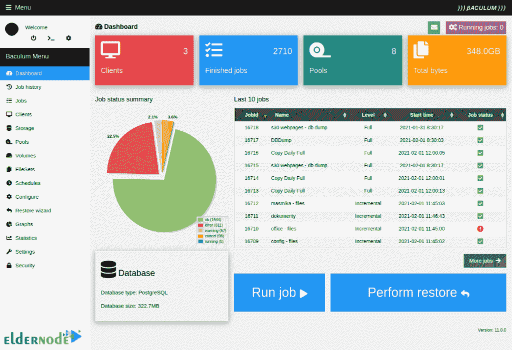
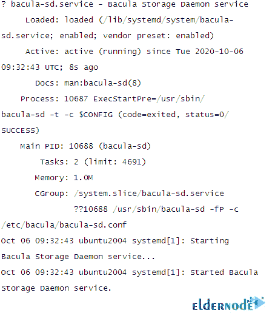
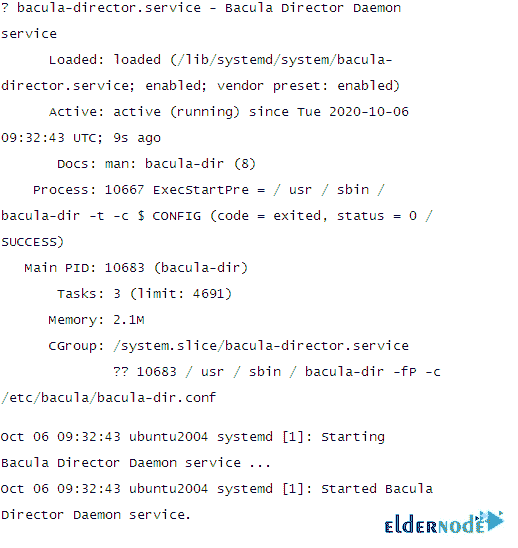
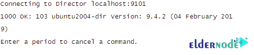
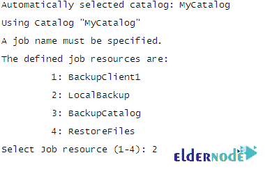
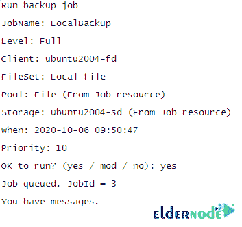
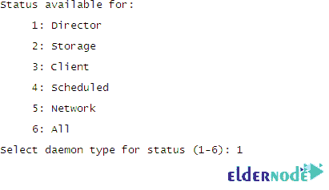
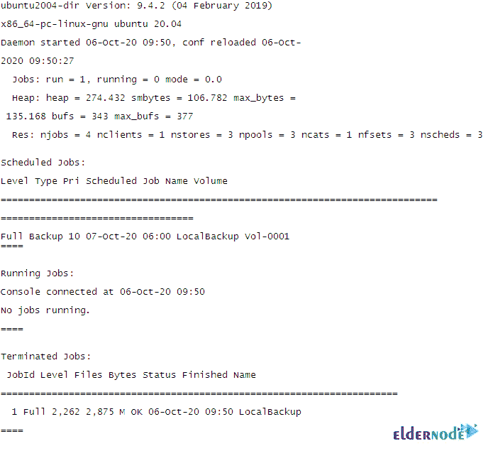
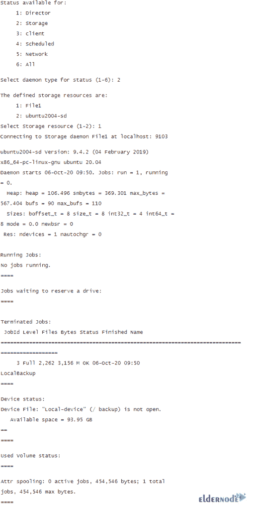

# 在 Ubuntu 20.04 - Eldernode 博客上介绍和安装 Bacula

> 原文：<https://blog.eldernode.com/introducing-and-install-bacula-on-ubuntu/>


作为管理员，您需要一个程序来管理不同种类的计算机网络上的计算机数据的备份、恢复和验证。Bacula 功能强大、易于使用且高效。它还可以完全在单台计算机上运行，并可以备份到各种类型的介质，包括磁带和磁盘。使用 Bacula，您可以找到并恢复丢失或损坏的文件。由于 Bacula 采用模块化设计，因此它可以从小型单台计算机系统扩展到由位于大型网络上的数百台计算机组成的系统。本文介绍**在 Ubuntu 20.04** 上介绍并安装 Bacula。如果您准备购买完全托管的 VPS，请依靠我们在 [Eldernode](https://eldernode.com/) 的技术团队来购买您自己的 **[Ubuntu VPS](https://eldernode.com/ubuntu-vps/)** 。

## **Ubuntu Linux 上的 Bacula 介绍**

之前，你已经在 [Eldernode 博客](https://blog.eldernode.com/)上读到过[如何制作备份](https://blog.eldernode.com/how-to-backup-linux-vps/)及其工具。但首先让我们解释一下，Bacula 本身并不是一个完整的灾难恢复系统。这是一个备份、恢复和验证程序，如果您仔细规划并遵循说明，它可以成为其中的一个关键部分。Bacula 提供了许多特性。因此，如果您正在使用 tar、dump 或 bru 来备份您的计算机数据，并且您需要更灵活的网络解决方案或目录服务，Bacula 是理想的选择。您应该是高级备份包的专家，因为 Bacula 比 tar 或 dump 更难设置和使用。

Bacula 已经在 OpenSuSE Linux、FreeBSD 和 Solaris 系统上编译和运行。Bacula 支持 [Linux](https://blog.eldernode.com/tag/linux/) 、 [Windows](https://blog.eldernode.com/tag/windows/) 和 macOS 备份客户端。它由几个组件组成，包括:Bacula 目录、Bacula、控制台、Bacula 存储、Bacula 文件、Bacula 监视器和 Bacula 目录。控制台有三个版本:基于文本的命令行版本、基于 Gnome 的 GTK+图形用户界面(GUI)界面和 wxWidgets GUI 界面。这些组件管理特定的作业。这些服务和应用程序可以在多个服务器和客户端上运行，或者如果备份单个磁盘或卷，它们可以安装在一台机器上。



## **在 Ubuntu 20.04 上安装 Bacula 备份服务器| Ubuntu 18.04**

看来你知道 Bacula 是最好的可联网的 Linux 备份解决方案。因此，让我们浏览一下本指南的步骤，并回顾一下在 [Ubuntu](https://blog.eldernode.com/tag/ubuntu/) 20.04 上安装 Bacula 的过程。

### **在 Ubuntu 20.04 上安装 Bacula 的先决条件**

为了让本教程更好地工作，请考虑以下先决条件:

_ 拥有 Sudo 权限的非 root 用户。

_ 要进行设置，请遵循我们在 Ubuntu 20.04 上的[初始服务器设置。](https://blog.eldernode.com/initial-server-setup-on-ubuntu-20/)

_ 至少 2 GB 内存。

如果您使用 MySQL 或 PostgreSQL 作为数据库，Bacula 不会为您安装数据库，请尝试使用这些服务。

### **如何在 Ubuntu Linux 上安装和配置 Bacula**

加入我们的指南，学习如何在 Ubuntu 20.04 上安装 Bacula。像往常一样，让我们从更新你的系统开始。因此，使用以下命令，将您的系统更新到最新的稳定版本:

```
apt-get update -y
```

Ubuntu 20.04 中默认提供 Bacula 包。要安装它，只需运行一个简单的命令，然后继续:

```
apt-get install bacula -y
```

现在将提示您输入邮件服务器、系统邮件名称、为 **bacula-directory-pgsql** 配置数据库，并为 Bacula PostgreSQL 数据库配置密码。

选择您想要的**邮件服务器**，提供您的**邮件名称**，点击**确定**按钮。然后，您将被要求为 bacula 配置一个数据库。选择 PostgreSQL 服务器的主机，然后选择 localhost。最后，您将被要求提供 PostgreSQL 密码

***注意:*** 一旦你完成了这些，你将得到你的提示并可以继续配置。

在配置 Bacula 之前，您需要通过一个必需的步骤。您应该创建一个目录来存储备份文件。因此，键入:

```
mkdir /backup
```

现在，要将 bacula 目录的所有权更改为 bacula 用户和组，请运行以下命令:

```
chown -R bacula:bacula /backup
```

此时，编辑 bacula 存储默认配置文件，并定义存储设备和位置:

```
nano /etc/bacula/bacula-sd.conf
```

接下来，删除或注释掉其他“设备”和“自动转换器”部分，并添加以下行:

```
Device {    Name = Local-device    Media Type = File    Archive Device = /backup    LabelMedia = yes; # lets Bacula label unlabeled media    Random Access = Yes;    AutomaticMount = yes; # when device opened, read it    RemovableMedia = no;    AlwaysOpen = no;    Maximum Concurrent Jobs = 5    }
```

现在，您可以**保存**并关闭文件。使用以下命令重新启动 Bacula 存储服务:

```
systemctl restart bacula-sd.service
```

此外，您可以验证 Bacula 存储的状态:

```
systemctl status bacula-sd
```

应显示以下输出:



### **如何在 Ubuntu 20.04 上配置 Bacula Director**

在此部分，您可以编辑 Bacula director 配置文件并提供您的存储位置。为此，请运行以下命令:

```
nano /etc/bacula/bacula-dir.conf
```

添加以下行，包括设备名称、存储名称、密码、作业等:

```
Storage {    Name = ubuntu2004-sd # Must be equal to the "Name" parameter of the "Storage"    section in the /etc/bacula/bacula-sd.conf file    Address = 127.0.0.1    Password = "aFEH-0a3QycsbYQVcoy_VoUMhAHJQ00CD" # Password must match    the password in the /etc/bacula/bacula-sd.conf    Device = Local-device    Media Type = File    }    FileSet {    Name = "Local-file"    Include {    Options {    signature = MD5    }    File = /etc    }    }    Schedule {    Name = "LocalDaily"    Run = Full daily at 06:00    }    Job {    Name = "LocalBackup"    JobDefs = "DefaultJob"    Enabled = yes    Level = Full    FileSet = "Local-file"    Schedule = "LocalDaily"    Storage = ubuntu2004-sd    Write Bootstrap = "/var/lib/bacula/LocalhostBackup.bsr"    }
```

同样，此时您可以保存并关闭文件。重新启动 Bacula director 服务以应用更改:

```
systemctl restart bacula-dir
```

使用以下命令验证 Bacula director 服务的状态

```
systemctl status bacula-dir
```

应显示以下输出:



### **如何使用 Bacula** 在 Ubuntu 20.04 上验证备份作业

运行以下命令，并使用 Bacula 控制台运行您的第一个备份作业:

```
bconsole
```

连接后，您将看到以下输出:



现在，您可以使用以下命令启动备份作业:

```
*run
```

接下来，将要求您选择备份作业，如下所示:



要查看以下输出，请键入 2 以选择您在配置文件中定义的 LocalBackup，然后按 Enter 键:



备份作业现在开始。运行以下命令检查备份作业的状态:

```
*status
```

然后，将要求您选择以下组件的状态:



要查看以下输出，请键入 1 并按 Enter 键，以检查控制器的状态:



同样，通过运行以下命令检查 Bacula 存储的状态:

```
*status
```

下面的输出应该显示:



此时，您可以从 Bacula 控制台退出。所以，运行:

```
*exit
```

然后，使用以下命令验证备份目录:

```
ls /backup/
```

最后，您可以看到创建了 Vol-0001 备份:

```
Vol-0001
```

## 结论

在本文中，我们向您介绍了 Bacula，并且您了解了如何在 Ubuntu 20.04 上安装 Bacula。从现在开始，您可以通过在远程计算机上安装 Bacula 客户端来保护您的客户端系统。告诉您在 [Eldernode community](https://community.eldernode.com/) 上的朋友您是否正在使用该程序，或者您是否找到了替代方案。