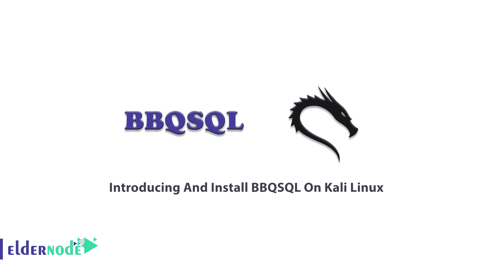
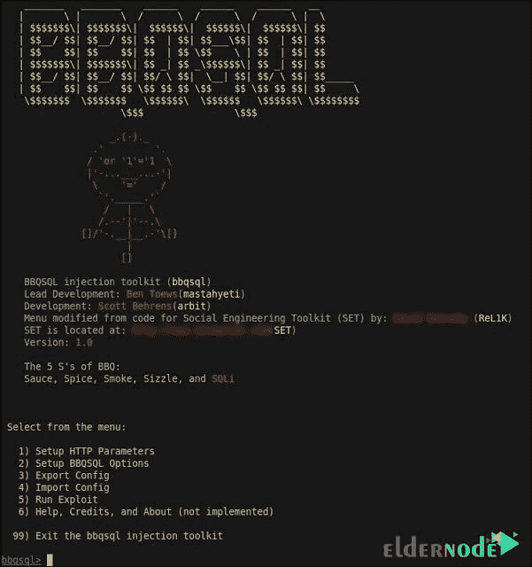

# 在 Kali Linux - Eldernode 博客上介绍和安装 BBQSQL

> 原文：<https://blog.eldernode.com/introducing-and-install-bbqsql-on-kali/>



BBQSQL 是一个用 Python 写的盲 SQL 注入框架，这使得它非常快。一旦你面对 SQL 注入的漏洞受到攻击，你会发现它们如此有用。它也适合那些很难触发 SQL 注入发现，因为他们可以定制这个半自动工具。BBQSQL 受 BSD 许可，有一个直观的用户界面，使设置攻击更加容易。这篇文章为**介绍了在 Kali Linux** 上安装 BBQSQL 的完整指南。如果你打算准备自己的 [Linux VPS](https://eldernode.com/linux-vps/) ，那么 [Eldernode](https://eldernode.com/) 上完美的 Linux 虚拟私有服务器包正等着专业人士购买。

## **Kali Linux 上的 BBQSQL 介绍**

### **什么是 BBQSQL**

BBQSQL 是一个利用盲 SQL 注入漏洞的开源 SQL 注入框架。如果您需要检查 web 应用程序的安全性，建议使用该工具。作为一个 [SQL 注入工具](https://blog.eldernode.com/introducing-and-install-sqlninja-on-kali-linux/)，必须提供一些通常的请求信息。BBQSQL 信息包括 URL、HTTP 方法、头、Cookies、编码方法、重定向行为、文件、HTTP Auth 和代理。然后，您必须指定注入的位置和注入的语法。作为一个专用工具，BBQSQL 可以快速检测应用程序中难以发现和难以利用的盲 SQL 注入漏洞。盲 SQL 和普通的 [SQL](https://blog.eldernode.com/sql-server-services/) 注入是有区别的，是从数据库中检索数据的方式。

### ****BBQSQL****如何工作(BBQSQL 在 Kali Linux 上)****

**注入作用于 URL、数据和 cookies。因为 BBQSQL UI 是使用 SET 中的资源构建的，所以您不必等到在命令行界面上键入巨大的请求。您可以确保对所有配置选项执行输入验证。**

**当您使用 BBQSQL 时，您会看到下面的屏幕:**

****

## ****如何一步步在 Kali Linux 上安装 BBQ SQL****

**运行以下命令在 [Kali Linux](https://blog.eldernode.com/tag/kali-linux/) 上安装 BBQSQL 和所有依赖包。**

```
`sudo apt-get install bbqsql`
```

### ****依赖于在 Kali Linux 上安装 BBQ SQL****

**要在 kali 上安装 Python，请键入:**

```
`sudo apt-get install python`
```

**此外，您可以通过运行以下命令来安装 **python-gevent** :**

```
`sudo apt-get install python-gevent`
```

**要安装 **python-requests** ，请键入:**

```
`sudo apt-get install python-requests`
```

### ****如何从 Kali Linux 中卸载 BBQ SQL****

**出于任何原因，您可能会决定从 [Kali Linux](https://blog.eldernode.com/install-and-configure-kali-linux-on-vps/) 中卸载 BBQSQL。您只需要运行下面的命令并删除 BBQSQL 包本身。**

```
`sudo apt-get remove bbqsql`
```

**如果您希望卸载 BBQSQL 及其依赖项，请使用下面的命令并删除 BBQSQL 包和任何其他不再需要的**依赖包**。**

```
`sudo apt-get remove --auto-remove bbqsql`
```

**此外，如果您希望**删除 BBQSQL 的本地/配置文件**,请运行以下命令，并且不要忘记，即使重新安装软件包，您也无法恢复已清除的配置/数据。**

```
`sudo apt-get purge bbqsql`
```

**或者类似这样的 BBQSQL**

```
`sudo apt-get purge --auto-remove bbqsql`
```

## **结论**

**本文回顾了在 Kali Linux 上介绍和安装 BBQSQL。您已经学习了如何在 Kali Linux 上安装一个更快的工具来自动测试盲 SQL 注入。当 Blind SQL 是一个菜单驱动的工具时，您可以解决问题，该工具会向数据库提出对或错的问题，并根据应用程序的响应来确定答案。**