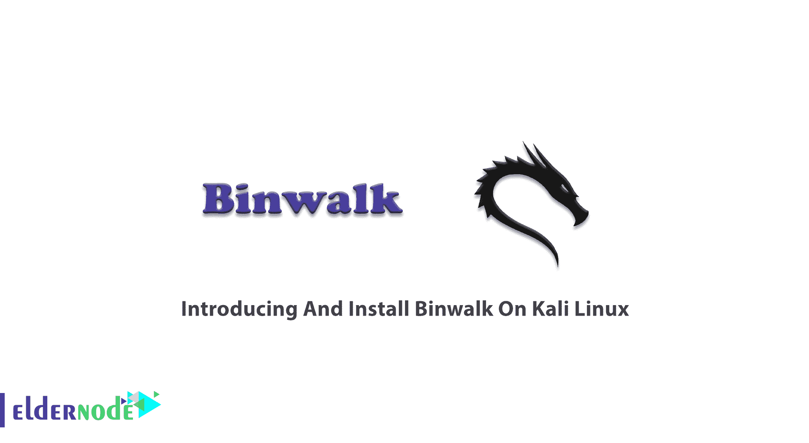

# Kali Linux - Eldernode 博客上的 Binwalk 介绍和安装

> 原文：<https://blog.eldernode.com/introducing-and-install-binwalk-on-kali/>



作为开发人员、渗透测试人员或黑客，您可以信任 Binwalk。这是一个快速简单的工具，可以帮助产品安全研究人员提取固件映像的组件。由于 Binwalk 用于分析、逆向工程和提取固件映像，因此您可以使用该工具逆向处理路由器的固件映像。通过这种方式，您可以了解它是如何工作的，并识别固件映像中嵌入的文件和代码。加入我们这篇文章来回顾一下**在 Kali Linux 上介绍和安装 Binwalk**。要购买您自己的 [Linux VPS](https://eldernode.com/linux-vps/) ，请访问 [Eldernode](https://eldernode.com/) 上提供的软件包，感受其中的差异。

## **Kali Linux 上的 Binwalk 介绍**

### **什么是 Binwalk？**

2010 年，克雷格·赫夫纳在麻省理工学院的许可下发行了《漫步》。它出色的能力是扫描固件映像和搜索文件签名。它帮助您识别和提取文件系统映像、可执行代码、压缩档案、引导加载程序和内核映像、JPEGs 和 pdf 等文件格式。您将能够查找漏洞，因为 Binwalk 允许您在文件系统映像中对二进制文件进行逆向工程。可以从映像中提取文件并搜索后门密码，还可以解压缩文件系统映像以搜索特定的密码文件并破解密码哈希。

### **Binwalk 特性(在 Kali Linux 上介绍并安装 Binwalk)**

Binwalk 最重要的特性之一是它的签名扫描。它所做的是扫描固件映像，以搜索不同的嵌入式文件类型和文件系统。Binwalk 不仅可以在文件的开头查找签名，还可以扫描整个文件。然后，它将提取在映像中找到的文件。当你用 Binwalk 扫描一个固件映像时，它会给你很多关于它的信息。

为了更有效地分析可执行二进制文件，Binwalk 使用了 libmagic 库和定制的 magic 签名文件。由于它用于从二进制文件中查找和提取固件映像，因此您可以使用这些映像来破解物联网设备或任何依赖于嵌入硬件的代码的设备。Binwalk 提供了一个定制的 magic signature 报告，其中包含文档的进度签名。它们可以在固件照片中找到，包括压缩/存档文件、固件头文件、Linux 内核、引导加载程序、文件系统等。

### **如何使用 Binwalk**

Binwalk 支持的平台有 [Linux](https://blog.eldernode.com/tag/linux/) 、OSX、Cygwin、FreeBSD 和 [Windows](https://blog.eldernode.com/tag/windows/) 。在 Linux 上安装 Binwalk 很简单，但是要在 Windows 上安装会比较复杂。然而，要使用 Binwalk，你只需先了解固件。固件是为硬件设计的软件。所以，它是介于软件和硬件之间的东西。作为一个操作系统，它可以运行嵌入式设备，如路由器、相机、冰箱等等。

### **如何使用 Binwalk IDA 插件**

第一步，你必须安装并配置 [Kali Linux](https://blog.eldernode.com/install-and-configure-kali-linux-on-vps/) 。然后，您可以使用 setup.py 安装 Binwalk IDA 插件。它将指定 IDA 安装目录的路径。

```
python setup.py idainstall --idadir=/home/user/ida
```

**用途**

当您安装 IDA 插件时，您可以在 IDA 的搜索下拉菜单列表中看到两个菜单选项:

1- **Binwalk 签名**–扫描加载的 IDB 以查找文件签名

2- **Binwalk 操作码**–扫描已加载的 IDB 以获取通用操作码签名

## **如何在 Kali Linux 上安装 Binwalk**

Binwalk 预装在 [Kali Linux](https://blog.eldernode.com/tag/kali-linux/) 操作系统上。要安装 Binwalk 和它所依赖的任何其他软件包，请使用以下命令:

```
sudo apt-get install binwalk
```

## 结论

在本文中，您了解了 Binwalk 以及在 Kali Linux 上安装它的方法。您还可以使用 Binwalk 执行熵分析，打印原始熵数据，并生成熵图。要尝试 Binwalk，您可以下载固件映像并查看结果。初学者或进阶者，在 [Eldernode Community](https://community.eldernode.com/) 上提升您的 IT 知识。