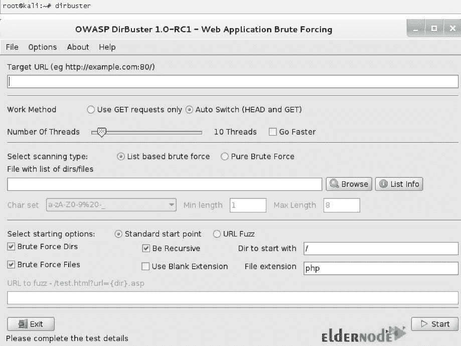

# 在 Kali Linux - Eldernode 博客上介绍并安装 DirBuster

> 原文：<https://blog.eldernode.com/introducing-and-install-dirbuster-on-kali/>


您已经学习了渗透测试工具。DirBuster 是一个渗透测试工具。它用于暴力破解 web/应用服务器上的目录和文件名。DirBuster 有一个图形用户界面，受 LGPL-2 协议的许可。如果喜欢命令行，您也可以使用 DIRB。请记住，如果你想在网站或应用程序上使用 DirBuster 或 DIRB，你需要得到许可。否则就是违法的。因此，你必须在一个受控的环境中，并给出一个特定的网址，如在 NCL 奥运会或不同的 CTF，或者与一家公司签订渗透测试合同。这篇文章介绍了如何在 Kali Linux 服务器上安装 DirBuster。在 [Eldernode](https://eldernode.com/) 上选择您喜欢的软件包，以最优惠的价格和支持购买 [Linux VPS](https://eldernode.com/linux-vps/) 。

## **介绍并在 Kali Linux 服务器上安装 DirBuster**

### **什么是 DirBuster，它在 Kali Linux 上是如何工作的？**

DirBuster 是由 OWASP 开发的多线程 Java 应用程序，旨在暴力破解 web/应用服务器上的目录和文件名。这是一个 GUI 应用程序，附带了 Kali Linux。DirBuster 搜索 web 服务器上的隐藏页面和目录并找到它们。作为一名开发人员，您可以保留一个可访问的页面，但不链接。这就是 DirBuster 寻找这些潜在漏洞的地方。因此，你可以用它来增加你的应用程序的[安全性](https://blog.eldernode.com/tag/security/),方法是在网络服务器或应用程序中找到不需要的内容。

你也将能够理解，简单地不链接到一个页面并不意味着它不能被访问。它的工作方式和方法非常简单。您应该指向一个 URL 和一个端口，如 80 或 443。然后给它提供一个单词表。最后，它向网站发送 HTTP GET 请求，并监听网站的响应。DirBuster 的工作原理是识别应用程序内或 web 服务器上不需要的内容。

### **如何在卡利身上使用 DirBuster**

有两种方法可以启动 DirBuster 应用程序。

**1-从 DirBuster 图标开始:**你可以在 Kali Linux 的菜单中搜索并输入“DirBuster”。然后点击图标，让应用程序启动。

**2-使用终端启动:**您也可以通过运行以下命令使用终端启动 DirBuster:

```
dirbuster 
```



使用上述两种方法将向您展示一个用户界面，允许您列出来自端口 80 中的 Web URL 的文件和目录。一旦 DirBuster 开始，你应该继续以下步骤:

1-设置目标 URL 和线程数

2-选择可能的目录和文件列表

3-启动强力扫描

4-生成报告(可选)

### **【DirBuster 功能(卡莉上的文章介绍和安装 DirBuster)**

除了上面关于 DirBuster 的解释，使用这个简单而强大的工具还有更多好处。

1-修井 HTTP 和 HTTPS

2-扫描文件和目录

3-递归扫描它识别的目录，提供更深入的搜索

4-在任何目录下启动的能力

5-执行暴力或基于列表的扫描的能力

6-以超高速执行强力扫描

7-提供自己的单词列表集合

8-允许用户制作自己的单词表

### **缺点**

**像任何其他工具一样，DirBuster 展示了一些用户认为是其缺点的行为。让我们来看看:**

**–太吵了**

**–服务可能会受到大量请求的干扰**

**–[当有许多错误响应时，强力](https://blog.eldernode.com/block-ip-of-brute-force-by-csf/)可能会停止**

## ****如何一步步在 Kali Linux 上安装 DirBuster****

**DirBuster 默认自带 [Kali Linux](https://blog.eldernode.com/tag/kali-linux/) 。您只需要运行以下命令来安装 DirBuster 和它所依赖的任何其他包:**

```
`sudo apt-get install dirbuster`
```

**这样，您可以通过下面的路径从 Kali Linux 启动 DirBuster:**

**Web 应用程序分析>>网络爬虫和目录蛮> > Dirbuster**

****

### ****如何在卡莉**T3 上卸载 DirBuster】**

**任何时候你决定**卸载 DirBuster** ，你可以运行下面的命令来删除 **DirBuster 包**本身。**

```
`sudo apt-get remove dirbuster`
```

**但是如果您希望删除 DirBuster 包和任何其他不再需要的**依赖包**，请键入:**

```
`sudo apt-get remove --auto-remove dirbuster`
```

**此外，您可以使用下面的命令**删除您的本地/配置文件**用于 DirBuster。您必须小心运行此命令，因为已清除的配置/数据无法通过重新安装软件包来恢复。**

```
`sudo apt-get purge dirbuster`
```

**或者类似的，像这个恐怖分子**

```
`sudo apt-get purge --auto-remove dirbuster`
```

## **结论**

**在本文中，向您介绍了 DirBuster，您学习了如何在 Kali Linux 上学习 DirBuster。如果您已经安装了此工具，请让您的朋友了解您的体验，并在 [Eldernode 社区](https://community.eldernode.com/)上添加更多详细信息。**