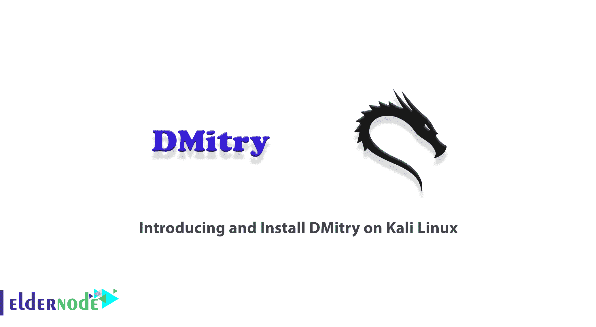
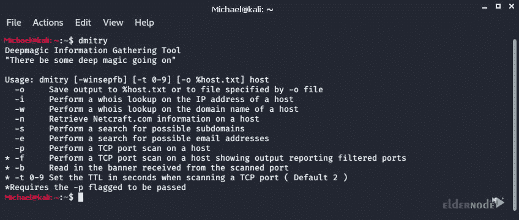
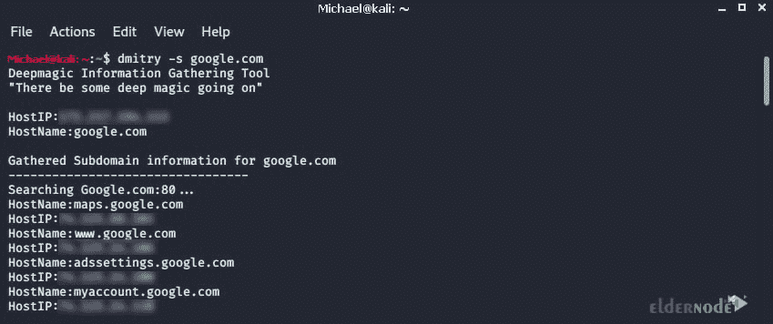

# Kali Linux - Eldernode 博客上的 DMitry 介绍和安装

> 原文：<https://blog.eldernode.com/introducing-and-install-dmitry-on-kali-linux/>



DMitry 是一个工具，通过它你可以获得关于你将要做的渗透测试的非常有用的信息。这个工具已经被开发为只用于 Linux 和 GNOME 操作系统的开源工具，它有一个命令界面。DMitry 是用 C 编写的，能够收集主机的信息。在这篇文章中，我们将教你如何在 Kali Linux 上介绍和安装 DMitry。如果你想买一台 [Linux VPS](https://eldernode.com/linux-vps/) 服务器，你可以在 [Eldernode](https://eldernode.com/) 看到可用的软件包。

## **Kali Linux 上的 Dmitry 介绍**

DMitry 是最强大的站点扫描工具之一。该工具用于分析网站，如 whois、子域、端口扫描器等。在下一节中，我们将描述 DMitry 工具的一些特性。然后我们会提到这个工具的开关。在熟悉了这个工具之后，我们将会到达在 [Kali Linux](https://blog.eldernode.com/tag/kali-linux/) 上安装 DMitry 的阶段，最后，我们将会讲解如何使用这个工具。

### **DMitry 工具功能**

在完全熟悉了上一节中的 DMitry 工具之后，我们现在想介绍一下这个工具的一些特性。这些功能包括:

1_ 访问源

2_ 搜索 whois

3_ 恢复可能更新的数据、系统和服务器数据。

4_ 在域上执行子域搜索。

5_ 收集域中的电子邮件地址。

6_ 使用 DMitry 工具扫描 TCP 端口

### **各种德米特里开关**

DMitry 工具有几个我们将介绍的开关:

**-o:** 允许用户输出工具的最终报告

**-i:** 在主机 IP 上建立 whois 查找

**-w:** 在主机域名上建立 whois 查询

从 netcraft.com 提取目标信息

**-s:** 标识站点子域

**-e:** 收集站点邮件

**-p:** 扫描目标 TCP 端口

## **如何在 Kali Linux 上安装 DMitry**

在这一节中，我们将教你如何在 Kali Linux 上安装 DMitry 工具。由于这个工具在 Kali 中是默认的，所以你不必努力安装它。

第一步，您必须使用以下命令安装安装 DMitry 所需的依赖项，即 **libc6** :

```
sudo apt install libc6-dev
```

然后，您可以使用以下命令安装 DMitry:

```
sudo apt install dmitry
```

### **如何在 Kali Linux 上使用 DMitry**

在上一步安装了 DMitry 之后，我们现在想谈谈如何使用这个工具。您可以在第一步中打开命令行来查看 Dmitry 中的选项。然后键入 DMitry 并按回车键:

```
dmitry
```



您可以运行域名 whois 查找(w)、IP whois 查找(I)、检索 Netcraft 信息(n)、搜索子域名(s)、搜索电子邮件地址(e)、进行 TCP 端口扫描(p)并将输出保存到 example.txt (o)中以用于域名 example.com:

```
dmitry -winsepo example.txt example.com
```

使用以下命令获取网站所有可能的子域。

不保存数据:

```
dmitry -s DOMAIN_NAME
```

保存数据:

```
dmitry -s -o info.txt DOMAIN_NAME
```



DMitry 工具的另一个功能是端口扫描。您可以看到如何使用以下命令扫描端口。

扫描端口而不保存数据:

保存数据时扫描端口:

```
dmitry -pb DOMAIN_NAME
```

最后，您可以使用 DMitry 获取所有可能的信息。

```
dmitry -pb -o info.txt DOMAIN_NAME
```

在不保存数据的情况下获取所有可能的信息:

通过保存数据获取所有可能的信息:

```
dmitry -winsepo DOMAIN_NAME
```

结论

```
dmitry -winsepo -o info.txt DOMAIN_NAME
```

## DMitry tool 是信息收集领域中最强大的工具之一，它是免费的，并且默认为用户提供 Kali 版本。在本文中，在介绍了这个工具之后，我们试图教您如何在 Kali Linux 上安装 DMitry。然后我们教你如何使用这个工具。如果你愿意，可以参考文章[在 Kali Linux](https://blog.eldernode.com/introducing-and-install-metasploit-on-kali/) 上介绍和安装 Metasploit。

DMitry tool is one of the most powerful tools in the field of Information Gathering, which is available for free and by default in Kali for users. In this article, we tried to teach you how to install DMitry on Kali Linux after introducing this tool. Then we taught you how to use this tool. You can refer to the article [Introducing And Install Metasploit On Kali Linux](https://blog.eldernode.com/introducing-and-install-metasploit-on-kali/) if you wish.