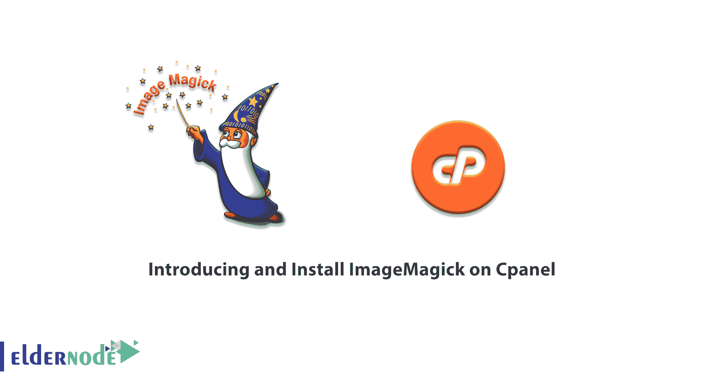
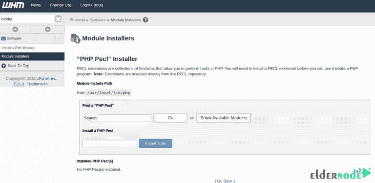

# 在 Cpanel - Eldernode 博客上介绍和安装 ImageMagick

> 原文：<https://blog.eldernode.com/introducing-and-install-imagemagick-on-cpanel/>



ImageMagick 是一个免费的开源 web 应用程序。该工具允许用户轻松创建或编辑自己的图像，如位图。因此，它的发行版是以开源代码的形式提供的。使用 ImageMagick，您可以使用可用选项应用各种图像格式，如 GIF、JPEG、PDF、PhotoCD、PNG、SVG、TIFF。这些选项包括旋转、镜像、裁剪和转换图像、调整图像颜色以及对图像应用各种特殊效果。在这篇文章中，我们将教你关于**在 Cpanel** 上介绍和安装 ImageMagick。需要注意的是，您可以访问 [Eldernode](https://eldernode.com/) 中提供的包来购买 [VPS 服务器](https://eldernode.com/vps/)。

## **介绍 Cpanel 上的 ImageMagick**

使用 ImageMagick 程序，像其他商业图形软件一样，您可以应用各种图形效果，如调整大小、镜像、旋转、颜色调整等。免费的图片。您还可以使用文本、线条、多边形和其他工具在图像上绘制不同的形状。例如，使用 Flash 和文本工具在可视地图中描述位置。应该注意的是，除了静态图像之外，您还可以在可用工具的帮助下使用一组图像来创建动画图像(GIF)。

### **【ImageMagick 特性(Cpanel 上的 ImageMagick 介绍和安装)**

ImageMagick 模块可以创建清晰、锐利和准确的图像。ImageMagick 生成的图像比 PrestaShop 生成的图像质量更好。你可以通过展示准确和高质量的图片来吸引更多的顾客，最终获得更多的利润。Imagemagick 生成的图像包含更多数据。所以这些文件的大小有点大。与 GD 制作的图像相比，ImageMagick 存储空间增加了 5%到 15%。还应注意的是，使用 Imagemagick 生成的图像要大 5%到 15%。在下一节中，我们将了解 Imagemagick 的一些优点。接下来我们将向您介绍如何在 [Cpanel](https://blog.eldernode.com/tag/cpanel/) 上安装 ImageMagick。

### **ImageMagick 的好处**

在本节中，我们将提到 ImageMagick 软件的一些优势:

1-相当简单的工作环境

2-支持大多数格式

3-拥有完整且可用的工具

4-能够在不损失质量的情况下调整大小

5-能够在图像上放置效果和标志

6-编辑图像配色方案的能力

在下一节中，我们将教您如何在 Cpanel 上安装 ImageMagick。请加入我们。

### **在 Cpanel 上安装 ImageMagick**

要在 Cpanel 服务器上安装 Imagick，必须首先安装以下软件包。为此，您必须首先通过 SSH 登录到您的操作系统终端。然后运行以下命令安装 ImageMagick 包:

```
yum -y install ImageMagick-devel ImageMagick-c++-devel
```

完成 ImageMagick 安装过程后，进入 **WHM 面板**。然后搜索**模块安装程序**并点击它。

在右边打开的页面中，在 **PHP Pecl** 部分，点击**管理**。

在**选择 PHP 版本**部分，选择您想要安装 Imagick 的 PHP 版本。然后点击**应用**。

下一步，您必须在**安装 PHP PECL** 字段中键入 Imagick。

最后，点击**立即安装**，等待安装过程完成。



最后，将显示 ImageMagick 安装成功的消息。

## 结论

ImageMagick 是一个免费且易于使用的软件套件，可以帮助用户创建、编辑或相互转换图像。它可以读取各种图像格式或以各种格式保存图像。在本文中，我们试图帮助您在 Cpanel 上介绍和安装 ImageMagick。