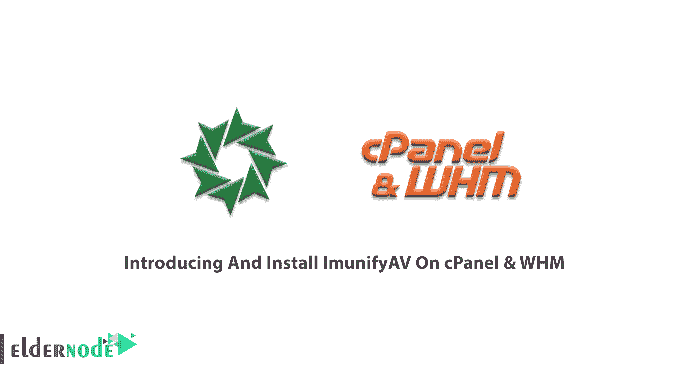
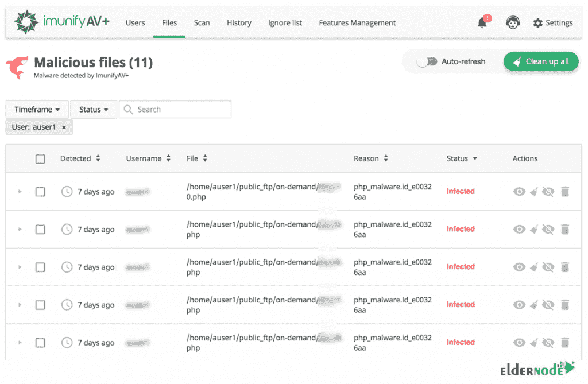

# 在 CPanel & WHM -埃尔德诺德博客上介绍和安装 ImunifyAV

> 原文：<https://blog.eldernode.com/introducing-and-install-imunifyav-on-cpanel/>



服务器总是容易受到感染。使用安全程序可以有效地提高安全性并删除服务器上受感染的文件和程序。ImunifyAV 是一个反病毒和网站安全监控工具。要使您的网站免于恶意软件，您可以使用 ImunifyAV 和清除恶意软件、域信誉监控和黑名单状态检查。CloudLinux 创建了这个工具，作为业界最有效的恶意软件检测解决方案。在本文中，我们将**介绍 ImunifyAV** **和** **在 cPanel 上安装 ImunifyAV&WHM**。如果你准备了一个[专用服务器](https://eldernode.com/dedicated-server/)，ImunifyAV 允许你的 cPanel 用户扫描文件，管理发现的恶意软件。但是，即使您没有安装任何控制面板，也可以在您的操作系统上安装此防病毒软件。在 [Eldernode](https://eldernode.com/) 上有各种[VP 托管](https://eldernode.com/vps-hosting/)计划，根据自己的需求购买一个套餐。

## **CPanel 上介绍 ImunifyAV&WHM**

### **ImunifyAV 是什么？**

您可能被 Google 检测为恶意网站。或者当您在浏览器中输入域名时被重定向到另一个地址。这意味着您已经被阻止的网页寄存服务由于垃圾邮件，恶意软件，或黑客攻击。为了管理这种情况，您需要扫描主机的文件以识别恶意文件。在这里， **ImunifyAV** 完美地发挥了它的作用。 [CloudLinux](https://blog.eldernode.com/install-cloudlinux-on-cpanel/) 发布了 ImunifyAV 作为一款免费的杀毒软件，拥有良好的界面。它有助于服务器管理员更轻松地管理设置。如果您使用 cPanel 控制面板，服务器的所有用户都可以访问此防病毒软件的设置。此外，管理员还控制服务器上已扫描和已感染的历史记录和文档。



当你在你的 [cPanel & WHM](https://blog.eldernode.com/cpanel-and-whm-installation-tutorial/) 上安装 ImunifyAV 时，它会自动扫描托管的网站，发出感染恶意软件的警报。一旦在网站上发现恶意软件，会通过 ImunifyAV 控制面板中的“文件”选项卡向用户发送通知。此外，如果您升级到 ImunifyAV+，您将收到一封发送到控制面板管理员电子邮件地址的电子邮件通知。ImunifyAV 为 cPanel 用户提供了清除感染或在发现恶意软件时升级到 ImunifyAV+的选择。因为在 ImunifyAV+中可以自动清除恶意软件。ImunifyAV 可帮助您实时识别危险行为，并在检测到危险行为后立即进行清理。ImunifyAV 兼容 [cPanel](https://blog.eldernode.com/tag/cpanel/) 、 [Plesk](https://blog.eldernode.com/tag/plesk/) 、ISP Manager、 [DirectAdmin](https://blog.eldernode.com/tag/directadmin/) ，无面板。此外，Ubuntu 支持即将推出。

加入我们的指南，了解如何**在 cPanel** 上安装 ImunifyAV 并享受它的特性。

### **ImunifyAV 特性(CPanel 上 ImunifyAV 的介绍和安装)**

1-免费版本包括一个全功能的恶意软件文件扫描器，信誉和黑名单状态监控。

2-高级版支持一键式自动清理、预定网站检查、恶意软件检测的管理员和用户通知，以及支持用户权限管理，并引入带有摘要和扫描结果的用户选项卡。

3-检测任何类型的恶意文件，包括后门程序、网络外壳、病毒、黑客工具、“blackhat SEO”脚本、钓鱼网页等。

4-针对 60 多种安全服务，包括 Google SB、Yandex SB、McAfee、ESET、Kaspersky，监控域名的信誉和黑名单状态。

5-支持 [WordPress](https://blog.eldernode.com/tag/wordpress/) ，Joomla！、Magento、Drupal、MODx、Bitrix 等基于 PHP 的 CMS 和静态 HTML 网站。

6-一键式自动恶意软件清除、预设和按需网站扫描以及详细报告。

7- UI 流程针对每台服务器数百名用户和数千个域的安全监控进行了优化

### **ImunifyAV 优势(CPanel 上 ImunifyAV 的介绍和安装)**

1-从 WHM 和 CLI 扫描整个服务器

2 个月自动扫描易于从 WHM 配置

3-过去扫描结果的历史记录

4-指定“忽略列表”中的目录列表

### **ImunifyAV 缺点**

1- cPanel 用户不能从 cPanel 启动扫描。

2-WHM 的重要功能，如自动清理和更频繁的自动扫描需要付费订阅。

3-仅适用于 [CentOS](https://blog.eldernode.com/tag/centos/) 、 [Ubuntu](https://blog.eldernode.com/tag/ubuntu/) 、 [CloudLinux](https://blog.eldernode.com/install-cloudlinux-on-directadmin/) 和 OpenVZ/Virtuozzo 平台。

4-还没有流行的第三方集成来连接其他 web 应用程序

相当新，大多数文档只能从官方网站获得。

### **ImunifyAV VS ClamAV**

你可能知道 ClamAV，甚至用过。ClamAV 是最受欢迎的免费开源反病毒软件之一，在大多数 Linux 发行版上都有。但是由于某些原因，你可能更喜欢 ImunifyAV 而不是 ClamAV。作为系统管理员，如果您希望减轻 cPanel 用户的负担，选择 ImunifyAV 更符合逻辑。如果您愿意为附加功能付费，您将会享受到更多没有终端的选择，因为免费的 ImunifyAV 和 ImunifyAV+版本在 WHM 和 cPanel 中提供了更多功能，以加快设置。

## **如何在 CPanel 上安装 ImunifyAV&WHM**

凭借高效的检测引擎，ImunifyAV 可以发现大多数类型的恶意软件，而不会对您或您的系统造成压力。这是免费的，但如果你需要删除恶意软件时，发现它，你需要准备 ImunifyAV+高级版。

让我们通过本指南的步骤来回顾一下在 cPanel 上安装 ImunifyAV 的过程。

*第一步:*

你需要以根用户的身份登录 WHM。如果您以经销商帐户的身份登录，则必须考虑拥有**根级**权限。因此，首先，您必须 SSH 到您的服务器。

*第二步:*

现在，你可以从 Imunify360.com 下载 ImunifyAV **安装 shell 脚本**。转到您的主目录并运行以下命令:

```
wget https://repo.imunify360.cloudlinux.com/defence360/imav-deploy.sh
```

*第三步:*

要运行**安装脚本**，请键入:

```
bash imav-deploy.sh
```

此外，您可以安装 ImunifyAV beta 版本，并添加参数*–beta*。请看下面的例子:

```
bash imav-deploy.sh --beta
```

*第四步:*

正如您所了解的，您可以将 ImunifyAV 升级到 ImunifyAV+,以删除发现的恶意软件。因此，如果您有一个 **ImunifyAV+许可证密钥**，请在安装过程中使用它。

```
wget https://repo.imunify360.cloudlinux.com/defence360/imav-deploy.sh
```

```
bash imav-deploy.sh --key YOUR_KEY
```

您的 _Key 是您的许可证密钥。请记住将您的 _Key 替换为之前在上述网站购买的实际密钥。

使用下面的命令查看安装脚本的可用选项。

```
bash imav-deploy.sh -h
```

如果通过了注册密钥，请通过以下命令注册一个激活密钥:

```
imunify-antivirus register YOUR_KEY
```

同样，如果是基于 IP 的许可证，您的 _Key 是您的激活密钥或 IPL。

***注意*** :如果您没有收到安全警报列表中的 ImunifyAV 警报，请检查以下情况以进行修复:

1-您的服务器不支持 ImunifyAV。

2-您使用的是试用账户。

3-您没有使用根用户或具有根级别权限的经销商帐户登录。

### 如何更新 CPanel 上的 ImunifyAV 指令

您可以通过运行以下命令来升级 ImunifyAV:

```
yum update imunify-antivirus
```

使用下面的命令更新 ImunifyAV 测试版。

```
yum update imunify-antivirus --enablerepo=imunify360-testing
```

但是，如果您不想从测试版接收更新，可以删除测试版存储库。

```
rm /etc/apt/sources.list.d/imunify360-testing.list
```

```
apt-get update
```

### **如何从 CPanel** 卸载 Imunify】

您可以出于任何原因通过 SSH 卸载 ImunifyAV 并停止使用它。以下步骤教你如何停止和卸载 ImunifyAV 。

第一步:

要停止 ImunifyAV 应用程序，请运行以下命令:

```
systemctl stop imunify-antivirus
```

运筹学

```
service imunify-antivirus stop
```

*第二步:*

您可能已经删除了 ***imav-deploy.sh*** 安装脚本。要卸载该程序，请再次下载。

```
wget https://repo.imunify360.cloudlinux.com/defence360/imav-deploy.sh
```

*第三步:*

最后，要卸载 ImunifyAV，运行:

```
bash imav-deploy.sh --uninstall
```

由于默认情况下 ImunifyAV cPanel 用户界面是隐藏的，因此您可以启用它来允许用户查看他们的恶意文件、扫描历史记录和忽略列表。

使用下面的命令通过 SSH 启用 ImunifyAV cPanel 用户界面。

```
/opt/alt/python35/share/imunify360/scripts/av-userside-plugin.sh
```

您可以通过运行以下命令再次禁用 ImunifyAV cPanel 用户界面:

```
/opt/alt/python35/share/imunify360/scripts/av-userside-plugin.sh -r
```

## 结论

在本文中，向您介绍了 ImunifyAV，您学习了如何在 cPanel & WHM 上安装 ImunifyAV。最后，您了解了如何为 cPanel 用户启用 Imunify。从现在开始，您可以轻松地为您的客户提供自动化的安全性，以抵御病毒、广告软件、间谍软件和蠕虫。面对被黑网站的客户，你肯定会接到更少的支持电话。去 [Eldernode 社区](https://community.eldernode.com/)问问你之前装过的朋友关于它的利弊。