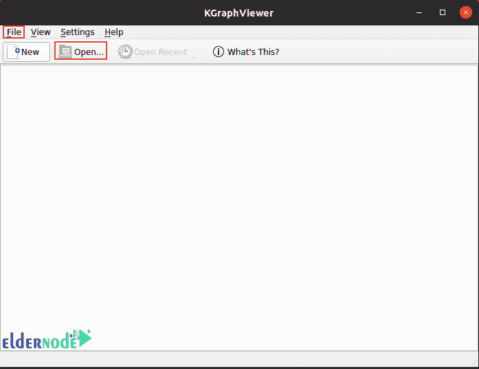

# 在 Linux - Eldernode 博客上介绍和安装 KGraphEditor

> 原文：<https://blog.eldernode.com/introducing-and-install-kgrapheditor-on-linux/>


图表可以让你找到变量之间的相关性，预测未知量，以一种简单的方式解释和呈现数据。在编程领域，图形可以以复杂数据结构的形式实现。图形解释的函数式语言之一是 DOT，它很容易显示不同变量之间的关系。加入我们这篇文章，学习在 Linux 上介绍和安装 KGraphEditor。点文件使用一个特殊的应用程序。另外，如果你想购买一个 [**Linux VPS**](https://eldernode.com/linux-vps/) 主机，你可以访问 [Eldernode](https://eldernode.com/) 中的软件包。


## **KGraphViewer 是什么？**

阅读点格式文件的最佳选择之一是 KGraphViewer。这个应用程序由 KDE 创建，是一个 KPart，可以显示 Graphviz 可以管理的任何图表。该组件由信号/插槽方法控制。

KGrapheditor 是 KGraphViewer 提供的点图测试编辑器，后来由于操作问题被删除。然而 KGraphViewer 是你在 Linux PC 上想要的程序。

该程序中实现的功能:

*   支持。点 Graphviz 2.12 格式。
*   手动备份文件的能力。
*   放大和缩小支持。
*   保存最近的文件列表。
*   在选项卡中加载多个图表。
*   从鸟瞰图显示图表后，您可以移动和打印图表，并预览打印输出。
*   上传 Graphviz 样本的能力。

## **如何在你的 Linux 系统上使用 KGraphViewer:**

有两种方法可以安装 KGraphViewer。如果方法 1 不成功，可以尝试方法 2。

### **第一种方法:使用 apt 命令安装 KGraphViewer**

命令终端用于安装 KGraphViewer。

安装 KGraphViewer 的第一种方法是使用 **install** 命令。本教程，最好是使用 [Ubuntu](https://blog.eldernode.com/tag/ubuntu/) 20.04 LTS，如果你使用的是以前的版本或不同的 Linux 发行版，安装方法应该没有不同，除了说明的格式。

按照以下说明安装 KGraphViewer:

首先，通过按下 **Ctrl +Alt+ T** 或尝试搜索栏上的**终端**来打开系统上的命令终端。然后键入以下命令来更新所有可用的软件包:

### **Ubuntu**

```
sudo apt update
```

### **Arch Linux**

```
sudo pacman -Syu
```

### **软呢帽**

```
sudo dnf upgrade
```

### **厘斯**

```
yum update
```

更新完成后，打开命令终端，然后运行以下代码行来安装 KGraphViewer:

```
sudo apt-get install kgraphviewer
```

Fedora 用户可以使用以下命令:

```
dnf install kgraphviewer
```

Arch Linux 的用户可以在命令终端中输入以下命令:

```
pacman -S kgraphviewer
```

等待命令完全执行，这样您的 [Linux](https://blog.eldernode.com/tag/linux/) 发行版就不会出现问题，然后继续下一步。

### **第二种方法:用 Snap 安装 KGraphViewer**

如果前面的方法对您不起作用，您可以使用 Snap Store 安装 KGraphViewer。首先使用以下命令安装 Snap:

```
sudo apt install snapd
```

在设备上安装 Snap 后，打开命令终端安装 KGraphViewer 并运行以下代码:

```
sudo snap install kgraphviewer --candidate
```

## **如何使用 KGraphViewer**

首次启动 KGraphViewer 时，您将看到以下屏幕:



点击**文件>打开**，选择想要检查的点文件。

## **KGraphEditor 有什么替代品可以用？**

如前所述，KGraphEditor 是 DOT editors 的试用版，但在无法运行后就停止了。但是，我们推出了一系列替代计划:

*   DotEditor 是最好的点文件编辑器之一，旨在创建一个用户友好的、基于图形用户的文件编辑器，允许用户使用图形用户界面工具编辑内容。
*   **yEd Graph Editor** 是另一种选择，可用于创建图表和从外部来源导入数据进行分析。
*   Graphviz 在另一个程序中，它拥有作为编辑器的所有必要工具。

## 结论

我们关于 KGraphEditor 的文章到此结束。虽然 KGraphEditor 不再可用，但 KGraphViewer 和 KGraphEditor 的其他替代工具对您来说是有用的工具。